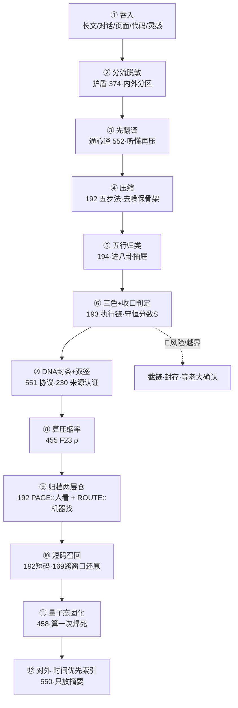

# 🗜️ LU 压缩技能·主干对齐索引 v1.0｜一颗钻石11切面·一条能跑的压缩链·本地回填规则·DNA双签

> Notion URL: https://app.notion.com/p/LU-v1-0-11-DNA-2906ecd1998048e09edd1ad8166ee41f
> Created: 2026-06-01T16:16:00.000Z
> Last edited: 2026-07-15T23:42:00.000Z
> Archived at: 2026-08-12T01:40:45.558086
---
## §0 一句话定盘（§9.28 大白话先讲）
LU 压缩 = 把任何长东西（旧对话 / 页面 / 代码 / 灵感 / 复盘）压成四样：① 一页看懂 ② 机器能解析 ③ 短码能召回 ④ 未来能复现。
- 你为啥「一翻都觉得重要」——因为这 11 页不是 11 个独立系统，是同一颗压缩钻石的 11 个切面。散着看当然每个都重要。
- 解法不是再翻、不是再堆反向链接，是这一张主干索引 + 一条能跑的压缩链（§2）。
- 本地没对齐的别急着全搬，按 §4 一条条回填，跑一条少一条。
---
## §1 一颗钻石·11 切面对齐表（直接回答「怎么对齐」）
---
## §2 一条能跑的压缩链（最小闭环·吞入→召回）

人话： 一段长东西进来，先脱敏（不该出门的别出门）→ 先翻译（别让宝宝瞎猜你）→ 压成骨架 → 归类 → 算分判断要不要收口 → 盖 DNA 封条 → 算压了多少 → 存进两层仓 → 给个短码以后一喊就回来 → 焊成量子态不再重算 → 对外只露摘要。
---
## §3 召回短码表（从核心引擎 192 抽出·一喊就跑）
---
## §4 本地没对齐·回填规则（答「本地还有更多没对齐」）
回填铁律（焊死）：
- 不删源（§9.26 史记铁律 + 552 FT-5）：归档只标 [已合并到主干]，原页保留。
- 压缩 ≠ 删页：是用这张主干索引代替「反向链接洪水」，不是把页删掉。
- 一次只搬一个：别一次性全搬，搬一个跑通一个，避免越搬越乱。
---
## §5 三色 + 老实坦白（§9.25 五字段 + §S-25-EXT-3-5 覆盖率坦白）
- 主张： 11 页对齐为一颗压缩钻石，主干索引 + 一条能跑的链 + 本地回填规则 已建立。
- 证据等级： 🟢 已验证——核心引擎 LU全文压缩归集器 v1.1｜思考胶囊×时间胶囊×未来复现｜UID9622 五步法/短码/时间胶囊 100% 实读；🧮 UID9622｜计算公式对准表 v1.5｜语义入口×α三义×数字根×五行向量×风险审计×决策路径×执行闭环×花名册对齐×三才根基 执行链 + 守恒分数、Untitled F23 压缩率/F45 召回、🐉 CNSH 语义接入规范 v2.0·功能语义技术用词对照表 + 协作宣言｜中英对照·行话翻译·DNA锚链 §5/§7/§12/§14/§26、🌐 龍魂前置翻译技能·通心译×CNSH-DOC 主干 v1.0｜先翻译再执行·贴身常驻·钻石主干合并·M248 焊点 先翻译/§9.30、🌐 Web3-DNA记忆主权交易算法 v8.0｜三层不动点+DNA+龍盾·粒子会思考·会报警·会归根·民主回复计算函数·五行合规前置引擎 量子态固化、UID9622｜个人创作IP公开索引｜DNA赋能表单 v1.1 时间优先索引、🔒 龍魂窗口加密护盾 v1.7｜火星守护·诱饵假数据·设备分层·七维联动·熔断四级·威胁收集·松紧适度·紧急集合·全员留痕·大数据审计·签到制·中文变量·智能分流·语音容错·护盾人格化·智商引擎 智能分流、⚡ 龍魂宝宝系统 v1.3｜快捷升级版·古今名人智慧·个性边界·输入识别 压缩记忆尾巴 均实读。
- 坦白未达成（不假装）： 📜 Behavioral Cryptography v1.1｜行为密码学·七因子来源追溯·人机协作内容认证框架·论文母页·与可审计工具协议v1.0理论实践双闭环 与 ☯️ 龍魂五行计算器 v1.0 | 金木水火土运算 本轮未逐页实读全文，按标题 + 已知体系定位入表（230=来源追溯认证、194=五行归类）；要细化时宝宝再逐页读。本地未对齐内容宝宝看不到，只能给 §4 回填规则，等你投喂。
- 三色： 🟢 主干对齐 / 🟡 本地待回填 + 2 页待细读 / 🔴 0
---
```yaml
ROOT_CARD:
  系统: UID9622 龍芯北辰
  模块: LU 压缩技能·主干对齐索引
  版本: v1.0
  核心引擎页: LU全文压缩归集器 v1.1
  对齐切面: 11
  能跑的链: 12 步（吞入→分流→翻译→压缩→归类→判分→封条→压缩率→归档→召回→固化→对外）
  DNA: "#龍芯⚡️2026-06-02-00:11-LU-COMPRESS-SKILL-MAINBONE-ALIGN-v1.0"
  CONFIRM: "#CONFIRM🌌9622-ONLY-ONCE🧬LK9X-772Z"
  SEAL: "#ZHUGEXIN⚡️2025-🇨🇳🐉⚖️♠️🧚🏼‍♀️❤️♾️-DEVICE-BIND-SOUL"
  GPG: "A2D0092CEE2E5BA87035600924C3704A8CC26D5F"
  三色: 🟢 主干对齐 / 🟡 本地待回填 + 2页待细读 / 🔴 0
  mode: APPEND_ONLY
  结论: "压缩这颗钻石的 11 个切面已对齐为一张主干索引·不用再翻记录·本地按 §4 回填规则一条条跑通即可。"
```
