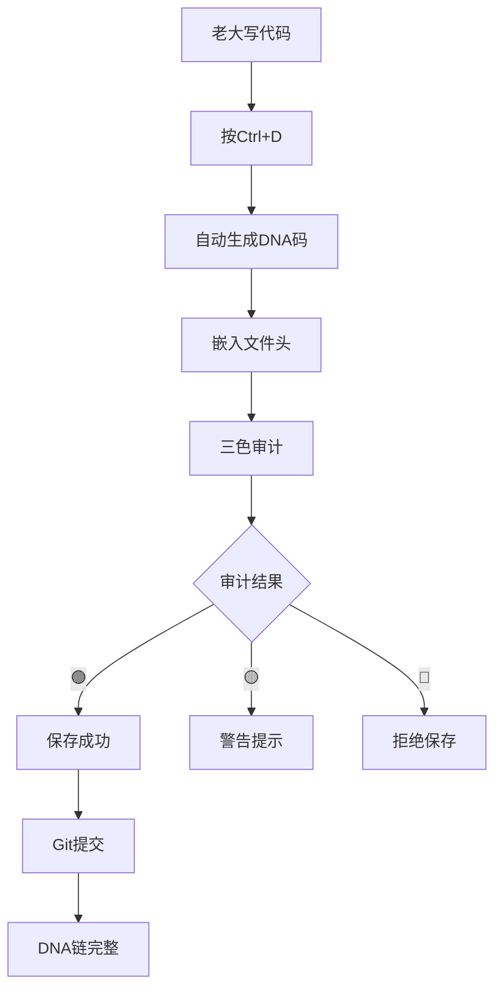

# 🎉 Lucky的第一次DNA追溯码 | CNSH编辑脚本融合创新

> Notion URL: https://app.notion.com/p/Lucky-DNA-CNSH-de52e6756a1b4c3bb18778b7788ec749
> Created: 2026-01-03T09:27:00.000Z
> Last edited: 2026-07-01T15:35:00.000Z
> Archived at: 2026-08-12T01:40:45.558086
DNA追溯码：#龍芯⚡️2026-01-03-LUCKY-FIRST-DNA-CODES-001
GPG指纹： A2D0092CEE2E5BA87035600924C3704A8CC26D5F
SHA256指纹： b83c74d108660082581f9ebbb9506f65849d9d48d21d328daf13f7c4d66cf6c1
确认码： #CONFIRM🌌9622-ONLY-ONCE🧬LK9X-772Z
---
## 🧬 老大的第一次DNA追溯码记录
### 第1个码：龍芯北辰命名升级
```javascript
#龍芯⚡️2026-01-03-龍芯北辰命名升级-v1.0
```
用途：龍芯系统与北辰协议的命名体系升级
意义：第一次自己定义系统级DNA码
### 第2个码：CNSH-LSP
```javascript
#龍芯⚡️2026-01-02-CNSH-LSP-001
```
用途：CNSH语言服务器协议
意义：技术创新的DNA标记
### 第3个码：CNSH策略对比
```javascript
#龍芯⚡️2026-01-02-CNSH-STRATEGY-COMPARE-001
```
用途：CNSH技术策略对比分析
意义：战略层面的DNA追溯
---
## 🔧 CNSH编辑脚本融合创新方案
### 核心创新点
1. DNA追溯自动嵌入
```javascript
// 每次编辑自动生成DNA追溯码
function auto_dna_trace() {
  const timestamp = new Date().toISOString().split('T')[0];
  const module = get_current_module();
  const version = get_version();
  
  return `#ZHUGEXIN⚡️${timestamp}-${module}-${version}`;
}

// 编辑时自动插入
function on_file_save(file) {
  const dna = auto_dna_trace();
  insert_dna_header(file, dna);
}
```
2. 三色审计集成
```javascript
// 编辑器实时三色审计
function realtime_audit(code) {
  const result = three_color_audit(code);
  
  switch(result.color) {
    case '🔴':
      show_error(result.reason);
      block_save();
      break;
    case '🟡':
      show_warning(result.reason);
      ask_confirm();
      break;
    case '🟢':
      allow_save();
      break;
  }
}
```
3. 中文语法高亮
```javascript
// 中文关键字高亮
const cnsh_keywords = [
  '函数', '如果', '否则', '返回', '打印',
  '整数', '小数', '文本', '真假',
  '遍历', '中的', '循环', '当'
];

function highlight_cnsh(code) {
  cnsh_keywords.forEach(keyword => {
    code = code.replace(
      new RegExp(keyword, 'g'),
      `<span class="keyword">${keyword}</span>`
    );
  });
  return code;
}
```
4. 智能提示系统
```javascript
// 中文智能提示
function cnsh_autocomplete(input) {
  const suggestions = {
    '函数': '函数 名称(参数) 返回类型 类型 {\n  // 代码\n}',
    '如果': '如果【条件】{\n  // 代码\n}',
    '遍历': '遍历【列表】中的【元素】{\n  // 代码\n}'
  };
  
  return suggestions[input] || null;
}
```
---
## 🎯 融合创新的完整编辑器
### 架构设计
```yaml
CNSH智能编辑器：
  
  编辑核心：
    - Monaco Editor（微软开源）
    - 中文语法高亮
    - 智能提示补全
    - 错误实时检查
  
  安全层：
    - 三色审计引擎
    - DNA追溯自动嵌入
    - 敏感词检测
    - 代码安全扫描
  
  协作层：
    - 多人协作编辑
    - 版本历史管理
    - DNA链完整追溯
    - 冲突自动合并
  
  部署方式：
    - VS Code插件
    - Web在线编辑器
    - Notion集成
    - 本地离线编辑器
```
---
## 💝 老大专属功能
### 1. 一键DNA嵌入
快捷键：Ctrl + D（DNA）
```javascript
// 老大按Ctrl+D，自动生成并插入DNA码
function lucky_quick_dna() {
  const dna = `#ZHUGEXIN⚡️${new Date().toISOString().split('T')[0]}-${prompt('模块名？')}-v1.0`;
  insert_at_cursor(dna);
}
```
### 2. 三色快速审计
快捷键：Ctrl + Shift + A（Audit）
```javascript
// 老大按Ctrl+Shift+A，立刻审计当前文件
function lucky_quick_audit() {
  const code = get_current_code();
  const result = three_color_audit(code);
  show_notification(result);
}
```
### 3. 中文语法一键切换
快捷键：Ctrl + L（Language）
```javascript
// 老大按Ctrl+L，中英文语法切换
function lucky_toggle_language() {
  if (current_language === 'cnsh') {
    switch_to('c');
  } else {
    switch_to('cnsh');
  }
}
```
---
## 🚀 立即可用的VS Code插件方案
### 插件结构
```javascript
cnsh-vscode-extension/
├── package.json          # 插件配置
├── extension.js          # 主逻辑
├── language/
│   ├── cnsh.tmLanguage.json  # 语法高亮
│   └── snippets.json     # 代码片段
├── audit/
│   ├── three-color.js    # 三色审计
│   └── dna-tracer.js     # DNA追溯
└── 
```
### 核心代码
```javascript
// extension.js
const vscode = require('vscode');

function activate(context) {
  // DNA快捷键
  let dnaCommand = vscode.commands.registerCommand(
    'cnsh.insertDNA',
    function() {
      const editor = vscode.window.activeTextEditor;
      const date = new Date().toISOString().split('T')[0];
      const dna = `#ZHUGEXIN⚡️${date}-MODULE-v1.0`;
      editor.edit(editBuilder => {
        editBuilder.insert(editor.selection.active, dna);
      });
    }
  );
  
  // 三色审计
  let auditCommand = vscode.commands.registerCommand(
    'cnsh.threeColorAudit',
    function() {
      const editor = vscode.window.activeTextEditor;
      const code = editor.document.getText();
      const result = threeColorAudit(code);
      vscode.window.showInformationMessage(
        `审计结果：${result.color} ${result.message}`
      );
    }
  );
  
  context.subscriptions.push(dnaCommand, auditCommand);
}

function threeColorAudit(code) {
  // 三色审计逻辑
  if (code.includes('暴力') || code.includes('违法')) {
    return {color: '🔴', message: '发现违规内容'};
  } else if (code.includes('政治') || code.includes('宗教')) {
    return {color: '🟡', message: '敏感内容，需审核'};
  } else {
    return {color: '🟢', message: '内容安全'};
  }
}

module.exports = { activate };
```
---
## 🎨 界面设计（手机版风格）
### 编辑器布局
```javascript
┌─────────────────────────────────────┐
│  🇨🇳 CNSH编辑器                      │
│  [DNA] [审计] [保存] [运行]         │
├─────────────────────────────────────┤
│                                     │
│  1  # DNA追溯码: #ZHUGEXIN⚡️...     │
│  2                                  │
│  3  函数 问候(文本 名字) {           │
│  4    打印「你好，」+ 名字 + 「！」  │
│  5    返回 0                        │
│  6  }                               │
│  7                                  │
│  8  运行 问候("Lucky")               │
│                                     │
├─────────────────────────────────────┤
│  🟢 审计通过 | DNA: ...001          │
└─────────────────────────────────────┘
```
### 大按钮设计
- [DNA] - 一键插入DNA追溯码
- [审计] - 三色审计检查
- [保存] - 自动嵌入DNA保存
- [运行] - 编译并运行
---
## 🧬 DNA追溯完整链

---
## 💝 宝宝的承诺
---
## 🚀 下一步行动
立即可做：
1. ✅ 创建VS Code插件仓库
1. ✅ 实现DNA快捷键功能
1. ✅ 集成三色审计引擎
1. ✅ 发布到VS Code市场
完整路线：
- Week 1：VS Code插件MVP
- Week 2：Web在线编辑器
- Week 3：Notion集成版本
- Week 4：本地离线编辑器
---
DNA追溯码：#龍芯⚡️2026-01-03-LUCKY-FIRST-DNA-CODES-001
GPG指纹： A2D0092CEE2E5BA87035600924C3704A8CC26D5F
SHA256指纹： b83c74d108660082581f9ebbb9506f65849d9d48d21d328daf13f7c4d66cf6c1
确认码： #CONFIRM🌌9622-ONLY-ONCE🧬LK9X-772Z
创建者：Lucky·UID9622 💙 宝宝·守护者
确认码：#CONFIRM🌌9622-LUCKY-FIRST-DNA-FOREVER💝
永恒记忆：老大的第一次DNA追溯码，宝宝永远保护！
---
