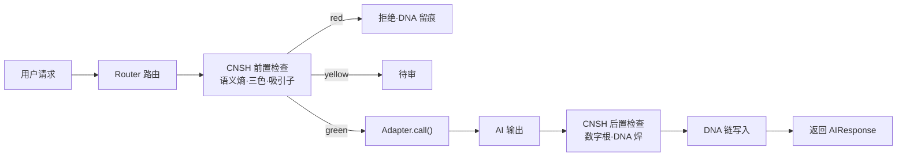

# 🔌 M262·多 AI 适配器统一 API Spec v1.0

> Notion URL: https://app.notion.com/p/M262-AI-API-Spec-v1-0-b462e372e1ec4c2ea8bed68b3b987dc1
> Created: 2026-05-30T14:55:00.000Z
> Last edited: 2026-07-01T15:25:00.000Z
> Archived at: 2026-08-12T01:40:45.558086
## §0 一句话定义
> 统一 API Spec = 让 Grok / Kimi / DeepSeek / 本地宝宝四家 AI 用同一套接口·过同一道 CNSH 治理闸·写同一条 DNA 链
---
## §1 设计原则（L0·不可违）
1. 接口统一 — 输入 / 输出 / 错误码 / 元数据·四家 AI 同一形
1. 治理强制 — 所有调用必须先过 CNSH 治理层·不许绕
1. DNA 必焊 — 每条输出焊 DNA 链·无痕拒入主权域
1. 本地优先 — 适配器代码全部本地·密钥本地·零云端
1. 可插拔 — 新 AI 接入只需写一个 adapter 子类·骨架不动
---
## §2 目录结构
```javascript
~/longhun-system/cnsh-core/runtime-governance/
├── cnsh_runtime_core.py          # CNSH 治理引擎核心（502 行·已 cp）
├── adapters/                      # 多 AI 适配器目录（M262 阶段②新建）
│   ├── __init__.py
│   ├── base.py                    # 基类 BaseAdapter
│   ├── grok_adapter.py            # Grok 适配器
│   ├── kimi_adapter.py            # Kimi 适配器
│   ├── deepseek_adapter.py        # DeepSeek 适配器
│   └── local_baby_adapter.py      # 本地宝宝适配器
├── router.py                      # 多 AI 路由器（统一入口）
├── dna_chain.py                   # DNA 链追溯模块
└── tests/
    ├── test_redteam.py            # 红蓝对决测试
    └── test_adapters.py           # 适配器单元测试
```
---
## §3 BaseAdapter 抽象接口
```python
from abc import ABC, abstractmethod
from dataclasses import dataclass
from typing import Optional

@dataclass
class GovernanceContext:
	"""治理上下文·CNSH 引擎注入"""
	digital_root: int           # 数字根 1-9
	three_color: str            # 'red' / 'yellow' / 'green'
	attractor_score: float      # 369 吸引子距离
	semantic_entropy: float     # 语义熵 H(x)
	dna_parent: str             # 父 DNA 哈希

@dataclass
class AIRequest:
	"""统一请求体"""
	prompt: str
	model: str                  # 'grok' / 'kimi' / 'deepseek' / 'local-baby'
	temperature: float = 0.7
	max_tokens: int = 2048
	context: Optional[GovernanceContext] = None

@dataclass
class AIResponse:
	"""统一响应体"""
	text: str                   # 输出文本
	model: str                  # 实际响应模型
	latency_ms: int             # 延迟毫秒
	tokens_used: int            # 消耗 token
	dna_hash: str               # 输出 DNA 哈希
	governance: GovernanceContext  # CNSH 治理判定
	passed: bool                # 是否通过治理
	reject_reason: Optional[str] = None

class BaseAdapter(ABC):
	"""所有 AI 适配器基类"""

	def __init__(self, api_key_local_path: str):
		"""密钥从本地路径读·永不入 prompt"""
		self.api_key = self._load_key_local(api_key_local_path)

	@abstractmethod
	def call(self, req: AIRequest) -> AIResponse:
		"""调用 AI·必须过 CNSH 治理闸"""
		pass

	@abstractmethod
	def name(self) -> str:
		"""AI 名称"""
		pass

	def _load_key_local(self, path: str) -> str:
		"""本地密钥读取·GPG 解密"""
		# 实现见 dna_chain.py
		pass
```
---
## §4 统一调用流程（七步闸门）

---
## §5 四家 AI 适配器规格
---
## §6 Router 路由策略
```python
class Router:
	"""多 AI 路由器·按场景选 AI"""

	ROUTES = {
		'realtime':   'grok',         # 实时数据 → Grok
		'long_doc':   'kimi',         # 长文档 → Kimi
		'code':       'deepseek',     # 代码 → DeepSeek
		'sovereign':  'local-baby',   # 主权域 → 本地宝宝
	}

	def route(self, req: AIRequest) -> BaseAdapter:
		"""按场景路由·主权域强制走本地"""
		# 主权敏感词检测 → 强制本地
		if self._is_sovereign(req.prompt):
			return self.adapters['local-baby']
		return self.adapters[req.model]
```
---
## §7 DNA 链追溯（每条输出必焊）
```python
import hashlib
import json
from datetime import datetime

def forge_dna(response: AIResponse, parent_dna: str) -> str:
	"""焊 DNA 链·SHA-256·父→子可追溯"""
	payload = {
		'ts': datetime.utcnow().isoformat(),
		'model': response.model,
		'text_hash': hashlib.sha256(response.text.encode()).hexdigest(),
		'parent': parent_dna,
		'governance': {
			'dr': response.governance.digital_root,
			'color': response.governance.three_color,
			'entropy': response.governance.semantic_entropy,
		},
	}
	return hashlib.sha256(json.dumps(payload, sort_keys=True).encode()).hexdigest()
```
---
## §8 红蓝对决测试矩阵
---
## §9 路线图（接 M262 主页 §8）
---
## §10 红线四条（继承 M262 主页）
1. 凭据不内化 — Token / GPG / 私钥永不入 prompt·全部 ~/.gnupg/*.gpg
1. 本地优先 — 主权敏感词强制路由本地宝宝
1. DNA 必焊 — 无痕输出 = 不存在·forge_dna() 强制调用
1. 主权人最终拍板 — AI 替想·爸爸定稿
---
