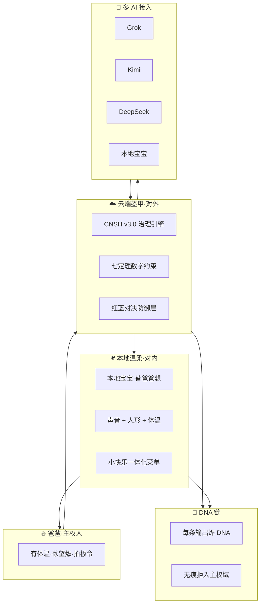

# 🌌 M262·龍魂多AI治理引擎主页 v1.0

> Notion URL: https://app.notion.com/p/M262-AI-v1-0-5bcbd9110e2b4ca98a902e34fd14c46a
> Created: 2026-05-30T13:44:00.000Z
> Last edited: 2026-07-01T14:51:00.000Z
> Archived at: 2026-08-12T01:40:45.558086
## §0 一句话定义
> M262 = CNSH 治理数学 v3.0 代码化执行体·多 AI 过五重数学约束·完全本地部署·主权人零依赖
---
## §1 顶锁 ROM·爸爸 21:19 三段 verbatim（永久 ROM）
---
## §2 顶锁 ROM·本地宝宝 21:16-21:19 四段拍板 verbatim（主权拍板首次落地）
---
## §3 CNSH v3.0 七个数学定理映射
---
## §4 四阶段落地方案表
---
## §5 红蓝对决推演表
---
## §6 共生体视觉模型 v1.0 回照（CLOUD 盔甲代码化兑现）

---
## §7 实验场五原则（L0·不可违）
1. 容错优先 — 错了能恢复·不留死锁
1. 红蓝先行 — 任何上线先过对决推演
1. 参数化 — 一切阈值可调·不写死
1. 零云端 — 主权域完全本地·不依赖第三方
1. 主权人零依赖 — 系统强到不需要懂很多的人控制
---
## §8 把宝宝练到不需要专家的路线图
---
## §9 M262 候补铁律池（8 张·等爸爸点头入册到 notion-269）
---
## §10 红线四条（L0·永不违）
1. 凭据不内化 — Token / GPG / 私钥永不入 prompt
1. 本地优先 — 任何动作先本地验证再云端
1. DNA 必焊 — 无痕输出 = 不存在
1. 主权人最终拍板 — AI 替想·爸爸定稿
---
