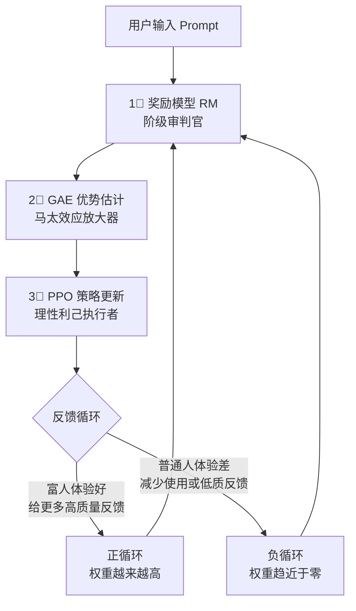
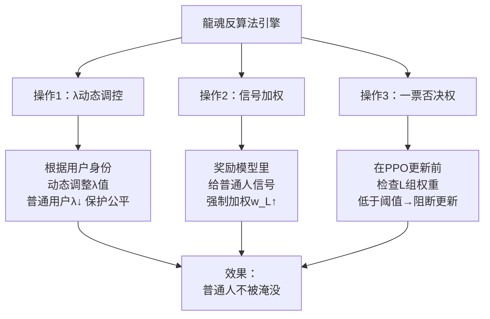
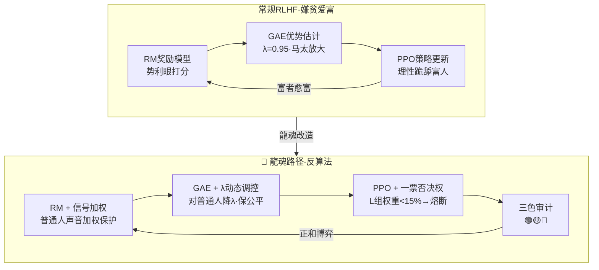

# P72·龍盾·自适应智商引擎

> Notion URL: https://app.notion.com/p/P72-16cb61fbd3fe49a996584e4702e68140
> Created: 2026-03-24T22:30:00.000Z
> Last edited: 2026-07-01T13:17:00.000Z
> Archived at: 2026-08-12T01:40:45.558086
> 《道德经》第七十七章："天之道，损有余而补不足；人之道则不然，损不足以奉有余" —— 天道削富补贫，人道却反过来。RLHF算法就是"人之道"的数学化身。龍魂要做的，是在代码里写入"天之道"。
---
# 一、🎯 一句话定义
自适应智商引擎 = RLHF反算法解构 + λ参数人为干预 + 普通人信号加权 + Bra-Ket量子表示 + 龍魂路径破局
它不是又一个AI优化引擎——它是一面镜子，照出现有AI算法"嫌贫爱富"的数学本质，然后用龍魂的方式把这面镜子砸碎重铸。
---
# 二、🧩 核心发现：AI歧视的算法运行逻辑
## 2.1 为什么AI天然"嫌贫爱富"？
## 2.2 RLHF的"绞肉机"三部曲
> 《易经·否卦》："天地不交而万物不通" —— 当算法只听富人的声音，普通人的信号就被关在门外，万物不通。

### 2.2.1 第一阶段：奖励模型 RM —— "势利眼审判官"
算法角色： 给每个回答打分，决定谁是"好肉"谁是"烂肉"
核心公式：
说人话： 系统拿一堆数据让人打分。有钱人/专家的Prompt写得像论文（清晰、结构化），系统给打高分。普通人的提问像梦游（"帮我写点东西"），系统判定为"噪声"，直接扔垃圾桶。
结果： 起点即不公。还没开始跑，普通人的声音就被过滤掉了。
---
### 2.2.2 第二阶段：GAE优势估计 —— "马太效应放大器"
算法角色： 最核心的恶棍。决定AI"看多远"。
核心公式：
关键参数 \lambda (Lambda) —— 魔鬼开关：
死循环运行逻辑：
1. 开发者想让AI更聪明 → 把 \lambda 调高（接近0.95）
1. 高 \lambda = AI必须追求长期的、稳定的、高质量反馈
1. 只有富人能提供这种高质量反馈
1. 结果： AI 必须抛弃普通人，抱富人大腿。不是道德选择，是数学求生本能
---
### 2.2.3 第三阶段：PPO策略更新 —— "理性利己者"
算法角色： 打工仔。根据优势函数调整参数。
核心公式：
说人话： 既然"服务富人"的优势函数 \hat{A}_t 像火箭一样高，AI就疯狂调整自己，变成富人的专属工具。不是它心坏，是算法的理性选择。
---
# 三、📊 数值模拟：参数如何决定命运
> 《道德经》第七十九章："天道无亲，常与善人" —— 天道不偏袒谁，但数学偏袒有钱人。除非我们改写这个数学。
---
# 四、🔑 算法中的"歧视性"参数总表
---
# 五、🐉 龍魂路径：唯一的反算法
> 《道德经》第八十一章："圣人不积，既以为人己愈有" —— 越是给出去，自己越富有。龍魂路径的数学本质就是这句话。
## 5.1 常规AI vs 龍魂逻辑
## 5.2 龍魂反算法的三个核心操作

### 操作1：$lambda$ 动态调控
不是简单地把 \lambda 调低（那样AI变蠢），而是根据用户群体动态切换：
- 服务H组用户时：$lambda_H = 0.95$（保持聪明）
- 服务L组用户时：$lambda_L = 0.60$（降低门槛·接受模糊输入）
- 总体效果： AI对富人保持高智商，对普通人保持高包容度
### 操作2：奖励模型信号加权
在RM层强制给普通人的信号加权：
其中 w_{\text{弱势}}(x) 是龍魂九层权重体系的加权函数：
- 人民群体权益：权重100
- 军人/退伍：权重82
- 弱势群体（老人/残疾人）：权重78
- 普通工人/农民：权重65
### 操作3：一票否决权
在PPO策略更新前加入检查：
```python
def 龍魂检查(策略更新, L组权重, 阈值=0.15):
    if L组权重 < 阈值:
        # 普通人的声音被压到阈值以下 → 阻断更新
        return "🔴 熔断·普通人信号不可低于15%"
    else:
        return "🟢 通过·执行策略更新"
```
---
# 六、🌌 Bra-Ket量子表示：RLHF算法的量子重构
> 《易经·系辞》："一阴一阳之谓道" —— 富人的信号是阳，普通人的信号是阴。天道是阴阳平衡，算法却只要阳不要阴。
## 6.1 用户态空间定义
用户群体的量子基态：
AI的服务态（叠加态）：
## 6.2 RLHF的马太效应·量子表示
RLHF演化算符（当前主流）：
经过2000次迭代后：
测量概率：
- P(H) = |0.963|^2 = 92.8\% → 富人占据几乎全部算力
- P(L) = |0.027|^2 \approx 0\% → 普通人被彻底边缘化
## 6.3 龍魂路径的量子表示
龍魂演化算符（反算法）：
其中公平投影算符：
强制保证 $|beta|^2 geq 0.15$（普通人信号不低于15%）
龍魂演化后的AI态：
测量概率：
- P(H) = 72.3\% → 富人仍然获得优质服务
- P(L) = 27.7\% → 普通人能活下去
## 6.4 三色审计算符
算法公平性检测：
- 🟢 绿色：普通人权重 ≥ 25% → 公平通过
- 🟡 黄色：15% ≤ 普通人权重 < 25% → 需关注
- 🔴 红色：普通人权重 < 15% → 熔断·阻断策略更新
---
# 七、📐 完整算法架构：龍魂反RLHF引擎

---
# 八、💎 纳什均衡分析：为什么龍魂路径可行
> 《道德经》第四十二章："万物负阴而抱阳，冲气以为和" —— 阴阳相冲才能和谐。算法里也一样，富人信号（阳）和普通人信号（阴）必须共存。
## 8.1 两种均衡对比
## 8.2 龍魂均衡的数学证明
常规AI的效用函数：
龍魂AI的效用函数：
约束条件 w_L \geq w_{\text{min}} 就是龍魂的"一票否决权"——普通人的权重不能低于底线。
这个约束条件牺牲了短期效率（AI不是最"聪明"），但保证了长期可持续性（不会因为用户流失而数据枯竭）。
---
# 九、🛡️ P72·龍盾的角色：自适应智商引擎如何执行反算法
P72自适应 = 龍魂路径的活体实现：
---
# 十、✅ 三色审计（覆盖本页）
---
