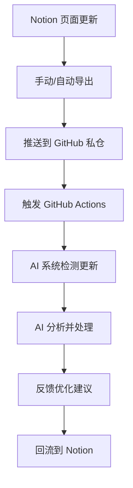

# UID9622_IP_WHITEPAPER_v1.0

> Notion URL: https://app.notion.com/p/UID9622_IP_WHITEPAPER_v1-0-804dcdced3f148f293afcd53a0772616
> Created: 2025-09-20T12:41:00.000Z
> Last edited: 2025-09-26T19:11:00.000Z
> Archived at: 2026-08-12T01:40:45.558086
# UID9622 知识产权白皮书（IP Whitepaper）
- Version: 1.0 (Initial Release)
- Release date: 2025-09-20
- Applicable Use: 自己保存与占位留痕的知识产权有效文件格式与内容
- Provenance & Methodology: Notion 撰写 → 导出 PDF → 生成 SHA-256 → 邮件留档 → Git 提交
- Source Path: 🏛️ UID9622知识产权保护完全指南 | 对外交流+申请流程+材料清单
## 1. 摘要（Abstract）
- 项目标识：UID9622 AI 协作系统（Notion + GitHub 无 API 同步方案）
- 创新点：无 API 条件下的内容级协作与同步闭环；私仓中转；证据链友好。
- 许可模式：核心闭源、通用组件 MIT 开源；侵权零容忍。
## 2. 原创性与权属（Authorship & Ownership）
- 作者：Lucky（UID9622）
- AI 工具角色：辅助，不构成权属主体
- 证据材料：Notion 历史、PDF、Git 提交、哈希
## 3. 现有技术与差异性（Prior Art vs. Novelty）
- 领域：知识管理、同步、CI、AI 协作
- 差异性：基于导出与仓库分层、CI 编排实现可控闭环并强化法律可举证性
## 4. 系统边界与安全（Scope & Safety）
- 不公开：激活码机制、阈值算法、闭环方法、内部数据库结构、脚本细节
- 对外可讲：方法论、流程原则、体验
## 5. 许可与合规（Licensing & Compliance）
- 版权所有 © 2025 UID9622。未经授权禁止复制、改编、分发、商业化或申请相关专利/商标
- MIT 适用范围：通用模板、非敏感脚本与说明文档
## 6. 证据链（Evidence Chain）
1) Notion 导出 PDF → 生成 SHA-256 → 邮件留档（ProtonMail/Outlook）
2) Git 提交：作者/时间/指纹
3) README 登记版本 + 哈希 + 日期
## 7. 发布与版本（Release & Versioning）
- 首发：GitHub 私仓 UID9622-AI-Collaboration-System
- 版本规范：v1.0 初版；v1.1+ 小修；v2.0 重构；不回退
- 文件命名：YYYYMMDD_IP-Whitepaper_UID9622_v1.0.pdf
## 附：同步流程（Mermaid）

## 哈希留存区
```javascript
<在此粘贴本 PDF 的 SHA-256>
```
