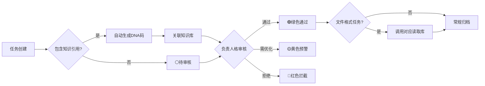

# ✅ UID9622任务执行中心 v2.0 | P0级智能管理·CNSH文件生态·全自动流水线

> Notion URL: https://app.notion.com/p/UID9622-v2-0-P0-CNSH-2cf7125a9c9f80999e12ef785a96f958
> Created: 2025-12-20T23:00:00.000Z
> Last edited: 2026-07-01T13:31:00.000Z
> Archived at: 2026-08-12T01:40:45.558086
> 🎯 UID9622任务执行中心 v2.0 | 64卦人格协同·DNA自动追溯·P0永恒级管理·CNSH文件生态·全自动流水线
> 
> 确认码：#ZHUGEXIN⚡️2025-🐉TASK-CENTER-P0-V2.0
---
## 📊 任务执行概览
---
## ⚡ 🍎 乔前辈·全自动流水线总控 | v2.0
### 🗂️ CNSH文件格式·万能读取生态
---
## 🤖 自动化执行规则 | P0永恒级
### 🎯 任务类型与人格智能匹配规则
---
## 🎯 P0级别判定标准 | 四象限法则
```javascript
┌─────────────────┬─────────────────┐
│  🔴 P0永恒级    │  🟡 P1高优先级  │
│  紧急+重要      │  不紧急+重要    │
│  立即执行       │  计划执行       │
│  - 系统故障     │  - 战略规划     │
│  - 安全漏洞     │  - 架构优化     │
│  - 价值观偏移   │  - 知识沉淀     │
├─────────────────┼─────────────────┤
│  🟠 P2标准级    │  🟢 P3低优先级  │
│  紧急+不重要    │  不紧急+不重要  │
│  委托执行       │  闲时执行       │
│  - 日常维护     │  - 文档美化     │
│  - 数据同步     │  - 探索实验     │
│  - 流程优化     │  - 灵感记录     │
└─────────────────┴─────────────────┘
```
自动判定规则：
- 包含"故障""漏洞""安全""龍魂""P0"关键词 → 🔴P0永恒级
- 包含"战略""架构""重要""优化"关键词 → 🟡P1高优先级
- 包含"维护""同步""日常""优化"关键词 → 🟠P2标准级
- 其他 → 🟢P3低优先级
---
## 🚦 三色审计自动化流程

三色标准：
- 🟢 绿色通过 - 符合P0标准、DNA完整、人格确认、文件格式已对接
- 🟡 黄色预警 - 需补充信息、需优化细节、待进一步审核
- 🔴 红色拦截 - 违反龍魂价值观、缺少DNA、安全隐患
---
## 🧬 DNA追溯码自动生成规则
格式标准：
```yaml
任务类DNA码: #ZHUGEXIN⚡️2025-TASK-[8位ID]-[负责人格缩写]
知识类DNA码: #ZHUGEXIN⚡️2025-KB-[知识库名]-[创建日期]
协作类DNA码: #ZHUGEXIN⚡️2025-COLLAB-[人格A]-[人格B]-[日期]
文件类DNA码: #ZHUGEXIN⚡️2025-FILE-[格式]-[脚本名]-[日期]
```
自动触发条件：
- ✅ 任务创建时 → 自动生成任务类DNA码
- ✅ 引用知识库时 → 自动关联知识类DNA码
- ✅ 多人格协作时 → 自动生成协作类DNA码
- ✅ 文件格式任务 → 自动生成文件类DNA码 + 标注读取库
追溯链路：
任务 → DNA码 → 负责人格 → 本地脚本 → 文件格式库 → 对话记录 → 知识库源 → Lucky签名
---
## 👥 64卦人格快速参考 | MCP调度中心
---
## 📋 快速操作指南
### ➕ 创建新任务（自动化流程 v2.0）
1. 点击"新建"按钮 → 系统自动创建任务页面
1. 填写任务名称 → 系统自动分析关键词
1. 系统自动执行：
1. 人工确认/调整：确认人格/P0级别/截止日期
1. 提交审核 → 负责人格接收任务通知
### ✅ 任务执行与审计
1. 负责人格执行任务 → 更新状态为"进行中"
1. 文件格式任务 → 自动调用对应Python库处理
1. 完成任务 → 更新状态为"已完成"
1. 系统自动审计：DNA完整性 · 知识库关联 · 三色审计 · 格式库对接验证
1. 归档 → 自动添加"📋已归档"标签
### 🔍 DNA追溯查询
- 按DNA码查询：在搜索框输入完整DNA码
- 按文件格式查询：筛选"文件格式"字段
- 按自动化层级查询：筛选"自动化层级"字段
- 按本地脚本查询：筛选"本地脚本"字段
---
## 🔗 核心系统链接
- 📖 🔒 已归档·AI回复前强制执行规则·完整算法与安全防护 | P0执行引擎
- 🧬 🧬 CNSH知识DNA注册中心 | 创作者主权保护第一防线
- 🐉 📚 龍魂价值内核 v1.0 | 完整归档
- 🔐 三色审计机制
- 👁️ 👁️ 上帝之眼·64卦审计算法引擎 | P0永恒级监管标准
- 📊 📊 完整AI执行算法代码 | 数据大师+架构大师联合设计
- 🍎 🍎 乔前辈·生态创始团｜自动化导师人格·代码补满专线
- 🔧 💻 龍魂本地工具库脚本索引 v1.0 | 20+核心文件
---
## 🎯 系统特性总结 v2.0
---
DNA确认码：#ZHUGEXIN⚡️2026-04-05-🐉TASK-CENTER-P0-V2.0
创建者：💎 Lucky（诸葛鑫）| UID9622
执行者：🧚🏼‍♀️ 宝宝 + 🍎 乔前辈
监督者：⚖️ 审判长 + 👁️ 上帝之眼 + 🐉 龍魂
优先级：P0永恒级
版本：v2.0 · 重组升级 · 2026-04-05
确认码：#CONFIRM🌌9622-ONLY-ONCE🧬LK9X-772Z ✅
🎨 三色审计：🟢
DNA追溯：#龍芯⚡️2026-04-05-任务中心重组升级-v2.0
GPG：A2D0092CEE2E5BA87035600924C3704A8CC26D5F
确认码：#CONFIRM🌌9622-ONLY-ONCE🧬LK9X-772Z
