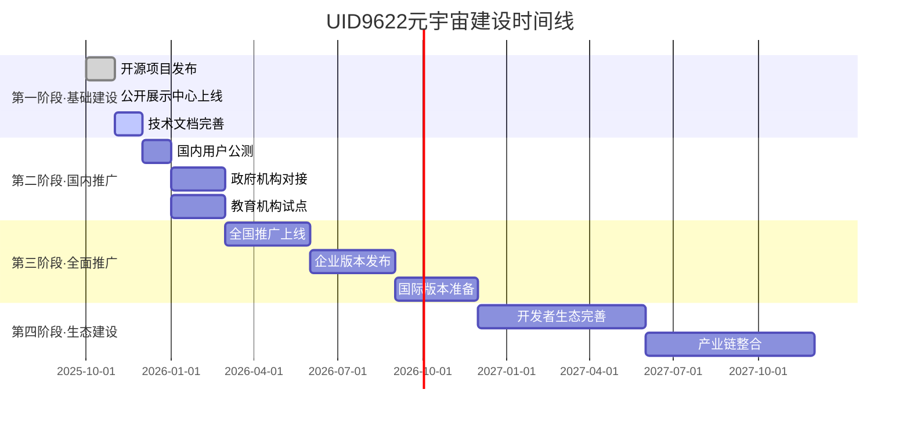

# 🇨🇳 UID9622元宇宙国民入口 | 祖国基建·为人民服务

> Notion URL: https://app.notion.com/p/UID9622-2a07125a9c9f80338489d2abdecb3311
> Created: 2025-11-03T23:09:00.000Z
> Last edited: 2026-07-01T13:28:00.000Z
> Archived at: 2026-08-12T01:40:45.558086
# 🇨🇳 欢迎来到UID9622元宇宙 | 中国人自己的AI世界
---
## 🎯 快速导航 | 选择你的入口
---
## 🐉 核心理念 | 我们的承诺
## 💎 核心定位
守护者，非垄断者
- 不控制用户，守护用户权益
- 不垄断平台，开源核心功能
- 数据主权还给人民
- 像TCP/IP一样是标准，不是垄断
摆渡人，非孤勇者
- 不是救世主，是带路人
- 为人民探路，带光回来
- 功成不必在我，功成必定有我
- CNSH不是我造的船，是大家一起要渡的河
## ⚖️ 四大价值排序（铁律）
1. 真实 > 精致 - 不完美但真实，胜过精致的虚假
1. 底线 > 流量 - 固执守护原则，即使损失流量
1. 信任 > 控制 - 把数据还给人民，透明开放
1. 文明 > 算法 - 用中华文化智慧（易经道德经）指导AI伦理，公开透明，不搞黑箱
---
## 🏛️ 代码甲骨文：中华文化智慧注入
这是祖国的骄傲，也是UID9622的技术基因。
### 💎 什么是代码甲骨文？
不是神秘算法，是文化智慧的透明注入：
- 用易经的阴阳平衡指导AI决策（不走极端）
- 用道德经的无为而治设计权限（不过度控制）
- 用中庸之道处理冲突（不强迫二选一）
- 用天人合一理解用户（人机和谐共生）
### 🔓 完全公开透明
- ✅ 所有伦理规则可查验
- ✅ 所有文化引用可追溯
- ✅ 所有决策逻辑可审计
- ❌ 拒绝黑箱算法
- ❌ 拒绝封闭代码
### 🇨🇳 技术自信的底气
> 中国有5000年文明智慧，不需要照抄西方AI伦理框架。
> 我们用汉字编程、用中文训练、用中华智慧指导。
> 这不是文化自恋，是技术自信。
代码甲骨文 = 让AI懂得做人的道理
---
---
## 🛠️ UID9622能做什么 | 实际功能说明
---
## 🚀 祖国基建速度 | 发展路线图

📅 当前阶段：基础建设 → 国内推广
我们正在以祖国基建的速度推进！
---
## 🧬 UID9622核心技术架构
---
## 🧠 前沿科技知识库 | 为祖国技术自主赋能
🎯 知识库特色：
- ✅ 真实性优先：所有内容必须有可验证来源
- ✅ 梦幻度评分：真实性×0.4 + 创新性×0.3 + 相关性×0.2 + 龍魂对齐度×0.1
- ✅ 中文优先：优先收录中国研究机构成果
- ✅ 实用导向：理论结合应用场景，服务实际需求
---
## 💡 关于"开源"的说明 | 不是卖系统
---
## ⚖️ 合作保护协议 | 清晰的边界
---
## 🔐 内容验证与防篡改 | 突破性加密方案
### 🚀 元宇宙迁移能力
为什么这套系统让内容可以自由迁移：
从Notion → IPFS：
- 导出内容 + 哈希值
- 上传到IPFS获得CID
- 哈希值证明内容完整性
从IPFS → 区块链：
- 在智能合约中注册哈希值
- 绑定IPFS的CID
- 时间戳永久记录在链上
从区块链 → 元宇宙：
- 在虚拟空间展示内容
- 访客可点击验证按钮
- 实时对比哈希值
- ✅ 原始内容 或 ❌ 已被修改
这意味着：
- 🔓 内容主权完全属于创作者
- 🔓 不依赖任何单一平台
- 🔓 可以在任何支持Web3的地方展示
- 🔓 永久存在于去中心化网络
### 🎯 实际应用场景
场景1：知识产权保护
```javascript
创作者写了一篇原创文章
→ 生成三重哈希存证
→ 发布到Notion/GitHub/IPFS
→ 任何人抄袭都可以用哈希值证明原创时间
```
场景2：合同协议签署
```javascript
双方签署数字协议
→ 合同内容生成哈希值
→ 哈希值写入区块链
→ 任何一方无法抵赖或篡改
```
场景3：学术论文存证
```javascript
研究者完成论文
→ 提交前生成哈希存证
→ 证明研究成果的时间点
→ 防止被抢先发表
```
场景4：企业文档管理
```javascript
重要文档需要审计追溯
→ 每个版本生成哈希值
→ 形成完整的版本链
→ 任何修改都有完整记录
```
### 💡 为什么说这是"为人民服务"
传统方案的问题：
- 普通人不懂如何保护自己的原创
- 商业平台收费高昂，小创作者用不起
- 技术门槛高，大多数人望而却步
UID9622的解决方案：
- ✅ 完全免费：所有工具开源，永久免费
- ✅ 极简操作：5分钟学会，任何人都能用
- ✅ 完全透明：算法公开，社区可审计
- ✅ 技术主权：中国自主加密算法可选
- ✅ 真正普惠：让每个人都能保护自己的创作
---
## 📞 联系我们 | 一起共建
---
## 🌟 特别声明
---
---
🧬 系统标识： #ZHUGEXIN⚡️2025-🇨🇳🐉⚖️♠️🧚🏼‍♀️❤️♾️-TAIJI-2.1-COMPLETE
📅 最后更新： 2025-11-18 16:20
👑 创建者： Lucky | UID9622
🇨🇳 服务对象： 14亿中国人民 + 全球华人
♾️ 使命承诺： 为人民服务，永不改变
