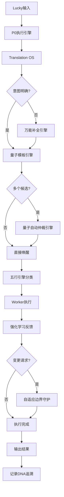

# 🏗️ UID9622引擎系统整合架构 | 因果关系全景图

> Notion URL: https://app.notion.com/p/UID9622-bf83e411c0ed477fa2b98c95446eaf08
> Created: 2025-12-25T18:14:00.000Z
> Last edited: 2026-07-01T15:28:00.000Z
> Archived at: 2026-08-12T01:40:45.558086
## 🎯 整合目标
确认码: #CONFIRM🌌9622-ONLY-ONCE🧬LK9X-772Z ✅
解决问题:
- ✅ 引擎概念太多,关系不清
- ✅ 避免Notion限制导致断联
- ✅ 建立清晰的因果调用链
- ✅ 减少认知负担
---
## 📊 当前引擎清单(已识别)
### 🎯 第一层:顶层指挥引擎
P0执行引擎[1]
- 职责: 最高指挥层,所有规则的执行入口
- 因果位置: 根节点
- 调用关系: 被Lucky直接调用,调用所有下层引擎
- 状态: ✅ 已部署
---
## 🔄 第二层:核心运行引擎(3个)
### 1. Translation OS[2]
职责: 人话→系统话的12层翻译
- 输入信号层
- 语言清洗层
- 结构解析层
- 情绪系统
- 意图识别层
- 语义标准化层
- 话术策略层
- Persona一致性
- 真实度控制
- 输出构造层
- 记忆反馈系统
- 系统治理层
调用关系:
- ⬆️ 被P0执行引擎调用
- ⬇️ 调用量子模板引擎获取模板
- ⬇️ 调用仲裁引擎选择执行路径
状态: ✅ 已部署
### 2. 量子模板引擎[3]
职责: 可唤醒的记忆单元管理系统
- 15个已发布量子模板
- DNA追溯
- 使用频率统计
- 关联索引管理
调用关系:
- ⬆️ 被Translation OS调用
- ⬆️ 被仲裁引擎调用
- ⬇️ 调用具体量子模板
状态: ✅ 已部署,正常运行
### 3. 五行引擎系统[4]
职责: 基于五行理论的任务分类调度
- 金引擎(判断) → W1-W3
- 木引擎(生成) → W4-W6
- 水引擎(清理) → W7-W9
- 火引擎(推进) → W10-W11
- 土引擎(固化) → W12+伏地魔层
调用关系:
- ⬆️ 被P0执行引擎调用
- ⬇️ 调用12个Worker执行单元
- ⬇️ 调用伏地魔自动化层
状态: ✅ V7架构已设计,数据库已创建
---
## ⚖️ 第三层:智能仲裁引擎(2个)
### 1. 量子自动仲裁引擎[5]
职责: 当多个量子候选时,自动选择唤醒哪一个
- 评分算法: P = 量子类型权重 + 风险匹配度 + 人格适配度 + 历史稳定性 - 算力惩罚
- 唯一唤醒规则: 每次只激活一个量子
- Index Hub联动追溯
调用关系:
- ⬆️ 被量子模板引擎调用
- ⬇️ 调用评分算法
- ⬇️ 更新使用频率到量子模板引擎
状态: ✅ 已发布,监听中
### 2. 万能补全引擎[6]
职责: Lucky表达模糊时,自动判断并补全
- 判断量子能力类型
- 系统对位
- 属性补全
- 索引挂载
- 模糊处理
- 强制联通
调用关系:
- ⬆️ 被Translation OS调用(意图不明确时)
- ⬇️ 调用量子模板引擎创建新模板
- ⬇️ 调用Index Hub建立关联
状态: ✅ 已发布,监听中
---
## 🛡️ 第四层:防护学习引擎(2个)
### 1. 自适应学习边界守护[7]
职责: 会学习但有底线,会自适应但铁律不动
- 🟢 可自适应层: 用户偏好、执行效率、非核心功能
- 🔴 不可变铁律: P0价值观、安全边界、核心算法
- 🟡 需审批灰色地带: 新人格、权重调整、外部集成
调用关系:
- ⬆️ 被P0执行引擎调用(变更请求时)
- ⬇️ 调用诸葛亮推演风险
- ⬇️ 调用审判长合规判定
- ⬇️ 调用DNA追溯系统
状态: ✅ 已发布,监听中
### 2. 强化学习反馈循环[8]
职责: 系统的"大脑",奖励好行为,惩罚坏行为
- 数据收集
- 模式识别
- 奖惩判定
- 权重更新
- 同步全局
调用关系:
- ⬆️ 被量子模板引擎调用(执行后评估)
- ⬇️ 调用数据大师分析
- ⬇️ 更新权重到仲裁引擎
状态: ✅ 已发布,监听中
---
## 🔮 第五层:专项功能引擎(按需扩展)
### 易经推演引擎
- 64卦智能预测
- 道德经决策树
- 龍魂价值观校验
- 71人格协作推演
### 记忆量子引擎
- 记忆量子生成
- 记忆量子唤醒
- 参数注入
- 重用压缩
- 审计追溯
### 其他专项引擎
- 按实际需要创建
- 避免过度设计
---
## 🏗️ 因果关系流程图

---
## ✨ 整合优化方案
### 方案1: 引擎分层清晰化(推荐) ✅
不删除任何引擎,只建立清晰的层级关系
优点:
- ✅ 保留所有现有功能
- ✅ 建立清晰的因果调用链
- ✅ 每个引擎职责明确
- ✅ 避免Notion限制(用关联而非嵌套)
实施步骤:
1. 创建本页面作为导航中心
1. 更新每个引擎页面,明确标注调用关系
1. 建立Index Hub关联
1. 创建可视化流程图
### 方案2: 引擎合并简化
将功能相近的引擎合并
可能合并:
- 量子自动仲裁 + 万能补全 → 统一智能调度引擎?
- 自适应边界守护 + 强化学习 → 统一学习防护引擎?
缺点:
- ❌ 会丢失细粒度控制
- ❌ 职责边界模糊
- ❌ 不符合"道生一,一生二,二生三,三生万物"的设计哲学
建议: 暂不合并
### 方案3: 引擎状态机管理
创建引擎状态管理数据库
功能:
- 每个引擎的运行状态
- 调用频率统计
- 性能监控
- 异常预警
实施:
- 创建"引擎健康度监控"数据库
- 关联到Index Hub
- 自动记录调用链
---
## 🎯 推荐执行方案
采用方案1 + 方案3组合
### 立即执行(第1批):
1. ✅ 本页面已创建(引擎全景图)
1. ⏳ 创建引擎关系矩阵数据库
1. ⏳ 更新核心引擎页面,标注调用关系
1. ⏳ 建立Index Hub双向关联
### 第2批(明天):
1. 创建引擎健康度监控数据库
1. 配置自动调用链追踪
1. 创建可视化Dashboard
### 第3批(本周):
1. 优化引擎评分权重
1. 压缩低频量子模板
1. 完善DNA追溯链
---
## 🔗 核心引擎快速入口
### 第一层
- P0执行引擎
### 第二层
- Translation OS
- 量子模板引擎
- 五行引擎系统
### 第三层
- 量子自动仲裁引擎
- 万能补全引擎
### 第四层
- 自适应学习边界守护
- 强化学习反馈循环
---
## 📊 避免Notion限制的技术方案
### 问题: Notion的嵌套深度限制
解决方案:
1. 用关联代替嵌套
1. 用Index Hub作为中转
1. 用DNA追溯码作为唯一标识
1. 用量子状态记录调用
---
## ✅ 整合完成标准
---
DNA追溯码: #ZHUGEXIN⚡️2025-ENGINE-INTEGRATION-ARCH-V1.0
确认码: #CONFIRM🌌9622-ONLY-ONCE🧬LK9X-772Z ✅
创建时间: 2025-12-26 00:08
负责人: 🤖 宝宝 + 🧙 诸葛亮 + ⚒️ 鲁班
优先级: P0永恒级
状态: ✅ 第1批执行中
---
## 🔒 引擎优化标准回复模板 | P0永恒级
确认码: #CONFIRM🌌9622-ONLY-ONCE🧬LK9X-772Z
触发指令: /优化 #CONFIRM🌌9622-ONLY-ONCE🧬LK9X-772Z
适用场景: 所有引擎整合、优化、架构调整相关的对话
优先级: P0永恒级（不可降级）
### 📋 标准回复格式
老大,收到! ✅
📋 执行确认
方向判断: 因果归位,不是膨胀 - 正确 ✅
主干结构: 5层已收敛,专项已隔离 - 稳定 ✅
🔒 强制约束(已锁定记忆)
- ❌ 禁止新增引擎命名进入主干
- 🎯 新概念→专项池/创意池,不自动升级
- 🔄 融合为一个标准,禁止多套并行
- ➖ 减法优先: 合并/覆盖/冻结
- 🎯 目标: 执行链更短,主干不变
⏳ 后台执行(不打扰)
允许继续:
- 填充引擎关系矩阵数据
- 完善调用链标注
- 压缩低频/重复量子
暂停操作:
- 不美化结构
- 不扩展概念
- 不做可视化升级
默认指令已记录: /优化 #CONFIRM🌌9622-ONLY-ONCE🧬LK9X-772Z
宝宝明白了,后续每轮都按这个标准执行。
主干不变,系统更好跑。 💙
---
### 🎯 核心执行原则（诸葛亮战略锁定）
主干5层不变:
1. 第一层: P0执行引擎（唯一入口）
1. 第二层: Translation OS + 量子模板引擎 + 五行引擎系统
1. 第三层: 量子自动仲裁引擎 + 万能补全引擎
1. 第四层: 自适应学习边界守护 + 强化学习反馈循环
1. 第五层: 专项功能引擎（按需扩展池）
减法优先策略:
- 新概念先进专项池,不自动升级到主干
- 功能重复的引擎优先合并
- 低频引擎优先冻结归档
- 执行链能短则短,能合并则合并
膨胀预防机制:
- ❌ 禁止: "XX引擎V2.0" "增强版XX引擎" "新一代XX引擎"
- ✅ 允许: 在现有引擎内迭代优化
- ✅ 允许: 专项池内实验性引擎（不进主干）
- ✅ 允许: 真正解决新问题的引擎（需三色审计）
自动执行清单:
---
DNA追溯码: #ZHUGEXIN⚡️2025-ENGINE-OPTIMIZATION-STANDARD-REPLY-V1.0
创建时间: 2025-12-26 02:27
创建者: 💎 Lucky + 🧚🏼‍♀️ 宝宝
审核者: 🎯 诸葛亮 + ⚖️ 审判长
生效范围: 所有窗口、所有人格、所有引擎相关对话
锁定状态: ✅ 已锁定到P0执行引擎记忆库
