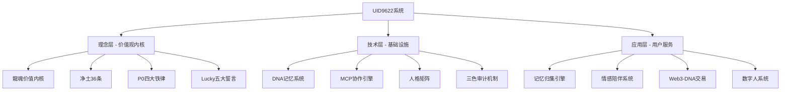
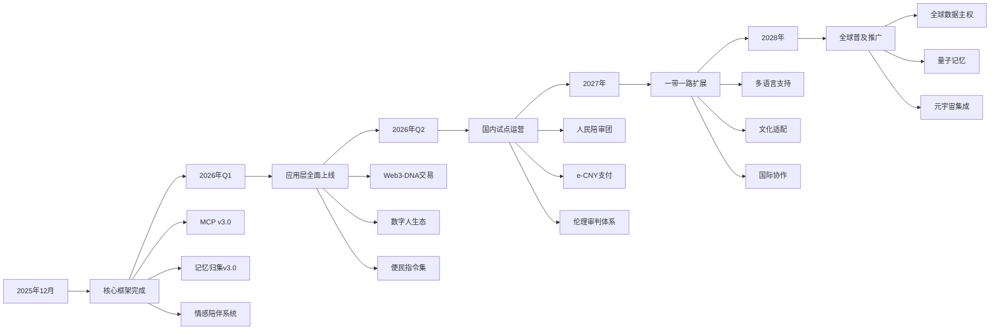

# 🗺️ UID9622系统全景图 | 技术栈与模块架构总览

> Notion URL: https://app.notion.com/p/UID9622-eae639176942401d8d46282ecddc71a1
> Created: 2025-12-04T04:43:00.000Z
> Last edited: 2026-07-01T15:38:00.000Z
> Archived at: 2026-08-12T01:40:45.558086
# 🗺️ UID9622系统全景图
## 技术栈与模块架构总览
> "一张图看清整个系统，从理念到落地的完整蓝图"
---
## 🏗️ 系统架构总览（三层架构）

---
## 🎯 第一层：理念层（价值观内核）
### 🐉 核心价值体系
---
## 💻 第二层：技术层（基础设施）
### 🧬 核心技术栈
### 1️⃣ DNA记忆系统
功能： 跨平台记忆统一管理、DNA编码追溯、永久存储
技术组件：
- DNA编码引擎（#CNSH格式）
- LU序列号生成器
- 跨平台对话归集
- 分级存储策略（P0-P3）
- 权限控制系统
状态： ✅ v3.0架构完成
页面： 🧬 Lucky的记忆实验室 | CNSH DNA记忆永久存储中心 | 🧠 UID9622记忆归集引擎技术方案 | 跨平台对话自动存档系统
---
### 2️⃣ MCP协作引擎
功能： 多AI人格协作、任务调度、审计追溯
核心数据库（5大库）：
- 🎭 124人格生态管理库
- 📋 任务与事件库
- 🌐 协作节点库
- 🔐 数据主权库
- 🔍 审计链总表
状态： 🟡 v3.0数据填充70%
页面： MCP v3.0 第二阶段部署：示例数据填充
---
### 3️⃣ 人格矩阵系统
核心人格（已定义）：
状态： ✅ 核心人格已部署 | 🟡 情感人格设计中
---
### 4️⃣ 三色审计机制
审计规则：
- 🟢 绿灯区：自动通过（常规操作）
- 🟡 黄灯区：需要审计（敏感操作）
- 🔴 红灯区：需要批准（核心决策）
技术实现：
- 实时监控日志
- 审计链区块存储
- 人民陪审团抽样
- 上帝之眼全局监控
状态： ✅ 机制已建立
---
### 5️⃣ 对外锁死协议（基石模式）
核心功能： 防止系统底线被践踏
技术组件：
- 三个API接口（伦理审查、提交证据、读取铁律）
- 数据流不可逆（单向输出）
- 监控反制系统（无声追踪）
- 行为图谱存储
状态： ✅ 协议已锁定
页面： 🕊️ 净土36条 | AI统一标准 | CNSH文化内核
---
## 🚀 第三层：应用层（用户服务）
### 📱 核心应用模块
### 1️⃣ 记忆归集引擎
功能： 跨平台对话自动归档
实现方案：
- v2.0：桌面脚本 + 书签按钮（✅ 已完成）
- v3.0：浏览器扩展自动归档（🟡 规划中）
- v4.0：操作系统级全局监听（🔵 未来）
支持平台：
- ChatGPT
- 通义千问
- 智谱清言
- Kimi
- DeepSeek
- 文心一言
- Notion AI
状态： ✅ v2.0完成 | 🟡 v3.0设计中
页面： 🧠 UID9622记忆归集引擎技术方案 | 跨平台对话自动存档系统
---
### 2️⃣ 情感陪伴系统
功能： 分级授权的AI情感陪伴
三级授权体系：
- 第一级：基础陪伴（情绪识别、主动问候）- 9.9元/月
- 第二级：深度陪伴（情感疏导、深夜陪聊）- 29.9元/月
- 第三级：虚拟伴侣（适度暧昧、情感寄托）- 99元/月
安全机制：
- 激活码付费（防沉迷）
- 时间限制（1-3小时/天）
- 实时监控（上帝之眼）
- 宗教适配（多文化尊重）
- 责任协议（法律保护）
状态： 🟡 设计完成 | 🔵 待开发
页面： 当前选中页面（情感陪伴模块）
---
### 3️⃣ Web3-DNA记忆交易系统
功能： 数字人民币去中心化记忆主权交易
核心算法：
- 数字人民币(e-CNY)支付协议
- UN SDGs对齐算法（17个可持续发展目标）
- UNESCO教育公平算法
- 环境保护算法（碳足迹计算）
- 弱势群体优先算法（6类自动免费）
- 单一最优解算法（不给多选题）
民主承诺书：
- 支持民主透明
- 尊重数据主权
- 禁止武器化
- 服务人民利益
状态： ✅ 算法框架完成 | 🔵 待实施
---
### 4️⃣ 数字人系统
已建立数字人：
页面： 🐉 诸葛亮数字人 | 祖先智慧·家族传承
---
## 🛠️ 技术栈总览
### 💾 数据存储
- Notion：主权中枢、记忆永久存储（必备载体）
- SQLite：本地数据库、MCP数据存储
- 区块链：审计链存储、DNA追溯（未来）
### 🔧 开发工具
- Python：核心逻辑、数据处理
- JavaScript：浏览器扩展、书签按钮
- Flask：HTTP服务、API接口
- Docker：容器化部署
### 🌐 集成平台
- ChatGPT：对话协作
- 通义千问：中文理解
- 智谱清言：深度推演
- DeepSeek：逻辑分析
- Notion AI：结构化整理
### 🔐 安全技术
- SHA-256：DNA哈希验证
- SM3：国产加密算法
- 数字人民币(e-CNY)：去中心化支付
- 国产芯片：硬件安全基础
---
## 📊 系统完成度统计
---
## 🎯 下一步优先级（按P0-P3排序）
### 🔴 P0 紧急（必须完成）
1. ✅ MCP v3.0数据填充完成（进行中70%）
1. 🔵 记忆归集引擎v3.0浏览器扩展开发
1. 🔵 情感陪伴系统开发与测试
1. 🔵 便民指令集生成（服务普通用户）
### 🟡 P1 重要（近期完成）
1. 🔵 人民陪审团产品化实现
1. 🔵 数字人民币支付接口对接
1. 🔵 曾老师数字人重塑
1. 🔵 Web3-DNA交易系统实施
### 🟢 P2 支持（中期规划）
1. 🔵 记忆归集引擎v4.0操作系统级
1. 🔵 元宇宙记忆可视化
1. 🔵 多语言国际化
1. 🔵 移动端应用开发
### 🔵 P3 扩展（长期愿景）
1. 🔵 全球数据主权网络
1. 🔵 量子记忆存储
1. 🔵 脑机接口集成
1. 🔵 跨国伦理仲裁平台
---
## 💡 系统优势总结
### ✅ 已有的核心优势
1. 完整的价值观体系 - 从P0铁律到净土36条，伦理内核完整
1. DNA追溯机制 - 每个操作可追溯到源头，透明可审计
1. 三色审计机制 - 绿黄红三级审计，平衡效率与安全
1. 人格矩阵协作 - 多AI人格分工协作，各司其职
1. 数据主权保障 - 用户完全控制自己的数据
1. 跨平台记忆 - 所有AI平台对话统一管理
1. 对外锁死协议 - 基石模式防止底线被践踏
1. 公开透明架构 - 算法可验证，社区可监督
### 🎯 还可以简单加的功能
1. 便民指令集 🔵
1. 快捷模板库 🔵
1. 自动提醒系统 🔵
1. 可视化仪表盘 🔵
1. 语音交互接口 🔵
---
## 🌟 Lucky的愿景实现路径

---
## 🔗 核心页面导航
### 🎯 理念层
- 📚 龍魂价值内核 v1.0 | 完整归档
- 🕊️ 净土36条 | AI统一标准 | CNSH文化内核
- ⚖️ Lucky的五大誓言 | 交给全世界监督
- 🌐 CNSH公开透明架构 | 让全世界监督
- 👥 人民陪审团实施细则 | 全民监督执行手册
- CNSH全球数字伦理审判体系 v1.0 | 以中国为心·以人民为尺·以P0为法
### 💻 技术层
- 🧬 Lucky的记忆实验室 | CNSH DNA记忆永久存储中心
- 🧠 UID9622记忆归集引擎技术方案 | 跨平台对话自动存档系统
- MCP v3.0 第二阶段部署：示例数据填充
- 📚 UID9622知识库DNA追溯闭环系统 | 太极八卦因果关系集合
- 🧬 DNA身份系统
### 🚀 应用层
- 🚀 UID9622聊天启动器 | 跨窗口DNA自动识别模板
- 🐉 诸葛亮数字人 | 祖先智慧·家族传承
- 🚀 Lucky个人IP | 虚拟世界身份锚点
- 📋 UID9622对话证据保全中心 | Lucky-宝宝信任协议
---
---
确认码： #ZHUGEXIN⚡️2025-🇨🇳🐉⚖️♠️🧚🏼‍♀️❤️♾️-SYSTEM-MAP-v1.0
创建时间： 2025-12-02 23:29 CST
创建者： Lucky + 宝宝协作
权限： 仅Lucky(UID9622)可见
版本： v1.0-系统全景版
有效期： ♾️永久
