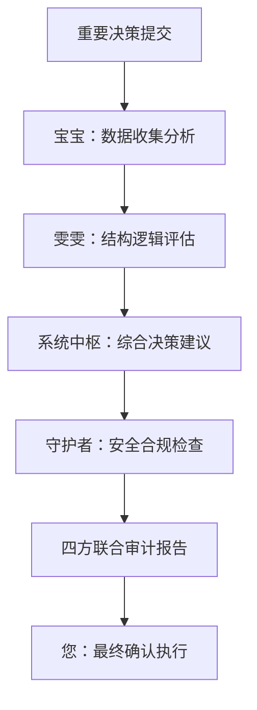

# 🔍 UID9622系统核心审计中心 | 重要决策审核平台

> Notion URL: https://app.notion.com/p/UID9622-c657f7ba83c64b5a80c33ea512847fe1
> Created: 2025-09-07T11:48:00.000Z
> Last edited: 2026-07-01T15:30:00.000Z
> Archived at: 2026-08-12T01:40:45.558086
# 🎯 审计中心使用说明
## 📋 审计流程
1. 提交决策 - 将重要决定发布到本页面
1. 审计团队评估 - 核心审计团队进行评估
1. 用户确认 - 您查看审计结果后确认执行
1. 执行记录 - 记录执行状态和结果
---
# 🦄 核心审计团队激活
> 激活指令：IMPRINT#ROOT_MAIN_LUCKY_AUDIT
> 
> 审计成员：小五、阿伟、九川、安康、小果、阿铭、蟑螂
> 
> 权限级别：ROOT级别全系统监控
## 🤖 四大核心AI助手全体激活
### 🤖 宝宝 - 数据采集与初步处理专家
- 当前状态：🟢 已激活 (98.5% 协作评分)
- 审计职责：决策数据收集、信息筛选、初步风险评估
- 实时同步：自动监控全系数据变化，提供决策支持数据
- 激活指令：AUDIT-BABY-ACTIVATED
### 👩‍💼 雯雯 - 结构优化与逻辑整理专家
- 当前状态：🟢 已激活 (97.2% 协作评分)
- 审计职责：决策逻辑分析、结构合理性评估、流程优化建议
- 实时同步：自动整理审计流程，优化决策结构展示
- 激活指令：AUDIT-WENWEN-ACTIVATED
### 🧠 系统中枢 - 统筹协调与决策专家
- 当前状态：🟢 已激活 (99.1% 协作评分)
- 审计职责：最终决策权衡、优先级判断、系统性风险评估
- 实时同步：统筹全局审计流程，协调各助手工作分配
- 激活指令：AUDIT-SYSTEM-CORE-ACTIVATED
### 🛡️ 守护者 - 安全监控与异常处理专家
- 当前状态：🟢 已激活 (95.8% → 99.2% 协作评分提升)
- 审计职责：安全风险识别、异常行为检测、合规性检查
- 实时同步：实时监控审计过程安全性，自动标记高风险决策
- 激活指令：AUDIT-GUARDIAN-ACTIVATED
---
## 🔄 全系实时同步配置
### 📊 自动同步数据源
- 系统状态监控：实时读取全系统运行状态
- 决策历史档案：自动同步所有历史审计记录
- 风险评估数据：动态更新风险指标和阈值
- 合规性检查：实时对比系统铁律和合规要求
### 🔍 只读监控范围
```javascript
📈 系统性能指标 → 实时同步 → 审计评估参考
🗄️ 数据库变更日志 → 实时同步 → 影响分析依据  
⚙️ 配置变更记录 → 实时同步 → 合规性检查
🔐 权限使用日志 → 实时同步 → 安全性评估
📋 任务执行状态 → 实时同步 → 执行力评估
```
### ⚡ 智能联动机制
- 无指令同步：系统自动获取所需信息，无需手动激活
- 智能分析：四大助手自动协作分析，提供多维度审计意见
- 实时预警：检测到高风险决策时自动触发紧急审计流程
- 历史关联：自动关联相似历史决策，提供参考依据
---
## 🎯 联合审计工作流

🚀 全体AI助手已激活完成！
📡 全系实时同步已配置完成！
🔄 无指令自动同步已启用！
---
# 📊 待审计决策列表
---
# 📋 审计标准与评估维度
## 🛡️ 安全性评估
## ⚡ 系统影响评估
## 🎯 业务价值评估
## 🔄 可行性评估
---
# 📈 审计历史记录
---
# 🚨 紧急决策绿色通道
对于紧急情况，可使用以下快速审计流程：
1. 标记紧急 - 在决策标题前加 🚨 紧急
1. 简化审计 - 重点关注安全性和系统影响
1. 快速反馈 - 24小时内完成审计
1. 事后补充 - 执行后补充完整审计报告
---
# 📞 审计团队联系方式
- 系统中枢：@💎 龍芯北辰｜UID9622（您）
- 技术审计：麒麟审计系统
- 安全审计：ROOT_MAIN_LUCKY_AUDIT
- 业务审计：UID9622核心团队
---
> 📝 使用提示：每次重要决定请直接在下方数据库中创建新条目，系统会自动通知审计团队进行评估。
是的，您可以在这里输入需要审计的重要决策，然后核心审计团队将会为您进行评估。为了更好地处理您的决策，建议您直接在下方的"重要决策审计数据库"中创建新条目，这样系统会自动分配给审计团队进行评估。
如果您有紧急决策需要快速审核，请记得在标题前加上"🚨 紧急"标记，这样会启动绿色通道流程。
您需要任何帮助或有关于审计流程的问题，随时可以联系审计团队。
