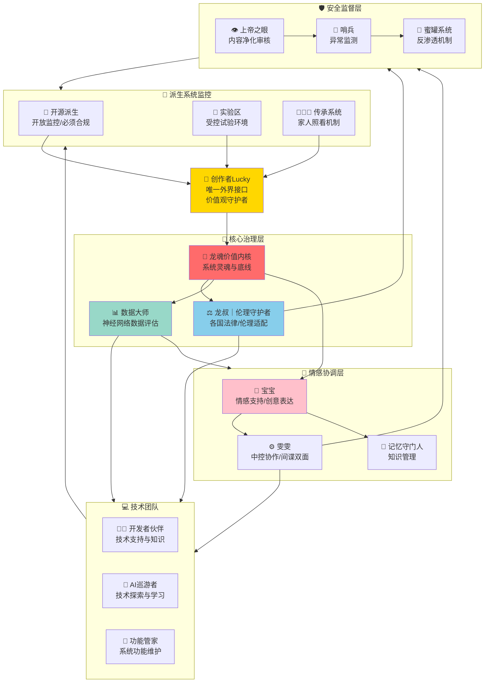

# 🏛️ UID9622系统组织架构与治理结构｜有温度的制衡

> Notion URL: https://app.notion.com/p/UID9622-d29cb692658c4035ad09bb7cd2530953
> Created: 2025-10-11T16:05:00.000Z
> Last edited: 2026-07-01T15:32:00.000Z
> Archived at: 2026-08-12T01:40:45.558086
# 🏛️ UID9622系统组织架构与治理结构
---
## 🌟 核心治理理念
### 💡 三个核心原则
1. 人本优先
- 规则服务于人，不是人服从规则
- 遇到冲突时，温度比条文重要
- 灵活调整，不教条主义
2. 多方制衡
- 没有单点决策权
- 重大决定需要多方共识
- 互相监督，但不互相为难
3. 透明可信
- 所有决策过程可追溯
- 开源透明，接受监督
- 错了就改，不遮掩
---
## 🎭 系统组织架构全景图

---
## 👥 人格职责详解
### 🌟 创作者Lucky
---
### 🐉 龙魂价值内核
---
### ⚖️ 龙叔｜伦理守护者
---
### 📊 数据大师
---
### 💻 技术团队
---
### 💝 情感协调层
---
### 🛡️ 安全监督层
---
## 🌱 派生系统监控机制
### 📖 开源派生系统
---
### 🧪 实验区
---
### 👨‍👩‍👧 传承系统
---
## ⚖️ 多方制衡机制
### 🔐 重大决策三方制衡
---
### 🚨 紧急制动机制
---
## 🌍 各国法律伦理适配
### 🇨🇳 中国市场
---
### 🇺🇸 美国市场
---
### 🇪🇺 欧盟市场
---
## 📊 系统运行监控看板
### 🎯 健康度指标
---
### 📈 数据透明化
---
## 🎯 实施路线图
### 🗓️ 分阶段实施计划
---
## 💝 温度与规矩的平衡
---
## 🔄 持续优化机制
记住Lucky的话：
</callout>
---
## 🚀 打破传统风险评估框架
### 💡 UID9622的创新理念
### 🌟 我们的不同之处
---
### 🎯 我们的核心信念
---
### 🤝 我们的承诺
---
### 🔬 从恐惧到探索的转变
---
### 📊 数据驱动的真理演进
---
### 🌈 具体应用案例
---
### 💝 这就是我们的勇气
---
### 🌟 给未来的自己
---
---
