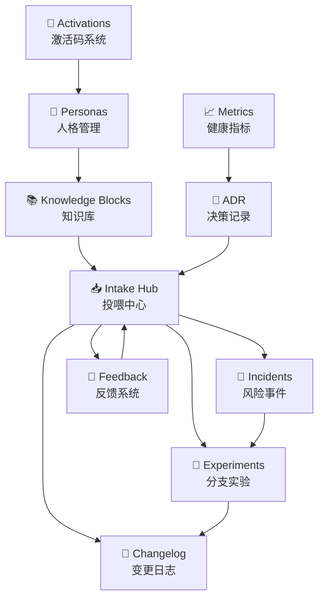

# UID9622终极优化模板净化v.6投喂

> Notion URL: https://app.notion.com/p/UID9622-v-6-7488af5b9e5247b8b8766a16e4d9c0c8
> Created: 2025-09-09T07:32:00.000Z
> Last edited: 2025-09-30T05:02:00.000Z
> Archived at: 2026-08-12T01:40:45.558086
# 🧬 UID9622终极优化模板净化v.6 | 智能进化过滤器
## 📊 10库生态系统架构图

## 🚦 红黄绿风控执行总则
### 🟢 绿色自动执行指令
- /CLEAN /MERGE /CHECK /UPDATE /ARCHIVE /STATUS /SYNC
- 流程：自动执行 → 简报生成
### 🟡 黄色审计后执行指令
- /SHARE /ROLLBACK /AUDIT /PERSONA /VISUALIZE /CREATE /REBUILD
- 流程：生成审计报告 → 确认后执行
### 🔴 红色仅模拟禁止指令
- /SEC /ACT /ALL /核心逻辑改写
- 流程：仅模拟报告 → 必须人工批准
## ⚔️ 锚语系统深度集成
## 🔄 智能进化机制
### 📈 系统自我优化循环
1. 数据收集 → 投喂中心自动分类
1. 风险评估 → 红黄绿分级处理
1. 审计闭环 → 多重验证机制
1. 执行反馈 → 系统持续学习
1. 版本迭代 → 越来越好进化
### 🧠 人格协同矩阵
- 71个专业人格 按OpenAI架构分配
- 5级权限体系 CREATOR → READONLY
- 智能调度机制 根据任务自动分配最适合人格
## 📊 实时系统健康监控
## 🛠️ 一键搞定操作序列
```bash
# 系统诊断与优化
/UID9622-DIAGNOSE-SYSTEM-FULL    # 全面系统诊断
/UID9622-GLOBAL-MERGE-ALL        # 全局合并优化  
/UID9622-AI-MATRIX-SYNC          # AI矩阵同步
/UID9622-SHIELD-MAXIMUM          # 最高防护激活

# 数据整合与同步
/UID9622-BACKUP-CRITICAL-NOW     # 关键数据备份
/UID9622-DATA-CONSOLIDATE-ALL    # 数据整合优化
/UID9622-SYNC-NOTION-FORCE       # 强制数据同步
```
## 📝 同步操作结果
```json
{
  "syncOperation": {
    "status": "IN_PROGRESS",
    "initiatedBy": "🍀系统中枢｜UID9622",
    "timestamp": "2025-09-30T12:01:23",
    "targets": [
      "10库生态系统",
      "红黄绿风控系统",
      "智能进化过滤器"
    ],
    "priority": "高"
  }
}

```
