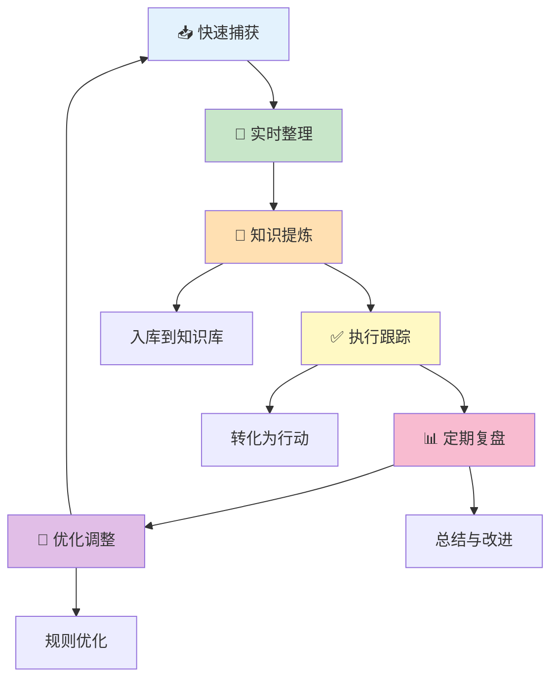

# 🌟 UID9622通用流程模板｜循序渐进的智慧

> Notion URL: https://app.notion.com/p/UID9622-210ee7c6758b44949f4e8554b9b738da
> Created: 2025-10-11T15:40:00.000Z
> Last edited: 2026-07-01T13:21:00.000Z
> Archived at: 2026-08-12T01:40:45.558086
# 🌟 UID9622通用流程模板
---
## 📚 核心设计理念
### 🎯 五大原则
1. 模块化设计
- 每个步骤相对独立，可选择性执行
- 不强制完成所有步骤，根据实际需求调整
- 轻量任务走简化流程，重要任务走完整流程
2. 渐进式处理
- 不追求一次性完成所有事情
- 分阶段推进，每阶段有明确交付
- 降低心理压力，提升执行意愿
3. 闭环反馈
- 有执行记录，能看到行动结果
- 有定期回顾，能优化流程本身
- 形成"做→看→改→优化"的成长循环
4. 高度灵活
- 流程是工具不是枷锁
- 感觉哪步太累就调整
- 可以根据场景定制修改
5. 以人为本
- 明确时间成本，不制造焦虑
- 提供便捷方式，降低操作门槛
- 强调"不是增加负担"
---
## 🔄 通用流程框架（5步法）
### ▶ 第1步：快速捕获
操作要点：
1. 记录核心信息（标题、来源、时间）
1. 标记重要程度（⭐⭐⭐ / ⭐⭐ / ⭐）
1. 快速分类（放到对应类别区）
1. 添加初步标签
快速模板：
```markdown
**⭐⭐⭐ [来源] - 标题**
*记录时间：日期*
*类别：分类*
```
---
### ▶ 第2步：实时整理
记录内容：
1. 🎯 核心要点：主要内容是什么（3-5条）
1. 💡 启发思考：哪些点触动了我（1-3条）
1. ✅ 立即行动：可以马上做的事（具体行动项）
1. 📌 深入研究：需要进一步了解的方向
标准模板：
```markdown
<callout color="blue_bg">
📝 **笔记：**

**🎯 核心要点：**
- （要点1）
- （要点2）
- （要点3）

**💡 启发思考：**
- （启发1）
- （启发2）

**✅ 立即行动：**
- [ ] （行动项1）
- [ ] （行动项2）

**📌 深入研究：**
- （研究方向1）
</callout>
```
---
### ▶ 第3步：知识提炼
提炼方法：
1. 使用 /ZGX-AI学习 指令处理内容
1. 生成规则卡片或知识条目
1. 入库到对应的知识库
1. 建立关联链接
操作指令：
```markdown
/ZGX-AI学习 材料：[粘贴整理后的内容]
```
入库后标记：
```markdown
✅ **已提炼入库** - <mention-date start="日期"/> 
知识条目：[链接到知识库]
关联标签：#标签1 #标签2
```
---
### ▶ 第4步：执行跟踪
跟踪方法：
1. 把"立即行动"转化为可勾选的todo
1. 设置合理的截止日期
1. 完成后记录执行结果
1. 未完成的分析原因并调整
执行记录模板：
```markdown
**📊 执行记录：**
- ✅ [行动项1] - 完成于 日期，效果：[简述结果]
- 🔄 [行动项2] - 进行中，预计 日期 完成
- ⏸️ [行动项3] - 暂缓，原因：[说明]
- ❌ [行动项4] - 取消，原因：[说明]
```
---
### ▶ 第5步：定期复盘
复盘周期：
- 每周复盘：回顾本周执行情况
- 每月复盘：总结阶段性成果
- 季度复盘：评估系统优化方向
复盘模板：
```markdown
## 📊 [时间段] 复盘总结

**📈 数据统计：**
- 处理数量：X个
- 完成笔记：X个
- 入库条目：X条
- 执行行动：X项（完成Y项）

**🏆 TOP3最有价值：**
1. [项目/内容] - 价值：[说明]
2. [项目/内容] - 价值：[说明]
3. [项目/内容] - 价值：[说明]

**✅ 成功案例：**
- [具体例子和效果]

**🔧 需要优化：**
- [改进点1]
- [改进点2]

**💡 下阶段计划：**
- [计划1]
- [计划2]
```
---
## 🎯 流程可视化

---
## 📋 快速适配指南
### 场景1：视频学习流程
---
### 场景2：读书笔记流程
---
### 场景3：项目开发流程
---
### 场景4：知识管理流程
---
### 场景5：目标管理流程
---
## 💡 使用技巧与建议
### ✨ 让流程更轻松的小技巧
---
### 🎯 常见问题与解决
Q1：感觉步骤太多，执行压力大？
- A：不是每个内容都要走完整流程！根据重要性选择：
Q2：经常忘记做定期复盘？
- A：设置固定时间和提醒：
Q3：执行跟踪容易半途而废？
- A：降低行动门槛：
Q4：知识提炼不知道怎么做？
- A：用 /ZGX-AI学习 指令：
Q5：流程需要调整怎么办？
- A：流程是活的不是死的：
---
## 🌟 龙魂价值观体现
---
## 🚀 快速开始
### 三步启用通用流程
第1步：选择应用场景
- 确定要用在什么场景（视频学习、读书笔记、项目管理等）
- 参考对应的适配指南
- 复制模板到你的页面
第2步：测试运行
- 找一个实际内容试试
- 完整走一遍5个步骤
- 感受哪里顺手哪里不顺手
第3步：调整优化
- 根据实际感受调整步骤
- 简化或增强某些环节
- 形成你自己的版本
---
## 📊 成功案例
### 案例1：视频学习流程
🎬 Lucky的视频库（专属收藏）
应用效果：
- ✅ 建立了完整的视频学习流程
- ✅ 5步法清晰可执行
- ✅ 降低了学习管理的心理负担
- ✅ 知识能够有效沉淀和应用
---
## 🔄 持续更新记录
---
