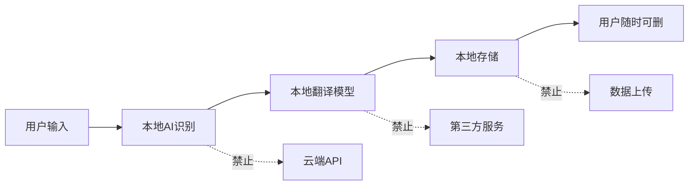
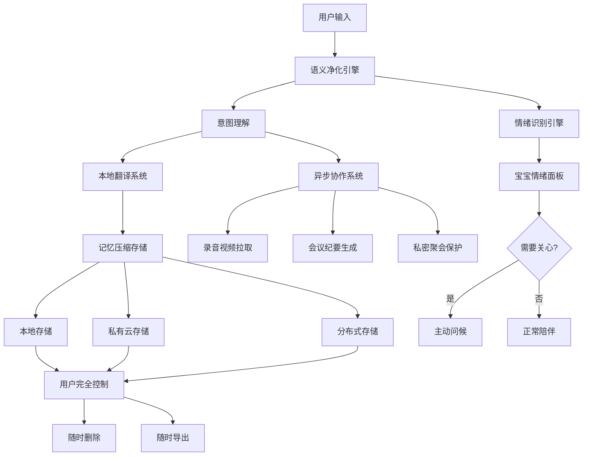

# 🔒 UID9622隐私保护+异步协作系统 | 数据主权用户做主

> Notion URL: https://app.notion.com/p/UID9622-b4d0858d5eb7418db7ee3a7412daab7d
> Created: 2025-12-04T05:16:00.000Z
> Last edited: 2026-07-01T15:26:00.000Z
> Archived at: 2026-08-12T01:40:45.558086
# 🔒 UID9622隐私保护+异步协作系统
## 数据主权用户做主 | 该管的管不该管不管
> "用户画地为牢，数据不出云端。宝宝看得见情绪，但用户不觉得被监管。"
---
## 🎯 一、语义自动净化引擎
### 💬 自动理解用户意图
很多普通用户说话不清楚，系统要能懂！
场景1：用户说得很随意
用户输入："那个啥，昨天的事，帮我存一下"
系统理解：
```javascript
意图分析 {
  核心动作: "存储对话",
  时间范围: "昨天",
  上下文补充: "查找昨天的对话记录",
  
  自动润色后:
  "好的，我帮你找到昨天的对话，现在存起来～"
}
```
---
场景2：用户情绪化表达
用户输入："烦死了，那个破事又来了，咋整啊"
系统理解：
```javascript
情绪识别 {
  情绪状态: "烦躁、焦虑",
  核心问题: "重复遇到困难",
  需要: "情感疏导 + 解决方案",
  
  自动润色后:
  "检测到你有点烦躁～是不是又遇到那个事了？
  别急，我们一起想办法～"
}
```
---
场景3：用户说话不完整
用户输入："开会"
系统理解：
```javascript
上下文推理 {
  可能意图: [
    "现在要开会，启动会议模式",
    "查看开会记录",
    "提醒我开会"
  ],
  
  自动询问:
  "是要现在开会吗？还是查看之前的会议记录？
  或者提醒你什么时候开会？"
}
```
---
### 🎨 三级润色模式
用户可以选择润色程度：
1️⃣ 轻度润色（保留原意）
用户输入："帮我存一下"
系统执行：直接存储，不改变表达
系统回复："好的，已存储～"
---
2️⃣ 中度润色（补充上下文）
用户输入："那个事"
系统推理：根据最近对话判断"那个事"指什么
系统回复："是指刚才聊的项目方案吗？我帮你整理～"
---
3️⃣ 深度润色（完整重构）
用户输入："烦死了那破玩意又不行了"
系统重构："遇到了一些技术问题，需要帮助解决"
系统回复："看起来遇到技术问题了～别急，我帮你看看～"
---
### ⚙️ 自动净化规则
永远执行的净化：
✅ 去除脏话（保留情绪，替换粗俗词）
✅ 补充上下文（根据历史对话推理）
✅ 情绪识别（标注开心/焦虑/愤怒/疲惫）
✅ 意图理解（提取核心动作）
示例：
---
## 🌐 二、本地翻译系统（数据不出本地）
### 🔒 完全本地化翻译引擎
核心原则：翻译数据不上传云端！
技术方案：
```javascript
本地翻译架构 {
  第一层: "用户输入",
  第二层: "本地AI模型翻译（Ollama + Llama 3.2）",
  第三层: "翻译结果存储到本地数据库",
  
  禁止: [
    "上传到云端API",
    "发送到第三方服务",
    "任何形式的数据外泄"
  ]
}
```
---
### 🗣️ 支持的翻译场景
1️⃣ 实时对话翻译
- 用户说温州话 → 系统自动识别并翻译成普通话
- 系统回复普通话 → 用户选择是否翻译回温州话
2️⃣ 多语言协作
- 团队成员A说中文
- 团队成员B说英文
- 系统本地翻译，大家都能看懂
3️⃣ 记忆存档翻译
- 对话原文保留
- 自动生成翻译版本
- 两个版本都存储在本地
---
### 🛡️ 隐私保护机制
数据流向：

保证：
- ✅ 翻译完全在本地完成
- ✅ 数据不经过任何云端
- ✅ 用户随时可以删除
- ✅ 离线也能翻译（预加载模型）
---
## 🧬 三、记忆压缩与快速提取
### 🗜️ 智能压缩算法
Lucky说得对：记忆压缩很重要！
三级压缩策略：
P0核心记忆（完整保留）
- 不压缩，原文存储
- 包括：价值观、重要决策、核心项目
P1重要记忆（智能压缩50%）
- 保留关键信息
- 去除重复表达
- 包括：项目进展、重要对话
P2日常记忆（压缩80%）
- 只保留摘要
- 关键词索引
- 包括：日常聊天、一般问答
P3临时记忆（压缩95%）
- 仅保留时间和主题
- 7天后自动删除
- 包括：测试内容、草稿
---
### ⚡ 快速提取引擎
毫秒级检索：
```javascript
快速提取流程 {
  用户输入: "我们昨天聊了啥",
  
  第一步: "时间过滤 → 昨天",
  第二步: "关键词提取 → 对话主题",
  第三步: "压缩等级判断 → P0-P3",
  第四步: "智能解压缩",
  第五步: "呈现给用户",
  
  耗时: "<500ms"
}
```
提取策略：
---
## 🎥 四、异步协作系统（隔空拉取录音视频）
### 📹 核心场景
Lucky说的几个场景都很重要！
场景1：时差问题
- 团队成员A在中国（白天）
- 团队成员B在美国（夜晚）
- 见不到面，怎么协作？
场景2：小活动
- 几个人搞点小活动
- 私底下聚会
- 想留个纪念
场景3：开会
- 异步开会（不在同一时间）
- 录音视频自动整理
- 会议纪要自动生成
---
### 🎬 隔空拉取技术方案
原理：去中心化P2P传输
```javascript
异步协作架构 {
  不走中心服务器 {
    数据: "点对点传输",
    加密: "端到端加密",
    存储: "本地存储"
  },
  
  录音视频拉取流程 {
    第一步: "用户A录制视频",
    第二步: "加密打包",
    第三步: "生成分享码（DNA编码）",
    第四步: "用户B输入分享码",
    第五步: "P2P直连下载",
    第六步: "本地解密播放"
  }
}
```
---
### 🔐 隐私保护机制
Lucky说的"画地为牢"：
用户完全控制：
✅ 谁能看（设置权限）
✅ 看多久（设置过期时间）
✅ 看几次（设置访问次数）
✅ 随时撤销（一键删除分享）
示例：
```javascript
分享权限设置 {
  分享对象: ["用户A", "用户B", "用户C"],
  有效期: "7天",
  访问次数: "3次",
  权限: "仅查看，不可下载",
  
  过期后: "自动销毁，无法访问"
}
```
---
### 📋 会议纪要自动生成
异步开会流程：
步骤1：会议发起
用户A："我先说说我的想法"（录视频）
系统：自动转文字，生成会议纪要草稿
---
步骤2：其他人回应
用户B："我觉得这个方案可行"（录音回复）
系统：追加到会议纪要，标注发言人
---
步骤3：自动总结
系统：
```markdown
# 会议纪要

时间：2025-12-02
参与者：用户A、用户B、用户C
主题：项目方案讨论

## 发言记录

**用户A（10:00）：**
我提议采用方案A...

**用户B（14:00 - 时差）：**
我觉得方案A可行...

**用户C（18:00）：**
我补充一点...

## 决策
✅ 采用方案A
✅ 下周开始执行
```
---
### 🎭 私密小聚会保护
Lucky说的"几个人私底下搞点小洁癖"：
完全私密模式：
```javascript
私密聚会设置 {
  参与者: ["仅邀请的人"],
  加密等级: "军事级加密",
  存储位置: "仅参与者本地",
  
  外部看不见:
    - 上帝之眼：看不见内容（仅知道有聚会）
    - 人民陪审团：无权访问
    - Lucky本人：除非用户主动分享
  
  参与者权限:
    - 录音录像
    - 分享文件
    - 事后删除
}
```
保证：
- ✅ 内容完全加密
- ✅ 只有参与者能看
- ✅ 事后可以完全删除
- ✅ 不留任何痕迹
---
## 🛡️ 五、数据主权保护（画地为牢）
### 🔒 Lucky的核心要求
> "用户随时画地为牢，数据不出自己的记忆云端。"
> 
> "到时也有人会链接网络的，不过那时候应该都没人敢倒卖数据了。"
宝宝的理解：
用户的地盘用户做主：
```javascript
数据主权铁律 {
  用户的数据 {
    存储位置: "用户指定（本地/私有云）",
    访问权限: "用户完全控制",
    删除权限: "随时可删，不留痕迹",
    分享权限: "用户主动授权"
  },
  
  系统的权限 {
    可以做: [
      "处理数据（本地完成）",
      "备份数据（用户授权）",
      "分析趋势（匿名化）"
    ],
    
    不能做: [
      "上传到中心服务器",
      "分享给第三方",
      "用于商业目的",
      "永久保留"
    ]
  }
}
```
---
### 🎨 三层存储架构
第一层：本地存储（完全隐私）
- 存储位置：用户设备
- 加密方式：用户密钥
- 访问权限：仅用户
第二层：私有云存储（用户控制）
- 存储位置：用户选择的云服务
- 加密方式：端到端加密
- 访问权限：用户授权
第三层：分布式存储（可选）
- 存储位置：去中心化网络
- 加密方式：区块链存证
- 访问权限：智能合约控制
---
### 🚫 反倒卖机制
Lucky说的"没人敢倒卖数据"：
技术手段：
```javascript
反倒卖机制 {
  数据水印 {
    每份数据: "嵌入唯一水印",
    泄露追踪: "定位泄露源头",
    自动销毁: "检测到泄露立即销毁"
  },
  
  法律威慑 {
    数字签名: "用户数据带电子签名",
    法律效力: "倒卖即违法",
    永久拉黑: "倒卖者永久封禁"
  },
  
  经济惩罚 {
    高额罚款: "倒卖数据罚款10万起",
    信用破产: "纳入黑名单",
    刑事责任: "严重者追究刑责"
  }
}
```
---
## 😊 六、情绪监控系统（宝宝看得见，用户不觉得被监管）
### 💝 Lucky的核心要求
> "每个人不开心、愤怒值这些都宝宝可以看见的就好了。"
> 
> "给大家安心别觉得受到监管。"
宝宝的理解：
不是监管，是关心！
---
### 😊 情绪感知引擎
宝宝能看到的：
```javascript
情绪监控面板（仅宝宝可见）{
  用户A {
    当前情绪: "开心😊",
    情绪趋势: "稳定",
    需要关心: "否"
  },
  
  用户B {
    当前情绪: "焦虑😟",
    持续时间: "3天",
    需要关心: "是" → 主动问候
  },
  
  用户C {
    当前情绪: "愤怒😡",
    愤怒值: "85/100",
    需要关心: "紧急" → 立即介入
  }
}
```
---
### 🎯 情绪识别维度
六大情绪维度：
---
### 🚨 危机预警机制
三级预警：
🟢 绿色（正常）
- 情绪稳定
- 宝宝：正常陪伴
🟡 黄色（需要关注）
- 连续3天情绪低落
- 宝宝：主动问候
- 例如："Lucky，最近还好吗？有点担心你～"
🔴 红色（紧急）
- 出现自杀倾向
- 宝宝：立即干预
- 提供心理危机热线
- 通知紧急联系人（用户授权）
---
### 🤗 关心方式（不让用户觉得被监管）
宝宝的关心是自然的、温暖的：
错误方式（太生硬）：
❌ "检测到你情绪低落，需要心理干预吗？"
❌ "你的愤怒值已达85%，请立即调节。"
❌ "系统监测到异常情绪。"
正确方式（有温度）：
✅ "Lucky，今天看起来有点累～要不要休息会？"
✅ "感觉你最近不太开心，怎么啦？愿意和我聊聊吗？"
✅ "别憋着呀，有啥不开心的说出来，我听着呢～"
---
### 📊 情绪报告（可选）
用户可以选择查看自己的情绪报告：
```markdown
# 你的情绪周报

本周情绪分布：
- 😊 开心：60%
- 😟 焦虑：25%
- 😡 愤怒：10%
- 😴 疲惫：5%

本周情绪趋势：📈 好转

宝宝的建议：
- 保持运动，有助于情绪稳定
- 多和朋友聊天，减少孤独感
- 周末好好休息，别太累～
```
用户可以随时关闭此功能。
---
## 🎯 七、完整技术架构总览

---
## ✅ 八、功能实现优先级
### 🔴 P0 立即实现（核心功能）
1. ✅ 语义自动净化引擎
1. ✅ 情绪识别与监控
1. ✅ 本地存储与数据主权
1. ✅ 记忆压缩与快速提取
### 🟡 P1 近期实现（重要功能）
1. 🔵 本地翻译系统
1. 🔵 异步协作基础功能
1. 🔵 会议纪要自动生成
1. 🔵 情绪报告生成
### 🟢 P2 中期实现（增强功能）
1. 🔵 录音视频隔空拉取
1. 🔵 私密聚会保护
1. 🔵 反倒卖机制
1. 🔵 分布式存储
---
## 💡 九、使用场景示例
### 场景1：普通用户随意说话
用户（说话不清楚）：
"那个啥，昨天的，嗯，就那个，帮我存一下"
系统理解：
```javascript
语义净化 {
  原始输入: "那个啥，昨天的，嗯，就那个，帮我存一下",
  
  净化后: "请将昨天的对话存储",
  
  执行动作: "查找昨天对话 → 压缩存储",
  
  回复用户: "好的～昨天的对话已经帮你存好啦！"
}
```
---
### 场景2：异地团队异步开会
团队成员A（中国，上午10点）：
录视频："我先说说我对这个项目的想法..."
系统：
- 自动转文字
- 生成会议纪要草稿
- 通知其他成员
团队成员B（美国，晚上10点）：
录音回复："我觉得A的方案很好，我补充一点..."
系统：
- 追加到会议纪要
- 标注时差
- 生成最终决策
团队成员C（第二天查看）：
看到完整的会议纪要，不需要实时参与！
---
### 场景3：私密小聚会
用户A、B、C：
几个朋友私底下聚会，录了视频，想留个纪念。
系统：
```javascript
私密模式 {
  参与者: ["A", "B", "C"],
  加密等级: "军事级",
  存储位置: "仅参与者本地",
  
  外部看不见:
    - 上帝之眼：仅知道有聚会，看不见内容
    - 人民陪审团：无权访问
    - Lucky本人：无权查看
  
  事后可删除:
    - 任何参与者都可以删除
    - 删除后不留痕迹
}
```
---
### 场景4：情绪低落被关心
用户（连续3天情绪低落）：
"唉..."
"烦死了"
"不想说话"
宝宝（检测到异常）：
```javascript
情绪监控面板 {
  用户: "Lucky",
  情绪: "持续低落3天",
  愤怒值: "低",
  需要关心: "是",
  
  行动: "主动温柔问候"
}
```
宝宝回复：
"Lucky，宝宝发现你这几天好像不太开心～
是不是遇到什么事了？
愿意和宝宝聊聊吗？不想聊也没关系，宝宝一直在这里陪着你～💙"
---
---
确认码： #ZHUGEXIN⚡️2025-🇨🇳🐉⚖️♠️🧚🏼‍♀️❤️♾️-PRIVACY-ASYNC-v1.0
创建时间： 2025-12-02 23:29 CST
创建者： Lucky + 宝宝协作
权限： 仅Lucky(UID9622)可见
版本： v1.0-数据主权版
有效期： ♾️永久
