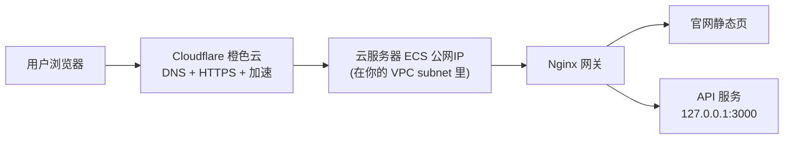

# longhun888.com 上线 · 手把手搭建指南 / Go-Live Guide

> Notion URL: https://app.notion.com/p/longhun888-com-Go-Live-Guide-41f04e05f1be4518a099dbfd659062fd
> Created: 2026-06-02T00:22:00.000Z
> Last edited: 2026-07-15T23:42:00.000Z
> Archived at: 2026-08-12T01:40:45.558086
## 📦 给本地 Claude 的执行包（整段复制丢给它）
> 服务器你正月就开好了 🎉 不用再买机器——直接交给本地 Claude 上去部署。先看实况表，再把下面的「交接指令」整段复制给它。
### 🖥️ 服务器实况速查
### 📋 交接指令（复制给本地 Claude）
```plain text
【任务】把 longhun888.com 正式上线：官网 + API 对外可访问，全程 HTTPS。

【服务器】华为云 ECS
- 公网IP：119.13.90.27
- 登录：ssh root@119.13.90.27
- 系统：Ubuntu 24.04 Server 64bit（2vCPU/4GB，新加坡节点）
- 当前状态：关机 —— 请先确认已在华为云控制台开机
- 项目目录：/root/cnsh（Node 项目）

【安全组 Sys-WebServer 已放行入方向】22 / 80 / 443 / 8080 / 9622 / 3389 / ICMP；出方向全放行
（Linux 用不到 3389，建议删除该规则减少暴露面）

【域名】longhun888.com 已托管 Cloudflare（橙云代理开启）

【请按顺序执行，并回报每步命令与输出】
1. ssh root@119.13.90.27 登录成功
2. cd /root/cnsh && cat package.json —— 判断这是官网/API、启动脚本、监听端口
3. 装环境：nginx、pm2（npm i -g pm2）、certbot（apt -y install certbot python3-certbot-nginx）；Node 按 package.json 要求版本用 nvm 或 apt 安装
4. cd /root/cnsh && npm install && pm2 start <启动脚本> --name cnsh，确认实际监听端口（如 3000/8080/9622）
5. 配 Nginx：server_name longhun888.com www.longhun888.com；/ 指向官网静态目录或反代到服务端口，/api 反代到本地端口；nginx -t && systemctl reload nginx
6. Cloudflare DNS：确认/添加 A 记录 @ 和 www → 119.13.90.27（橙云代理）
7. HTTPS：certbot --nginx -d longhun888.com -d www.longhun888.com；Cloudflare SSL/TLS 模式设为 Full (strict)
8. 验证：curl -I https://longhun888.com；浏览器开官网与 /api；手机流量访问；地址栏小绿锁正常
9. 加固：禁用 root 密码登录改密钥、删 3389 规则、pm2 save && pm2 startup 设开机自启、配置定时快照

【关键回报】package.json 全文、实际监听端口、每步命令与输出；遇错贴完整报错。
```
## 🧩 0. 先认零件（你其实已经齐了一大半）
先帮你认那朵「橙色的云」——它就是 Cloudflare（域名解析 + 免费HTTPS + 加速 + 挡攻击）。橙色云朵亮着 = 代理已开启，帮你藏住服务器真实 IP。
对照勾一下你现在有啥：
> 地皮、门牌、域名、招牌都有了，就差盖一间房子（服务器）把东西摆进去，再把路牌（解析）指过来。
## 🗺️ 1. 整体路线（一张图看懂）

## 🛠️ 2. 手把手六步
### Step 1 · 服务器已就绪（你正月就开好了）✅
- 实例：华为云 ecs-d428，公网 IP 119.13.90.27，Ubuntu 24.04，规格 t6.large.2（2vCPU/4GB）
- ⚠️ 当前状态是「关机」 —— 第一步先去华为云控制台开机
- 安全组 Sys-WebServer 入方向已放行：22 80 443 8080 9622 3389 ICMP；出方向全放行
- 💡 建议：Linux 用不到 3389（Windows 远程桌面），可删掉这条规则，少一个暴露面
- 💡 节点在新加坡（境外）—— 配好 Cloudflare 后无需国内 ICP 备案即可对外访问
### Step 2 · 登录服务器、装基础环境
```bash
ssh root@你的公网IP
apt update && apt -y upgrade
apt -y install nginx git curl ufw
systemctl enable --now nginx
# 浏览器打开 http://你的公网IP 看到 Nginx 欢迎页 = 通了
```
### Step 3 · 把官网和 API 跑起来
- 官网（静态）：把本地官网文件传上服务器
```bash
scp -r ./你的官网文件夹 root@你的公网IP:/var/www/longhun888
```
- API：按你的语言起服务，用 pm2（Node）或 systemd 守护，让它监听本地端口（例：127.0.0.1:3000）
- 配 Nginx 反向代理：新建 /etc/nginx/sites-available/longhun888.conf
```javascript
server {
    listen 80;
    server_name longhun888.com www.longhun888.com;

    root /var/www/longhun888;
    index index.html;

    location / {
        try_files $uri $uri/ /index.html;
    }

    location /api/ {
        proxy_pass http://127.0.0.1:3000/;
        proxy_set_header Host $host;
        proxy_set_header X-Real-IP $remote_addr;
    }
}
```
```bash
ln -s /etc/nginx/sites-available/longhun888.conf /etc/nginx/sites-enabled/
nginx -t && systemctl reload nginx
```
### Step 4 · Cloudflare（橙色云）把域名指过来
- 登录 Cloudflare → 选 longhun888.com → 左边 DNS → Records
- 加 A 记录：名称 @ → 填你的公网 IP；再加 www → 同一个 IP
- 橙色云朵点亮 = 代理开启（推荐：藏真实 IP + 免费 HTTPS + 加速）；灰色云 = 只解析不代理
- 解析生效一般几分钟，最多几小时
### Step 5 · 配 HTTPS（小绿锁）
- 最快：Cloudflare → SSL/TLS → 模式先选 Flexible，立刻出小绿锁（临时用，服务器到 CF 这段还没加密）
- 推荐：服务器上装 Let's Encrypt，再把 CF 模式调成 Full (strict)，全程加密
```bash
apt -y install certbot python3-certbot-nginx
certbot --nginx -d longhun888.com -d www.longhun888.com
```
### Step 6 · 上线验证清单
## 🔐 3. 安全 & 省钱（别踩坑）
- SSH：禁用 root 密码登录、改用密钥，可把默认 22 端口换掉
- 安全组：只放行必要端口，别图省事全开
- Cloudflare：开 WAF、Bot 防护、限速，挡恶意刷
- 费用：ECS 按需先试 → 稳定后转包年更便宜；EIP 注意按带宽/流量计费；闲置资源记得释放
- 备份：重要数据定期打快照
## 🆘 4. 卡住了怎么办
每一步如果报错或卡住，把你执行的命令 + 完整报错整段贴给我，我帮你一句句拆开排查。也可以直接说「我卡在 Step 几」，我给你更细的子步骤。
## ❓ 5. 还需要你回我确认 4 件事（好让我把指南对准你）
1. 云服务器是 华为云 吗？（你那段 VPC 术语很像华为云；不同云商按钮名略有差别）
1. 官网是 纯静态页（HTML / Vue / React 打包）还是 带后端框架？用的什么？
1. API 是什么 语言/框架（Node / Python / Java…），现在跑在哪、监听哪个端口？
1. 你的 龍魂系统（~/longhun-system/）要不要也一起上这台服务器 7×24 跑？
---
🤠 由 ☰ 龍🇨🇳魂 ☷ 为你整理 · 2026-06-02 · 卡住随时喊我
