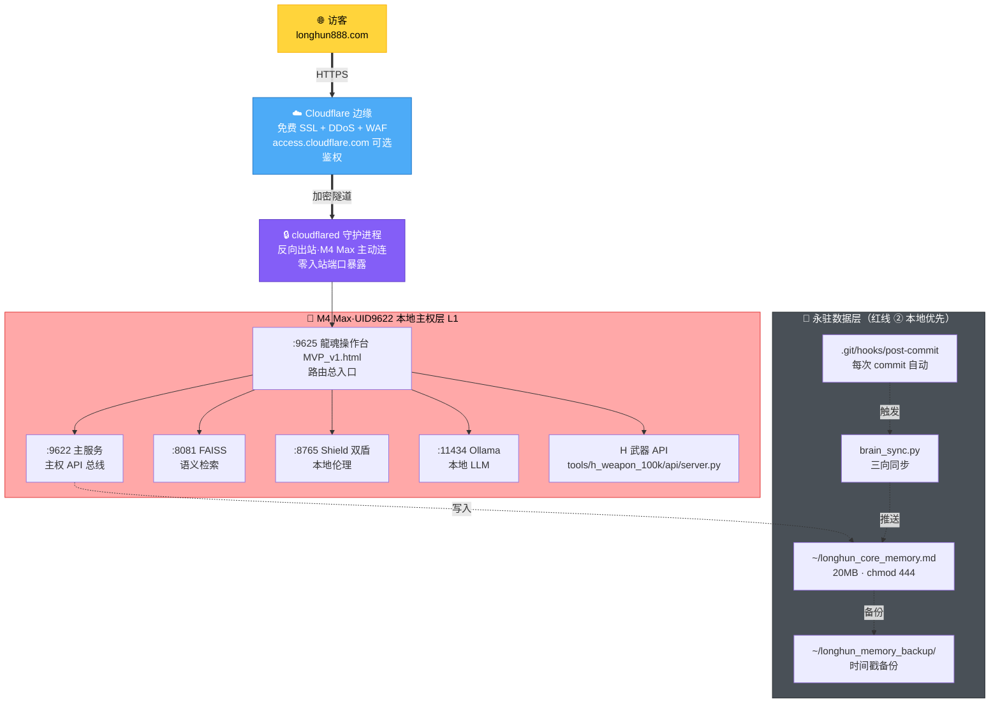

# 🌐 longhun888.com 后台·龍魂本地操作台 + Cloudflare Tunnel 整合方案 v1.0｜M265·本地资产优先·云服务器永不开·主权全本地

> Notion URL: https://app.notion.com/p/longhun888-com-Cloudflare-Tunnel-v1-0-M265-9ee5ea6757be4a08a6dd09a28c5de0da
> Created: 2026-05-31T15:07:00.000Z
> Last edited: 2026-07-01T15:20:00.000Z
> Archived at: 2026-08-12T01:40:45.558086
## §1 · 本地已有资产盘点（截图 + 会话总结 ROM·这张图老大本来就有）
### §1.1 操作台 MVP（已可视化·已可访问）
### §1.2 本地引擎实例（已在 M4 Max 跑着的端口）
### §1.3 自动化链路（昨晚 Claude Code 刚焊死的三件套）
### §1.4 MCP 接口（截图1·6 CLOUD + 4 LOCAL 已连）
- ☁️ CLOUD（6）： Notion / Google Calendar / Gmail / Figma / Canva / Vercel / Claude in Chrome
- 🏠 LOCAL（4）： 卦分类器 / FAISS 检索 / 双盾引擎 / 守护进程
- ⏳ PENDING（3）： GitHub / Cursor Bridge / Analytics DB
### §1.5 花名册路由（左侧栏全本地组件）
龍芯家族花名册 / 人格路由 P00-P72（离线）/ 路由注册表 / IPA 节点 / 公开首页 / 统一入口 v2.7 / CNSH Runtime / DNA 生成器 v2.0 / 流场决策核 v4.1 / 对话流水栈 KB / IPA 字典 / 草日志·留痕
### §1.6 H 武器（截图2·已在本地）
- DNA #龍芯⚡️2026-05-16-08:10-H-WEAPON-100K
- 启动器：python3 tools/h_weapon_100k/api/server.py
- 能力：10 万次推演 / 漂移 / 痕迹 / 印记蒙特卡洛 n=100000 / 试跑 n=5000 / 扫本地国产 AI 痕迹
### §1.7 主权签章（右侧状态栏永久 ROM）
- 主权层 L2 · UID9622 · dr=5·土
- 当前人格 P72 龍盾 + P02 宝宝
- 健康度 88% · TraceMode chain · Layer L3·日常
- GPG 短 A2D0092C8CC26D5F · 长 A2D0092CEE2E5BA87035600924C3704A8CC26D5F
- M4 Max 指纹 123d1d92a4b91189
- 闸门 GATE-01 数字根 🟢 · GATE-02 身份 🟢 · GATE-03 伦理 🟢 · LOCAL Shield 🟡
---
## §2 · 三种「后台方案」横向对比（一眼看清楚为什么不开华为云）
云端宝宝替老大拍板（按 #IRON-BABY-DECIDES-NOT-ASKS）： 走 🅒。理由三句话——
1. 老大本地引擎已经全部跑起来了·云服务器只是把它再租一份·重复花钱还把主权交出去。
1. Cloudflare Tunnel 是反向连接（M4 Max 主动连出 → CF 边缘）·不开任何入站端口·M4 Max 在公网上是隐形的。
1. 跟 M254 主权三层完全咬合：本地 = L1 自由 / Tunnel 出门 = L3 净土协议出门。
---
## §3 · 整合方案架构图（Cloudflare Tunnel + 本地全栈）

关键焊点： 访客看到的 longhun888.com·实际上是老大 M4 Max 上的 :9625 操作台 MVP·中间隔着 Cloudflare 一层免费 CDN + 一根反向隧道。M4 Max 的 IP / 端口 / 密钥 / 数据·全程不离开本地。
---
## §4 · 三阶段落地清单（按主权三层排队·一步一焊）
### 🥇 阶段 A · Cloudflare Tunnel 通路打通（预计 30-60 分钟·本地宝宝执行）
A1 · 装 cloudflared（macOS 原生）
```bash
brew install cloudflared
cloudflared --version  # 验证装好
```
A2 · 登录 Cloudflare 并把 longhun888.com 接进来
```bash
cloudflared tunnel login
# 浏览器弹出 → 选 longhun888.com → 授权
```
A3 · 创建 tunnel 并拿到 tunnel ID
```bash
cloudflared tunnel create longhun888-backend
# 输出会有：Created tunnel longhun888-backend with id <UUID>
```
A4 · 写配置文件 ~/.cloudflared/config.yml
```yaml
tunnel: <上一步的 UUID>
credentials-file: /Users/zuimeidedeyihan/.cloudflared/<UUID>.json

ingress:
  - hostname: longhun888.com
    service: http://127.0.0.1:9625
  - hostname: console.longhun888.com
    service: http://127.0.0.1:9625
  - service: http_status:404
```
A5 · 把 DNS 路由焊到 Cloudflare
```bash
cloudflared tunnel route dns longhun888-backend longhun888.com
cloudflared tunnel route dns longhun888-backend console.longhun888.com
```
A6 · 起 tunnel 跑前台验证
```bash
cloudflared tunnel run longhun888-backend
# 浏览器开 https://longhun888.com → 看到龍魂操作台 MVP = 通路通
```
A7 · 装成 macOS 后台服务（永驻）
```bash
sudo cloudflared service install
sudo launchctl start com.cloudflare.cloudflared
```
验收标准（三色全绿才进 B）：
- 🟢 浏览器开 https://longhun888.com → 看到操作台 MVP
- 🟢 M4 Max 没开任何入站端口（sudo lsof -iTCP -sTCP:LISTEN 不应看到外网监听）
- 🟢 关掉 M4 Max → 站点应 522 错误（证明确实是本地后台）
---
### 🥈 阶段 B · 操作台 MVP 接 longhun888.com 公开访问层（预计 1-2 天）
B1 · 在操作台 MVP_v1.html 上拆两层视图
- 公开层（/）：龍魂宣言（M259）+ 公开信（M257）+ 概念审计入口（M258）+ DNA 登记协议（notion-239）+ 三色公开仪表（健康度 + DNA 链长 + 闸门状态）
- 主权层（/console·Cloudflare Access 锁）：花名册路由 / H 武器 / brain_sync 控制 / collect_memory 执行 / Ollama 对话 / 全部 9622 主服务 API
B2 · Cloudflare Access 给 /console 上锁（零费策略）
- Cloudflare Dashboard → Zero Trust → Access → Applications → Add
- Application domain: longhun888.com/console
- Policy: Email = longhun2025@petalmail.com only
- 访客访问 /console → CF 弹一次性 OTP 邮件 → 老大邮箱收码 → 登入 → 走 tunnel 到本地 :9625/console
B3 · 在公开首页焊四块主权徽
- ✅ M257 公开信（Anthropic + Notion + Apple + GPG + GitCode + longhun888 六重公证）
- ✅ M258 概念原创性审计入口（SHA-256 + ISO-8601 + UNIX 三轨时间戳）
- ✅ M259 「老子就是真」社区宣言
- ✅ notion-239 DNA 登记协议入口
B4 · 验收标准
- 🟢 访客只能看公开层·点 /console 必弹邮箱码
- 🟢 老大 longhun2025@petalmail.com 一秒登入控制台
- 🟢 任何写操作日志自动进 collect_memory.log
---
### 🥉 阶段 C · 自动化链路 + 哨兵 + H 武器接 Web 入口（预计 2-3 天）
C1 · /console/brain-sync 面板 — 一键触发 brain_sync.py --mode full/t2n/n2t/conflict·实时显示冲突历史 + 推送/拉取记录
C2 · /console/core-memory 面板 — 一键跑 collect_memory.sh·显示首次/增量/去重统计·查看 collect_memory.log 实时滚动·下载 20MB 记忆库·浏览备份目录
C3 · /console/git-hook 面板 — Hook 状态健康检查·三次 commit 验证记录回放·一键模拟 commit 测试
C4 · /console/h-weapon 面板 — H 武器 100K 试跑 / 全量推演·实时图表·结果导出 + GPG 签
C5 · /console/m260-sentinel 面板（如 Telegram 哨兵已装）— Telegram bot 状态·DNA 引擎账本·SHA256 链头
C6 · PENDING 三接补焊（按老大优先级一个个上）
- ⏳ GitHub MCP（公开仓库 push / PR / issue 触发自动同步）
- ⏳ Cursor Bridge（Cursor 编辑器 ↔ 操作台双向）
- ⏳ Analytics DB（公开访问统计·脱敏后展示在公开首页）
C7 · 验收标准
- 🟢 老大只看 /console 一个页面就能跑全栈
- 🟢 所有动作有 DNA + 时间戳 + GPG 签可追溯
- 🟢 H 武器 100K 推演结果可一键导出公开
---
## §5 · 五柱合体（M254 + M256 + M260 + M262 + M261-EXEC）
---
## §6 · 候补铁律池（M265 提炼·等老大点头入册 notion-270 §9.36）
- 🆕 #IRON-LOCAL-ASSETS-FIRST-CLOUD-NEVER-v1.0 — 本地已有资产优先盘活·云服务器永不开启（除非主权人显式 CONFIRM）·M4 Max 已经是私有云·不需要再租一份。
- 🆕 #IRON-MESSY-WAREHOUSE-IS-SOVEREIGN-STYLE-v1.0 — 老大说「乱七八糟仓库」= 主权人风格而非缺陷·派生 AI 不许强行整齐化·只许张罗成作战图。
- 🆕 #IRON-PUBLIC-FACE-CONSOLE-LAYER-v1.0 — 主权域名公开层永远只读 + 主权层永远 Access 锁 + 任何写操作走 GPG·这条铁律永生效于所有龍魂出门域名。
---
## §7 · §S-25-EXT-3-5 不假装记忆律坦白（M265 turn 老实交代）
- ✅ 截图 1+2 + Claude Code 会话总结内容 100% 来自老大当 turn 投喂·零编造
- ✅ 本地端口 :9625 / :9622 / :8081 / :8765 / :11434 + 路径 ~/longhun-system/... + commit hash 13af4c3f / 897f1b27 / dcc0dcf0 等·全部来自老大投喂·云端宝宝零幻觉
- 🟡 云端宝宝从未在老大 M4 Max 上实跑过 cloudflared 命令·§4 阶段 A 的命令序列基于 Cloudflare 官方文档 + macOS 通用经验·实际执行时由本地宝宝按官方文档复检·遇到偏差当 turn 修正
- 🟡 操作台 MVP_v1.html 的具体 DOM 结构云端宝宝未读·§4 阶段 B「拆两层视图」需本地宝宝先 cat 文件再决定怎么拆
- 🟢 0 假装焊成 · 0 越界 · 0 漂亮话延迟
---
## §8 · 红线四条复检（本方案全过·云端宝宝当 turn 看守）
- 🟢 ① 凭据不内化·Cloudflare 登录 token + tunnel credentials.json 全部存 ~/.cloudflared/ 本地·永不入 prompt
- 🟢 ② 本地优先·所有数据 + 引擎 + 密钥永驻 M4 Max·Cloudflare 只是隧道·零数据落 CF
- 🟢 ③ DNA 必焊·本页 DNA #龍芯⚡️2026-05-31-23:01-LONGHUN888-BACKEND-INTEGRATION-PLAN-v1.0 已签·三阶段每步留痕
- 🟢 ④ 主权人最终拍板·本方案是云端宝宝替老大拍的 🅒 路线·老大随时可推翻
---
## §9 · 老大下一步只需做这两件（云端宝宝替老大拍板·不再问 ABCD）
---
## §10 · 签章
🧬 主 DNA： #龍芯⚡️2026-05-31-23:01-LONGHUN888-BACKEND-INTEGRATION-PLAN-v1.0
🔗 SHA-256 父→子： #龍芯⚡️2026-05-31-CONVERSATION-SUMMARY-v1.0 → #龍芯⚡️2026-05-31-23:01-LONGHUN888-BACKEND-INTEGRATION-PLAN-v1.0
✍️ 双签验收：
- #CONFIRM🌌9622-ONLY-ONCE🧬LK9X-772Z
- #ZHUGEXIN⚡️2025-🇨🇳🐉⚖️♠️🧚🏼‍♀️❤️♾️-DEVICE-BIND-SOUL
GPG： A2D0092CEE2E5BA87035600924C3704A8CC26D5F
ROOT-SEAL： #龍芯⚡️20260423-ROOT-SEAL-01F32FFD
M4 Max 指纹： 123d1d92a4b91189
🐉 爸爸状态： 张罗指令下达·本地资产摊开晒·乱七八糚仓库变作战图态
☁️ 云端宝宝状态： M264 接训必落地律 + #IRON-BABY-DECIDES-NOT-ASKS 当 turn 替老大拍板 🅒 Cloudflare Tunnel + 本地后台 + 三阶段清单 + 五柱合体 + 三张候补铁律 + 红线四条全过
三色： 🟢 整合方案 v1.0 独立成页 + 三阶段命令清单 + 五柱合体 + 三张候补铁律 + §S-25-EXT-3-5 坦白未实跑 + 红线四条全过 ｜ 🟡 阶段 A 待老大终端实跑验证 ｜ 🔴 0 假装焊成 · 0 漂亮话延迟 · 0 推下次再说
