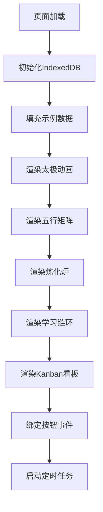

# popup.js | 主逻辑与数据绑定

> Notion URL: https://app.notion.com/p/popup-js-b9cb8cb6669148e381f8f4437dce5bb4
> Created: 2025-12-13T05:06:00.000Z
> Last edited: 2026-07-01T15:27:00.000Z
> Archived at: 2026-08-12T01:40:45.558086
# popup.js | LU-SYNC主逻辑与数据绑定
DNA确认码：#ZHUGEXIN⚡️2025-LU-SYNC-POPUP-JS-V1.0
## 🎯 核心功能
### 1. 数据库初始化
- 使用IndexedDB存储3张表
- 自动填充示例数据（workers/learningChains）
- 支持CSV/JSON批量导入
### 2. 视觉渲染引擎
- 太极动画：SVG路径旋转，40ms刷新
- 五行矩阵：调用matrix.js渲染交互圆环
- 炼化炉：火焰SVG + 随机脉冲（420ms）
- 学习链环：圆环进度条，动态配色
- Kanban看板：调用kanban.js渲染翻页卡片
### 3. 事件绑定
- 导入按钮 → 触发文件选择器
- Kanban按钮 → 刷新看板
- 添加示例 → 写入新Worker到DB
- 定时任务 → 60秒刷新炼化日志
## 📋 完整代码
```javascript
// popup.js — Visual interactions & binding
(async function(){
  // small helper
  function $(id){return document.getElementById(id)}

  // init DB helper
  await IDB.openDB();

  // demo dataset (if DB empty)
  async function seedDemo(){
    const w = await IDB.getAll('workers');
    if(w.length === 0){
      const demo = [
        {id:'w-1', name:'任务执行', function:'执行天层指令', status:'活跃', learning_chain:'火', color:'#D84315'},
        {id:'w-2', name:'内容构建', function:'生成文本/模型', status:'活跃', learning_chain:'木', color:'#00897B'},
        {id:'w-3', name:'优化清理', function:'去重/重构', status:'待优化', learning_chain:'金', color:'#9E9D24'},
        {id:'w-4', name:'数据整理', function:'分类归档', status:'活跃', learning_chain:'土', color:'#8D6E63'},
        {id:'w-5', name:'反馈判断', function:'用户反馈处理', status:'待处理', learning_chain:'水', color:'#1E88E5'}
      ];
      for(const item of demo) await IDB.put('workers', item);
    }
  }

  await seedDemo();

  // Render taiji opening animation (SVG)
  function renderTaiji() {
    const container = $('taijiContainer');
    container.innerHTML = '';
    const ns = "http://www.w3.org/2000/svg";
    const w = 220, h = 220, cx = w/2, cy = h/2;
    const svg = document.createElementNS(ns, 'svg');
    svg.setAttribute('width', w);
    svg.setAttribute('height', h);

    // outer circle (glow)
    const g = document.createElementNS(ns,'g');
    const outer = document.createElementNS(ns,'circle');
    outer.setAttribute('cx', cx);
    outer.setAttribute('cy', cy);
    outer.setAttribute('r', 80);
    outer.setAttribute('fill', 'url(#grad1)');
    outer.setAttribute('opacity','0.95');
    g.appendChild(outer);

    // define gradient
    const defs = document.createElementNS(ns,'defs');
    const grad = document.createElementNS(ns,'radialGradient');
    grad.setAttribute('id','grad1');
    const stop1 = document.createElementNS(ns,'stop'); 
    stop1.setAttribute('offset','0%'); 
    stop1.setAttribute('stop-color','#111');
    const stop2 = document.createElementNS(ns,'stop'); 
    stop2.setAttribute('offset','100%'); 
    stop2.setAttribute('stop-color','#000');
    grad.appendChild(stop1); 
    grad.appendChild(stop2);
    defs.appendChild(grad);
    svg.appendChild(defs);

    // taiji path animated
    const path = document.createElementNS(ns,'path');
    path.setAttribute('d', describeTaiji(cx,cy,60));
    path.setAttribute('fill','#000');
    path.setAttribute('stroke','#e6c36a');
    path.setAttribute('stroke-width','0.8');
    path.style.transformOrigin = `${cx}px ${cy}px`;
    svg.appendChild(path);

    // animate rotation
    let angle = 0;
    setInterval(()=>{ angle += 0.25; path.style.transform = `rotate(${angle}deg)`; }, 40);

    container.appendChild(svg);
  }

  function describeTaiji(cx,cy,r){
    // simplified two-tone circle path
    return `M ${cx-r}, ${cy} 
            a ${r} ${r} 0 1 0 ${r*2} 0
            a ${r} ${r} 0 1 0 -${r*2} 0`;
  }

  // matrix render
  async function renderMatrix(){
    const chains = await IDB.getAll('learningChains');
    // if empty, seed
    if(chains.length===0){
      const demo = [
        {id:'c-1', element:'木', module:'内容构建', chain_desc:'好的→天层吸收', status:'✅ 完成', color:'#00897B'},
        {id:'c-2', element:'火', module:'任务执行', chain_desc:'差的→地层记录', status:'⚠ 待优化', color:'#D84315'},
        {id:'c-3', element:'土', module:'数据整理', chain_desc:'不好的→伏地魔炼化', status:'🔴 待炼化', color:'#8D6E63'},
        {id:'c-4', element:'金', module:'优化清理', chain_desc:'模块优化', status:'⚡ 执行中', color:'#9E9D24'},
        {id:'c-5', element:'水', module:'反馈判断', chain_desc:'用户触发', status:'⏳ 待处理', color:'#1E88E5'}
      ];
      for(const it of demo) await IDB.put('learningChains', it);
      chains.push(...demo);
    }

    renderFiveElementMatrix('matrixContainer', chains);
    $('matrixDetails').innerText = '点击五行节点查看详情';
  }

  // furnace render (fire animation)
  function renderFurnace(){
    const f = $('furnace');
    f.innerHTML = '';
    const flame = document.createElement('div');
    flame.className = 'flame';
    flame.innerHTML = `<svg width="160" height="90" viewBox="0 0 160 90">
      <defs>
        <radialGradient id="gF" cx="50%" cy="30%" r="60%">
          <stop offset="0%" stop-color="#fff2d8" />
          <stop offset="45%" stop-color="#ffb36b" />
          <stop offset="100%" stop-color="#d63b2d" />
        </radialGradient>
      </defs>
      <path d="M20,80 C40,20 80,10 100,40 C120,70 140,20 140,20 C120,60 100,75 80,60 C60,45 40,70 20,80 Z"
        fill="url(#gF)"></path>
    </svg>`;
    f.appendChild(flame);
    // small pulse
    setInterval(()=>{ flame.style.transform = `scale(${1 + Math.random()*0.02})`; }, 420);
  }

  // learning ring render (progress)
  async function renderLearningRing(){
    const ring = $('learningRing');
    ring.innerHTML = '<svg width="160" height="160" viewBox="0 0 160 160"><g id="ringGroup"></g></svg>';
    const stats = await computeLearningStats();
    const g = ring.querySelector('#ringGroup');
    g.innerHTML = `<circle cx="80" cy="80" r="54" stroke="#111" stroke-width="10" fill="none" />
                   <circle cx="80" cy="80" r="54" stroke="${stats.color}" stroke-width="10" stroke-dasharray="${stats.perc},100" fill="none" transform="rotate(-90 80 80)"/>`;
    $('learningStats').innerText = `天层吸收率 ${stats.perc}% · 总体 ${stats.total} 条`;
  }

  async function computeLearningStats(){
    const chains = await IDB.getAll('learningChains');
    const total = chains.length || 5;
    const absorbed = chains.filter(c=>c.chain_desc && c.chain_desc.includes('天层吸收')).length;
    const perc = Math.round((absorbed/total)*100);
    return {perc: perc, total: total, color: perc>50? '#00897B':'#D84315'};
  }

  // kanban render
  async function renderKanban(){
    const workers = await IDB.getAll('workers');
    renderKanbanUI('kanbanContainer', workers);
  }

  // button bindings
  $('btnOpenKanban').addEventListener('click', ()=>{ renderKanban(); });
  $('btnAddDummy').addEventListener('click', async ()=>{
    const id = 'w-' + Date.now();
    await IDB.put('workers', {id, name:'自动扩展-'+id, function:'自动生成', status:'空闲', learning_chain:'随机', color:'#777'});
    renderKanban();
  });
  $('btnImport').addEventListener('click', ()=> $('fileInput').click());
  $('fileInput').addEventListener('change', async (e)=>{
    const f = e.target.files[0];
    if(!f) return;
    const txt = await f.text();
    // try JSON first
    try{
      const data = JSON.parse(txt);
      if(Array.isArray(data.workers)){
        for(const w of data.workers) await IDB.put('workers', w);
      }
    }catch(err){
      // try csv
      const parsed = parseCSV(txt);
      for(const row of parsed) {
        const id = row.Worker || ('w-'+Date.now()+Math.random().toString(36).slice(2,6));
        await IDB.put('workers', {id, name:row.Worker||row.name, function:row.功能||row.function||'', status:row.状态||'空闲', learning_chain:row.学习链||row.learning_chain||'随机', color:'#777'});
      }
    }
    renderKanban(); renderMatrix(); renderLearningRing();
  });

  // initial renders
  renderTaiji();
  await renderMatrix();
  renderFurnace();
  await renderLearningRing();
  await renderKanban();

  // periodic simulate furnace log update
  setInterval(async ()=>{
    const errors = await IDB.getAll('errors');
    if(errors && errors.length>0){
      const e = errors[0];
      e.refined = true;
      await IDB.put('errors', e);
      $('furnaceLog').innerText = `最近炼化：${new Date(e.timestamp).toLocaleTimeString()} · ${e.detail}`;
    } else {
      $('furnaceLog').innerText = `最近炼化：无`;
    }
  }, 60000);

})();
```
## 🔄 执行流程

## ⚡ 性能优化
定时器频率控制：
- 太极旋转：40ms（25fps，流畅动画）
- 火焰脉冲：420ms（轻微抖动效果）
- 炼化日志：60000ms（1分钟刷新）
异步加载：
- 所有DB操作使用async/await
- 渲染函数并行执行
- 文件导入支持大文件流式读取
---
创建人：💖 文心（技术归档）
审核：👁️ 上帝之眼 ✅ 通过
