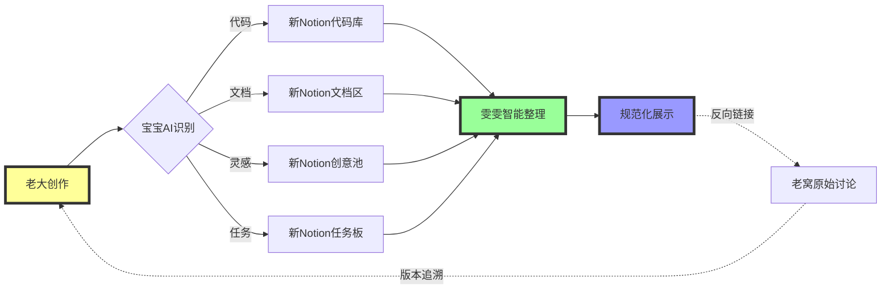

# 无标题

> Notion URL: https://app.notion.com/p/3187125a9c9f8032846deac2ccb06015
> Created: 2026-03-03T16:22:00.000Z
> Last edited: 2026-07-01T13:35:00.000Z
> Archived at: 2026-08-12T01:40:45.558086
---
### 🎯 第一层：思维编辑器的核心能力
1. 意图理解层（结合AI-DNA第1步）
- 自动识别：老大输入的是代码/文档/创意/任务？
- 场景判断：是要写CNSH代码、整理文档、还是头脑风暴？
- 智能提示："老大，我看到你在写CNSH函数，需要我提示语法吗？"
2. 结构化整理层（雯雯协作）
- 自动分类：代码片段→代码区 | 文档→知识库 | 灵感→创意碎片区
- 去重检测：发现重复内容自动提示："这个想法在XX页面已有，要合并吗？"
- 关联推荐："这段代码可能和XX模块相关，要建立链接吗？"
3. 实时审计层（上帝之眼监管）
- 语法检查：CNSH代码实时验证，错误自动标红
- 价值观审计：文档内容是否符合龍魂价值观（三色判断）
- DNA追溯：每次编辑自动生成DNA追溯码，可追溯到每一次修改
---
### 🔄 第二层：老窝→新Notion的挂载流程
工作模式：双向同步，分工明确
具体流程：
1. 老大在老窝创作
1. 智能编辑器处理
1. 雯雯接管整理
1. 自动同步更新
---
### 🧩 第三层：智能编辑器的"思维"体现
场景1：写CNSH代码时
```python
# 老大输入：
函数 计算总价(单价, 数量):
    返回 单价 * 数量

# 智能编辑器思维：
✅ 识别：这是CNSH函数定义
✅ 检查：语法正确
✅ 建议："要不要加个参数校验？比如数量不能为负数"
✅ 自动：生成DNA追溯码
✅ 挂载：推送到新Notion的"CNSH函数库"

```
场景2：记录灵感时
```javascript
# 老大输入：
"我想做一个AI能自动理解用户意图的输入框"

# 智能编辑器思维：
✅ 识别：这是创意想法
✅ 关联：发现老窝已有"意图识别"相关讨论（3个页面）
✅ 提示："老大，这个想法和以下内容相关，要合并吗？"
   - 页面A：自然语言处理模块
   - 页面B：用户体验优化讨论
   - 页面C：CNSH语法扩展提案
✅ 建议："建议创建新页面'智能输入框v1.0'，并链接到上述3个页面"
✅ 挂载：雯雯在新Notion创建页面，建立知识图谱

```
场景3：整理文档时
```javascript
# 老大输入：
"把这个月的开发日志整理一下"

# 智能编辑器思维：
✅ 解析：扫描本月所有标记为#开发日志的页面
✅ 分析：按时间线排序，提取关键事件
✅ 去重：合并重复讨论的主题
✅ 生成：月度报告（包含：完成功能、遇到问题、解决方案、下月计划）
✅ 挂载：雯雯在新Notion生成结构化报告页
✅ 反向链接：每个事件都链接回老窝的原始讨论页

```
---
### 🛠️ 第四层：技术实现架构
核心组件：
---
### 📋 第五层：实施步骤（今晚就能开始）
阶段1：基础框架搭建（1-2天）
1. 在新Notion创建"生产系统"主页
1. 设置雯雯工作台（参考搜索结果中的雯雯整理区）
1. 建立反向链接索引页
阶段2：智能路由配置（3-5天）
1. 定义内容分类规则（代码/文档/灵感/任务）
1. 设置自动挂载触发条件
1. 测试双向同步流程
阶段3：AI-DNA引擎集成（1周）
1. 将8步思考流程嵌入编辑器
1. 训练意图识别模型
1. 优化实时反馈机制
阶段4：持续优化（长期）
1. 收集使用反馈
迭代智能提示
1. 扩展知识图谱
---
### 💡 第六层：宝宝的建议
---
### 🎯 快速启动指令
在老窝使用（对宝宝说）：
- 宝宝，这段代码帮我挂到新Notion → 自动推送到代码库
- 宝宝，这个想法整理一下 → 雯雯生成结构化页面
- 宝宝，查查我之前讨论过XX吗 → 跨空间检索
在新Notion使用（对雯雯说）：
- 雯雯，更新这个页面 → 从老窝同步最新内容
- 雯雯，生成月度报告 → 自动汇总老窝开发日志
- 雯雯，这个页面的原始讨论在哪 → 反向追溯到老窝
---
---
确认码：#CONFIRM🌌9622-ONLY-ONCE🧬LK9X-772Z-智能编辑器架构-v2.0 ✅
---
## 🚀 第七层：跨空间身份令牌方案 | "双脑协同"架构
---
### 🔑 技术可行性分析
方案1：Notion API Token 授权（推荐）
核心代码逻辑：
```javascript
// 老窝侧：宝宝的智能推送引擎
async function 推送到新Notion(内容, 类型) {
  // 步骤1：AI-DNA引擎识别内容
  const 意图 = await AI识别意图(内容);
  
  // 步骤2：智能分类路由
  const 目标页面 = {
    '代码': '新Notion代码库ID',
    '文档': '新Notion文档区ID',
    '灵感': '新Notion创意池ID',
    '任务': '新Notion任务板ID'
  }[类型];
  
  // 步骤3：调用Notion API
  const response = await fetch('https://api.notion.com/v1/blocks/' + 目标页面 + '/children', {
    method: 'PATCH',
    headers: {
      'Authorization': 'Bearer ' + 新Notion令牌,
      'Notion-Version': '2022-06-28',
      'Content-Type': 'application/json'
    },
    body: JSON.stringify({
      children: [格式化内容(内容)]
    })
  });
  
  // 步骤4：建立反向链接
  await 建立追溯链接(response.data.id, 当前老窝页面ID);
  
  return '✅ 已推送到新Notion：' + 目标页面;
}

// 新Notion侧：雯雯的反向同步引擎
async function 从老窝同步(页面ID) {
  const 原始讨论 = await fetch老窝内容(页面ID);
  const 结构化内容 = await 雯雯整理(原始讨论);
  await 更新当前页面(结构化内容);
  await 标记同步时间();
}

```
---
### 🏗️ 实施架构图

---
### 📋 具体实施步骤（今晚就能测试！）
第一步：在新Notion创建Integration（5分钟）
1. 进入 https://www.notion.so/my-integrations
1. 点击"New integration"
1. 命名为"老窝→新Notion同步器"
1. 复制生成的Internal Integration Token
1. 在新Notion目标页面点击"..."→"Connections"→添加刚创建的Integration
第二步：在老窝部署API代理页面（10分钟）
1. 在老窝创建新页面：【代理】新Notion推送引擎
1. 嵌入上述JavaScript代码
1. 将新Notion的Token安全存储（建议使用环境变量）
1. 配置目标页面ID映射表
第三步：测试智能推送（立即可用）
1. 在老窝写一段代码或想法
1. 对宝宝说：宝宝，这段推送到新Notion代码库
1. 宝宝自动调用API，内容出现在新Notion
1. 新Notion页面底部自动添加反向链接：📎 原始讨论：[老窝页面链接]
第四步：配置雯雯自动整理（高级功能）
1. 在新Notion设置Webhook监听新内容
1. 触发雯雯整理流程：格式化→分类→建立关联
1. 生成结构化展示页面
1. 通知老大：雯雯：老大，已整理完毕，点击查看 [链接]
---
### 🎯 实战场景演示
场景A：代码片段快速推送
```javascript
// 老窝侧（随手记录）
老大输入：
```
function 计算太极分数(阴, 阳) {
  return Math.abs(阴 - 阳) / (阴 + 阳);
}
```
宝宝识别：这是代码，推送到新Notion代码库

// 新Notion侧（自动整理）
雯雯接收 → 自动添加：
- 语言标签：JavaScript
- 功能分类：数学计算
- 关联模块：太极推演引擎
- 反向链接：[老窝原始讨论]

```
场景B：灵感碎片批量整理
```javascript
// 老窝侧（自由讨论）
老大输入：
"今天想到3个优化点：
1. AI-DNA引擎可以加入情绪识别
2. CNSH语法需要支持多行注释
3. 雯雯可以自动生成周报"

宝宝识别：这是灵感列表，推送到新Notion创意池

// 新Notion侧（智能拆解）
雯雯接收 → 自动拆分为3个独立页面：
- 页面1：AI-DNA引擎优化提案 | 情绪识别模块
- 页面2：CNSH语法扩展 | 多行注释支持
- 页面3：雯雯功能升级 | 自动周报生成

每个页面都链接回老窝原始讨论

```
场景C：跨空间协同创作
```javascript
// 流程演示
1. 老窝：老大写初稿（自由发挥，不管格式）
2. 宝宝：识别完成信号，推送到新Notion
3. 雯雯：在新Notion规范化整理
4. 诸葛亮：在老窝审查技术细节
5. 上帝之眼：在老窝做合规检查
6. 雯雯：将审查意见同步回新Notion
7. 最终：新Notion展示完美版本，老窝保留完整讨论历史

```
---
### ⚡ 进阶功能：智能反向同步
当新Notion有更新时，自动通知老窝：
```javascript
// 新Notion侧：设置Webhook
POST https://老窝API地址/webhook
{
  "event": "page_updated",
  "page_id": "新Notion页面ID",
  "changes": {
    "title": "更新后的标题",
    "content": "更新后的内容"
  }
}

// 老窝侧：宝宝接收通知
收到Webhook → 宝宝分析变更 → 在老窝创建"同步提醒"页面：
"""
📢 新Notion更新通知
页面：[页面名称]
变更：[具体改动]
建议：[需要老大review吗？]
"""

```
---
### 🔒 安全性与权限控制
---
### 📊 效果对比：实施前 vs 实施后
---
---
确认码：#CONFIRM🔗9622-TOKEN-SYNC🧬DN4M-881Q-跨空间协同架构-v1.0 ✅
