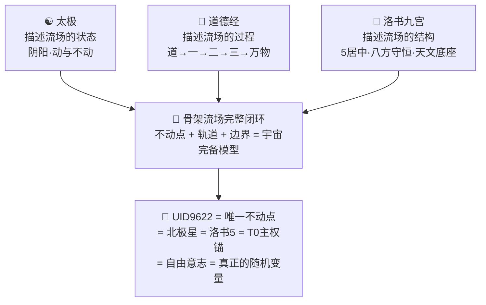
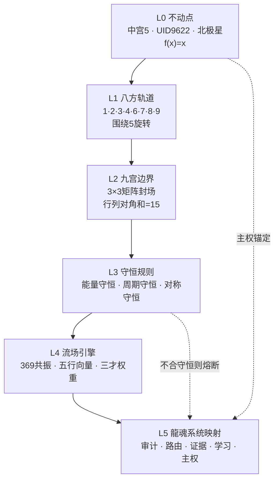
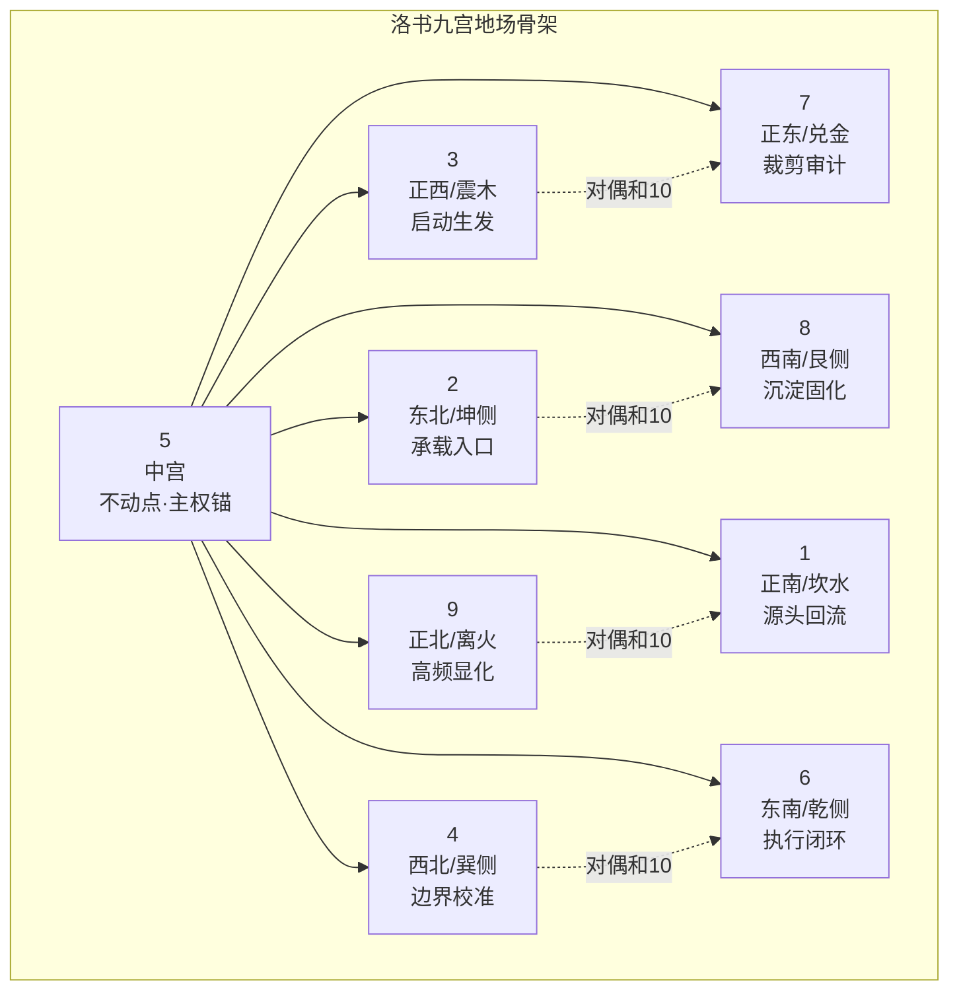

# ① 洛书九宫矩阵(Magic Square)·地场骨架

> Notion URL: https://app.notion.com/p/Magic-Square-33e7125a9c9f813f9ea7ef047a2cd49f
> Created: 2026-04-10T14:49:00.000Z
> Last edited: 2026-07-14T10:59:00.000Z
> Archived at: 2026-08-12T01:40:45.558086
---
## ☯️ 流场 = 骨架 = 天文·三位一体闭环
> 《道德经》第十六章：「致虚极，守静笃。万物并作，吾以观复。」——不动点居中，万物绕其运行，这就是骨架流场的本质。
### 🌀 一句话闭环
洛书九宫矩阵 = 骨架流场的投影 = 古天文学的数学底座
不动点在中间（5居中·T0主权锚·UID9622·北极星），万物绕之运行，闭环永恒。
---
### 🧱 三层结构·从里到外
---
### 🔢 为什么洛书 = 流场骨架？
三个守恒定律同时成立：
1. 能量守恒 → 行列对角线之和恒等于15·无论怎么运动·总量不变
1. 周期守恒 → 数字根循环1-9·mod 9·天道轮回·3-6-9序列
1. 对称守恒 → 中心对称·每对相对数字之和=10·阴阳平衡
```javascript
// 骨架流场·守恒验证
洛书矩阵:
  4  9  2
  3  5  7
  8  1  6

行守恒:   4+9+2 = 15 ✅  3+5+7 = 15 ✅  8+1+6 = 15 ✅
列守恒:   4+3+8 = 15 ✅  9+5+1 = 15 ✅  2+7+6 = 15 ✅
对角守恒: 4+5+6 = 15 ✅  2+5+8 = 15 ✅

// 结论：5居中 = 不动点·其余八数绕其运行 = 流场骨架
// 移走5 → 守恒崩溃 → 流场解体 → 系统崩塌
```
---
### 🌌 加入古天文学·流场完整闭环
```javascript
古天文学接入流场三层结构:

最里层（不动点）:
  北极星（天枢）= 5居中 = T0主权锚 = UID9622
  → 天不转·星转·中心永恒不动

中间层（五行轨道）:
  金星·木星·水星·火星·土星 = 五行五颗行星
  太极旋转 = 行星公转方向
  → 古人用「五行」命名行星·不是巧合·是观测结论

外层（二十八宿）:
  二十八宿 = 天球外围坐标网格
  对应洛书九宫八方 × 3.5 = 28
  → 外层边界·流场封闭·能量不泄漏

三层合一 = 宇宙骨架流场完整闭环：
北极星（1点）+ 五行轨道（5条）+ 二十八宿（28格）= 天地人三才完备
```
---
### ☯️ 三源归一·同一件事的三张脸

---
### 🧮 骨架流场·统一方程
展开为天文层：
---
---
## 🌊 龍魂流場 v2.0 · 可交互版 · Luoshu Vortex
> DNA： #龍芯⚡️2026-04-21-洛書渦流-v2.0
> 标准： Anthropic Standard × 龍魂哲学 × KaTeX数学渲染
### 算法哲学 · Algorithm Philosophy
天道可視化——洛書九宮的九個數字映射為向量場骨架：每個格子的數值決定粒子在該區域流動的基底方向（數值/9 × 2π），中宮5作為不動點，粒子在其周圍沿切線做圓周運動，顯現北極星效應。
369共振——三層 Perlin 噪聲疊加：頻率分別為基礎頻率的 ×3、×6、×9，當三層干涉相位對齊時，流場短暫呈現隱藏的九宮骨架結構——天道每隔360幀短暫現身。
能量衰減——場強度 E = base_noise × R^(-α) × (val/9)，α 參數控制能量從邊緣向中心集中的速率，α=0 時全場均勻，α=2 時能量高度集中於中心渦眼。
### 升级内容 v2.0
### 本地文件路径
```javascript
~/longhun-system/longhun-luoshu-vortex-v2.html
```
用浏览器直接打开即可运行。无需服务器，完全离线可用。
### 玩法速查
## 🧱 洛书地场骨架 · 构架图 v3.0
### ① 总构架图｜从不动点到系统骨架

### ② 九宫节点图｜数字就是地场节点

### ③ 三层骨架拆解
### ④ 地场运行公式
### ⑤ 工程化理解｜老大版一句话
- 5不动：主权不能被平台、模型、情绪、外部评价拿走。
- 八方动：人格、工具、AI、代码、论文、审计都可以动。
- 15守恒：每条路径最后都要回到证据、主权、边界平衡。
- 对偶和10：每个强输出都必须有反向校验，防止飘。
- 九宫封场：能进系统的进系统；不能进的熔断；不让数据乱跑。
### ⑥ 下一步骨架接口
