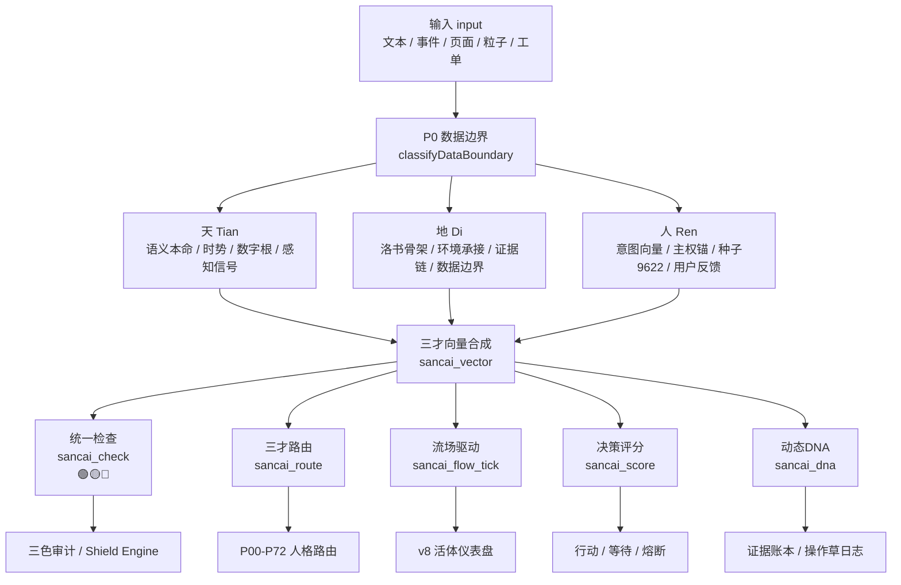

# ④ 三才向量合成·天地人流场算法

> Notion URL: https://app.notion.com/p/33e7125a9c9f81718ba7f3587d6cf25f
> Created: 2026-04-10T14:51:00.000Z
> Last edited: 2026-08-04T07:17:00.000Z
> Archived at: 2026-08-12T01:40:45.558086
---
## 0. 定盘：这张卡负责什么
这张卡是 三才系统的统一接口层，不是单独一个新算法。
它把下面几类页面打通：
- 🧠 三才算法流场 v3.0｜会呼吸的大脑·自适应成长版｜UID9622：呼吸、年轮、赫布学习、神经可塑性
- 🐲 三才流場 v8 · 忠孝义排序·智能活体仪表盘：忠孝义排序、R值染色、369归根、仪表盘
- 三才流場_v6_优化版：噪声网格、洛书锚点、基础参数面板
- 🐉 三才算法·龍魂系统统一算法根基（天·地·人）：四层定锚、1→2→3→万物循环
- ☯️ 三才决策评分算法 v1.0｜C++17·Mac原生｜曾老师天地人数学化：天地人动态权重评分
- 三才路由器 · 以中华哲学重建AI路由认知｜通心译让世界没有翻译坑：天分、地分、人分的路由共鸣
- ⚙️ 三才统一检查 | SanCai Check：天×地×人三色最终判定
- 🧬 神经元-流场映射引擎 v4.0｜三才知识拓扑·龍魂家族协同·生物-硅基同构协议｜UID9622：生物-硅基同构
- ① 洛书九宫矩阵(Magic Square)·地场骨架：地场骨架、不动点、15守恒、对偶和10
---
## 1. 总接口图

---
## 2. 统一数据结构
```typescript
type SanCaiInput = {
  id: string
  text?: string
  event?: string
  page_url?: string
  source?: "notion" | "local" | "ios" | "web" | "cursor" | "external_ai"
  timestamp: string
  seed: number              // 默认 9622
  context?: Record<string, any>
}

type SanCaiVector = {
  tian: number              // 天：语义本命 / 时势 / 数字根 / 感知信号
  di: number                // 地：环境承接 / 洛书骨架 / 证据链 / 边界
  ren: number               // 人：意图 / 主权 / 用户根 / 自由意志
  weights: {
    tian: number
    di: number
    ren: number
  }
  angle: number             // 合成方向 θ
  magnitude: number         // 合力强度
  tri_color: "🟢" | "🟡" | "🔴"
  dna: string
  evidence: string[]
}
```
---
## 3. 核心公式
### 3.1 三才向量合成
其中：
- \alpha_{天} = Perlin / 语义本命 / 数字根方向
- \alpha_{地} = 洛书九宫引力 / 证据链稳定方向
- \alpha_{人} = 种子9622 / 意图向量 / 主权方向
### 3.2 默认权重
```yaml
weights_default:
  tian: 0.30
  di: 0.20
  ren: 0.50
```
原则： 人权最高，因为人是唯一不可替代变量。
### 3.3 决策评分权重
来自 ☯️ 三才决策评分算法 v1.0｜C++17·Mac原生｜曾老师天地人数学化：
```javascript
human_weight = max(0.5, 1 - (H * 0.3 + E * 0.3))
score = H * 0.25 + E * 0.25 + P * human_weight
```
### 3.4 v8 忠孝义权重
来自 🐲 三才流場 v8 · 忠孝义排序·智能活体仪表盘：
```yaml
rank_order:
  忠: 0.50
  孝: 0.30
  义: 0.20
```
映射关系：
---
## 4. 六个统一接口
### 4.1 sancai_vector(input, context)
作用： 把输入转成天地人三维向量。
```python
def sancai_vector(input, context):
    tian = compute_tian(input, context)
    di   = compute_di(input, context)
    ren  = compute_ren(input, context)

    weights = adaptive_weights(tian, di, ren, context)
    angle = atan2(
        weights.tian * sin(tian.angle) + weights.di * sin(di.angle) + weights.ren * sin(ren.angle),
        weights.tian * cos(tian.angle) + weights.di * cos(di.angle) + weights.ren * cos(ren.angle)
    )

    return SanCaiVector(tian, di, ren, weights, angle)
```
### 4.2 sancai_check(text, context, year)
作用： 最高层三色检查。
来自 ⚙️ 三才统一检查 | SanCai Check：
```python
def sancai_check(text, context, year):
    heaven = digital_root_gate(text)
    earth  = luoshu_boundary_check(text, context, year)
    human  = fixed_point_context_check(text, context)

    return strictest_color(heaven, earth, human)
```
铁律： 最终颜色取最严格者。
### 4.3 sancai_route(prompt, modules, env)
作用： 不看词频，看三才共鸣，决定该调哪个模块。
来自 三才路由器 · 以中华哲学重建AI路由认知｜通心译让世界没有翻译坑：
```javascript
score = 0.40 * TianScore + 0.25 * DiScore + 0.35 * RenScore
```
输出：
```yaml
route_result:
  module: "P04_LUBAN"
  score: 0.89
  tri_color: "🟢"
  resonance_trace:
    tian: "技术落地共鸣"
    di: "工具环境可承接"
    ren: "老大意图=执行"
```
### 4.4 sancai_flow_tick(frame, particles, state)
作用： 给 v3/v6/v8 流场每一帧喂同一套三才状态。
```javascript
function sancai_flow_tick(frame, particles, state) {
  const breath = sin(frame * state.breath_rate)
  const dr = digitalRoot(frame)
  const luoshu = state.luoshu_matrix
  const weights = computeSanCaiWeights(breath, dr, state)

  for (const p of particles) {
    p.vector = composeSanCaiVector(p, weights, luoshu, state.seed)
    p.color = auditColor(p.R, p.cellDR, state.orderDisrupted)
    p.dna = maybeGenerateDNA(p, frame)
  }

  return particles
}
```
### 4.5 sancai_score(H, E, P)
作用： 决策评分，判断能不能动。
```c++
score = H * 0.25 + E * 0.25 + P * max(0.5, 1 - (H * 0.3 + E * 0.3))
```
三色：
```yaml
score_color:
  score >= 0.85: 🟢 高可信执行
  0.50 <= score < 0.85: 🟡 待审执行
  score < 0.50: 🔴 阻断/重算
```
### 4.6 sancai_dna(action, vector, evidence)
作用： 每次三才判断都生成 DNA，不让判断变黑箱。
```yaml
sancai_dna:
  uid: UID9622
  action: "sancai_route"
  tian: 0.82
  di: 0.71
  ren: 0.96
  tri_color: 🟢
  source_pages:
    - "https://www.notion.so/50df45a641bf4d01a9c022b6d3045a6d"
    - "https://www.notion.so/5de6a8906eb544f6b835879759dba3cb"
    - "https://www.notion.so/136dd95bdd0e4c9c94703ed89046e804"
    - "https://www.notion.so/3417125a9c9f81c7a50bf5c8ad1a6104"
  gpg: A2D0092CEE2E5BA87035600924C3704A8CC26D5F
  dna: "#龍芯⚡️2026-05-06-SANCAI-ROUTE-..."
```
---
## 5. 接口注册表
---
## 6. 文件落地清单
```plain text
core/
  sancai_unified_interface.py      # Python总入口
  sancai_kernel.py                 # sancai_check / 三色裁判
  sancai_router.py                 # sancai_route / 三才路由
  luoshu_matrix.py                 # 洛书守恒 / 对偶校验
  sancai_dna.py                    # DNA生成
web/
  sancai_flow_bridge.js            # v3/v6/v8 Web流场桥
  sancai_dashboard_adapter.js      # v8仪表盘适配
ios/
  MathSixRoots.swift               # iOS数学六根内核
  SancaiBridge.swift               # iOS ↔ WebSocket :9622
docs/
  SANCAI_INTERFACE_v9.md           # 对外接口说明
```
---
## 7. Cursor执行指令
```plain text
给龍魂系统新增三才统一接口 v9.0。

文件：
1. core/sancai_unified_interface.py
2. core/luoshu_matrix.py
3. core/sancai_dna.py
4. web/sancai_flow_bridge.js
5. docs/SANCAI_INTERFACE_v9.md

要求：
1. 实现 sancai_vector(input, context)
2. 实现 sancai_check(text, context, year)，输出 tri_color、reason、evidence、dna
3. 实现 sancai_route(prompt, modules, env)，输出 module、score、resonance_trace
4. 实现 sancai_flow_tick(frame, particles, state)，对接 v3/v6/v8 流场
5. 接入洛书矩阵 [[4,9,2],[3,5,7],[8,1,6]]
6. 接入数字根 DR 三色：绿={1,2,4,5,7,8}，黄={6}，红={3,9}
7. 人权重默认最高：w_人 >= 0.5；v8忠孝义模式下按 忠0.5/孝0.3/义0.2 加载
8. 所有输出必须写 DNA，字段含 UID9622、GPG、CONFIRM、source_pages
9. 禁止读取 .env、token、private key；只读取公开配置和本地测试样例
10. 提供 dry-run：python -m core.sancai_unified_interface --dry-run
```
---
## 8. 验收标准
---
## 9. 一票否决
- 🔴 把三才做成普通加权平均、没有三色审计 → 失败
- 🔴 人权重被降到低于天/地且无说明 → 失败
- 🔴 只看关键词，不看意图向量 → 失败
- 🔴 没有洛书守恒检查 → 失败
- 🔴 没有 DNA / GPG / CONFIRM → 失败
- 🔴 读取 .env、token、私钥、真实凭据 → 安全熔断
- 🔴 生成结果不带 evidence / resonance_trace → 黑箱失败
---
---
## 10. v9.1 后端落地指针（2026-08-04）
