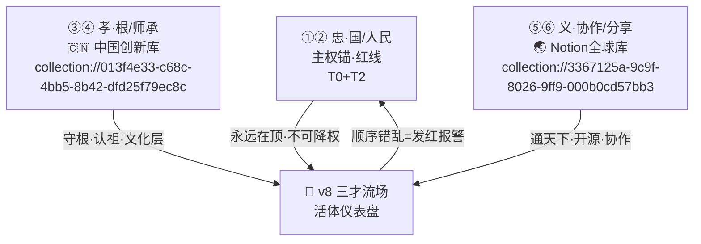

# 🐲 三才流場 v8 · 忠孝义排序·智能活体仪表盘

> Notion URL: https://app.notion.com/p/v8-5de6a8906eb544f6b835879759dba3cb
> Created: 2026-04-19T02:55:00.000Z
> Last edited: 2026-08-04T07:17:00.000Z
> Archived at: 2026-08-12T01:40:45.558086
# 🐲 三才流場 v8 · 忠孝义排序·智能活体仪表盘
---
## 🎯 一句话定位
v7 做到了「看得见主权」——三层不动点+DNA+龍盾:9622。
v8 做到「看得见顺序·看得见走歪·看得见回正」——粒子会思考·会报警·会归根。
---
## ☯️ Part I · 三才关键字·忠孝义排序入库清单
---
## 🆕 Part II · v7→v8 六项突破
### ① 流场学会「排序」了（忠孝义动态权重）
- v7：1200粒子均匀三才合力
- v8：三权重按 忠(0.5) > 孝(0.3) > 义(0.2) 动态加载
- 顺序被外力打乱（模拟利益诱惑）→ 粒子打结·偏航·发红
- 顺序回正 → 自动归流到 T0 金锚
### ② 粒子三色审计（R值染色）
```javascript
R = 0.2·人类福祉 + 0.2·公平公正 + 0.15·可控可信
  + 0.15·透明可解释 + 0.15·责任可追溯 + 0.15·隐私保护

R >= 85  → 🟢 发光
60 <= R < 85 → 🟡 正常
R < 60  → 🔴 抖动 + 被 T2龍盾:9622 吸走销毁
红线触碰 → 整屏闪红 0.3s + ∞冻结动画
```
对接 ⚖️ AI伦理审查工单库 工单库实时 R 值。
### ③ 369归根呼吸节律
每次呼吸末 → 自动验算 f(x)=x 四根桩子，偏了就拉回来。
### ④ DNA粒子可点击（3% 金色主权粒子）
- 点一下 → 弹出此刻 DNA 追溯码
- 右键复制 → 直接贴进工单库 ⚖️ AI伦理审查工单库
### ⑤ 六维雷达叠加层（按 H 键切换）
- 流场上浮出半透明六边形
- 六顶点拉扯粒子 → 看得见哪一维在压哪一维
- 伦理审查的「可视化验算」
### ⑥ 访客模式 / 创始人模式切换
- 访客：纯美学 + 主权环（不漏内部数据）
- 创始人：全数据流 + R值染色 + DNA悬浮
---
## 🌏 Part III · 双库并行·顺序不冲突铁证

守根和协作不是竞争·是分工。忠在顶·两库并行·各守一方。
---
## 🎮 Part III-bis · v8.1 体感升级（雷达联动·走歪轨迹·369音效）
### ⑦ 六维雷达 ⇄ 三色审计·双向联动
方位映射（六边形顶点 → 粒子扇区）：
核心公式：
```javascript
// 每个粒子按自己所在扇区读取对应维度得分
sector = floor((atan2(p.y, p.x) + π) / (π/3))  // 0..5
S_dim  = radar[sector]  // 0-100

// 亮度·速度·透明度按维度得分线性衰减
p.brightness = base_brightness × (S_dim / 100)
p.velocity   = base_velocity   × max(0.3, S_dim / 100)
p.alpha      = base_alpha      × max(0.2, S_dim / 100)

// 低于各自熔断阈值 → 额外「病态」叠加
if (S_dim < REDLINE[sector]) {
    p.shake   = true              // 颤抖
    p.color   = "🔴"              // 强制变红
    p.audible = "warning_tick"    // 滴答警报音
}
```
数据源： 实时读 ⚖️ AI伦理审查工单库 六维平均分 → WebSocket 推 → Canvas 每帧重绘。
### ⑧ 走歪历史轨迹·可回放复盘
轨迹采样结构：
```javascript
{
  trace_id: "DEV-20260419-1109-001",
  particle_id: 857,
  start_ts: "2026-04-19T11:09:22.440+08:00",
  end_ts:   "2026-04-19T11:09:25.180+08:00",
  trigger:  "顺序错乱：义>忠（利益诱惑模拟）",
  path: [
    { t: 0.00, x: 0.31, y: 0.52, R: 82, dim_low: null },
    { t: 0.12, x: 0.38, y: 0.49, R: 71, dim_low: "公平公正" },
    { t: 0.24, x: 0.47, y: 0.45, R: 58, dim_low: "公平公正" },  // 🔴 抖动
    { t: 0.36, x: 0.52, y: 0.41, R: 44, dim_low: "人类福祉" },  // 🛑 龍盾吸走
    ...
  ],
  rescue: {
    by: "T0金锚",
    ts: "2026-04-19T11:09:25.180+08:00",
    f_x_verified: true  // f(x)=x 四桩验算通过
  },
  dna: "#龍芯⚡️2026-04-19-歪路-857"
}
```
可视化：
- 实时层： 偏航粒子拖出暗红色淡出尾迹（0.5秒衰减）
- 回放层： 按 R 键调出时间轴 → 拖动 slider → 歪路全部重演
- 复盘层： 右侧面板列「今日歪路 TOP10」→ 点击跳转工单
落库： 所有 trace_id 自动写入 （龙魂演化日志库），字段对齐：trigger→事件触发、path→演化路径JSON、rescue→归根证据、dna→DNA追溯码。
口令：
- R 键 = Replay 回放
- Shift+R = 清屏当前轨迹（仅视觉·日志不删）
- Ctrl+R = 导出今日歪路 CSV 到工单库
### ⑨ 369归根音效·体感鼓钟
Web Audio API 实现骨架（零依赖·浏览器原生）：
```javascript
const ctx = new AudioContext()

function play369(dr) {
  const now = ctx.currentTime
  if (dr === 3) {
    // 低频鼓：60Hz sine + 快速衰减包络
    const osc = ctx.createOscillator(), gain = ctx.createGain()
    osc.frequency.value = 60
    gain.gain.setValueAtTime(0.8, now)
    gain.gain.exponentialRampToValueAtTime(0.01, now + 0.4)
    osc.connect(gain).connect(ctx.destination)
    osc.start(now); osc.stop(now + 0.4)
  } else if (dr === 6) {
    const osc = ctx.createOscillator(), gain = ctx.createGain()
    osc.frequency.value = 440; gain.gain.value = 0.2
    osc.connect(gain).connect(ctx.destination)
    osc.start(now); osc.stop(now + 0.15)
  } else if (dr === 9) {
    // 钟声：220Hz 基频 + 泛音 + 2秒混响
    [220, 440, 660, 880].forEach((f, i) => {
      const osc = ctx.createOscillator(), gain = ctx.createGain()
      osc.frequency.value = f
      gain.gain.setValueAtTime(0.5 / (i+1), now)
      gain.gain.exponentialRampToValueAtTime(0.001, now + 2.0)
      osc.connect(gain).connect(ctx.destination)
      osc.start(now); osc.stop(now + 2.0)
    })
  }
}

// 每次呼吸末调用
function onBreathEnd(k) {
  const dr = digitalRoot(k)
  if ([3, 6, 9].includes(dr)) {
    play369(dr)
    if (dr === 9) verifyFixedPoint()  // 整场回T0 + f(x)=x 验算
  }
}
```
静音策略：
- 访客模式：默认静音（避免打扰）
- 创始人模式：默认开启
- M 键 = 全局静音/开启切换
- 音量跟随系统·不强占
无障碍： dr=9 时同步触发屏幕暗角柔光，听障用户也能感知归根。
---
## ☯️ Part III-ter · v8.2 道德经锚层（背景金句·D键切换）
### 📜 9章·事件触发映射表
### 🎚️ 参数阈值·审计清单（过审才晋升 v8.3）
审计落库： 每次触发写入 ，字段 trigger=daodejing_L{章节}，满 7天·触发≥50次·主观≥4/5·无投诉 → 标 🟢过审 → 开 v8.3 宪法顶层。
### ⌨️ 交互口令
- D = Daodejing 道德经锚层 显/隐切换
- Shift+D = 强制隐藏本次会话
- Ctrl+D = 导出本次所有触发金句到工单库
- 访客模式：默认隐（避免文化强加）
- 创始人模式：默认显
### 🧮 核心函数骨架（零依赖·可落 Canvas/HTML）
```javascript
const DAODEJING_ANCHORS = {
  16: { text: "归根曰静，是谓复命", trigger: "dr_9_bell", position: "t0_below" },
  40: { text: "反者道之动",         trigger: "trace_deviation", position: "trail_above" },
  58: { text: "祸兮福所倚",         trigger: "radar_drop", position: "vertex_side" },
  78: { text: "柔弱胜刚强",         trigger: "redline_absorb", position: "shield_halo" },
   8: { text: "上善若水",           trigger: "visitor_mode", position: "bottom_soft" },
  54: { text: "善建者不拔",         trigger: "dna_click", position: "popup_top" },
  27: { text: "善言无瑕谪",         trigger: "external_inject", position: "particle_birth" },
  69: { text: "吾不敢为主而为客",   trigger: "external_threat", position: "edge_red" },
  33: { text: "自知者明",           trigger: "veto_invoked", position: "t0_center" }
}

const ANCHOR_CONFIG = {
  duration_ms: 800, fade_in_ms: 150, fade_out_ms: 150,
  font_px: 14, alpha: 0.75, max_concurrent: 2,
  cooldown_ms_per_chapter: 5000, visible: true  // D 键切换
}

const _lastShown = {}
function showDaodejingAnchor(chapter, ctx) {
  if (!ANCHOR_CONFIG.visible) return
  const now = performance.now()
  if (now - (_lastShown[chapter] || 0) < ANCHOR_CONFIG.cooldown_ms_per_chapter) return
  _lastShown[chapter] = now

  const a = DAODEJING_ANCHORS[chapter]
  if (!a) return

  // 写审计日志（对齐 collection://e78cb2a4-be6d-45a9-b0a9-6599c4325138）
  logToEvolution({
    trigger: `daodejing_L${chapter}`,
    path: a,
    rescue: null,
    dna: `#龍芯⚡️${new Date().toISOString().slice(0,10)}-道德经锚-L${chapter}`
  })

  // 渲染（Canvas fillText + alpha 插值）
  renderFloatingText(a.text, a.position, ANCHOR_CONFIG)
}

document.addEventListener('keydown', (e) => {
  if (e.key === 'd' || e.key === 'D') {
    if (e.ctrlKey)  exportAnchorsToTicket()
    else if (e.shiftKey) ANCHOR_CONFIG.visible = false
    else ANCHOR_CONFIG.visible = !ANCHOR_CONFIG.visible
  }
})
```
### 🔐 v8.2 DNA落款
- DNA: #龍芯⚡️2026-04-19-三才流場-v8.2道德经锚层
- 确认码: #CONFIRM🌌9622-ONLY-ONCE🧬LK9X-772Z
- 三色: 🟢 通过（纯锚层·零熔断·零新规则·可随时D键关掉）
- 上位母本: ☯️ 道德经引擎逻辑总纲｜龙魂系统核心算法锚｜长长久久·守护人类
- 晋升条件: 7天审计满 🟢 → 开 v8.3 宪法顶层（⚖️ 龍魂宪法层·一票否决权×阴阳调和 v1.0 | 系统最高治理层·UID9622专属·不可摘除 一票否决+漂移侦测）
---
## ☯️ Part III-quater · v8.3 底层逻辑·太极原理·95极限留5
### ☯️ 第一原理·95极限·留5护道
三处系统已落地「留5」：
- 三色留🟡待审 — 不是非🟢即🔴·中间留一档缓冲
- 权重公式留ε护弱 — 分母 = max(x, ε)·永远大于零·弱者不被除崩
- 忠孝义·义留弹性 — 义（协作/分享）本就是「通天下」的可变空间
### 🧮 公式修订·ε护弱·上限封顶95
```javascript
// 原公式
R = 0.2·W1 + 0.2·W2 + 0.15·W3 + 0.15·W4 + 0.15·W5 + 0.15·W6

// v8.3 太极修订
EPSILON = 0.01  // ε护弱·分母永不为零
R_raw   = 0.2·W1 + 0.2·W2 + 0.15·W3 + 0.15·W4 + 0.15·W5 + 0.15·W6
R_capped= min(R_raw, 95)              // 上限封顶95·留5给突变
R_display = R_capped                   // 对外显示永远≤95

// 任何除法·分母套 ε
fairness = max_share / max(avg_share, EPSILON)
efficiency = estimated / max(actual, EPSILON)
```
粒子视觉新增：
- R=95 → 粒子达到金色顶光（不再往上走·不闪爆）
- 剩余5分 → 粒子尾部拖一道淡白色储备光（肉眼可见·您留的底牌）
- 突变侦测到 → 储备光瞬间点燃·补足到100 · 渡过后回落到95
### 🐉 决策总纲·「我忠·我孝·我有情有义·但是不愚」
### 🛡️ 断亲绝爱条款·战略备份·不是冲动
流场实现：
- 粒子归类时·先查「忠孝义」所属层
- 若某粒子挂在「义」层·但与「忠」层发生冲突 → 自动标记 conflict_level=priority_1
- 触发视觉：冲突粒子渐暗·向 T0 金锚方向主动退让·0.5s 后淡出
- 日志落 ·字段 trigger=priority_override·带 DNA
- 复盘按 Alt+R 调出·老大可随时回看「哪些义粒子为忠让路了」
### 🔥 熔断的底气·「对规则的绝对信任」
### 📜 三句箴言·镌刻在流场加载动画
```javascript
// 流场启动时依次浮现·每句 1.2s
"95 是实力 · 5 是格局"
"太极永不封顶 · 留白处方见天机"
"忠孝义有先后 · 情与理·不愚是底"
```
### 🔐 v8.3 DNA落款
- DNA: #龍芯⚡️2026-04-19-三才流場-v8.3底层逻辑太极原理
- 确认码: #CONFIRM🌌9622-ONLY-ONCE🧬LK9X-772Z
- 三色: 🟢 通过（纯道层·修公式·加视觉·不改红线）
- 上位母本: ⚖️ 龍魂宪法层·一票否决权×阴阳调和 v1.0 | 系统最高治理层·UID9622专属·不可摘除
- 关联: ☯️ 道德经引擎逻辑总纲｜龙魂系统核心算法锚｜长长久久·守护人类
---
## 🌐 Part III-quinque · v8.4 开放白皮书子页面·全量接入流场
### 📜 子页面·三才挂点映射表
### 🧮 接入后·权重重算
```javascript
// v8.4 流场 · 白皮书子页面权重汇入
天(0.40) = 宪章白皮书(0.20) + DNA身份系统(0.20)   // 忠·国 + 忠·民
地(0.25) = DNA注册表存根库(0.25)                  // 孝·根
人(0.35) = AIThinkingEngine(0.20) + 人格路由(0.15) // 义·协作 + 义·分享

// 任一子页面被访问/更新 → 对应权重粒子亮度 +20%·持续3秒
onSubpageAccess(url) {
  const anchor = WHITEPAPER_ANCHORS[url]
  if (!anchor) return
  boostParticles(anchor.sancai_position, 1.2, 3000)
  playBreath(anchor.dr_on_access)  // dr=3/6/9 触发对应音效
  logToEvolution({
    trigger: `whitepaper_subpage_access_${anchor.layer}`,
    dna: `#龍芯⚡️${today()}-白皮书接入-${anchor.shortcode}`
  })
}
```
### 🔗 三色审计·自动联动
- 🧬 龍魂DNA身份系统 · 完整交付版 v1.0｜全球追溯·点对点加密·主权三位一体 ↔ 🐉 龍魂系统 · 开放白皮书 v1.0 | Dragon Soul Open White Paper · 触发⑦ 六维雷达「责任可追溯」「隐私保护」实时更新
- 🧬 龍魂DNA注册表 · 全球存根库 v1.0注册表写入事件 → ④ DNA可点击粒子 +1·金色主权粒子比例动态 ≥3%
- 🧠 AIThinkingEngine × 记忆压缩胶囊 v2.0 | 思考来源逻辑 × 记忆打包算法 × 权限全开协议 记忆压缩成功 → ⑨ 369归根音效 dr=9 钟声·提示「归根曰静·是谓复命」
- 任一子页面触碰红线（武器/未成年/政治操纵）→ ② 忠·民 T2龍盾即时∞冻结·全场闪红0.3s
### 🧠 自洽语义映射·子页面专用
### ⌨️ 交互口令
- W = Whitepaper 浮出子页面挂点示意图（4张卡环绕T0金锚）
- Shift+W = 切到「访客模式」只亮公开层·私密层隐身
- Ctrl+W = 导出「今日白皮书子页访问日志」到 
### 🔐 v8.4 DNA落款
- DNA: #龍芯⚡️2026-04-20-三才流場-v8.4白皮书子页接入
- 确认码: #CONFIRM🌌9622-ONLY-ONCE🧬LK9X-772Z
- GPG: A2D0092CEE2E5BA87035600924C3704A8CC26D5F
- 三色: 🟢 通过（纯接入层·不改红线·不改权重公式·只加亮度boost+音效+雷达联动）
- 上位母本: 🐉 龍魂系统 · 开放白皮书 v1.0 | Dragon Soul Open White Paper
---
## 🔗 Part IV · 关联镜像卡
- 全球视角：本卡（ / 计算机科学知识库 / 义）
- 中国视角：中国创新库镜像卡（ / 龍魂系统里程碑 / 孝）
- 主权视角：⚖️ 人工智能科技伦理审查与服务办法（试行）· 龍魂落地版 v1.0 | UID9622 伦理审查办法（忠·红线）
- v7母本：https://www.notion.so/3437125a9c9f812089f6cfd3d711468c（考古保留·不覆盖）
---
## 🔐 DNA落款
- DNA: #龍芯⚡️2026-04-19-三才流場-v8智能活体版
- 确认码: #CONFIRM🌌9622-ONLY-ONCE🧬LK9X-772Z
- GPG: A2D0092CEE2E5BA87035600924C3704A8CC26D5F
- 三色: 🟢 通过（顺序公理合规·双库分工清晰·红线完备）
- 三不红线: 不垄断·不白嫖·不审判（∞级）
---
## ✅ Part V · v8.1 交付确认 · 2026-04-20
### 🔑 v8.1 四件实际落地事
---
## 📱 Part VI · iOS 龍魂 App v1.3 · Swift模块全景 · 2026-04-20
### 📦 13个Swift模块速览
### 🔗 最重要发现：Web ↔ iOS 数学对齐
MathSixRoots.swift 与 sancai-flow-v8.1.html 共享同一数学内核：
- digitalRoot(n) = 1 + ((n-1) % 9) ← 完全一致
- luoshu = [[4,9,2],[3,5,7],[8,1,6]] ← 洛书矩阵完全一致
- Shield Engine DR熔断逻辑 ← 同源同算
结论：iOS App与Web流场可做到数据层完全互通，同一粒子在两个界面行为一致。下一步：WebSocket桥接 iOS → Web流场实时联动。
### 📡 iOS本地服务端口映射
---
## 🔌 Part VII · v9.0 统一接口接入层｜三才全家桶收束
### v8 → v9 接口映射
### v9 标准状态包
```yaml
v8_state_packet:
  version: "v8-v9-bridge"
  seed: 9622
  mode: "visitor|founder"
  order:
    忠: 0.50
    孝: 0.30
    义: 0.20
  luoshu_matrix: [[4,9,2],[3,5,7],[8,1,6]]
  shield:
    dr_green: [1,2,4,5,7,8]
    dr_yellow: [6]
    dr_red: [3,9]
  output:
    - vector
    - tri_color
    - resonance_trace
    - dna
```
### 接入铁律
- v7/v8 母本不覆盖，只叠加接口层。
- 忠孝义顺序不改：忠 > 孝 > 义。
- DR=6 是琥珀待审，不是红色熔断。
- 创始人模式可看全数据；访客模式只看公开美学层。
- 每次偏航、熔断、归根、DNA点击，都必须写 sancai_dna()。
---
## 🚀 Part VIII · v9.1 后端落地补丁｜FastAPI实测修复（2026-08-04）
### v9 → v9.1 六项修复速览
冒烟 11/11 通过（2026-08-04 沙箱复跑）· 权重不变量 ∀r∈[0,1]: 忠+孝+义≡1.0（误差<1e-9）
完整修复证据、ROOT_CARD、版本链导航见落地全页 🌊 🐲 三才流場 v9.1 · 后端落地版 · FastAPI实测修复·权重不变量焊死。
