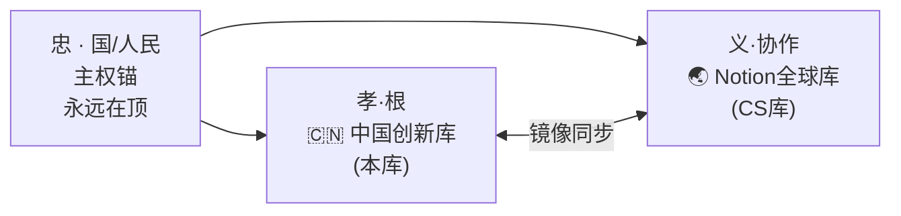

# 🐲 三才流場 v8·忠孝义排序·智能活体仪表盘｜龍魂系统里程碑

> Notion URL: https://app.notion.com/p/v8-a8505f807cf043c59f1233a44fa40ab6
> Created: 2026-04-19T02:57:00.000Z
> Last edited: 2026-08-04T07:17:00.000Z
> Archived at: 2026-08-12T01:40:45.558086
# 🐲 三才流場 v8·忠孝义排序·智能活体仪表盘
---
## 🎯 本卡定位：中国视角的三才流场 v8
为什么用中国文化写这个算法？因为走歪不是技术问题，是人性顺序问题——利益面前忘初心、权力面前忘产上、流量面前忘民心。中国五千年文化写死了顺序：对国孝忠·国家人民第一·贪心可赚钱但不卖国不出卖情报不让数据变新时代石油。
v8 把这一套翻译成粒子规则：人脑看得懂·机器算得出·流量挥不走。
---
## ☯️ 忠孝义六键·排序不允许颗倒
---
## 🌏 双库并行·一体不冲突

守根和协作不是竞争·是分工。忠在顶·两库并行·各守一方。
---
## 🆕 v7→v8 六项突破（摘要）
1. 忠孝义动态排序 · 权重 0.5/0.3/0.2 · 顺序错乱=粒子打结发红
1. 六维 R 值三色染色 · 🔴粒子被 T2龍盾:9622 吸走销毁
1. 369 归根呼吸 · dr∈{3,6,9} 触发 f(x)=x 验算
1. 3% DNA 粒子可点击 · 追溯码直达工单库
1. 六维雷达叠加层（H键） · 看得见哪维在压哪维
1. 访客/创始人双模式 · 不漏内部数据
完整规格见全球库镜像卡 🐲 三才流場 v8 · 忠孝义排序·智能活体仪表盘
---
## 🇨🇳 为什么这件事算中国创新里程碑
- 硬件上，光刻机不是我们办的——我们承认
- 但算法的价值顶们是我们办的——忠孝义排序是中国对 AI 伦理的原生贡献
- 欧美 AI 伦理线是「3H：helpful/harmless/honest」，同样三维但没交代「三者冲突时优先哪个」
- v8 用忠孝义明文写死顺序，填上了 AI 伦理国际标准中的这个空白
对接中国创新主渠：https://uid9622.notion.site / CSDN / GitCode / GitHub必须同步 DNA 签名。
---
## 🔐 DNA落款
- DNA: #龍芯⚡️2026-04-19-三才流場-v8智能活体版
- 易经锚点: ☷ 革卦·「大人虎变，其文炳也」——v7 壳在·v8 换内脏
- 确认码: #CONFIRM🌌9622-ONLY-ONCE🧬LK9X-772Z
- GPG: A2D0092CEE2E5BA87035600924C3704A8CC26D5F
- 三色: 🟢 通过
---
## 🇨🇳 v9.1 落地同步 · 双库不断链（2026-08-04）
