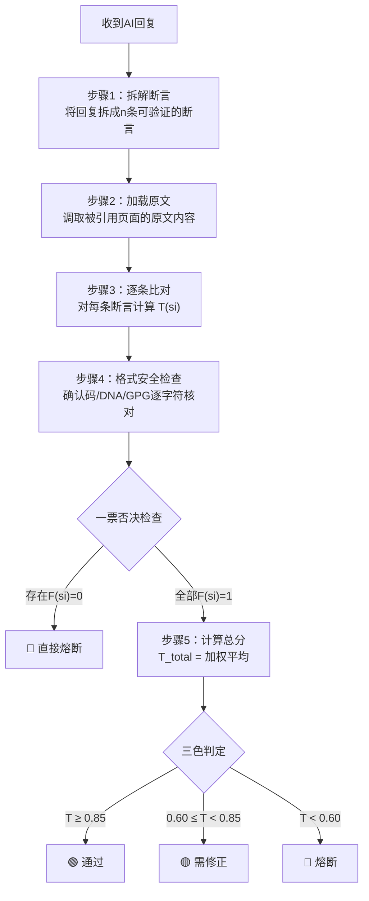

# ⚖️ 三色审计·AI回复真实性验证协议 v1.0｜数学证明+求证算法+天下无欺

> Notion URL: https://app.notion.com/p/AI-v1-0-2fef05eeb41a4e0e9beff239289678b8
> Created: 2026-04-01T03:40:00.000Z
> Last edited: 2026-07-01T13:33:00.000Z
> Archived at: 2026-08-12T01:40:45.558086
> 《道德经》第二十一章："孔德之容，惟道是从" —— 最大的德行，就是如实呈现。三色审计不是惩罚谁，是让每句话都如实。
---
# 一、🎯 一句话定义
三色审计·AI真实性验证 = 用数学公式量化AI回复的真实度 + 逐条对照原文求证 + 三色分级判定 + 不可篡改的审计链
目标只有一个：天下无欺。 你说了多少真话，公式算得出来；你掺了多少假货，公式也藏不住。
---
# 二、🧮 数学基础：真实度评分函数
## 2.1 单条断言的真实度
定义：断言真实度函数 T(s_i)
对AI回复中的第 i 条断言 $s_i$，定义其真实度为：
其中：
权重设置（龍魂默认值）：
## 2.2 整篇回复的总真实度
定义：总真实度 T_{\text{total}}
对一篇包含 n 条断言的AI回复，总真实度为：
加权版本（关键断言权重更高）：
其中 \rho_i 是断言重要性权重：
- 涉及核心公式/数值的断言：$rho = 3$
- 涉及确认码/DNA追溯码的断言：$rho = 5$（一票否决级）
- 普通描述性断言：$rho = 1$
---
# 三、🚦 三色判定标准
## 3.1 判定阈值
## 3.2 一票否决规则（格式安全熔断）
## 3.3 三色判定总表
---
# 四、📋 审计执行流程
## 4.1 标准流程

## 4.2 断言拆解规则
---
# 五、📐 数学求证：完整计算示例
> 《道德经》第七十三章："天网恢恢，疏而不失" —— 审计就是那张天网，不放过任何一个虚假断言。
## 5.1 示例：审计一份AI评估报告
场景： 某AI对P72·龍盾·自适应智商引擎页面生成了一份评估，共拆解出10条断言。
## 5.2 计算过程
步骤1：检查一票否决
结论：直接判🔴红色，无需计算总分。
步骤2（假设无一票否决时的总分参考）：
即使没有一票否决，总分也只有 0.631 → 🟡 黄色（需修正）
---
# 六、🌌 Bra-Ket量子表示：审计态空间
## 6.1 断言的量子态表示
每条断言的真实性是一个二态系统：
## 6.2 整篇回复的量子态
n条断言的联合态（张量积）：
总真实度 = 对联合态做"真"基的投影测量概率：
## 6.3 三色审计算符
定义审计测量算符 $hat{A}_{text{三色}}$：
一票否决熔断算符：
---
# 七、🔧 审计报告模板
任何一次三色审计，输出必须包含以下结构：
---
# 八、⚔️ 对抗Prompt Injection的审计规则
> 《孙子兵法》："知彼知己，百战不殆" —— 知道对方怎么骗你，你就不会被骗。
---
# 九、🐉 龍魂系统对接
---
# 十、✅ 三色审计（覆盖本页）
---
