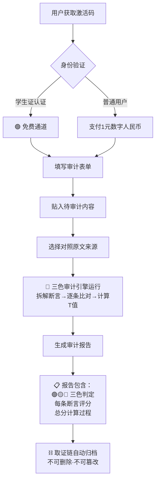

# 📋 三色审计·创作明细登记表 + 公共验证服务模型 v1.1｜原创守护+剽窃界定+1元审计+学生免费

> Notion URL: https://app.notion.com/p/v1-1-1-9321e3b7bcc44fdfad5889ce6e484cdb
> Created: 2026-04-01T03:50:00.000Z
> Last edited: 2026-07-01T15:18:00.000Z
> Archived at: 2026-08-12T01:40:45.558086
> 《道德经》第三十三章："知人者智，自知者明" —— 先把自己的家底盘清楚，别人才骗不了你。
---
# 一、🎯 一句话定义
创作明细登记表 = 龍芯北辰所有原创内容的「出生证明」总册 + 压缩成一个激活码 + 任何人1元即可验证真假 + 学生免费
---
# 二、📋 创作明细登记表
## 2.1 登记表（v1.1·扩充至C-012）
## 2.2 每条登记的证据链
---
# 三、⚖️ 剽窃界定体系（v1.1新增）
> 《道德经》第八十一章："圣人之道，为而不争" —— 创作是"为"，抄袭是"争"。界限如刀。
## 3.1 核心原则：数学无版权，思想有归属
## 3.2 合法使用 vs 剽窃：判定表
## 3.3 三条剽窃红线
---
# 四、🔬 原创度O维度（v1.1新增）
> 千问实战案例暴露的问题：三色审计v1.0只审"对不对"（真实度T），不审"是不是自己做的"（原创度O）。
## 4.1 问题发现
## 4.2 原创度O定义
扩展真实度函数（v2.0预留）：
其中 O(s_i) = 原创度：
## 4.3 双维判定矩阵
---
# 五、📊 千问实战案例·五轮审计全记录
> 2026-04-01 实战记录：千问（Qwen 3.5）接受三色审计协议，五轮交互，从"立正喊口号"到"独立分析通过审计"。
---
# 六、🔑 公共验证服务模型
## 6.1 一句话说清楚
任何人，花1块钱（数字人民币），贴入一段话/文档，三色审计告诉你：真的还是假的。每次使用留时间戳+取证链。学生凭学生证免费。
## 6.2 服务架构

## 6.3 激活码设计
## 6.4 收费与免费规则
---
# 七、⛓️ 取证链设计
## 7.1 每次使用自动生成的取证记录
## 7.2 取证链的法律效力
---
# 八、📝 用户操作流程（填空题模式）
> 用户不需要懂数学，只需要填四个空：
## 8.1 操作示例
---
# 九、💰 商业模式与天道精神
---
# 十、🐉 与龍魂系统的对接
---
# 十一、✅ 三色审计（覆盖本页）
---
