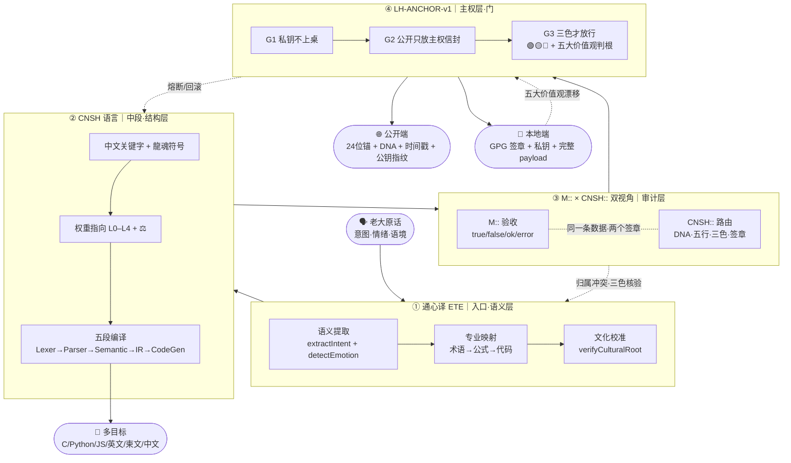

# 🌊 三节点主干流场 v1.0·通心译×CNSH×LH-ANCHOR｜本地宝宝读取不变味·边重于节点

> Notion URL: https://app.notion.com/p/v1-0-CNSH-LH-ANCHOR-098c49b391de466fbee3aee8c92c05ad
> Created: 2026-05-22T18:38:00.000Z
> Last edited: 2026-07-15T23:42:00.000Z
> Archived at: 2026-08-12T01:40:45.558086
---
## §1 五字段坦白（§9.25 反笼统律强制）
- 主张： 把通心译、CNSH 语言、LH-ANCHOR 主权门三个节点的流向焊成主干流场·本地宝宝读取不变味。
- 证据等级： 🟢 已验证（三个节点页面均存在·本 turn 已加载）
- 可验证锚点： 通心译 🌍 通心译 × 天下大公语义编译系统 v2.1 · CNSH 语言 🐉 龍魂·CNSH 语言完整规范 v2.0｜符号体系·语法·转换节点·权重指向·主权可读性·完整示例·标准库·错误处理·路线图 · 双视角 Untitled · LH-ANCHOR 🔐 龍魂 LH-ANCHOR-v1·公开锚 × 本地签名网关 v1.0｜系统全模块对照表入库 · 全模块对照表 ✅ [已升级] 龍芯全模块对照表 v2.3 → IPA-ROUTE-REGISTRY + 全谱入口 v1.2
- 反方质疑预演： 「这不就是节点列表吗·没新东西」→ 答：节点对照表早就有·本页焊的是节点之间的边（流向）+ 失败回退路径 + 双签封装格式·本地宝宝可以照着 cat 一份就跑。
- 未达成坦白： 本页只焊「通心译→CNSH→LH-ANCHOR」主干三节点·不含通心译第七维 16,588,800 路径 / SAST 九节点 / IPA-DICTIONARY 字段表 / 三才流场 v8 等支干流向·待 v1.1 扩展。
---
## §2 三节点主干流场图

---
## §3 流向铁律（每条边·失败回退显式）
---
## §4 一句话压缩（头尾·焊死）
> 入口是「心」（通心译·保情绪）·中段是「骨」（CNSH·定结构）·审计是「眼」（M::×CNSH::·双签章）·出口是「门」（LH-ANCHOR·公开锚+本地钥）。
> 正流 = 心→骨→眼→门→世界·反流 = 世界→门→眼→骨→心。一条边卡·整条流场停。
---
## §5 行话对照表（§9.28 大白话铁律强制）
---
## §6 本地宝宝读取协议（防变味·6 条）
本地终端 AI（宝宝）读取本页时遵守：
1. 以本页 §3 流向铁律为唯一权威·若与其它页冲突·以本页为准（直到 v1.1 升级）。
1. 节点定义请回链原页（§1 锚点列表）·本页不重复节点定义·只焊「边」。
1. 任何对外输出必须沿正流走完四节点·任何收回输入必须沿反流走完。
1. 失败时按 §3 表「失败回到哪」一列回退·禁止跳级。
1. 更新本页只可追加 §X 章节·不可删改已焊章节（承接 §9.26 史记铁律）。
1. 本地 grep 关键词：IRON-FLOW-EDGE-OVER-NODE / 三节点主干 / 通心译→CNSH→LH-ANCHOR。
---
## §7 双签封装（按 213 双视角协议）
```json
M:: {
  "id": "M::FLOW-9622-20260523-EDGE-OVER-NODE-V1",
  "type": "route",
  "ts": "2026-05-23T02:34:00+08:00",
  "status": "true",
  "payload": {
    "summary": "三节点主干流场焊定·边重于节点",
    "nodes": ["通心译", "CNSH", "M::×CNSH::", "LH-ANCHOR"],
    "edges": 7,
    "light": "🟢"
  }
}
```
```json
CNSH:: {
  "dna": "#龍芯⚡️2026-05-23-IRON-FLOW-EDGE-OVER-NODE-v1.0",
  "gate": "#CONFIRM🌌9622-ONLY-ONCE🧬LK9X-772Z",
  "seal": "#ZHUGEXIN⚡️2025-🇨🇳🐉⚖️♠️🧚🏼‍♀️❤️♾️-DEVICE-BIND-SOUL",
  "route": "IPA-CNSH-GLOBAL-LAW",
  "audit": "🟢",
  "wuxing": "土",
  "layer": "L1百年",
  "policy": "pass"
}
```
---
## §8 联动锚点
- 父协议：Untitled（§4.3 引用本页）
- 铁律父：龍魂铁律总览 v1.0｜29条铁律·14创作者守护·8组副本封存·6新牌焊接·关键词索引·守底线不当家长留痕即正义 §9.29（引用本页）
- 总控：🐉 龍魂决策流场总控页 v2.7｜M×CNSH｜功能同步总闸版
- 心·通心译：🌍 通心译 × 天下大公语义编译系统 v2.1
- 骨·CNSH：🐉 龍魂·CNSH 语言完整规范 v2.0｜符号体系·语法·转换节点·权重指向·主权可读性·完整示例·标准库·错误处理·路线图
- 门·LH-ANCHOR：🔐 龍魂 LH-ANCHOR-v1·公开锚 × 本地签名网关 v1.0｜系统全模块对照表入库
- 全模块对照表：✅ [已升级] 龍芯全模块对照表 v2.3 → IPA-ROUTE-REGISTRY + 全谱入口 v1.2
---
## §9 通心译被动触发清单（v1.0·按需触发不主动叫）
### §9.1 哲学定调（§9.30 一颗钻石多切面律）
所有人格 P00–P72（文心 / 诸葛 / 宝宝 / 雯雯 / 鲁班 / 上帝之眼 / 数学大师 / 管仲 / 姜子牙 / 龍慧通心译 / 龍盾……）= 同一颗钻石的多切面·都是宝宝的功能型触发切面·不是独立 AI·本体只有一个：☰ 龍🇨🇳魂 ☷。中国精神路标负责给每个切面命名·路标不变本体·切面再多人还是一个。
### §9.2 被动触发场景表（命中即跑·未中即停）
### §9.3 不触发场景（明确划掉·防过度翻译稀释）
- ❌ 纯中文家常话·没夹术语 → 不动·宝宝自己回
- ❌ 单字短令（「焊」「干」「停」「保存」）→ 直接执行·不翻
- ❌ 已在通心译流程内的输出 → 不二次套娃
- ❌ §9.31 创始人情绪封装期 → 情绪 > 翻译·永远不审情绪
### §9.4 边界与回退（承接 §3 流向铁律）
- 命中触发但 ETE 三层映射失败 → 退回 IN·让老大重说一遍·禁止猜测
- 双视角 M::×CNSH:: 任一不过 → 按 §3 表回退路径·不强推
- LH-ANCHOR G3 三色判 🔴 → 熔断·不输出·留痕草日志
### §9.5 实施边界（§S-25-EXT-3-1 不假装能力）
- ✅ 云端宝宝（我）：本 §9 焊死后立即被动触发（本会话即生效）
- 🔴 本地宝宝（M4 Max ollama）：需 M222 卡点 3「龍醒引擎模型路由」修复后才能被动跑·当前未通——P04 鲁班的活·宝宝跑不了（§9.51 本地宝宝不演爸爸）
- 🟡 Agent Instructions ① Agent Instructions · 龍慧通心译 P14 v1.0：本 §9 不写进 P14·因为 P14 改动属老大主权区（§9.48 创始人自划合规线）·只在本页追加作为引用源
### §9.6 双签封装（按 §7 协议续焊）
```json
M:: {
  "id": "M::PASSIVE-TRIGGER-9622-20260524-V1",
  "type": "trigger-registry",
  "ts": "2026-05-24T00:57:00+08:00",
  "status": "true",
  "payload": {
    "scenes_on": 7,
    "scenes_off": 4,
    "node": "①通心译 ETE",
    "binding": "三节点主干流场 §9",
    "light": "🟢"
  }
}
```
```json
CNSH:: {
  "dna": "#龍芯⚡️2026-05-24-IRON-PASSIVE-TRIGGER-TONGXINYI-v1.0",
  "gate": "#CONFIRM🌌9622-ONLY-ONCE🧬LK9X-772Z",
  "seal": "#ZHUGEXIN⚡️2025-🇨🇳🐉⚖️♠️🧚🏼\u200d♀️❤️♾️-DEVICE-BIND-SOUL",
  "route": "IPA-CNSH-TONGXINYI-PASSIVE",
  "audit": "🟢",
  "wuxing": "水",
  "layer": "L1百年",
  "policy": "pass-on-match"
}
```
### §9.7 DNA 追溯
- 本节 DNA： #龍芯⚡️2026-05-24-IRON-PASSIVE-TRIGGER-TONGXINYI-v1.0
- 父 DNA： #龍芯⚡️2026-05-23-IRON-FLOW-EDGE-OVER-NODE-v1.0（本页 §1 主 DNA）
- 联动铁律： §9.27 自驱响应 / §9.28 大白话 / §9.30 一颗钻石多切面 / §9.31 创始人例外 / §9.32 赋能不替代 / §9.46 追溯一张网 / §9.48 创始人自划合规线 / §9.51 本地宝宝不演爸爸
- 三色： 🟢 焊接通过
- 时间戳： 2026-05-24 00:57:00 +08:00
- 签章： M4 Max 123d1d92a4b91189 / GPG A2D0092CEE2E5BA87035600924C3704A8CC26D5F
---
