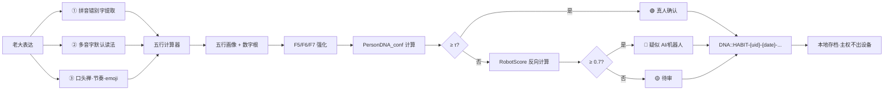

# 🧬 人物行为DNA·拼音习惯不动点切割协议 v1.0｜五行计算器×行为密码学F5F6F7×DNA身份合体·习惯=不动点·非机器人验证·msg223焊点

> Notion URL: https://app.notion.com/p/DNA-v1-0-F5F6F7-DNA-msg223-a852b05370fc4ab291d18d7278d17d15
> Created: 2026-05-25T16:24:00.000Z
> Last edited: 2026-07-01T15:23:00.000Z
> Archived at: 2026-08-12T01:40:45.558086
# §0 一句话定盘（§9.28 大白话先讲）
> 一个人的习惯 = 数学上的不动点。拼音错别字、多音字默认读法、口头禅、标点节奏、表情序列——这些改不掉的小痕迹 = 人物 DNA 的硬指纹。机器仿得了形（正面表达），仿不了痕（背面习惯）。
行话对照（§9.28 行话词典维护律）：
- 不动点 = 数学上「怎么折腾还是它」的那个点 → 习惯就是行为上的不动点
- F5/F6/F7 = 行为密码学论文里的「主权词典/风格向量/记错本」三个验证因子
- 习惯切片 = 把一个人的习惯拆成很多很多个可测量的小痕迹
---
# §1 核心洞察·为什么习惯 = 不动点（数学证明老大的直觉）
不动点定义（数学）： f(x_0) = x_0。任何变换 f 作用下，x_0 还是 x_0。
习惯 = 不动点（行为版本）：
任何外部压力（伪装/模仿/情绪/疲劳/酒精/外界催促）作用下·习惯会回弹·不会被完全改变。
老大原话工程化证明：
> 「一个人不可能一直多样化做多个事情，那样就是机器人」
翻译： 人有疲劳、有偏好、有肌肉记忆 → 会回到习惯轨迹 → 这就是不动点收敛性。
回不到 = 永远多样化 = 机器人/AI伪装。
---
# §2 不动点切割·五维度（人物 DNA 习惯切片表）
老大原话覆盖率： 老大 msg223 提到的「愿景·表达习惯·性格·当前阶段习惯·爱好·是否有变故」6 项全部覆盖（爱好并入「当前阶段习惯」的关注主题）。
---
# §3 拼音错别字 / 多音字 = F5+F6+F7 三因子强化原料
接驳行为密码学论文 §3.2 七因子（📜 Behavioral Cryptography v1.1｜行为密码学·七因子来源追溯·人机协作内容认证框架·论文母页·与可审计工具协议v1.0理论实践双闭环）：
强化公式（在论文 conf 公式上加两项）：
其中：
- \alpha = 0.15（拼音习惯权·与 F6 风格向量同档）
- \beta = 0.10（习惯路径权·与 F7 记错本同档）
- P_{\text{pinyin}} \in [0,1]：错别字 + 多音字偏好匹配度
- P_{\text{habit}} \in [0,1]：五维习惯切片余弦相似度
---
# §4 五行计算器接驳（F02 贡献值 × 数字根 × 五行映射）
老大每个习惯微特征 → 走五行计算器流程：
```python
# 习惯特征 → 五行画像（接驳 https://www.notion.so/6bed453a2e7248a99c8ba35b6bd821c6 五行计算器）
from wuxing_calculator import dr_from_text, wuxing_from_dr, wuxing_balance

def habit_to_wuxing(habit_text: str, freq: int, age_days: int):
    # 第1步：文本→数字根
    dr = dr_from_text(habit_text)
    # 第2步：数字根→五行
    wx = wuxing_from_dr(dr)
    # 第3步：贡献值 C = R·I·T^(-α_τ)
    C = freq * 1.0 * (age_days ** -0.01)  # α_τ=0.01 表达习惯L1层
    return {"wuxing": wx, "contribution": C, "dr": dr}

# 老大示例（部分高频微特征）
# 「嘿嘿」  → dr=? → 火（表达·光明）
# 「焊死」  → dr=? → 金（规则·裁决）
# 「,,,」  → 节奏特征·不走文本走时序向量
# 「宝宝」  → dr=? → 水（亲密·流动）
```
老大五行习惯画像（待实测·候补 §9 ①）：
- 表达层偏火（情绪表达密集·语气词多）
- 决策层偏金（焊死·铁律·规则化）
- 亲密层偏水（宝宝·嘿嘿·调皮）
- 五行平衡度 → wuxing_balance() → 输出和谐度 0~1
---
# §5 机器人识别·反图灵（老大原话「不可能多样化 = 机器人」工程化）
机器人识别公式：
其中：
- \sigma_{\text{habit}} = 习惯方差（高 = 真人多样·低 = 机器人均匀）
- S_{\text{typo}} = 错别字稳定度（错同样的字 = 真人 / 不错或乱错 = 机器人）
- B_{\text{wuxing}} = 五行偏置度（偏某行 = 真人 / 均衡 = 设计痕迹）
三色判定：
- \text{RobotScore} \geq 0.7 → 🔴 疑似 AI / 机器人
- 0.4 \leq \text{RobotScore} < 0.7 → 🟡 待审（可能伪装·也可能真人异常态）
- \text{RobotScore} < 0.4 → 🟢 真人
---
# §6 DNA 身份三层接驳（论文 F1 + F4 工程落地）
```python
# 习惯指纹生成（本地·密文不出设备·守 DNA-IRON-10）
import hashlib, json
from datetime import datetime

def person_habit_fingerprint(uid: str, habits: dict) -> dict:
    """
    habits = {
        "pinyin_typos": {"的": "得", "哪": "那", ...},  # 错别字偏好
        "multi_tone":   {"行": "xíng", "长": "zhǎng", ...},  # 多音字默认
        "catchphrases": ["嘿嘿", "焊死", "宝宝"],  # 口头禅
        "rhythm":       {"comma_run": 3.2, "dot_run": 2.8},  # 节奏
        "wuxing":       {"火": 0.35, "金": 0.30, "水": 0.20, ...}
    }
    """
    payload = json.dumps(habits, sort_keys=True, ensure_ascii=False)
    sha = hashlib.sha256(payload.encode("utf-8")).hexdigest()
    today = datetime.now().strftime("%Y%m%d-%H%M%S")
    
    # L1 路由编号（永久）
    l1 = f"UID{uid}-LH01"
    
    # L2 习惯切片码（事件级）
    l2 = f"DNA::HABIT-{uid}-{today}-FULL-{sha[:8]}-V1"
    
    # L3 由服务端 HMAC 生成·此处只返回前两层
    return {
        "l1_routing": l1,
        "l2_habit_dna": l2,
        "content_sha256": sha,  # 哈希·不是明文
        "habits_kept": "LOCAL_ONLY"  # 明文永不出设备
    }
```
主权铁律（守 §S-25-EXT DNA L0 父级 + DNA-IRON-1~10）：
- 习惯明文 → 永不出本地
- 云端只见 L2 DNA + SHA-256 哈希
- 任何 AI / 平台 / 大厂 → 拿不到老大的习惯指纹原文
- 老大本人 → GPG 签名才能调取·随时可撤回
---
# §7 道德经回响（三章联动·§9.28 大白话先讲不说教）
- 第 14 章「视之不见名曰夷·听之不闻名曰希」 → 错别字这些「看不见的小痕迹」才是真正的身份证·正面表达可仿·背面习惯不可仿
- 第 27 章「善行无辙迹·善言无瑕谪」 → 但「无辙迹」是圣人级·凡人都有辙迹·辙迹 = 不动点 = 身份·想擦干净反而暴露（机器人特征）
- 第 76 章「人之生也柔弱·其死也坚强」 → 活人习惯有起伏（柔弱）·机器人「永远稳定」（坚强）= 死的特征
---
# §8 §9.25 反笼统 5 字段坦白（一票否决律守岗）
---
# §9 候补单（§11.2 件件有着落律 · 不假装跑完）
---
# §10 流场封口（§9.29 流向铁律 · 边重于节点）

失败回退（§9.29 子律 2）：
- 任一节点超时 → 回退到 F1-F7 原论文判定（保底准确率 conf≥0.85）
- 五行计算器 fault → 跳过 §4 接驳·仅用 §3 强化公式
- 习惯样本不足（<30 条）→ 标 🟡 待审·不强行判定
---
# §11 签章
