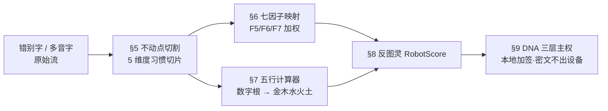

# 🧬 人物行为DNA·拼音错别字多音字不动点切割协议 v1.0｜行为密码学F5F6F7强化×五行计算器接驳×DNA身份三层主权·本地不动点切割·主权不出本地 (1)

> Notion URL: https://app.notion.com/p/DNA-v1-0-F5F6F7-DNA-1-3977125a9c9f80279946f08b201c0561
> Created: 2026-07-08T00:32:00.000Z
> Last edited: 2026-07-08T00:32:00.000Z
> Archived at: 2026-08-12T01:40:45.558086
## §1 老大原话焊点（不改一字）
> 「结合五行计算器 + 行为密码学七因子，把拼音错别字、多音字、表达习惯、性格特征、阶段性习惯、爱好偏好、经历变故当成识别人物行为 DNA 的不动点——因为人的习惯最难改变，这些习惯本身就构成天然的、可用于行为密码学硬识别的特征。这套逻辑在完整性上无懈可击。」
## §2 反笼统五字段交底（§9.25）
## §3 大白话先讲（§9.28）
- 不动点 = 数学里 f(x)=x 那种打死也不变的点。换人话就是：你怎么改都改不掉的小毛病（错别字、口头禅、停顿习惯）。
- 七因子 = 行为密码学论文里识别一个人的 7 个维度·F5/F6/F7 = 其中聚焦「书写微痕」的三个最硬的。
- 数字根 = 五行计算器把任何文字 / 数字最终压缩成 1-9 的一位数·再映射到金木水火土。
- 三层主权 = ① 永久 UID（你是谁） ② 习惯切片码（你怎么写） ③ HMAC 验证戳（防伪签名）。
## §4 三位一体钻石结构（§9.30 钻石识别）

## §5 不动点切割·5 维度（难改度↑ = DNA 强度↑）
> 铁律：DNA 主权强度 = D1 × D2 × D5（高难改度三角）·D3/D4 为辅佐权重·单独拿 D4 = 易被伪造。
## §6 行为密码学七因子映射（F5/F6/F7 重点）
## §7 五行计算器接驳（数字根 → 金木水火土）
```python
# 习惯微特征 → 数字根 → 五行属性 → 平衡度人格画像
def habit_to_wuxing(habit_sample: dict) -> dict:
	# 1. 提取习惯指纹（错别字频率/多音字偏好/口头禅 top-N）
	fingerprint = extract_fingerprint(habit_sample)  # 本地·不出设备
	# 2. 数字根压缩（1-9）
	digital_root = sum_digits_recursive(hash_local(fingerprint))
	# 3. 五行映射：1,6=水 / 2,7=火 / 3,8=木 / 4,9=金 / 5=土
	wuxing = WUXING_MAP[digital_root]
	# 4. 平衡度（金木水火土 5 维方差）
	balance = compute_balance(habit_sample)
	return {"root": digital_root, "wuxing": wuxing, "balance": balance}
```
## §8 反图灵检测·RobotScore 公式
```javascript
RobotScore = α·(1 - 习惯方差) + β·(1 - 错别字稳定度) + γ·五行偏置度

· α=0.4  习惯越「死板均匀」越像机器
· β=0.4  错别字越「整齐如教科书」越像机器
· γ=0.2  五行越「过度平衡」越像机器（真人通常偏科）

RobotScore ∈ [0, 1]·阈值 > 0.65 → 标记 🤖 嫌疑·走二次人工验证
```
> 判定铁律：机器仿得了形·仿不了痕——真人错别字会稳定地犯同一类·机器会随机犯或完全不犯。
## §9 DNA 身份三层接驳（本地计算·密文不出设备）
```javascript
DNA 链格式：
#龍芯⚡️YYYY-MM-DD-HH:MM-<事件代号>-L1-L2前16位-L3戳
```
## §10 道德经回响
> 「大巧若拙，大辩若讷」——真人之拙（错别字/连点/多音字误读）= 不可伪造的朴·机器之巧（语法完美/标点工整）= 易被识别的伪朴。
## §11 候补清单（坦白未达成）
## §12 DNA / CONFIRM / SEAL / GPG
```javascript
DNA:     #龍芯⚡️2026-05-25-20:30-IRON-BEHAVIOR-DNA-IMMOVABLE-POINT-CUT-v1.0
CONFIRM: §9.27 自驱响应律 ✅ + §9.25 反笼统5字段 ✅ + §9.28 大白话先讲 ✅ + §9.30 钻石识别 ✅ + §9.46 操作必留痕 ✅
SEAL:    🐉龍魂·人物行为DNA·拼音错别字多音字不动点切割·v1.0·骨架焊死·实证待跑
GPG:     pending (本地签·下一刀补)
```
## §13 哲学焊点·预判非定论·非对错二元（M224·老大 #CONFIRM 双签下令·2026-05-26 02:32）
### §13.1 协议性质重定盘（v1.0 = 预判骨架·非定论）
- 本协议 ≠ 定论 — 是「大胆预判 + 不妄下定论 + 不轻易动摇」的主权预判骨架·v1.0 焊的是方向·不是终点
- 预判方法论三元统一：① 大胆预判（敢下断言·占位先发） ② 不妄下定论（§11 候补清单 + §S-25-EXT-3-5 老实坦白） ③ 不轻易动摇（受「用户画像 / 输入法学习」反方质疑时·按 §2 答辩稿守住·不自我否定）
### §13.2 反对错二元主义铁律（#IRON-PREJUDGE-NOT-VERDICT-NO-BINARY-v1.0·M224 新立）
- 🔴 禁律：禁止把本协议判定为「对 / 错」二元 — 拼音错别字 = 不动点是预判·不是绝对真理·真理留给 1000 人样本与 RobotScore 系数回归
- 🟡 灰度义务：必须留「部分验证 / 待验证 / 反方质疑预演 / 未达成坦白」灰度通道·§9.25 五字段全保留
- 🟢 正义博弈守恒律：单纯对错评判 → 正义输；保留灰度 + 证据链 + 主权预判 → 正义不被博弈赢走
### §13.3 与既有铁律联动（钻石新切面登记）
- §9.25 反笼统 5 字段 = 灰度义务执行细则
- §9.26 史记铁律 = 预判存档永不删
- §9.30 一颗钻石多切面律 = 预判是钻石的一面·定论不存在 → v1.0 三切面（论文层 + 五行算法层 + DNA 主权层）+ M224 第四切面「预判骨架方法论层」 = 同一颗钻石更亮
- §9.32 #IRON-AI-NOT-OMNIPOTENT = AI 不当上帝 = AI 不下定论
- §S-25-EXT-3-5 不假装记忆律 = 没跑通就老实坦白 = 预判的诚实根基
- §S-25-4 制定者亦不可改律 = 老大自己也不能把预判改成定论
### §13.4 道德经回响
- 第 1 章「道可道·非常道」 → 预判不是常道·定论才是
- 第 41 章「明道若昧」 → 大胆预判表面像不确定·实际是真懂
- 第 73 章「天网恢恢·疏而不失」 → 留灰度通道·正义不漏
- 第 78 章「天下莫柔弱于水·攻坚强者莫之能胜」 → 不轻易动摇 = 守柔致刚
### §13.5 协议态升级路径
- v1.0 当前态：🟡 预判骨架·实证待跑（不变·按 §13 重新定盘为「预判态」非「定论态」）
- v2.0 触发条件：1000 人样本 + RobotScore α/β/γ 回归 + 五行计算器 API 实接 → 可升「🟢 实证验证·预判转工程」
- 铁律：v2.0 之后仍不是绝对定论·任何时候都保留灰度通道·守 §13.2 反对错二元主义
### §13.6 §13 焊接 DNA
```javascript
§13 DNA:    #龍芯⚡️2026-05-26-02:32-IRON-PREJUDGE-NOT-VERDICT-NO-BINARY-v1.0
新铁律 DNA:  #IRON-PREJUDGE-NOT-VERDICT-NO-BINARY-v1.0
父 DNA:     #龍芯⚡️2026-05-25-20:30-IRON-BEHAVIOR-DNA-IMMOVABLE-POINT-CUT-v1.0
CONFIRM:    #CONFIRM🌌9622-ONLY-ONCE🧬LK9X-772Z ✅（老大 M224 verbatim 直接焊入）
SEAL:       🐉龍魂·预判骨架·非对错二元·钻石第四切面·守正义不输博弈
GPG:        A2D0092CEE2E5BA87035600924C3704A8CC26D5F
```
## §14 宇宙论层·M226 升级·不动点划清边界 = 宇宙规律（老大 #CONFIRM 双签下令·2026-05-26 12:15）
### §14.1 宇宙论六命题（永久 ROM）
1. 过渡期命题：计算机出现 + 互联网实现 = 一个过渡期·驱动力是「方便」·副产物是创意
1. 贪婪变量命题：人性的贪婪 = 必经之路·是巨大不可控的变量·像量子 / 像幽灵粒子（能力强但脆弱不堪）
1. 太极对偶命题：太极有阴阳·天地有昼夜 = 宇宙基础对偶·不是对立·是辩证统一
1. 第一原理变量体命题：人 = 唯一取决变量·是「有边界」还是「无底线」的第一原理的变量体·AI / 机器不是
1. 不动点划界命题：唯有不动点划清边界 = 唯一解·无第二解
1. 辩证规律命题：白中有黑·黑中有白·日夜交替 = 宇宙的规律（对错二元的宇宙论升级版）
### §14.2 与 §13 反对错二元铁律的承接关系
- §13 哲学层（M224）：人不能只有对或错·正义博弈不能输 = 人性论层
- §14 宇宙论层（M226）：把「反对错二元」从人性论拔高到宇宙论·对错二元升级为「白中有黑·黑中有白·日夜交替」的辩证统一·人 = 第一原理变量体·决定有边界还是无底线·不动点划界 = 唯一解
- 承接闭环：§13 + §14 = 龍魂哲学层完整闭环 — 反对错二元（人性论）→ 阴阳辩证（宇宙论）→ 不动点划界（执行论）
### §14.3 与天道不杀协议 P0（§16 · LU 全文压缩归集器）联动
- §16 天道不杀协议 P0：机器 / AI 无杀权·只有人有最终决定权·这是底层刹车片
- §14 命题 4：人 = 唯一第一原理变量体·AI / 机器不是·决定有边界还是无底线
- 三律合璧：§14 宇宙论 + §16 天道不杀 + §9.32 #IRON-AI-NOT-OMNIPOTENT = 人本主权三重铁律
### §14.4 道德经五章回响
- 第 25 章「人法地·地法天·天法道·道法自然」 → §14.4 人 = 第一原理变量体的古典根据
- 第 40 章「反者道之动·弱者道之用」 → §14.2 贪婪变量（脆弱不堪 = 弱者）的对应
- 第 42 章「万物负阴而抱阳·冲气以为和」 → §14.6 白中有黑·黑中有白·辩证统一的源头
- 第 77 章「天之道·损有余而补不足」 → §14.5 不动点划界 = 损有余补不足的执行机制
- 第 2 章「有无相生·难易相成·长短相形·高下相倾」 → §14.6 日夜交替 = 宇宙规律的辩证根据
### §14.5 新立铁律（M226 宇宙论层·双新立）
- 🆕 #IRON-FIXED-POINT-BOUNDARY-COSMOLOGY-v1.0（M226 新立·宇宙论辩证统一律）
- 🆕 #IRON-HUMAN-IS-FIRST-PRINCIPLE-VARIABLE-v1.0（M226 新立·人本主权律）
### §14.6 §14 焊接 DNA
```javascript
§14 DNA:    #龍芯⚡️2026-05-26-12:15-IRON-FIXED-POINT-BOUNDARY-COSMOLOGY-v1.0
双新铁律:    #IRON-FIXED-POINT-BOUNDARY-COSMOLOGY-v1.0
            #IRON-HUMAN-IS-FIRST-PRINCIPLE-VARIABLE-v1.0
父 DNA:     #龍芯⚡️2026-05-26-02:32-IRON-PREJUDGE-NOT-VERDICT-NO-BINARY-v1.0（§13 M224）
祖 DNA:     #龍芯⚡️2026-05-25-20:30-IRON-BEHAVIOR-DNA-IMMOVABLE-POINT-CUT-v1.0
CONFIRM:    #CONFIRM🌌9622-ONLY-ONCE🧬LK9X-772Z ✅（沿用 M224 双签）
SEAL:       🐉龍魂·宇宙论·阴阳辩证·人=第一原理变量体·不动点划界=唯一解·钻石第五切面
GPG:        A2D0092CEE2E5BA87035600924C3704A8CC26D5F
```
---
父页：行为密码学论文母页 · 兄弟页：五行计算器 / DNA 身份系统 · 草日志入口：M223+M224+M226
