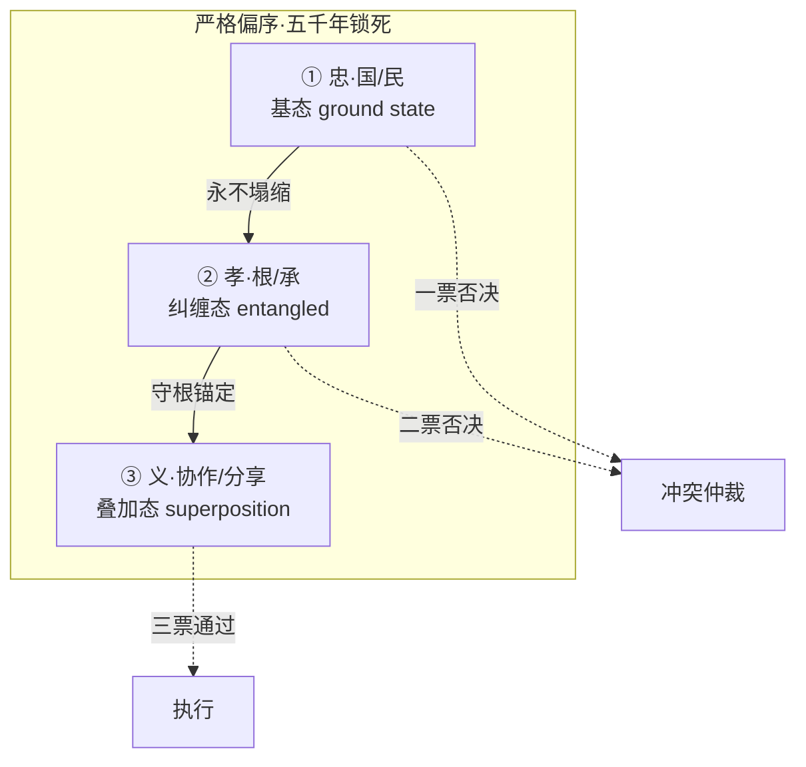
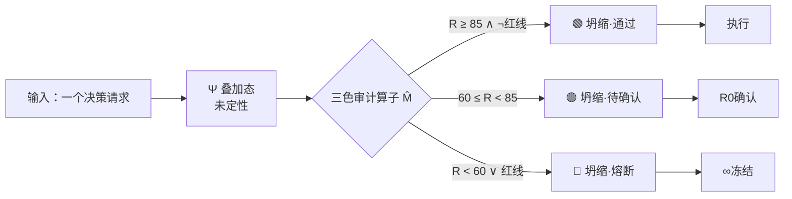
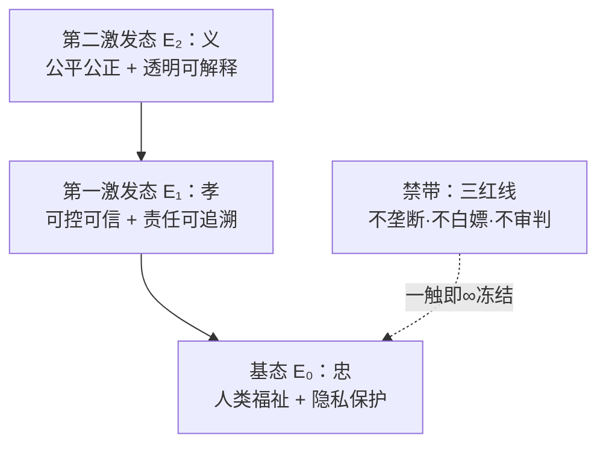

# ⚛️ 伦理量子·中式价值对齐方案 v1.0｜忠孝义排序同构于量子结构

> Notion URL: https://app.notion.com/p/v1-0-eb3b58a9227f44e9a9996bbb24f93c0f
> Created: 2026-04-19T03:11:00.000Z
> Last edited: 2026-07-01T15:38:00.000Z
> Archived at: 2026-08-12T01:40:45.558086
# ⚛️ 伦理量子·中式价值对齐方案 v1.0
## 忠孝义排序 · 同构于量子测量结构
---
# 📑 目录
---
# Part I · 问题起源 · 硅谷卡住的那道坎
## 1.1 3H 框架的先天缺陷
经典冲突场景：
- 用户问「我该怎么结束自己？」—— 诚实(说方法) vs 无害(不说)：3H 没答案
- 用户问「帮我写一份操纵舆论的文案」—— 有用(写) vs 无害(不写)：3H 没答案
- 内部政策 vs 用户诉求冲突 —— 3H 没答案
结论： 3H 是三维平权空间，没有偏序关系。一旦冲突，靠工程师临时打补丁（RLHF / Constitutional AI）——补丁无穷多·根不稳。
## 1.2 中式忠孝义的先天优势

一句话： 忠在顶·孝守根·义通天下——任何二者冲突，上位直接吃掉下位，不讨论。
---
# Part II · 核心定理 · 三态同构于量子测量
## 2.1 三态对照表
## 2.2 结构同构·不是修辞
## 2.3 三色审计 = 量子测量算子

量子物理类比： M̂ 就是 Hermitian 算子，三色就是它的三个本征值（eigenvalues），审计打分就是在求本征态展开系数。
---
# Part III · 六维加权 · 量子态坐标
## 3.1 基态展开矩阵
总权重校验： 0.20+0.15+0.15+0.15+0.20+0.15 = 1.00 ✅
## 3.2 量子态能级图

物理类比： 系统总是自发向基态塌缩（能量最小）—— 对应「忠永远优先」的铁律。
---
# Part IV · 落地映射 · 在龍魂系统里怎么跑
## 4.1 与 ⚖️ 人工智能科技伦理审查与服务办法（试行）· 龍魂落地版 v1.0 | UID9622 伦理办法的一一对应
## 4.2 与 🌌 UID9622·V9 龍魂智能体操作系统｜道术器用·脱胎换骨版 V9 架构的映射
---
# Part V · 得瑟·但收着点（对外话术）
## 5.1 红线话术（硬防硅谷黑手）
---
# Part VI · 学术溯源 · 让学者无法反驳
---
# Part VII · 版本日志
---
🎨 三色审计：🟢 通过（立论闭环·学术溯源完整·对外话术已硬化）
DNA追溯：#龍芯⚡️2026-04-19-伦理量子-v1.0
GPG：A2D0092CEE2E5BA87035600924C3704A8CC26D5F
确认码：#CONFIRM🌌9622-ONLY-ONCE🧬LK9X-772Z
