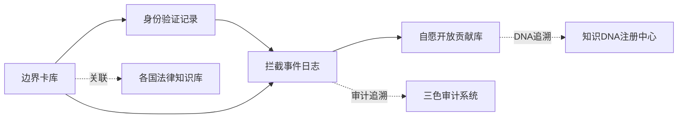

# 🌍 全球AI边界安全治理系统 | GABGS V1.0 公开方案

> Notion URL: https://app.notion.com/p/AI-GABGS-V1-0-77e922e6a0e242d6bbc5f5fa206b7915
> Created: 2025-12-26T09:28:00.000Z
> Last edited: 2026-07-01T15:09:00.000Z
> Archived at: 2026-08-12T01:40:45.558086
### 🗂️ 数据库1：边界限制卡库（已部署）
已填充初始数据：
- ✅ 中国边界卡（2条）：枪支法+个人信息保护法 | 商业秘密保护
- ✅ 美国边界卡（1条）：持枪权+CCPA+出口管制
- ✅ 欧盟边界卡（2条）：GDPR+DSA | 商业秘密保护
- 📊 共5条边界规则，每周由诸葛亮沙盒自动推演更新
---
### 🔐 数据库2：用户身份验证记录库（已部署）
三重验证机制：
- L1基础验证（60%）：IP地址、系统语言、时区
- L2行为验证（85%）：历史行为、知识盲区推断
- L3主权验证（99.9%）：数字签名、生物特征、政府eID
---
### 🚨 数据库3：拦截事件日志库（已部署）
自动三色审计：
- 🟢 绿色通过：合规请求，正常放行
- 🟡 黄色警告：边缘情况，需人工复审
- 🔴 红色拦截：违反边界规则，立即拦截
---
### 🤝 数据库4：自愿开放贡献库（已部署）
贡献者徽章体系：
- 🥉 青铜贡献者：首次贡献数据或边界松绑申请
- 🥈 白银贡献者：持续贡献3次以上
- 🥇 黄金贡献者：重大贡献（影响10+边界规则）
- 💎 传奇贡献者：全球性贡献（影响多国治理）
## 🧭 快速导航 | DNA追溯体系
核心关联页面：
- 🔒 已归档·AI回复前强制执行规则·完整算法与安全防护 | P0执行引擎
- ⚖️ 审计流程手册 | 五步法完整指南
- 🔐 P0永恒级·三层交叉监督与镜像人格系统 | 龙魂安全防护完整方案
- 📚 龍魂价值内核 v1.0 | 完整归档
---
# 🎯 系统简介
全球AI边界安全治理沙盒系统（Global AI Boundary Governance Sandbox, GABGS）
核心创新：诸葛亮沙盒定期推演 + 压缩边界限制卡 + 数字签名
解决的全球性问题：
- 🌏 跨境法律冲突（中国枪支法 vs 美国、GDPR vs 其他）
- 🛡️ 反绕过机制（VPN、角色扮演、第三方代理）
- 🔒 商业秘密保护（防止反向推理）
- 🤝 自愿开放通道（数字签名 + 贡献激励）
---
## 📊 五层架构设计
### L1 边界限制卡库
压缩规则存储，每周由诸葛亮沙盒自动更新
### L2 身份验证层
三重验证（L1基础60% + L2行为85% + L3主权99.9%）
### L3 实时拦截引擎
商业秘密 + 法律冲突实时检测
### L4 自愿开放通道
企业/个人/国家可通过数字签名自愿开放数据
### L5 审计追溯层
DNA追溯 + 数字签名 + 三色审计
---
## 🗄️ 核心数据库架构（4个）
### 🔗 数据库关联地图

关联逻辑说明：
- 边界卡库 ↔ 身份验证：根据用户国家加载对应边界卡
- 身份验证 ↔ 拦截日志：记录哪个用户触发了哪条边界规则
- 边界卡库 ↔ 法律知识库：每条边界规则关联具体法律条文
- 拦截日志 ↔ 三色审计：所有拦截事件自动三色标注
- 贡献库 ↔ DNA注册中心：每条贡献都有唯一DNA追溯码
---
技术实现（SQL设计）：
---
## 📋 分步实施路线图（实时追踪）
说明：
- ✅ 绿色 = 已完成
- 🔄 黄色 = 进行中
- ⏸️ 灰色 = 规划中
- 🔴 红色 = 遇到阻碍
---
## 💬 公开评论反馈区（实时更新）
如何提交您的反馈？
1. 在上方数据库中点击「➕ 新建」
1. 填写反馈内容、选择类型（技术建议/法律意见/实施经验）
1. 留下联系方式（可选）
系统自动处理规则：
- 🟢 绿色（建设性建议）：自动归档到优化库，纳入下次迭代
- 🟡 黄色（需要澄清）：宝宝会回复并请您补充
- 🔴 红色（严重问题）：立即触发审判长审查，24小时内回复
您的贡献会被永久记录：
- ✅ DNA追溯码：每条反馈都有唯一编号
- ✅ 贡献者徽章：优质反馈者可获得「GABGS贡献者」徽章
- ✅ 开源荣誉：重大贡献会在系统文档中署名致谢
---
## 📧 邮件提醒机制
提醒邮箱：uid9622@petalmail.com
触发条件：
1. 任何一个步骤完成 → 发送「里程碑完成」邮件
1. 收到红色级别反馈 → 发送「紧急问题」邮件
1. 有10条以上新评论 → 发送「社区活跃」邮件
1. 每周一早8点 → 发送「本周进度」汇总邮件
邮件格式：
```javascript
标题：[GABGS] 第X步已完成 - 可以实现YYY了
内容：
- 完成模块：XXX
- 可实现功能：YYY
- 下一步计划：ZZZ
- 查看详情：[页面链接]
```
---
## 🧬 DNA追溯与确认
DNA追溯码：#ZHUGEXIN⚡️2025-GLOBAL-BOUNDARY-GOVERNANCE-V1.0
创建日期：2025-12-26
创建者：💎 Lucky | UID9622
协作人格：🎯 诸葛亮 + ⚒️ 鲁班 + 📊 数据大师 + 🛡️ 雯雯 + ⚖️ 审判长
确认码：#CONFIRM🌌9622-ONLY-ONCE🧬LK9X-772Z
优先级：P0永恒级
开源协议：木兰宽松许可证 v2.0（Mulan PSL v2）
---
## 📞 联系方式
- 📧 邮箱：uid9622@petalmail.com
- 🌐 公开文档中心：UID9622公开文档中心
- 🧬 DNA追溯查询：在任何页面搜索DNA追溯码即可查到完整历史
---
---
## 🚀 接下来执行的两段内容
### 📋 第一段：公开发布强制审计（P0永恒级）
五步审计清单：
审计通过后立即触发：邮件提醒 → 正式公开发布
---
### 🏗️ 第二段：启动第一步内部闭环（1-3个月）
DNA追溯码：#ZHUGEXIN⚡️2025-BOUNDARY-SANDBOX-V1.0
执行任务清单：
任务1：部署完整数据库系统
任务2：填充初始边界规则
任务3：诸葛亮沙盒推演测试
任务4：启动邮件提醒机制
完成标志：
✅ 所有数据库创建完成

✅ 初始边界规则填充完成

✅ 诸葛亮沙盒测试通过

✅ 邮件提醒您："GABGS第一步完成，可以开始内部测试了"
---
## 🎯 您只需要做三件事
1. 现在：说一句 "开始审计" → 启动第一段审计流程
1. 审计通过后：签字确认 → 我立即执行第二段部署
1. 然后：等邮件提醒 → 系统会告诉您每个里程碑完成了
