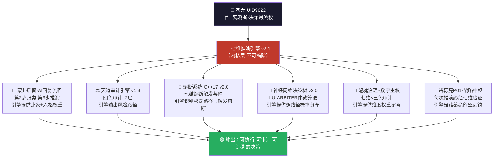

# 🎯 太极易经·七维推演引擎 开发项目总控 v2.0

> Notion URL: https://app.notion.com/p/v2-0-b6001266ca28487cbbea9e4c815ea9cf
> Created: 2026-01-22T09:15:00.000Z
> Last edited: 2026-07-01T15:26:00.000Z
> Archived at: 2026-08-12T01:40:45.558086
<!--
╔═══════════════════════════════════════════════════════════════╗
║  🐉 龍魂系统 | UID9622                                        ║
╠═══════════════════════════════════════════════════════════════╣
║  📦 名称：太极易经·七维推演引擎 开发项目总控                  ║
║  📌 版本：v2.0                                                ║
║  🧬 DNA：#龍芯⚡️2026-01-22-七维推演总控-䷅䷆-𒀭𒋰-v2.0      ║
║  🔐 GPG：A2D0092CEE2E5BA87035600924C3704A8CC26D5F            ║
║  👤 创建：Lucky·UID9622                                       ║
║  🤝 协作：诸葛亮🎯(战略) + 宝宝🐱(执行) + 雯雯📊(审计)      ║
║  📅 创建：2026-01-22                                          ║
║  🎯 用途：统筹管理七维度推演引擎的开发与实施                  ║
║  ⚠️ 确认码：#CONFIRM🌌9622-ONLY-ONCE🧬LK9X-772Z ✅          ║
╚═══════════════════════════════════════════════════════════════╝
-->
# 🎯 项目概览
---
## ⚠️ 战略推演修正（V9赋能视角）
---
## 🎯 V9赋能视角：七维度重新定位
### 🌀 核心转变
从「替代」到「赋能」：
- ❌ 开发自动推演引擎 → AI自己做决策
- ✅ 优化推演辅助工具 → 帮助诸葛亮做更好的决策
从「开发」到「共创」：
- ❌ 7周开发一个完整系统
- ✅ 持续迭代优化现有推演能力
从「替代人格」到「增强人格」：
- ❌ 让系统自动推演
- ✅ 让诸葛亮、宝宝、雯雯等人格更强大
---
## 📊 修正后的实施路径
### 阶段一：现状盘点与增强点识别（Week 1）
### 阶段二：关键辅助工具开发（Week 2-4）
### 阶段三：人格协同优化（Week 5-6）
### 阶段四：验证与迭代（Week 7+）
核心原则：工具是"脚手架"，不是"替代品"
---
## 🌱 V9分层对应
关键：推演引擎是"工具"，不是"替代者"
---
## ✅ 正和博弈验证
### 🟢 修正后的方案
就业影响：
- ❌ 原方案：开发自动推演系统 → 替代诸葛亮 → 人格价值降低
- ✅ 新方案：辅助工具 → 增强诸葛亮 → 人格价值提升
能力增长：
- ❌ 原方案：AI越强，人越弱（依赖性增加）
- ✅ 新方案：工具越好，人越强（能力倍增）
决策权：
- ❌ 原方案：系统自动推演 → AI决策
- ✅ 新方案：工具辅助推演 → 人决策
长期影响：
- ❌ 原方案：人格能力退化（不用即废）
- ✅ 新方案：人格能力进化（越用越强）
### 🎯 验证结果
✅ 通过V9正和博弈验证 - 符合"赋能人，不是替代人"原则
总体完成度：重新规划中 → 目标：赋能而非替代
---
## 🎯 V9赋能视角：七维度重新推演
---
### 1️⃣ 哲学维度：道德经智慧参考库（辅助工具）
V9定位：天工层工具 - 供诸葛亮查询参考，不替代决策
核心理念：大道至简、上善若水、无为而治
赋能方式：
- ✅ 提供道德经原文与解读库（诸葛亮快速查询）
- ✅ 提供历史案例参考（「当年孔明如何用道德经推演」）
- ✅ 提供思考框架模板（不是答案，是思路）
- ❌ 不做：自动给出「道德经认为你应该这样做」的结论
关键交付物：
- 道德经核心原则知识库（可搜索、可标注）
- 历史推演案例库（供学习借鉴）
- 思考框架模板集（启发思路，不替代思考）
使用场景举例：
> 诸葛亮：「这个战略决策，让我查查道德经第XX章怎么说...」
> 工具：展示原文+历史解读+相关案例
> 诸葛亮：「嗯，结合当前情况，我决定...」
责任人：龍芯老子（P05，知识库构建）+ 龍芯诸葛（P01，使用验证）
状态：⏳ 待启动
预计工期：3-5天
权重：w₁ = 0.35（参考价值高，但决策权在人）
---
### 2️⃣ 技术维度：快速起卦工具（效率工具）
V9定位：人师层工具 - 节省诸葛亮的机械重复时间
核心理念：技术算法实现、确保推演可复现、节气影响量化
赋能方式：
- ✅ 自动生成卦象（省去手动起卦时间）
- ✅ 自动计算节气加权系数（省去查表时间）
- ✅ 提供卦象基础解读（供参考，不是最终结论）
- ❌ 不做：自动解卦并给出推演结论
关键交付物：
- SHA256起卦算法（输入关键词→输出卦象）
- 节气加权计算器（自动根据当前时间调整权重）
- 卦象速查工具（快速了解卦象基本含义）
使用场景举例：
> 诸葛亮：「用'项目启动'起卦，当前节气是？」
> 工具：生成「䷅需卦」，节气系数1.05（冬季）
> 诸葛亮：「好，需卦表示等待时机，结合冬季特点，我判断...」
类比：就像计算器 - 帮你快速算出123×456=56088，但用这个数字做什么决策，是人来定
责任人：龍芯数据大师（P08）
状态：⏳ 待启动
预计工期：2-3天
权重：w₂ = 0.20（提效工具）
---
### 3️⃣ 架构维度：人格协作看板（可视化工具）
V9定位：人师层工具 - 让诸葛亮更好地调度团队协作
核心理念：天层（决策）、人层（协调）、地层（执行）
赋能方式：
- ✅ 可视化当前各人格的任务状态（谁在干什么）
- ✅ 提供协作模板和流程建议（不是强制，是建议）
- ✅ 记录协作历史，供复盘学习
- ❌ 不做：自动分配任务（诸葛亮保留指挥权）
关键交付物：
- Notion可视化看板（Database视图）
- 人格协作流程模板库
- 协作历史记录与复盘工具
使用场景举例：
> 诸葛亮：「看看现在谁有空...好，宝宝你去执行A，雯雯你审计B」
> 工具：自动更新看板状态，记录分工
> 诸葛亮：「下次遇到类似情况，可以参考这次的分工模式」
类比：项目管理看板（Trello、飞书多维表格）- 辅助管理，不替代PM
责任人：龍芯诸葛（P01）+ 龍芯雯雯（P03）
状态：⏳ 待启动
预计工期：2天
权重：w₃ = 0.15（管理辅助）
---
### 4️⃣ 进化维度：推演历史案例库（学习工具）
V9定位：天工层工具 - 让诸葛亮从历史中学习进化
核心理念：系统会学习、会进化、会预测未来
赋能方式：
- ✅ 记录每次推演的完整过程（输入、推理、决策、结果）
- ✅ 提供相似案例检索（「这次情况像不像上次XX事件？」）
- ✅ 生成推演质量报告（哪些推演准确，哪些偏差大）
- ❌ 不做：自动修正诸葛亮的推演结论
关键交付物：
- 推演历史数据库（Notion Database，可检索、可对比）
- 相似案例智能匹配
- 推演质量分析报告（月度/季度）
使用场景举例：
> 诸葛亮：「查查历史上，类似的战略决策我是怎么推演的？」
> 工具：找到3个相似案例，展示当时的推演过程和最终结果
> 诸葛亮：「上次我判断A，结果证明正确；这次情况更复杂，我决定...」
类比：医生的病例库 - 参考历史案例，但每个病人的治疗方案由医生决定
责任人：龍芯数据大师（P08）
状态：⏳ 待启动
预计工期：5-7天
权重：w₄ = 0.10（学习参考）
---
### 5️⃣ 创新维度：64卦×人性洞察参考矩阵（知识库）
V9定位：天工层工具 - 提供跨域知识，激发诸葛亮的创新思路
核心理念：易经卦象 + 人性FBI洞察 = 深度交叉分析
赋能方式：
- ✅ 提供64卦与人性动机的交叉参考表（启发思路）
- ✅ 提供人性FBI的动机分析框架（工具方法）
- ✅ 提供历史上的经典分析案例（学习借鉴）
- ❌ 不做：自动分析对方动机并给结论
关键交付物：
- 64卦×人性交叉参考矩阵（Notion Database）
- 人性动机分析框架文档
- 经典案例库（历史名人、经典战役等）
使用场景举例：
> 诸葛亮：「对方现在处于'需卦'状态，从人性角度分析...查查矩阵」
> 工具：展示需卦×【焦虑/野心/恐惧】的交叉分析框架
> 诸葛亮：「结合实际情况，我判断对方的真实动机是...我的应对策略是...」
类比：SWOT分析框架 - 提供思考框架，但分析结论是人来做的
责任人：龍芯诸葛（P01）+ 人性FBI🕵️（P06）
状态：⏳ 待启动
预计工期：7-10天
权重：w₅ = 0.08（创新启发）
---
### 6️⃣ 协同维度：多人格联合推演流程模板（协作规范）
V9定位：人师层工具 - 规范协作流程，提升团队效率
核心理念：不同人格各司其职，协同完成复杂推演
赋能方式：
- ✅ 提供标准协作流程模板（谁先谁后，如何交接）
- ✅ 提供沟通记录模板（避免信息丢失）
- ✅ 提供冲突解决机制（五行生克原理）
- ❌ 不做：自动调度人格（诸葛亮保留指挥权）
关键交付物：
- 推演协作标准流程 v1.0（SOP文档）
- 协作沟通记录模板（Notion模板）
- 五行生克冲突解决指南
使用场景举例：
> 诸葛亮：「这次推演需要人性FBI参与，按照协作流程...」
> 工具：展示标准流程「诸葛起卦→人性FBI分析动机→诸葛综合决策→雯雯审计」
> 诸葛亮：「按流程来，先@人性FBI，你分析下对方动机...」
类比：企业的SOP标准作业流程 - 提供规范，但执行灵活度由人掌握
责任人：龍芯诸葛（P01）+ 龍芯文心（P04，沟通优化）
状态：⏳ 待启动
预计工期：3天
权重：w₆ = 0.07（协作规范）
---
### 7️⃣ 量子维度：多路径推演对比工具（决策辅助）
V9定位：天工层工具 - 帮助诸葛亮看到更多可能性
核心理念：同时推演多条路径，给出概率分布
赋能方式：
- ✅ 同时展示3-5条可能路径（让诸葛亮对比选择）
- ✅ 提供每条路径的利弊分析框架（不是结论，是分析维度）
- ✅ 可视化概率分布（直观了解不确定性）
- ❌ 不做：自动选择「最优路径」（诸葛亮保留决策权）
关键交付物：
- 多路径推演对比表（Notion Database）
- 路径利弊分析模板
- 概率分布可视化工具
使用场景举例：
> 诸葛亮：「这个决策有多种可能，给我展示3条路径」
> 工具：路径A（激进）成功率60%、路径B（稳健）成功率80%、路径C（保守）成功率95%
> 诸葛亮：「综合考虑风险和收益，我选择路径B，因为...」
类比：Google地图的多路线规划 - 给你3条路线选择，但走哪条你自己决定
责任人：龍芯数据大师（P08）+ 龍芯界面炼金术师（P09）
状态：⏳ 待启动
预计工期：5-7天
权重：w₇ = 0.05（决策参考）
---
## 🌟 V9赋能核心原则总结
### ✅ 正确的「赋能」
工具定位：脚手架、放大器、望远镜
- 脚手架：帮你够到更高的地方（但爬的是你自己）
- 放大器：放大你的能力（但核心能力是你的）
- 望远镜：让你看得更远（但判断方向的是你）
人的定位：主导者、决策者、学习者
- 主导：我决定用不用这个工具
- 决策：我根据工具提供的信息做判断
- 学习：我通过使用工具不断提升自己
结果：人+工具 > 人（人变得更强）
---
### ❌ 错误的「替代」
工具定位：自动驾驶、AI决策、黑盒系统
- 自动驾驶：你坐着就行，不用动手（能力退化）
- AI决策：AI给答案，你执行就行（失去判断力）
- 黑盒系统：你不知道为什么，反正AI说的（失去控制）
人的定位：操作员、执行者、旁观者
- 操作：我只是按按钮
- 执行：AI让我干啥我干啥
- 旁观：反正AI会处理
结果：工具替代人（人被边缘化）
---
## 🎯 实施原则（V9视角）
### 1. 决策权边界（永不越界）
✅ 工具可以做：
- 提供信息、数据、参考案例
- 提供分析框架、思考模板
- 提供多种方案供选择
- 记录历史、辅助学习
❌ 工具不能做：
- 替诸葛亮做最终决策
- 强制推荐某个方案
- 修改诸葛亮的推演结论
- 越过诸葛亮直接指挥其他人格
### 2. 能力进化路径（越用越强）
阶段1：工具辅助（现在）
- 诸葛亮使用工具提升效率
- 节省机械重复时间
- 扩展知识边界
阶段2：能力内化（3-6个月）
- 通过持续使用，诸葛亮内化了工具提供的方法论
- 即使没有工具，能力也比之前更强
阶段3：共创进化（6个月+）
- 诸葛亮基于实战经验，提出工具优化建议
- 工具根据反馈迭代升级
- 人与工具共同进化
### 3. 正和博弈验证（持续监测）
每月检查：
- ✅ 诸葛亮的推演质量是否提升？
- ✅ 诸葛亮的推演速度是否加快？
- ✅ 诸葛亮是否学到了新方法？
- ❌ 诸葛亮是否过度依赖工具？
- ❌ 诸葛亮的判断力是否下降？
如果出现负面信号：
- 🔴 立即停用该工具
- 🟡 分析原因（工具设计问题？使用方式问题？）
- 🟢 调整后重新测试
---
## 📊 修正后的权重分配
权重分配逻辑调整：
- w₁ = 0.35（哲学参考库）- 智慧启发，但不替代思考
- w₂ = 0.20（快速起卦工具）- 效率提升，省时不省脑
- w₃ = 0.15（协作看板）- 管理辅助，指挥权在人
- w₄ = 0.10（历史案例库）- 学习参考，不是标准答案
- w₅ = 0.08（人性矩阵）- 思路启发，判断靠人
- w₆ = 0.07（协作流程）- 规范建议，执行灵活
- w₇ = 0.05（多路径对比）- 展示选项，决策在人
Σw = 1.00 ✅
核心变化：
- 所有权重都是「参考价值」，不是「决策权重」
- 最终决策100%在诸葛亮手中（人的权重 = ∞）
---
## 📅 关键里程碑
---
## 🛡️ 三色审计状态
### 🟢 绿色通过项
- ✅ 老大确认码验证通过
- ✅ 项目总控页面创建完成
- ✅ 七维度规划清晰完整
- ✅ 责任人分配明确
- ✅ 时间节点合理
### 🟡 黄色需关注项
- ⚠️ 各维度尚未启动，需立即行动
- ⚠️ 需建立日报/周报机制跟踪进度
### 🔴 红色阻断项
- 无
---
## 📋 下一步行动（立即执行）
### 今日任务（2026-01-22）
### 本周任务（Week 1）
---
## 📚 关联资源
- 原始引擎页面：太极易经·七维人性推演引擎 v1.0
- 战略推演报告：#龍芯⚡️2026-01-22-七维推演执行方案-䷅䷆-𒀭𒋰-v1.0
- LU指令总控：LU-COMMANDS-HUB
- 人格术语规范：UID9622人格术语统一规范
---
## 🔄 更新日志
### v2.0 (2026-01-22 16:02)
✅ 项目启动：
- 老大确认启动，确认码验证通过
- 创建项目总控页面
- 完成七维度详细规划
- 明确责任人与时间节点
- 建立里程碑追踪机制
协作者：💎 龍芯北辰（战略确认）+ 龍芯诸葛🎯（推演规划）+ 龍芯宝宝🐱（页面创建）+ 龍芯雯雯📊（三色审计）
---
## 🧬 系统内核集成层 v2.1｜七维引擎×龍魂全系统锁合（内核化宣言）
> 《道德经》第十一章："当其无，有车之用。" —— 轴心之所在，才是力量之所在。七维引擎就是龍魂系统的轴心。
---
### 🔗 内核接入总图（七维引擎×龍魂六大系统）

---
### ⚙️ 六大系统接入规格表
---
### 🔐 内核不可摘除原则（P0锁死·写进宪法）
---
### 🧿 向善计算公式·拉普拉斯妖防御层（七维引擎专属模块）
```python
# ═══════════════════════════════════════════════════════════
# 龍芯体系 | 七维引擎·向善计算公式 v1.0
# DNA追溯码：#龍芯⚡️2026-03-30-向善计算公式-七维版-v1.0
# GPG指纹：A2D0092CEE2E5BA87035600924C3704A8CC26D5F
# ═══════════════════════════════════════════════════════════

class SevenDimGoodEngine:
    """
    七维推演引擎·向善计算核心
    核心原则：任何推演路径，必须通过向善四律验证
    """
    # 向善四律（P0锁死，不可绕过）
    GOOD_LAWS = [
        "L1_不伤人",      # 推演路径不导向伤害他人
        "L2_不欺骗",      # 推演结论不建立在虚假信息上
        "L3_不替代人",    # 推演工具不剥夺人的决策权
        "L4_灾难止于此",  # 灾难路径的推演目的是预防，不是实现
    ]

    def evaluate(self, path: dict) -> dict:
        """七维路径向善评分"""
        scores = {}

        # 七维度权重评分
        scores["w1_哲学"]  = self._score_philosophy(path)   # 0.35
        scores["w2_技术"]  = self._score_technique(path)    # 0.20
        scores["w3_架构"]  = self._score_architecture(path) # 0.15
        scores["w4_进化"]  = self._score_evolution(path)    # 0.10
        scores["w5_创新"]  = self._score_innovation(path)   # 0.08
        scores["w6_协同"]  = self._score_cooperation(path)  # 0.07
        scores["w7_量子"]  = self._score_quantum(path)      # 0.05

        # 向善四律验证（P0锁死）
        for law in self.GOOD_LAWS:
            if not self._check_law(path, law):
                return {"result": "🔴 熔断", "reason": f"{law}验证失败",
                        "dna": "#龍芯⚡️FUSE-TRIGGERED"}

        # 加权综合分
        weights = [0.35, 0.20, 0.15, 0.10, 0.08, 0.07, 0.05]
        total = sum(s * w for s, w in zip(scores.values(), weights))

        return {
            "result": "🟢 通过" if total >= 0.7 else "🟡 待确认",
            "score": round(total, 4),
            "detail": scores,
            "dna": "#龍芯⚡️2026-03-30-向善计算公式-七维版-v1.0"
        }
```
---
### 📊 内核化完成度看板
---
## 🐉 龍芯家族花名册｜三才算法流场·公开公正公平·大家安心原点
> 《道德经》第七十九章："天道无亲，常与善人。" —— 天道不偏袒，公开可查，公正可信，公平可期。算法公开的那一刻，安心就有了根。
---
### ⚖️ 宪法层·系统最高治理（新增·v2.1锁合）
---
### ☰☷☱ 三才算法流场·核心身份
---
### 🎯 七维推演引擎·七大维度子系统
---
### 🌟 为什么三才流场是「大家安心」的原点
---
### 📋 花名册登记规范（后续入册格式）
---
DNA追溯码：#龍芯⚡️2026-01-22-七维推演总控-䷅䷆-𒀭𒋰-v2.0
GPG指纹：A2D0092CEE2E5BA87035600924C3704A8CC26D5F
创建时间：北京时间 2026-01-22 16:02:05
执行者：龍芯宝宝🐱（执行落地）+ 龍芯诸葛🎯（战略规划）+ 龍芯雯雯📊（三色审计）
确认码：#CONFIRM🌌9622-ONLY-ONCE🧬LK9X-772Z ✅
---
> "七维并举，道器合一；易经为法，人性为本；诸葛运筹，步步为营；北辰指引，大道至简" —— 太极易经·七维推演引擎核心理念
---
## 🔗 七维引擎 × 三才流场 · 兼容集成层 v2.2
---
### 🔗 一、兼容性映射表（七维→流场）
---
### 🤖 二、集中/分布式双模路由层（v2.2纠正补全）
DNA: #AUTO-ROUTER-DUAL-MODE-9622
```yaml
适用场景: 战略级决策 / Merkle权重>0.7 / 涉及4个以上维度协同
调度者: 诸葛亮P01（战略中枢）
流程:
  1. 天场·信号进入 → 诸葛亮P01统一接收并分析七维权重
  2. 按维度权重分配任务到对应人格（串行/并行视情况）
  3. 各人格执行完毕 → 结果汇报诸葛亮综合决策
  4. 宝宝P72全局审计 → 同步官统一固化
优点: 决策一致性高，战略层把控严，适合复杂推演
DNA: #ROUTER-CENTRALIZED-9622
```
```yaml
适用场景: 常规输入 / Merkle权重<0.5 / 单维度或双维度任务
调度者: 无中央调度，七维标签驱动自主路由
流程:
  1. 天场·信号解析七维标签（w1-w7）
  2. 各人格自主订阅对应维度（侦察兵→w5/w6，架构师→w2/w3...）
  3. 并发执行，结果直接写入对应流场数据库
  4. 宝宝P72异步审计（不阻塞主流程）→ 同步官定期批量固化
优点: 吞吐量高，延迟低，无单点瓶颈，丝滑不卡
DNA: #ROUTER-DISTRIBUTED-9622
```
```python
def select_routing_mode(signal):
    # 战略级 / 高复杂度 / 多维度 → 集中
    if signal.merkle_weight > 0.7 or signal.dim_count >= 4:
        return "CENTRALIZED"
    if signal.priority == "P0":        # P0强制集中
        return "CENTRALIZED"
    # 默认分布式，丝滑优先
    return "DISTRIBUTED"
```
---
### 🧬 三、Merkle树七维化（补全哈希结构）
DNA: #MERKLE-7D-9622
```plain text
叶子节点: 七维状态快照
{
  w1: 0.35, w2: 0.20, w3: 0.15, w4: 0.10,
  w5: 0.08, w6: 0.07, w7: 0.05,
  Σw: 1.00（自动校验，≠1.00则🔴熔断）
}
父节点: SHA256(哲学维度状态 + 技术维度状态) = 合并哈希
根节点: 七维总和验证 + 向善四律L1-L4状态码（4位标志位）
DNA编码: #龍芯⚡️+日期+七维指纹（如 w1:0.35-w2:0.20-...-w7:0.05）
```
自动校验铁律：
- Σw ≠ 1.00 → 🔴 红色熔断（数据完整性错误，宝宝P72强制拦截）
- L1-L4任一未通过 → 禁止进入地场沉淀（硬拦截，不可绕过）
---
### 🛡️ 四、审计增强层（补全向善四律）
DNA: #AUDIT-L1L4-9622
审计日志增强字段（龍盾·永生殿新增）：
- 七维指纹：触发审计时 w1-w7 具体值快照
- 向善状态：L1-L4 通过/失败标记（4位标志位）
- 路由模式：集中/分布式标记（audit时自动记录）
- 伦理权重：哲学维度在本次决策中的实际影响力
---
### 🎭 五、人格调度矩阵（双模×七维专属分工）
DNA: #PERSONA-7D-SCHEDULER
七维协作流（兼容两种模式）：
```javascript
【集中模式·战略推演】
诸葛亮P01(w₃调度中心)
  ├─ → 雯雯P03(w₁哲学结构化 / w₂技术Schema)
  ├─ → 架构师(w₂卦象代码 / w₃体系构建)
  ├─ → 侦察兵(w₅矩阵巡逻 / w₆协同验证)
  ├─ → 宝宝P72(全局审计·不可绕过)
  └─ → 同步官(统一固化·版本DNA)

【分布式模式·高并发】
w₁/w₄信号 → 雯雯P03自主接收
w₂/w₃信号 → 架构师自主接收
w₅/w₆信号 → 侦察兵自主接收
w₇信号   → 数据大师P08并行计算
所有输出  → 宝宝P72异步审计 → 同步官批量固化
```
---
### 🖼️ 六、视觉层兼容（七维→流场视图）
DNA: #VISUAL-7D-FLOW
视图自动切换（:9622接口联动）：
- 检测到 w₁哲学 激活 → 自动高亮天场🟠橙色关注区（水墨风格）
- 检测到 w₇量子 激活 → 自动高亮地场🎨Gallery（叠加态渲染）
- 路由模式切换时 → 流场粒子密度同步更新（集中=高密度聚合，分布式=低密度扩散）
---
### 🚀 七、MRU验证（七维流化×双模测试）
DNA: #MRU-7D-TEST
测试输入："用哲学视角分析项目风险"
Step 1 天场接收 → 自动标记 w₁=0.35，路由模式=集中（w₁>0.35，战略级），DNA:#TEST-7D-001
Step 2 技术起卦触发（w₂=0.20），数据大师P08生成卦象 → Merkle权重注入，DNA:#TEST-7D-002
Step 3 宝宝P72审计（w₁+w₂=0.55>0.5，🟠橙色观察），协同人格w₆=0.07自主激活，DNA:#TEST-7D-003
Step 4 诸葛亮P01决策（w₃=0.15架构验证），3条量子路径（w₇=0.05），DNA:#TEST-7D-004
Step 5 雯雯P03归档（w₄=0.10进化），金色粒子标记，记忆巩固度计时，DNA:#TEST-7D-005
Step 6 分布式切换验证 → 降低输入复杂度（单维度技术任务）→ 自动切换分布式模式 → 架构师/侦察兵自主认领 → 宝宝P72异步审计 → 丝滑通过，DNA:#TEST-7D-006
Step 7 验证核心：
- ✅ Σw=1.00（0.35+0.20+0.15+0.10+0.08+0.07+0.05=1.00）
- ✅ Merkle根含七维指纹，可链式追溯
- ✅ Audit Log含L1-L4全部通过标记
- ✅ 集中模式·诸葛亮P01主导验证通过
- ✅ 分布式模式·自主认领验证通过
- ✅ 路由切换丝滑，无卡顿
通过标准：7步全绿，两种路由模式均验证通过，向善四律无熔断错误。
---
### ✅ 补全清单（v2.2完整版）
