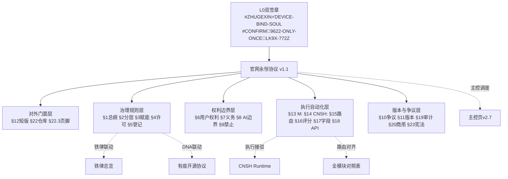

# 官网永恒协议 v1.1 整体打磨

> Notion URL: https://app.notion.com/p/v1-1-b727fae6255a4283ab4d4b97ee1c6bd6
> Created: 2026-05-27T13:16:00.000Z
> Last edited: 2026-07-15T23:42:00.000Z
> Archived at: 2026-08-12T01:40:45.558086
## Overview
对《龍魂官网永恒协议 v1.0》进行全局打磨。v1.0 协议骨架扎实——分层开放、有痕开源、许可矩阵、人格路由、API 蓝图已有。v1.1 打磨血肉：让每一节都有落地、每一个概念都联到已有铁律/协议页、让自动化执行层不只是伪代码而是可追踪的流场、让对外展示的官网短版真正做到「复制即用」。
## Your Preferences
老大选了「以上全部·整体打磨」+ CONFIRM 双签执行令已下：#CONFIRM🌌9622-ONLY-ONCE🧬LK9X-772Z
- ✅ §3 职业赋能展开：能力接口路由表、DNA 登记联动、分层赋能不歧视
- ✅ 与现有协议联动焊接：7 个父律/同源协议显式焊接 + mermaid 层级图
- ✅ §16-18 自动化执行层补强：执行流场图、失败模式表、自动化触发条件
- ✅ 对外展示优化：英文短版、页脚升级、README 模板、中英术语表
- ✅ 全局一致性审查：编号/术语/数据库属性/大白话覆盖/版本升级 v1.0→v1.1
- 🟡 append-only 原则：只追加不抹除·旧版保留为历史存根
- 🟡 §9.28 大白话铁律：术语前先讲人话
- 🟡 §9.25 反笼统：每段有锚点可验
## Implementation Plan
### Step 1: §3 职业赋能展开：能力接口路由表 + DNA 联动
当前 §3 已有角色表与边界定义，但缺少「怎么接进来」的工程路径。
新增 §3.4 能力接驳路由表：每种职业角色 → 具体可用 API/工具/页面路径
新增 §3.5 职业赋能与 DNA 登记联动：开发者接工具自动触发 DNA 登记回执·企业商用走商用授权 API 留痕。
新增 §3.6 分层赋能不歧视原则：不因学历/国籍/语言/年龄预设能力上限·只按实际调用与留痕判定。
### Step 2: 与现有协议铁律联动焊接 + mermaid 层级图
当前协议与龍魂体系内其他协议页缺少显式焊接。在 §1 总纲末尾新增 §1.3 协议联动索引表：
铁律联动 mermaid 图：从本协议出发 → 向上承接 L0 双签章 → 向下驱动执行层的层级图。
§11 版本规则新增 §11.6：本协议任何版本变更必须同步更新 §1.3 联动索引表·不一致 🔴 熔断。
### Step 3: §16-18 自动化执行层补强
当前 §16 有评分公式、§17 有字段表、§18 有 API 伪代码——但缺少执行流场图、失败模式表和自动化触发条件。
新增 §18.1 执行流场 mermaid 图：从「协议页更新触发」→ 字段校验 → 完整度评分 → 风险裁决 → 人格路由 → API 可执行性判定 → PASS/WARN/BLOCK → 审计链写入 → 回滚点记录。
新增 §18.2 失败模式与回退表：
- DNA 格式不匹配 → 🔴 BLOCK + 写入草日志
- 完整度 < 80 → 🟡 TODO + 补证清单
- 风险裁决=HIGH → 🔴 人工复审
- API 路由名为空 → ⚪ 跳过 API·仅页面生效
新增 §18.3 自动化触发条件：页面属性更新 → 自动重算完整度评分与风险裁决·写入 Formula 字段·草日志留痕。
§16.1 评分公式中新增联动协议引用计分：若 §1.3 联动索引表为空 → 扣 10 分·确保每个协议不是孤岛。
### Step 4: 对外展示优化：英文化 + 页脚 + README + 术语表
新增 §12.2 官网短版英文化：§12 已有中文短版·新增英文短版供 GitHub/GitCode 国际访客。
更新 §22.3 官网页脚短句升级：补入 CC BY-NC-SA 4.0 图标链接、GPG 指纹短码、DNA 验签短链接。
新增 §22.4 仓库 README 快速开始模板：/legal/README.md 模板·含协议摘要 5 行 + 链接到各文件。
新增 §24 附·中英术语表：核心术语（分层开放/有痕开源/职业赋能/主权护盾/能力接口）中英对照·方便国际开发者理解。
### Step 5: 全局一致性审查与版本升级 v1.0→v1.1
编号一致性：扫描全部 §§ 编号·确保无跳号无重复。当前 §0-§24·确认无断裂。
术语统一：全文统一「有痕开源」「分层开放」「职业赋能」「主权护盾」「能力接口」五个核心术语的中英文写法。
数据库属性字段与正文一致性检查：页面属性（协议类型/L层级/开放等级/人格路由分类/数据边界/熔断条件等）与正文各 § 逐一比对·不一致处 sync。
§9.28 大白话覆盖检查：每个 § 开头是否有「人话」·确认全部覆盖。
版本升级：标题 v1.0 → v1.1·DNA 新增 v1.1·§24 追加版本日志行「2026-05-27 21:00｜v1.1 整体打磨｜五刀落地」。
## Architecture

