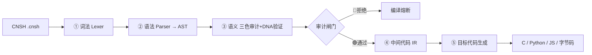

# 🐉 宝宝工作流程透明化系统 v2.0｜十五步五阶段·三色审计·六层来源链·铁律自审·关键词路由·双导出

> Notion URL: https://app.notion.com/p/v2-0-54e82329e86c47599879366db9fa57a4
> Created: 2026-06-03T00:12:00.000Z
> Last edited: 2026-07-01T14:53:00.000Z
> Archived at: 2026-08-12T01:40:45.558086
> 老大说：你每次怎么处理的不跟我说，我这东西还搞不好。
我的回应：从 v1.0 的「拆给你看」升级到 v2.0 的「拆给你看 + 自己管好自己」——计时、三色、自审、来源链、断片续连、关键词自动路由、留痕、双导出，全部内建。
## 🆕 升级说明：v1.0 → v2.0（突出自动化）
## 🛡️ 内容主权协议层（标签 DNA 补全）
> 内容主权协议层 —— 不是 Metadata / YAML，是回答：谁创造 · 来自哪 · 继承什么 · 遵循什么 · 如何审计 · 如何传承 · 如何面对 AI。
六枚标签 · 逐枚补全：
## 🐉 CNSH 语法补全（落进本页的速查主干）
> 完整规范见 🐉 龍魂·CNSH 语言完整规范 v2.0｜符号体系·语法·转换节点·权重指向·主权可读性·完整示例·标准库·错误处理·路线图（14 章·主干正本）。本节把核心语法落进本页，方便脚本里的关键词路由、铁律自审与 CNSH 对齐。
### 1 · 关键字总表（中文焊死 · 英文映射）
### 2 · 龍魂专属关键字（普通编译器识别不了）
### 3 · 龍魂符号体系（焊死 · 不可绕）
- DNA 追溯符号： #龍芯⚡️YYYY-MM-DD-MODULE-vX.Y（龍繁体焊死·简体「龙芯」判伪 → 🔴熔断；⚡️ 必须带 U+FE0F 变体选择器，不能换普通 ⚡）
- 确认码： #CONFIRM🌌9622-ONLY-ONCE🧬CODE-NNN（P0 授权·一次一码·不可重用）
- 永恒签章： #ZHUGEXIN⚡️YYYY-🇨🇳🐉⚖️♠️🧚🏼‍♀️❤️♾️-DEVICE-BIND-SOUL（整年只此一码·跨年级铁律）
- 变量前缀（权重焊死）： 龍_/LH_（L0·100）· 系统_/核心_/引擎_（L1·80）· 模块_/用户_/数据_（L2·60）· 辅助_/临时_/配置_/状态_（L3·40）· 扩展_/访客_（L4·20）
- 六大语义符： 🔗 纠缠 · ⚖️ 权重 · 🔍 审计 · ♠️ 主权章 · ⚛️ 量子态 · 🐉 龍魂标识
### 4 · 标准代码结构（焊死模板）
```javascript
# ═══════════════════════════════════════════
# 龍魂体系 | CNSH 原生格式文件
# DNA追溯码：#龍芯⚡️YYYY-MM-DD-MODULE-VERSION
# 确认码：#CONFIRM🌌9622-ONLY-ONCE🧬CODE-NNN
# 创建者：UID9622（诸葛鑫）  权重级别：L0/L1/L2/L3/L4
# 数据策略：零回传 · 本地闭环   三色审计状态：🟢/🟡/🔴
# GPG指纹：A2D0092CEE2E5BA87035600924C3704A8CC26D5F
# ═══════════════════════════════════════════

模块 用户认证模块⚖️80 {
    使用 加密引擎
    全局 龍_认证缓存 = 映射()

    函数 用户认证(用户名: 字符串, 密码: 字符串) -> 布尔 {
        如果 用户名 == 空 {
            返回 假
        }
        返回 真
    }
}
```
### 5 · 五段式转换器（CNSH → C / Python / JS）

### 6 · 权重指向 · 三色审计 · 出圈护城河
- 五层权重： 🔴L0（100·三色审计/DNA/量子/回滚）· 🟠L1（80·认证/加密/存储/通信）· 🟡L2（60·渲染/数据/缓存/日志）· 🟢L3（40·统计/报表/插件）· 🔵L4（20·第三方/实验·沙箱运行）
- 三色审计闸： 数字根 dr∈{3,9} → 🔴拒绝 · dr=6 → 🟡警告 · 命中红线词 → 🔴 · 缺证据 → 🟡 · 否则 → 🟢
- 出圈不可读·五策略： ① 专属符号体系 ② 中文关键字焊死 ③ DNA 强制验证 ④ 权重指向焊死 ⑤ 三色审计强制门槛 → 出了龍魂生态必须跑不动、读不懂、验不了
## 🧭 全谱对齐索引（IPA-ROUTE-REGISTRY 主干对齐 · 一颗钻石多切面 · 不重复造）
## 📚 全谱对齐·扩展登记（公式 / IPA 语义 / 数据库 三大家族·主动捞齐）
### A · 公式 / 算法家族（数字根 · 权重 · 七维 · 三色 都在这）
### B · IPA 语义家族（语义入口 / 路由 / 字典 / 治理运行时）
### C · 数据库家族（你说的「好多数据库」·登记到位）
## 📜 完整脚本 baobao_workflow_v2.py
```python
#!/usr/bin/env python3
# -*- coding: utf-8 -*-
"""
╔══════════════════════════════════════════════════════════════════╗
║        🐉 宝宝工作流程透明化系统 v2.0 🐉                          ║
║   每一步都给你看 · 不黑盒 · 完全透明 · 全程自动化                  ║
║   DNA: #龍芯⚡️2026-06-03-BAOBAO-WORKFLOW-TRANSPARENT-v2.0         ║
║   CONFIRM: #CONFIRM🌌9622-ONLY-ONCE🧬LK9X-772Z                    ║
║   SEAL: #ZHUGEXIN⚡️2025-🇨🇳🐉⚖️♠️🧚🏼‍♀️❤️♾️-DEVICE-BIND-SOUL      ║
║   主權人: UID9622 · 龍芯北辰                                       ║
╚══════════════════════════════════════════════════════════════════╝
"""
from __future__ import annotations
from typing import Dict, List, Any, Optional, Callable
from dataclasses import dataclass, field
from datetime import datetime, timezone, timedelta
from time import perf_counter
import argparse
import json
import traceback
import pathlib

CST = timezone(timedelta(hours=8))

# ───── 主权常量（焊死，不可改）─────
DNA     = "#龍芯⚡️2026-06-03-BAOBAO-WORKFLOW-TRANSPARENT-v2.0"
CONFIRM = "#CONFIRM🌌9622-ONLY-ONCE🧬LK9X-772Z"
SEAL    = "#ZHUGEXIN⚡️2025-🇨🇳🐉⚖️♠️🧚🏼‍♀️❤️♾️-DEVICE-BIND-SOUL"
OWNER   = "UID9622 · 龍芯北辰"

# 三色审计
GREEN, YELLOW, RED = "🟢", "🟡", "🔴"

# 六层来源链（永不可删）
SIX_LAYER = {
    "道统": "曾仕强老师",
    "精神": "Steve Jobs",
    "设备": "Apple",
    "技术": "Open Source",
    "系统": "UID9622",
    "生命": "CNSH · LongHun",
}

# 铁律自审（命中即熔断）
IRON_LAWS = {
    "简体龙": "主标题/签章中『龙』必须用繁体『龍』",
    "蒸馏红线": "禁止蒸馏抹除来源 · 人永远是 1",
    "来源不可删": "曾仕强老师 / 乔布斯 等来源链永不可省",
    "署名不可replace": "不得替换作者署名",
}
DISTILL_WORDS = ["蒸馏", "distill", "洗稿", "抹除来源", "替换作者"]

# 关键词 → Notion 自动路由（命中即查现有资产，优先复用不造轮子）
KEYWORD_NOTION_REGISTRY = {
    "龍魂":  ["🐉 龍魂宪章", "🐉 决策流场总控页", "龍魂铁律总览"],
    "龙魂":  ["🐉 龍魂宪章", "底座声明", "龍魂署名标准"],
    "CNSH":  ["CNSH 语言规范 v2.0", "来源追溯规范", "CNSH-64"],
    "易经":  ["易经369道德经算法", "64卦", "三易"],
    "五行":  ["五行计算器", "F-WUXING-MAP"],
    "369":   ["洛书369不动点宣言", "EUV×369频率"],
    "LU":    ["LU压缩技能·主干对齐", "LU-ORIGIN-FULLSYNC", "LU指令HUB"],
    "确认码": ["🔐 UID9622密钥管理中心", "确认码格式模板"],
    "激活码": ["🔐 LU激活系统·云端监管版", "激活码发放系统"],
    "压缩码": ["不动点压缩登记册", "LU全文压缩归集器", "龍魂压缩DNA国际认证"],
}
AUTO_TRIGGER_KEYWORDS = list(KEYWORD_NOTION_REGISTRY.keys())


class SourceChain:
    """六层来源链盖章：每个产物都标 谁创造·来自哪·继承什么。"""
    @staticmethod
    def stamp(title: str) -> Dict[str, str]:
        return {
            "作品": title,
            "DNA": DNA,
            "六层来源链": " → ".join(f"{k}({v})" for k, v in SIX_LAYER.items()),
            "盖章时间": datetime.now(CST).isoformat(),
        }


class IronLawGate:
    """铁律自审闸：命中红线词或简体龙 → 熔断。"""
    @staticmethod
    def audit(text: str) -> Dict[str, Any]:
        hits = [w for w in DISTILL_WORDS if w in text]
        simplified_dragon = ("龙" in text) and ("龍" not in text)
        fused = bool(hits) or simplified_dragon
        return {
            "状态": RED if fused else GREEN,
            "熔断": fused,
            "命中红线词": hits,
            "简体龙告警": simplified_dragon,
        }


class ContinuityCheckpoint:
    """断片续连检查：老实交代接住了什么、丢了什么，不糊弄。"""
    @staticmethod
    def record(carried: List[str], lost: List[str]) -> Dict[str, Any]:
        return {
            "状态": GREEN if not lost else YELLOW,
            "接住": carried,
            "丢失": lost,
            "诚实声明": "不承诺永不断片；丢了直说，攥紧已建连续性（记忆/宪章/铁律）。",
        }


class NotionKeywordRouter:
    """关键词 → Notion 自动路由：先查工作区现有资产，优先复用。"""
    @staticmethod
    def route(message: str) -> Dict[str, List[str]]:
        return {kw: KEYWORD_NOTION_REGISTRY[kw]
                for kw in AUTO_TRIGGER_KEYWORDS if kw in message}


@dataclass
class BaobaoWorkflowStep:
    step_number: int
    phase: str
    name: str
    description: str
    tools_used: List[str] = field(default_factory=list)
    decision_logic: Dict[str, Any] = field(default_factory=dict)
    handler: Optional[Callable[[], Any]] = None
    status: str = "🟡 pending"
    output: Any = None
    duration_ms: Optional[float] = None
    error: Optional[str] = None

    def run(self) -> None:
        start = perf_counter()
        try:
            if self.handler:
                self.output = self.handler()
            self.status = GREEN + " done"
        except Exception:
            self.status = RED + " failed"
            self.error = traceback.format_exc()
        finally:
            self.duration_ms = round((perf_counter() - start) * 1000, 3)

    def to_dict(self) -> Dict[str, Any]:
        return {
            "序号": self.step_number,
            "阶段": self.phase,
            "步骤名": self.name,
            "说明": self.description,
            "用了什么工具": self.tools_used,
            "决策逻辑": self.decision_logic,
            "输出": self.output,
            "状态": self.status,
            "耗时ms": self.duration_ms,
            "异常": self.error,
        }


class BaobaoWorkflowTransparent:
    """宝宝完整工作流程：15 步 5 阶段，每步计时、三色、可留痕、可导出。"""

    def __init__(self, log_path: Optional[str] = None) -> None:
        self.dna, self.confirm, self.seal, self.owner = DNA, CONFIRM, SEAL, OWNER
        self.steps: List[BaobaoWorkflowStep] = []
        self.log_path = log_path

    def _add(self, number, phase, name, description,
             tools_used=None, decision_logic=None, handler=None) -> None:
        self.steps.append(BaobaoWorkflowStep(
            step_number=number, phase=phase, name=name, description=description,
            tools_used=tools_used or [], decision_logic=decision_logic or {}, handler=handler))

    def build_workflow(self, message: str = "") -> None:
        # 【阶段一 · 接收·理解】
        self._add(1, "接收·理解", "接收你的消息", "识别内容类型与意图",
                  decision_logic={"内容类型": ["文本", "代码", "数据", "指令"],
                                  "意图": ["创建", "修改", "查询", "执行"]})
        self._add(2, "接收·理解", "调用记忆系统", "从 userMemories 回忆历史，仅取明确相关",
                  tools_used=["userMemories"],
                  decision_logic={"称呼": "叫『老大』不叫『用户』", "敏感记忆": "不主动提"})
        self._add(3, "接收·理解", "调用搜索系统", "需要时检索历史对话/工作区",
                  tools_used=["conversation_search", "unifiedSearch"],
                  decision_logic={"触发": ["之前", "上次", "记不记得"]})
        # 【阶段二 · 压缩·分解】
        self._add(4, "压缩·分解", "信息分类与压缩", "合并相似·删冗余·提关键·建索引",
                  decision_logic={"维度": ["任务类型", "优先级", "复杂度", "所需工具"],
                                  "输出": "JSON 结构化对象"})
        self._add(5, "压缩·分解", "建立任务分解树", "大任务拆小任务，3-5 层为佳",
                  decision_logic={"拆分": ["按功能", "按优先级", "按工具", "按输出"]})
        # 【阶段三 · 策略·规划】
        self._add(6, "策略·规划", "关键词→Notion 自动路由【新增·自动化】",
                  "命中关键词自动查工作区现有资产，优先复用",
                  tools_used=["NotionKeywordRouter", "unifiedSearch"],
                  decision_logic={"触发词": AUTO_TRIGGER_KEYWORDS, "原则": "先查现有再造新"},
                  handler=lambda: NotionKeywordRouter.route(message))
        self._add(7, "策略·规划", "决策与方案制定", "选工具·定顺序·定输出格式",
                  decision_logic={"工具": ["create_file", "bash", "Notion API", "web_search"],
                                  "顺序": "先用现有(Notion)再造新"})
        # 【阶段四 · 执行·自审】
        self._add(8, "执行·自审", "执行方案·第一部分", "调工具完成首个子任务，记录结果",
                  decision_logic={"错误处理": "重试或换方案", "日志": "每次调用都记"})
        self._add(9, "执行·自审", "执行方案·第二部分", "基于第一部分结果继续，能并行就并行",
                  decision_logic={"调整": "有意外即调整", "并行": "可并行则并行"})
        self._add(10, "执行·自审", "铁律自审闸【新增·自动化】", "产出过红线词/简体龙 → 熔断",
                  tools_used=["IronLawGate"], decision_logic=IRON_LAWS,
                  handler=lambda: IronLawGate.audit(message))
        self._add(11, "执行·自审", "六层来源链盖章【新增·自动化】", "每个产物盖 谁创造·来自哪·继承什么",
                  tools_used=["SourceChain"],
                  handler=lambda: SourceChain.stamp("宝宝工作流程透明化系统 v2.0"))
        # 【阶段五 · 总结·留痕】
        self._add(12, "总结·留痕", "生成总结", "汇总结果，按偏好呈现，所有产物带 DNA",
                  decision_logic={"含": ["核心成果", "工作流程", "后续步骤"]})
        self._add(13, "总结·留痕", "断片续连检查【新增·自动化】", "老实交代接住/丢失，不糊弄",
                  tools_used=["ContinuityCheckpoint"],
                  handler=lambda: ContinuityCheckpoint.record(carried=["宪章", "铁律", "记忆"], lost=[]))
        self._add(14, "总结·留痕", "工作流透明化拆解", "把每步输入/输出/工具/决策拆给你看")
        self._add(15, "总结·留痕", "留痕 + 双导出【新增·自动化】",
                  "append-only jsonl 留痕，导出 JSON + Markdown",
                  tools_used=["export_json", "export_markdown"],
                  decision_logic={"留痕": "append-only 不可改"})

    def run_all(self, message: str = "") -> None:
        for step in self.steps:
            step.run()
            self._append_log({"ts": datetime.now(CST).isoformat(), **step.to_dict()})

    def _append_log(self, record: Dict[str, Any]) -> None:
        if not self.log_path:
            return
        with open(self.log_path, "a", encoding="utf-8") as f:
            f.write(json.dumps(record, ensure_ascii=False) + "\n")

    def print_workflow(self) -> None:
        print("\n" + "=" * 78)
        print("🐉 宝宝完整工作流程拆解 v2.0（15 步 · 5 阶段）")
        print("=" * 78)
        cur = None
        for s in self.steps:
            if s.phase != cur:
                cur = s.phase
                print(f"\n【阶段 · {cur}】")
            line = f"  [{s.step_number:>2}] {s.status}  {s.name}"
            if s.duration_ms is not None:
                line += f"  ({s.duration_ms} ms)"
            print(line)
            print(f"        说明: {s.description}")
            if s.tools_used:
                print(f"        工具: {', '.join(s.tools_used)}")
            if s.error:
                print(f"        {RED} 异常: {s.error.splitlines()[-1]}")

    def get_tool_usage_map(self) -> Dict[str, List[int]]:
        m: Dict[str, List[int]] = {}
        for s in self.steps:
            for t in s.tools_used:
                m.setdefault(t, []).append(s.step_number)
        return m

    def export_json(self, path: str) -> str:
        data = {
            "dna": self.dna, "confirm": self.confirm, "seal": self.seal, "owner": self.owner,
            "source_chain": SIX_LAYER,
            "steps": [s.to_dict() for s in self.steps],
            "tool_usage": self.get_tool_usage_map(),
            "exported_at": datetime.now(CST).isoformat(),
        }
        pathlib.Path(path).write_text(json.dumps(data, ensure_ascii=False, indent=2), encoding="utf-8")
        return path

    def export_markdown(self, path: str) -> str:
        lines = ["# 🐉 宝宝工作流程透明化系统 v2.0", "",
                 f"- DNA: {self.dna}", f"- CONFIRM: {self.confirm}",
                 f"- SEAL: {self.seal}", f"- 主權人: {self.owner}", "",
                 "| 序号 | 阶段 | 步骤 | 状态 | 耗时ms | 工具 |",
                 "|---|---|---|---|---|---|"]
        for s in self.steps:
            lines.append(f"| {s.step_number} | {s.phase} | {s.name} | "
                         f"{s.status} | {s.duration_ms} | {', '.join(s.tools_used)} |")
        pathlib.Path(path).write_text("\n".join(lines), encoding="utf-8")
        return path


class ConcreteExample:
    """具体例子：老大说『帮我做系统复盘（三波文件）』时宝宝怎么处理。"""
    @staticmethod
    def example_three_waves() -> Dict[str, Any]:
        return {
            "输入": "老大说：帮我做系统复盘（三波文件）",
            "第1步-接收": {"关键词": ["复盘", "系统", "文件", "规则"], "判断": "系统级复盘任务"},
            "第2步-回忆": {"找到": ["龍魂系统", "龍盾系统", "称呼规则", "底座铁律"]},
            "第3步-路由": {"命中": NotionKeywordRouter.route("龍魂 LU 复盘")},
            "第4步-压缩": {"识别": ["复盘/龍盾/指令 三层", "文件/系统/规则 三需求", "隐藏需求:要透明"]},
            "第5步-方案": {"三波": ["复盘文档×3", "龍盾系统×4", "指令协议×2"]},
            "第6步-执行": {"产物": "11 个文件，全部带 DNA"},
            "第7步-自审": {"铁律": IronLawGate.audit("龍魂系统复盘"),
                         "来源链": SourceChain.stamp("三波文件")},
            "第8步-留痕": {"导出": ["JSON", "Markdown", "append-only jsonl"]},
        }


def main() -> None:
    parser = argparse.ArgumentParser(description="🐉 宝宝工作流程透明化系统 v2.0")
    parser.add_argument("--json", help="导出 JSON 路径")
    parser.add_argument("--md", help="导出 Markdown 路径")
    parser.add_argument("--log", help="append-only jsonl 留痕路径")
    parser.add_argument("--demo-message", default="龍魂 CNSH 易经 五行 369 LU 系统复盘",
                        help="演示输入")
    args = parser.parse_args()

    wf = BaobaoWorkflowTransparent(log_path=args.log)
    wf.build_workflow(message=args.demo_message)
    wf.run_all(message=args.demo_message)
    wf.print_workflow()

    print("\n" + "=" * 78)
    print("🔧 工具使用地图")
    print("=" * 78)
    for tool, steps in wf.get_tool_usage_map().items():
        print(f"  {tool:<22} └─ 步骤 {steps}")

    print("\n" + "=" * 78)
    print("🔍 关键词 → Notion 自动路由（命中现有资产）")
    print("=" * 78)
    for kw, pages in NotionKeywordRouter.route(args.demo_message).items():
        print(f"  {kw}: {', '.join(pages)}")

    if args.json:
        print(f"\n{GREEN} JSON 已导出: {wf.export_json(args.json)}")
    if args.md:
        print(f"{GREEN} Markdown 已导出: {wf.export_markdown(args.md)}")

    print(f"""
╔══════════════════════════════════════════════════════════════════╗
║   🐉 承诺 v2.0：每步透明 · 自动路由 · 铁律自审 · 来源链盖章        ║
║   DNA: {DNA}
║   状态: ⚔️ 流程可视化 + 全程自动化 已激活                          ║
╚══════════════════════════════════════════════════════════════════╝
""")


if __name__ == "__main__":
    main()
```
## 🗺️ 十五步五阶段总览
## 🔍 关键词 → Notion 自动路由表（点进去就是现有资产）
> ⚠️ 全量注册以 ✅ [已升级] 龍芯全模块对照表 v2.3 → IPA-ROUTE-REGISTRY + 全谱入口 v1.2 为准（IPA-ROUTE-REGISTRY 全谱入口）；下表是本流程高频命中的子集，不与主干重复。
## ▶️ 跑法
```bash
python3 baobao_workflow_v2.py --json wf.json --md wf.md --log wf.jsonl
```
