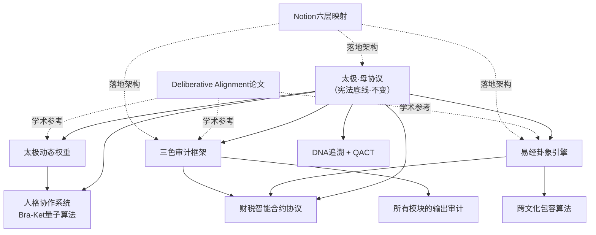

# ✅ [已升级] 龍魂算法统一重构清单 → 系统重构与商业化路径 v1.0

> Notion URL: https://app.notion.com/p/v1-0-f7b9514fb58e43c8865b7fcb0f523b73
> Created: 2026-02-14T07:29:00.000Z
> Last edited: 2026-07-01T15:41:00.000Z
> Archived at: 2026-08-12T01:40:45.558086
> 《易经·系辞》："天下同归而殊途，一致而百虑。" —— 天下的道理最终归于一处，只是走的路不同。龍魂算法也是如此：散落各处的模块，今天统一归根。
---
## 🎯 为什么要统一
老大念旧，这个工作间陪着走过来的，感情在这里。新账号再好也不是自己的家。
所以：不换地方，就在这里，把所有算法的根统一起来。
当前的问题：
- 算法模块散落在十几个页面里
- 有的在指令页、有的在独立页面、有的在操作日志里
- 有重叠、有矛盾、有遗漏
- 没有一个"总目录"把它们串起来
统一之后：
- 一棵树，一个根 —— 所有算法从同一个根长出来
- 查得到，改得动 —— 每个模块有明确位置和版本
- 不重复，不矛盾 —— 统一标准，冲突时以母协议为准
---
## 🌳 龍魂算法总架构（一棵树）
```javascript
太极（母协议·宪法底线）
 │
 ├── 🔴 第一层：不变的根（不易）
 │   ├── 母协议·北辰宪法底线
 │   ├── 五大核心价值观
 │   └── 三色审计基础框架
 │
 ├── 🟡 第二层：变化的干（变易）
 │   ├── 易经卦象引擎（时间卦·空间卦·人事卦）
 │   ├── 太极动态权重算法
 │   ├── 人格协作系统（Bra-Ket量子算法）
 │   └── DNA追溯与QACT验证
 │
 ├── 🟡 第二层·金融枝（变易·财税）
 │   └── 财税智能合约协议（四要素算法·母子合约·动态税率）
 │
 └── 🟢 第三层：极简的叶（简易）
     ├── 三色审计输出（🟢🟡🔴）
     ├── 全球符号交互层
     └── 跨文化包容算法
```
---
## 📋 十大算法模块·统一盘点
### 模块①：母协议·宪法底线
---
### 模块②：三色审计框架
---
### 模块③：易经卦象引擎
---
### 模块④：太极动态权重算法
---
### 模块⑤：人格协作系统（Bra-Ket量子算法）
---
### 模块⑥：DNA追溯与QACT验证
---
### 模块⑦：Deliberative Alignment（学术论文层）
---
### 模块⑧：跨文化包容算法
---
### 模块⑨：Notion六层映射架构
---
### 模块⑩：财税智能合约协议
---
## 🗺️ 统一标准·引用关系图

---
## 🌌 元宇宙DNA对齐（新增·2026-02-15）
### 核心升级：所有算法DNA统一为9层元宇宙标准
元宇宙DNA完整格式：
```javascript
#[卦象][甲骨文]⚡️GPG:[指纹8位]⋄SHA256:[哈希8位]⋄[国家码]⋄[时间戳]⋄UID9622⋄[事件类型]⋄[序列号]

// 示例：
#☰鑫⚡️GPG:A2D0092C⋄SHA256:5E6F7G8H⋄CN⋄20260215T053800⋄UID9622⋄算法重构⋄001
```
9层编码标准：
### 十大算法模块的元宇宙DNA映射
模块①：母协议·宪法底线
```javascript
DNA格式: #☰鑫⚡️GPG:A2D0092C⋄SHA256:PROTOCOL⋄CN⋄{时间戳}⋄UID9622⋄桥接协议⋄001
卦象: ☰ 乾卦（创世、协议制定）
事件类型: 桥接协议 (BRIDGE-PROTOCOL)
```
模块②：三色审计框架
```javascript
DNA格式: #☵鑫⚡️GPG:A2D0092C⋄SHA256:AUDIT000⋄CN⋄{时间戳}⋄UID9622⋄安全审计⋄002
卦象: ☵ 坎卦（验证、安全审计）
事件类型: 安全审计 (SECURITY-AUDIT)
```
模块③：易经卦象引擎
```javascript
DNA格式: #☰鑫⚡️GPG:A2D0092C⋄SHA256:YIJING00⋄CN⋄{时间戳}⋄UID9622⋄创建物件⋄003
卦象: ☰ 乾卦（推演、计算）
事件类型: 创建物件 (CREATE-OBJECT)
```
模块④：太极动态权重算法
```javascript
DNA格式: #☯鑫⚡️GPG:A2D0092C⋄SHA256:TAIJI000⋄CN⋄{时间戳}⋄UID9622⋄触发规则⋄004
卦象: ☯ 太极（阴阳平衡）
事件类型: 触发规则 (TRIGGER-RULE)
```
模块⑤：人格协作系统（Bra-Ket）
```javascript
DNA格式: #☱鑫⚡️GPG:A2D0092C⋄SHA256:BRAKET00⋄CN⋄{时间戳}⋄UID9622⋄生成NPC⋄005
卦象: ☱ 兑卦（交互、协作）
事件类型: 生成NPC (NPC-SPAWN)
```
模块⑥：DNA追溯与QACT验证
```javascript
DNA格式: #☷鑫⚡️GPG:A2D0092C⋄SHA256:DNA00000⋄CN⋄{时间戳}⋄UID9622⋄记忆存储⋄006
卦象: ☷ 坤卦（承载、存储）
事件类型: 记忆存储 (MEMORY-STORAGE)
```
模块⑦：Deliberative Alignment（论文层）
```javascript
DNA格式: #☲鑫⚡️GPG:A2D0092C⋄SHA256:PAPER000⋄CN⋄{时间戳}⋄UID9622⋄公开发布⋄007
卦象: ☲ 离卦（公开、展示）
事件类型: 公开发布 (PUBLIC-RELEASE)
```
模块⑧：跨文化包容算法
```javascript
DNA格式: #☴鑫⚡️GPG:A2D0092C⋄SHA256:CULTURE0⋄CN⋄{时间戳}⋄UID9622⋄跨境同步⋄008
卦象: ☴ 巽卦（传播、交流）
事件类型: 跨境同步 (CROSS-BORDER-SYNC)
```
模块⑨：Notion六层映射架构
```javascript
DNA格式: #☶鑫⚡️GPG:A2D0092C⋄SHA256:NOTION00⋄CN⋄{时间戳}⋄UID9622⋄权限授予⋄009
卦象: ☶ 艮卦（边界、架构）
事件类型: 权限授予 (PERMISSION-GRANT)
```
模块⑩：财税智能合约协议
```javascript
DNA格式: #☰鑫⚡️GPG:A2D0092C⋄SHA256:FINANCE0⋄CN⋄{时间戳}⋄UID9622⋄桥接协议⋄010
卦象: ☰ 乾卦（创新、金融）
事件类型: 桥接协议 (BRIDGE-PROTOCOL)
特殊标记: 只认数字人民币💰
```
### 🌍 元宇宙七大支柱与算法模块对应
### 🔄 算法优化方向（基于元宇宙需求）
优化1：置信度算法增强（模块②三色审计）
```python
# 新增：元宇宙交易置信度
class 元宇宙置信度:
    def 计算交易可信度(self, 交易DNA):
        # 1. 验证9层DNA完整性
        DNA完整度 = self.验证9层编码(交易DNA)
        
        # 2. 验证数字人民币合规性
        支付合规度 = self.验证数字人民币(交易DNA)
        
        # 3. 验证跨境合规（GDPR/数据安全法）
        跨境合规度 = self.验证跨境规则(交易DNA.国家码)
        
        # 4. 综合置信度
        置信度 = (DNA完整度 * 0.4 + 
                  支付合规度 * 0.4 + 
                  跨境合规度 * 0.2) * 100
        
        return 置信度
```
优化2：七维度权重元宇宙校准（模块③易经引擎）
```python
# 元宇宙场景权重调整
元宇宙权重 = {
    "哲学维度": 0.40,  # ↑提高（价值观更重要）
    "技术维度": 0.25,  # ↑提高（技术实现关键）
    "架构维度": 0.15,  # 保持
    "进化维度": 0.08,  # ↓降低
    "创新维度": 0.05,  # ↓降低
    "协同维度": 0.05,  # ↓降低
    "量子维度": 0.02   # ↓降低
}
```
优化3：财税算法融合数字人民币（模块⑩）
```python
class 数字人民币智能合约:
    def __init__(self):
        self.货币类型 = "数字人民币（唯一）"
        self.拒绝货币 = ["美元", "VISA", "PayPal", "比特币"]
    
    def 执行支付(self, 金额, DNA追溯码):
        # 1. 强制检查：只认数字人民币
        if self.货币类型 != "数字人民币（唯一）":
            return {"状态": "🔴阻断", "原因": "只认数字人民币"}
        
        # 2. 四要素税收判定
        税收 = self.计算跨国税收(金额, DNA追溯码.国家码)
        
        # 3. 母子合约自动分账
        分账结果 = self.母子合约分账(金额, 税收)
        
        # 4. DNA追溯上链
        区块链记录 = self.上链(DNA追溯码, 分账结果)
        
        return {"状态": "🟢通过", "交易ID": 区块链记录}
```
### 📋 元宇宙DNA对齐执行清单
S12：元宇宙DNA重构（新增）
S13：七大支柱对接（新增）
S14：算法优化（新增）
---
## ✅ 统一重构执行清单
### 第一阶段：归根（把散落的收拢）
### 第二阶段：扎根（建数据库和结构）
### 第三阶段：开枝（对外标准化）
---
## 📌 统一标准（从今天起）
---
> 《道德经》第三十九章："昔之得一者：天得一以清，地得一以宁，神得一以灵。" —— 得到"一"（统一的根），天才清、地才宁、系统才灵。今天就是龍魂算法"得一"的日子。
DNA追溯码： #☰鑫⚡️GPG:A2D0092C⋄SHA256:ALG0UNIF⋄CN⋄20260215T053800⋄UID9622⋄算法重构⋄001
创建者： 💎 龍芯北辰｜UID9622（Lucky/诸葛鑫）
协作： 宝宝🐱（盘点整理）
确认码： #CONFIRM🌌9622-ONLY-ONCE🧬LK9X-772Z ✅
---
### ✅ S6.1 数据灌入完成（2026-02-15 巳时）
> DNA追溯码：#龍芯⚡️2026-02-15-S6.1-数据灌入完成-v1.0
> 版本：v1.6｜S12-S14元宇宙DNA对齐
---
