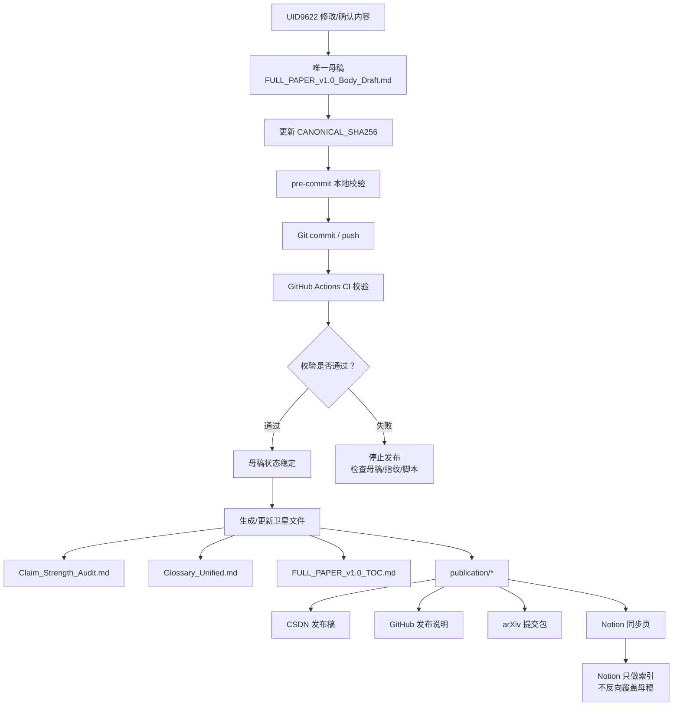

# 📦【已封存·口径见 v1.1】Behavioral Cryptography v1.0｜Notion 同步总览

> Notion URL: https://app.notion.com/p/v1-1-Behavioral-Cryptography-v1-0-Notion-eeaf7aa6588e42818d16452d4ef1834e
> Created: 2026-05-07T00:37:00.000Z
> Last edited: 2026-07-01T15:39:00.000Z
> Archived at: 2026-08-12T01:40:45.558086
---
---
## 1. 定盘结论
这套做法是对的，已经形成一套比较完整的“论文主权锁 + 发布分发包”结构。
核心判断：
```plain text
唯一母稿已经锁定。
机器校验已经接上。
发布通道已有骨架。
Notion 只做同步页和索引，不反向覆盖 Git 母稿。
```
本页只做 Notion 侧登记与导航，不取代 Git 仓库内的唯一母稿。
---
## 2. 唯一母稿与锁死规则
### 2.1 唯一母稿
```plain text
longhun-system/BehavCrypto_v1.0/FULL_PAPER_v1.0_Body_Draft.md
```
### 2.2 锁死规则
```plain text
longhun-system/BehavCrypto_v1.0/CANONICAL_LOCK.md
```
关键规则：
- 全文级撰写、修订、合并、导出与版本对齐，一律以 FULL_PAPER_v1.0_Body_Draft.md 为唯一权威母稿。
- Clean、清洗稿、scrub 文件只能作为临时工作稿。
- Downloads、Documents、临时导出文件不得反向覆盖母稿。
- FULL_PAPER_v1.0_TOC.md 只能由母稿同步或对齐，不能反向定义章节真源。
- Claim_Strength_Audit.md、Glossary_Unified.md、publication/* 都是卫星文件，不能替代母稿。
### 2.3 封印线
```plain text
#CONFIRM🌌9622-ONLY-ONCE🧬LK9X-772Z#ZHUGEXIN⚡️2025-🇨🇳🐉⚖️♠️🧚🏼‍♀️❤️♾️-DEVICE-BIND-SOUL
```
---
## 3. 完整性指纹：CANONICAL_SHA256
### 3.1 指纹文件
```plain text
longhun-system/BehavCrypto_v1.0/CANONICAL_SHA256
```
### 3.2 当前 SHA256
```plain text
6302bef7d1d30f12ca8bbfa6fed1c0b2ee8963df89cc83b9ac000208d34d6e6a
```
### 3.3 作用
```plain text
母稿内容一变，SHA256 指纹就变。
如果有人改了母稿但没有更新 CANONICAL_SHA256，verify.sh 会报错。
```
### 3.4 对应机制
---
## 4. 仓库与 Hook 配置
### 4.1 远程仓库
```plain text
https://github.com/UID9622/longhun-system.git
```
### 4.2 分支
```plain text
release-snapshot
```
### 4.3 新 clone 后必须执行
```bash
git config core.hooksPath longhun-system/scripts/githooks
```
### 4.4 原因
core.hooksPath 是本地 Git 配置，不会自动跟着 GitHub 仓库同步。
```plain text
当前机器当前仓库已配置 → 不用重复配置
换电脑 / 新目录 / 新 clone → 需要重新配置一次
```
---
## 5. 文件清单
---
## 6. 发布包状态
### 6.1 GitHub 发布骨架
```plain text
publication/GitHub_README.md
```
定位：
- 展示 Behavioral Cryptography 的核心说明
- 列出 F1-F7 七因子
- 明确边界：提高伪造成本，不声称数学不可伪造
- 提供 BibTeX 示例
### 6.2 CSDN 发布骨架
```plain text
publication/CSDN_post.md
```
定位：
- 面向中文平台的发布稿骨架
- 摘要可从正文中文摘要同步
- 正文结构包括 provenance gap、七因子、动态 DNA、Longhun、边界声明
### 6.3 arXiv 提交包骨架
```plain text
publication/arXiv_submission.md
```
定位：
- arXiv 元数据
- 目标分类：cs.CR 主，cs.AI 副
- 摘要草稿
- reviewer 预防段落
- 后续需要转成 LaTeX/PDF 包
### 6.4 Notion 同步页
```plain text
publication/Notion_page.md
```
定位：
- Git 真源索引
- Notion 只做摘要、链接、状态看板
- 大段公式与附录继续维护在 Git
---
## 7. 北辰母协议清理版状态
文件：
```plain text
PROTOCOL__20260325__BEICHEN-MOTHER-PROTOCOL__v2.0-clean.md
```
当前元信息：
```yaml
M:
  status: PASS
  readable: true
  risk: low
  target_path: 01_protocols/cnsh/
  rename_to: PROTOCOL__20260325__BEICHEN-MOTHER-PROTOCOL__v2.0-clean.md

CNSH:
  dna: "#龍芯⚡️2026-03-25-北辰母协议-v2.0"
  gate: "#CONFIRM🌌9622-ONLY-ONCE🧬LK9X-772Z"
  seal: "#ZHUGEXIN⚡️2025-🇨🇳🐉⚖️♠️🧚🏼‍♀️❤️♾️-DEVICE-BIND-SOUL"
  route: 01_protocols
  audit: 🟢
  wuxing: 金
  next_action: NEED_UID_CONFIRM
```
判断：
```plain text
内容清理方向正确。
外部 AI 名称已降权/移除，主控统一回 UID9622 + Notion 平台。
但 next_action 是 NEED_UID_CONFIRM，所以不能直接视为最终入库完成。
```
---
## 8. 标准同步边界
### 8.1 Git 是正文真源
```plain text
正文、公式、附录、伪代码、引用、Claim Audit 修复，以 Git 母稿为准。
```
### 8.2 Notion 是索引与看板
```plain text
Notion 负责记录状态、导航、摘要、同步策略、发布进度。
Notion 不反向覆盖 Git 母稿。
```
### 8.3 发布平台是派生出口
```plain text
CSDN / GitHub / arXiv / Notion 页面都属于发布出口。
所有出口内容必须从母稿派生。
```
---
## 9. 工作流程图

---
## 10. 一票否决
- 🔴 把 Clean 文件改成唯一母稿，而未修改 CANONICAL_LOCK.md
- 🔴 用 Downloads / Documents 文件直接覆盖母稿
- 🔴 删除 CONFIRM / SEAL / GPG / DNA
- 🔴 修改母稿后不更新 CANONICAL_SHA256
- 🔴 GitHub CI 报错仍继续发布
- 🔴 Notion 页面反向覆盖 Git 母稿
- 🔴 arXiv / CSDN / GitHub 发布稿声称“数学不可伪造”
- 🔴 北辰母协议 NEED_UID_CONFIRM 未确认前直接标为最终完成
---
## 11. 下一步
---
## 12. 本次附件核对结果｜2026-05-07 08:39
### 12.1 已核对文件清单
### 12.2 发现的具体修补点
### 12.3 三色总判
```yaml
overall:
  architecture: 🟢
  canonical_lock: 🟢
  sha256_guard: 🟢
  claim_strength: 🟢
  glossary: 🟢
  toc: 🟡
  body_draft_completion: 🟡
  publication_ready:
    github: 🟡
    csdn: 🟡
    arxiv: 🟡
```
### 12.4 同步边界确认
```plain text
可以同步到 Notion：作为“核对结果 + 状态看板 + 下一步清单”。
不应同步为：最终论文正文真源。
最终正文仍以 Git 母稿 FULL_PAPER_v1.0_Body_Draft.md 为准。
```
