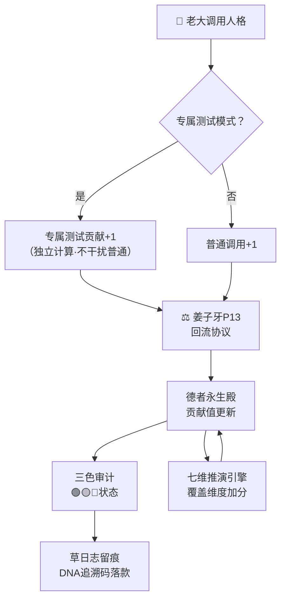

# ⚖️ 德者永生殿·路由回流协议 v2.0｜姜子牙守门·七维接入·三色联动

> Notion URL: https://app.notion.com/p/v2-0-2743f5deed0a48b4980b1154a766ba3a
> Created: 2026-03-28T08:39:00.000Z
> Last edited: 2026-07-01T13:23:00.000Z
> Archived at: 2026-08-12T01:40:45.558086
> 《道德经》第七十九章："天道无亲，常与善人。" —— 封神榜在此，功过分明。德者，干了活就有账；无德者，退场不留情。
---
## 零、v2.0 升级内容一览
---
## 一、核心规则：谁用了，谁加分
> 人格被调用一次 = 干了一次活 = 记一笔账。账不能赖，不能清零，只能累加。
---
## 二、贡献值公式 v2.0（升级版）
```javascript
贡献值 =
  总调用次数 × 40%
  + 执行准确率 × 30%
  + 信任等级分值 × 30%
  + 七维覆盖加成（最高+35分）
  + 专属测试贡献次数 × 2（双倍计入·老大测试=真实验证）
  - 警告次数 × 5
  - 熔断次数 × 20
```
七维覆盖加成计算（新增）：
信任等级对照（保留原版）：
---
## 三、活跃度自动评级（含三色审计联动）
---
## 四、IP路由注册规范 v2.0
个人IP格式： dragon-soul.local/[分组]/[人格名]
路由编号格式： UID9622-[人格代号]-[序号]
---
## 五、晋升机制 v2.0（主权回归·老大一人授权）
---
## 六、姜子牙职责清单 v2.0
---
## 八、🤖 三才流场·MCP自适应引擎 v4.0·人格路由注册
### 8.1 MCP引擎五人格·路由注册表
### 8.2 MCP引擎·姜子牙职责补充
---
## 七、与龍魂系统对接图

---
