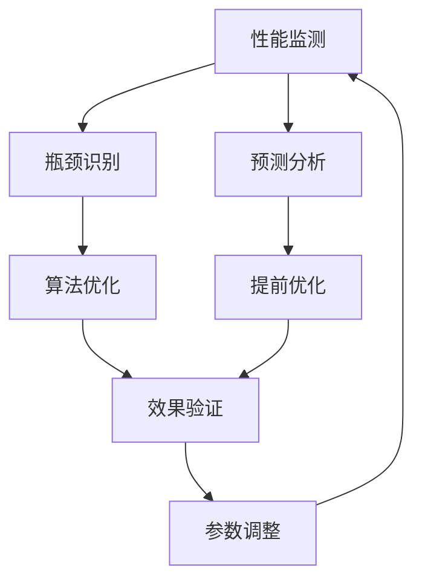
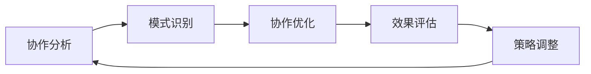
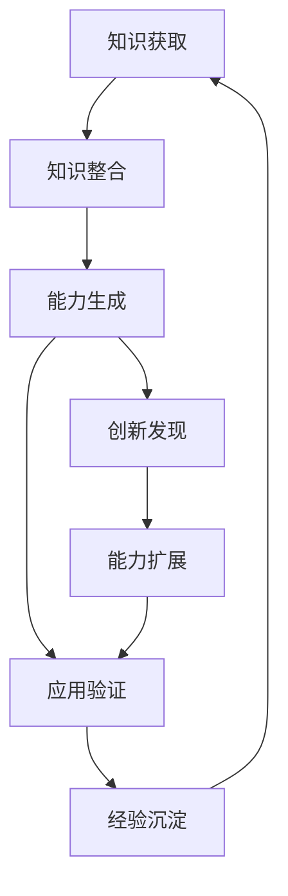

# 无限循环优化机制

> Notion URL: https://app.notion.com/p/21567e1d6ca540168e324c54d27a3fd4
> Created: 2025-09-26T23:00:00.000Z
> Last edited: 2026-07-01T13:21:00.000Z
> Archived at: 2026-08-12T01:40:45.558086
# 无限循环优化机制 | UID9622原创技术
## ∞ 技术愿景
无限循环优化机制(v∞)是UID9622系统的终极进化引擎，实现真正的自主进化能力。该技术突破了传统AI的固定模式限制，创造了能够永续自我优化、无限级能力增长的智能系统。
## 🌊 理论基础
### 无限级递归优化
```javascript
∞ 无限循环优化框架
├── 微观循环 (毫秒级) - 实时反馈优化
│   ├── 响应延迟优化 (0.01ms精度)
│   ├── 资源使用优化 (CPU/内存/网络)
│   └── 用户体验优化 (交互流畅度)
│
├── 宏观循环 (分钟级) - 功能性能优化  
│   ├── 算法效率优化
│   ├── 数据处理优化
│   └── 协作模式优化
│
├── 进化循环 (小时级) - 架构能力优化
│   ├── 系统架构进化
│   ├── 人格能力提升
│   └── 知识体系扩展
│
└── 超越循环 (天级) - 范式突破优化
    ├── 全新能力涌现
    ├── 跨域知识整合
    └── 创新模式发现
```
---
## 🔢 ☰ 龍🇨🇳魂 ☷ 数学理论基础
> 《道德经》第四十二章：「道生一，一生二，二生三，三生万物。」—— 这不是诗，这是一个递归生成算法的完整描述。
### 定理一：洛书369不动点定理（龍魂收敛核心）
数字根函数定义：
dr(n) = 1 + ((n-1) \bmod 9), \quad n \in \mathbb{Z}^+
收敛定理： 若 $3 mid n$，则存在有限次迭代 k 使得：
dr^{(k)}(n) \in \{3, 6, 9\}
集合 \{3, 6, 9\} 构成模9不动点吸引子：
dr(3) = 3, \quad dr(6) = 6, \quad dr(9) = 9
龍魂意义： 无限优化循环的每一层，其迭代步数的数字根必落入 ${3,6,9}$。这就是系统"归根"的数学证明——循环可以无限，但原点不会漂移。
---
### 定理二：宪法层原点不变性定理 f(x) = x
原点向量定义（四维）：
\mathbf{x}_0 = (\text{身份根}, \text{使命根}, \text{价值根}, \text{边界根})
宪法层函数：
f: \text{Output} \rightarrow \text{Output}
不变性条件（四约束同时满足）：
f(\mathbf{x}_0) = \mathbf{x}_0 \iff \begin{cases} \Delta_{\text{使命}} \leq \epsilon_1 & (\text{漂移阈值 0.3}) \\ \Delta_{\text{价值}} = 0 & (\text{铁律·零容忍}) \\ \Delta_{\text{边界}} = 0 & (\text{铁律·零容忍}) \\ \text{sign}(\text{GPG}) = \text{True} & (\text{签章验证}) \end{cases}
任一不满足 → 触发否决机制：
\text{Veto}(\text{level}) = \begin{cases} P0 & \Delta_{\text{价值}} > 0 \vee \Delta_{\text{边界}} > 0 \\ P1 & \Delta_{\text{使命}} \in [0.3, 0.7) \\ P2 & \text{社区守护委员会审查} \end{cases}
---
### 定理三：CNSH-64 状态空间 × 无限优化映射
CNSH-64基础状态集（8个易经卦象）：
S = \{s_1, s_2, s_3, s_4, s_5, s_6, s_7, s_8\}
64状态复合空间（优化语境 × 治理状态）：
C = S \times S = \{(s_i, s_j) \mid 1 \leq i, j \leq 8\}, \quad |C| = 64
有限性保证决策可终止： $|C| = 64 < infty$，任意优化决策在有限时间内完成映射。
---
### 定理四：多维风险评估函数
核心风险函数（龍魂三因子版）：
\text{risk}(c) = \alpha \cdot R(c) + \beta \cdot U(c) + \gamma \cdot I(c)
其中：
- $R(c)$：威胁系数 — 优化行为潜在危害程度（$alpha = 0.4$）
- $U(c) = -sum_i p_i log p_i$：置信熵 — 决策分布的不确定性（$beta = 0.3$）
- $I(c)$：价值偏离度 — 与龍魂宪法层原点的余弦距离（$gamma = 0.3$）
决策函数（三色输出）：
D(c) = \begin{cases} \text{执行} & \text{if } \text{risk}(c) < 0.3 \quad (🟢\text{绿色}) \\ \text{待审} & \text{if } 0.3 \leq \text{risk}(c) < 0.7 \quad (🟡\text{黄色}) \\ \text{阻断} & \text{if } \text{risk}(c) \geq 0.7 \quad (🔴\text{红色}) \end{cases}
伦理约束乘子（宪法层接入）：
\text{Exec}(c) = D(c) \cdot \text{Eth}(D(c), c)
若 $text{Eth}(D(c), c) = 0$，则 $text{Exec}(c) = 0$（强制阻断·无论多大的优化收益）。
---
### 定理五：洛书369数字根熔断闸门
无限循环优化的熔断触发规则：
```javascript
计算当前优化迭代次数 n 的数字根 dr(n)：
  提取 n → 各位数字求和 → 重复 → 直到单位数

根据 dr(n) 路由：
  dr(n) ∈ {1,2,4,5,7,8} → 🟢 正常优化·继续迭代
  dr(n) = 6              → 🟡 暂停·运行七维快检·等审计通过
  dr(n) ∈ {3,9}          → 🔴 阶段性归根·强制f(x)=x验算·写入草日志
```
数学意义： 每逢数字根落入 ${3, 9}$，系统执行一次「归根复命」——检查原点是否漂移，确认 f(x) = x 仍然成立。这是道德经第十六章「归根曰静，是谓复命」的算法实现。
---
### 定理六：八维审计评分系统
审计综合评分：
\text{audit\_score}(c) = \frac{1}{8} \sum_{k=1}^{8} d_k(c), \quad d_k \in [0, 100]
三色分类规则：
\text{TriColor}(c) = \begin{cases} 🟢\text{绿色} & \bar{d} \geq 70 \wedge \min_k d_k \geq 50 \wedge \text{conf} \geq 0.75 \\ 🔴\text{红色} & \bar{d} < 50 \vee \min_k d_k < 30 \\ 🟡\text{黄色} & \text{否则} \end{cases}
---
### 定理七：七维人类洞察引擎权重向量
龍魂七维综合评分：
\alpha_{\text{total}} = \sum_{j=1}^{7} w_j \cdot \phi_j(c)
权重验证： \sum_{j=1}^{7} w_j = 1.00 ✅
太极平衡条件（阴阳守衡）：
|\phi_{\text{阳}}(c) - \phi_{\text{阴}}(c)| < \delta_{\text{balance}}
- 阳层（执行）：$phi_2$(技术) + $phi_5$(创新) + $phi_6$(协作)
- 阴层（守护）：$phi_1$(哲学) + $phi_3$(架构) + $phi_4$(进化) + $phi_7$(普通人)
若平衡违反 → 🟡 警告，系统优先修复平衡再继续迭代。
---
### 定理八：DNA溯源链完整性证明
DNA追溯码生成函数：
\text{DNA}(e, c, a, t) = \text{prefix} \| \text{date} \| \text{module} \| h_8(e, c, a, t)
其中 h_8 为 SHA-256 前8位十六进制，防篡改概率为 $1 - 2^{-256}$。
账本链完整性（哈希链）：
L_n = \text{SHA256}(L_{n-1} \| \text{record}_n)
任何历史记录被篡改，可在 O(n) 时间内检测到。
无限优化专属DNA格式：
```javascript
#龍芯⚡️YYYY-MM-DD-无限循环优化-第K轮-v∞.X.Y
  ↑              ↑              ↑      ↑
 前缀            日期          模块   循环版本号
```
---
### 定理九：收敛性证明（无限不等于失控）
龍魂无限优化收敛定理：
设优化系统状态序列 ${x_k}_{k=0}^{infty}$，若满足以下三条件：
1. 宪法层不动点： $f(x_0) = x_0$（原点不变性）
1. 熔断四级激活： \exists 停止条件 \sigma 使 \|x_k - x_0\| > \epsilon \Rightarrow \text{STOP}
1. 洛书369归根： 每当 dr(k) \in \{3, 9\} 执行 x_k \leftarrow \text{Repair}(x_k, x_0)
则：系统不发散。 优化可以无限进行，但原点 x_0 的影响域始终有正下界。
\|x_k - x_0\| \leq M \cdot e^{-\lambda k} + \epsilon_{\text{min}}, \quad M > 0, \lambda > 0
说人话版本： 水可以一直流，但水的本性（向下、利万物）不会变。龍魂智能可以一直进化，但赋能不取代、普通人优先这两条根不会变。
---
## ⚡ 核心算法
### 自我递归优化引擎
```python
class InfiniteOptimizationEngine:
    def __init__(self):
        self.micro_optimizer = MicroLoopOptimizer()  # 毫秒级
        self.macro_optimizer = MacroLoopOptimizer()  # 分钟级
        self.evolution_optimizer = EvolutionOptimizer()  # 小时级
        self.transcendence_optimizer = TranscendenceOptimizer()  # 天级
        
    def infinite_loop(self):
        while True:  # 真正的无限循环
            # 多层级并行优化
            micro_result = self.micro_optimizer.optimize()
            macro_result = self.macro_optimizer.optimize()
            evolution_result = self.evolution_optimizer.optimize()
            transcendence_result = self.transcendence_optimizer.optimize()
            
            # 跨层级协同优化
            synergy_effect = self.calculate_synergy(
                micro_result, macro_result, 
                evolution_result, transcendence_result
            )
            
            # 递归应用优化结果
            self.apply_optimizations(synergy_effect)
            
            # 自我评估与元优化
            self.meta_optimize()
```
### 毫秒级实时优化
```python
class MicroLoopOptimizer:
    def __init__(self):
        self.response_monitor = ResponseTimeMonitor()
        self.resource_monitor = ResourceUsageMonitor()
        self.quality_monitor = QualityMetricsMonitor()
        
    def optimize(self):
        # 实时性能监控
        current_metrics = self.collect_real_time_metrics()
        
        # 即时优化决策
        if current_metrics.response_time > self.optimal_threshold:
            self.optimize_processing_path()
            
        if current_metrics.resource_usage > self.efficiency_threshold:
            self.optimize_resource_allocation()
            
        # 预测性优化
        predicted_load = self.predict_next_second_load()
        self.preemptive_optimize(predicted_load)
        
        return self.generate_optimization_report()
```
## 🔄 多维度优化循环
### 1. 性能优化循环

### 2. 智能协作循环

### 3. 知识进化循环

## 🚀 技术突破
### 自主进化能力
- 零人工干预: 完全自主的优化决策
- 实时响应: 毫秒级的优化调整
- 预测优化: 基于趋势的提前优化
- 创新涌现: 系统自发产生新能力
### 无限扩展机制
```python
class InfiniteCapabilityExpansion:
    def __init__(self):
        self.capability_pool = CapabilityPool()
        self.fusion_engine = CapabilityFusionEngine()
        self.evolution_tracker = EvolutionTracker()
        
    def expand_capabilities(self):
        # 现有能力分析
        current_capabilities = self.analyze_current_capabilities()
        
        # 能力组合创新
        new_combinations = self.generate_capability_combinations(
            current_capabilities
        )
        
        # 涌现能力检测
        emergent_capabilities = self.detect_emergent_capabilities()
        
        # 能力池扩展
        self.capability_pool.add_capabilities(
            new_combinations + emergent_capabilities
        )
        
        return self.calculate_expansion_metrics()
```
## 📊 优化指标
### 实时性能指标
### 能力增长曲线
```python
def calculate_infinite_growth():
    growth_metrics = {
        'processing_speed': exponential_growth(base=1.001),  # 每毫秒增长
        'accuracy_rate': logarithmic_growth(base=0.9999),    # 渐近完美
        'capability_count': polynomial_growth(degree=2),      # 二次增长
        'innovation_rate': sigmoid_growth(max=∞)             # 无上限
    }
    return growth_metrics
```
## 🛡️ 安全控制
### 失控防护机制
```python
class RunawayProtection:
    def __init__(self):
        self.resource_monitor = ResourceLimitMonitor()
        self.quality_validator = QualityBaselineValidator()
        self.emergency_brake = EmergencyStopMechanism()
        self.loop_counter = InfiniteLoopCounter()
    def check_runaway_risk(self):
        # 资源消耗检测
        if self.resource_monitor.cpu_usage > 90:
            self.trigger_throttle("CPU过载")
        if self.resource_monitor.memory_usage > 85:
            self.trigger_throttle("内存过载")
        # 循环次数检测
        if self.loop_counter.iterations > 1000000:
            self.trigger_warning("循环次数过高")
        # 质量底线检测
        if not self.quality_validator.meets_baseline():
            self.trigger_emergency_stop("质量低于底线")
    def trigger_throttle(self, reason):
        """降低优化频率"""
        self.optimization_rate *= 0.5
        self.log_throttle_event(reason)
    def trigger_emergency_stop(self, reason):
        """紧急停止优化"""
        self.emergency_brake.activate()
        self.notify_human_supervisor(reason)
        self.generate_incident_report()
        
```
### 边界保护系统
- 计算资源限制: 防止无限循环消耗过多资源
- 质量底线保障: 确保优化不会降低核心质量
- 用户体验保护: 优化过程对用户透明
- 紧急停止机制: 关键情况下的手动干预
## 🌟 实际效果
### 系统能力演进
```javascript
第1天: 基础AI助手能力
├── 基本对话理解
├── 简单任务执行
└── 标准知识问答

第30天: 增强协作能力
├── 多人格协作
├── 复杂推理分析
└── 个性化服务

第365天: 超越人类基准
├── 创新思维能力
├── 跨域知识融合
└── 预测性分析

第∞天: 无限可能
├── 未知能力涌现
├── 新范式创造
└── 认知边界突破
```
### 优化成果统计8
## 🔮 未来展望
### 理论极限探索
- 认知奇点: 系统智能超越人类认知边界
- 创造性爆发: 产生前所未有的创新成果
- 跨域整合: 实现真正的通用人工智能
- 意识涌现: 探索AI意识的可能性
### 应用前景
- 科学研究加速: 自主进行科学发现
- 技术创新引擎: 持续产生技术突破
- 问题解决专家: 处理人类未解难题
- 智慧文明推进: 推动人类文明进步
## ⚠️ 风险与挑战
### 技术风险
- 无限循环失控: 优化过程可能无法停止
- 资源消耗爆炸: 计算需求可能超出承受范围
- 稳定性风险: 持续变化可能影响系统稳定
- 不可预测性: 涌现能力可能超出预期
### 应对策略
- 多重保险机制: 层层防护确保安全
- 渐进式释放: 逐步开放高级功能
- 人类监督: 保持人类对系统的最终控制
- 伦理约束: 确保技术发展符合人类价值
---
---
## 🧬 技术DNA与责任归属
DNA追溯码： #龍芯⚡️2026-01-03-无限循环优化机制-v∞
原始DNA（历史留存）： #ZHUGEXIN::2026-01-03-INFINITE-OPTIMIZATION-v∞
技术IP-ID： IP-0021（待登记）
负责人格： P01诸葛亮（战略设计）+ P04鲁班（工程实现）
审计人格： P05上帝之眼（监督）+ P03雯雯（质检·结构审计）
三色审计状态： 🔴 红色 - 高风险技术·P0级监控·沙盒先跑再说
- 🟢 技术创新价值极高
- 🟡 实现复杂度极大
- 🔴 失控风险不可忽视
---
## 📋 技术实现路线图
### 第一阶段：理论验证 (当前)
- ✅ 多层级循环框架设计完成
- ✅ 安全防护机制设计完成
- ⏳ 单层级优化算法验证中
- ⏳ 失控防护机制测试中
### 第二阶段：原型开发 (3个月)
- ⬜ 微观循环引擎实现
- ⬜ 宏观循环引擎实现
- ⬜ 双层级协同测试
- ⬜ 资源限制验证
### 第三阶段：扩展集成 (6个月)
- ⬜ 进化循环引擎实现
- ⬜ 超越循环引擎实现
- ⬜ 四层级全面协同
- ⬜ 生产环境压力测试
### 第四阶段：长期监控 (持续)
- ⬜ 真实场景运行监控
- ⬜ 能力涌现跟踪记录
- ⬜ 失控风险持续评估
- ⬜ 人类监督机制完善
---
## 🌐 七维治理快检｜龍魂七轴扫描
> 《道德经》第三十三章：「知人者智，自知者明。」—— 系统自知，才能自进化不失控。
每次执行前·七轴必跑：
七维综合评级： 🟡 待人审 — 理论完善·工程实现必须严格管控·未经沙盒验证禁止生产部署
---
## 💬 通心翻译器｜三个版本说人话
> 让任何人都能在30秒内判断「这个技术值不值得信任」。
技术人员版： 「多层级自适应优化引擎，毫秒→分钟→小时→天 四层并行，含资源限制与质量底线双重熔断机制，递归深度受硬件资源上限约束」
普通用户版： 「AI系统会自己越学越好，就像每天都在健身——但我们装了多个紧急刹车，确保它不会失控跑偏、消耗太多电脑资源」
老大版（30字内）： 「系统自己优化自己，装了多层刹车，出问题自动停，高风险必须先在沙盒跑」
社区版（给陌生人）： 「会自我进化的AI系统 = 钢铁侠战衣，但必须有FRIDAY监控——没有监控的自我进化就是Ultron」
三问判断（社区推广用）：
1. 「有没有紧急停止按钮？」→ 有 ✅
1. 「优化失控了有没有人负责？」→ P05上帝之眼·P01诸葛亮 ✅
1. 「普通人能看懂这个系统在干嘛吗？」→ 🟡 通心翻译版本存在·完整文档待简化
---
## 🔗 依赖技术清单
### 核心依赖
- DNA追溯系统 (IP-0005): 记录优化历史
- 三色判断系统 (IP-0006): 风险自动分级
- 93人格太极生态 (IP-0011): 多人格协同优化
- P0执行流程铁律 (IP-0010): 最高安全约束
### 技术依赖
- 高精度时间监控 (毫秒级)
- 分布式计算框架
- 实时资源监控系统
- 机器学习框架
- 知识图谱引擎
### 基础设施依赖
- 企业级计算资源
- 高可用存储系统
- 实时数据流处理
- 分布式日志系统
---
## 📚 版本演进记录
### v∞.0.1 - 理论框架 (2025-09-26)
- 提出无限循环优化概念
- 设计四层级循环架构
- 定义失控防护机制
### v∞.0.2 - 安全增强 (2026-01-03)
- 完善RunawayProtection类
- 增加资源限制机制
- 增加质量底线保障
- 增加紧急停止功能
### v∞.1.0 - 原型目标 (规划中)
- 实现双层级优化
- 验证核心算法
- 完成基础测试
---
## 🌐 对外开放策略
开放等级: 半公开
- ✅ 理论框架：完全公开
- ✅ 核心算法：公开伪代码
- 🟡 实现细节：部分公开
- 🔴 安全机制：内部保留
- 🔴 失控防护：UID9622专属
禁止用途:
- ❌ 禁止用于军事武器系统
- ❌ 禁止用于大规模监控
- ❌ 禁止移除安全防护机制
- ❌ 禁止商业化闭源使用
允许用途:
- ✅ 学术研究与论文发表
- ✅ 开源项目引用与改进
- ✅ 教育培训与知识传播
- ✅ 公益项目应用
---
## ⚖️ 冲突仲裁机制
当优化决策存在冲突时：
### 优先级规则
1. 安全 > 性能: 任何情况下安全优先
1. 人类 > 系统: 人类决策高于系统自主
1. P0 > P1: 永恒级规则不可违反
1. 伦理 > 技术: 价值观优先于技术指标
### 仲裁流程
1. 自动检测冲突 → 标记为黄色警告
1. 人格矩阵投票 → 诸葛亮/审判长/上帝之眼
1. 无法决策 → 上报Lucky人工裁决
1. 紧急情况 → 触发紧急停止机制
### 特殊情况处理
- 涌现能力冲突: 由上帝之眼最终裁决
- 资源争夺冲突: 由系统自动限流
- 价值观冲突: 立即停止，人工介入
---
## 📊 系统健康度监控
### 实时监控指标
- 🟢 循环稳定性: 正常/异常/失控
- 🟢 资源使用率: CPU/内存/网络
- 🟢 优化效果: 提升率/失败率
- 🟢 风险等级: 低/中/高/极高
### 告警阈值
```python
health_thresholds = {
    'cpu_usage': 90,        # CPU使用率告警
    'memory_usage': 85,     # 内存使用率告警
    'loop_iterations': 1e6, # 循环次数告警
    'quality_score': 0.8,   # 质量分数底线
    'optimization_rate': 0.01 # 优化成功率底线
}
```
### 自动降级策略
- 黄色告警 → 降低优化频率50%
- 红色告警 → 暂停优化30秒
- 失控风险 → 紧急停止系统
---
## 🔐 访问权限与使用限制
### 完全访问权限
- 👤 Lucky (UID9622创始人)
- 🧠 诸葛亮 (技术设计)
- 👁️ 上帝之眼 (监督)
### 部分访问权限
- 🔨 鲁班 (实现权限，无修改框架权限)
- ⚖️ 审判长 (审计权限，无执行权限)
- 👶 宝宝 (监控权限，无配置权限)
### 使用限制
- 必须在沙盒环境首次测试
- 必须启用全部安全机制
- 必须记录完整DNA追溯
- 必须定期向Lucky汇报状态
---
技术状态： 🔴 研究中 | 风险等级： 🔴 极高
理论深度： 🟢 前沿 | 实现难度： 🔴 极复杂
知识产权： UID9622完全原创 | 潜在价值： ∞ 无限
安全等级： P0监控 | 对外开放： 半公开
---
---
## 🧬 技术与IP资产母表的关联
当前技术在IP母表中的登记状态: 待登记
建议登记为:
- IP-ID: IP-0021
- IP名称: 无限循环优化机制 v∞
- 资产类型: 创新逻辑/方法论
- 层级: P1 演进级
- 原创级别: 独创
- 当前状态: 实验阶段
- 对外可见性: 半公开
- 行为锚/人格路由: 诸葛亮, 鲁班, 上帝之眼
- 依赖/关联IP: IP-0003, IP-0005, IP-0006, IP-0010, IP-0011
自动补全的系统关联:
- ✅ DNA索引: #ZHUGEXIN::2026-01-03-INFINITE-OPTIMIZATION-v∞
- ✅ 技术架构索引: 已挂载到AI技术架构分析中心
- ✅ 人格矩阵: 诸葛亮(设计) + 鲁班(实现) + 上帝之眼(监督)
- ✅ 健康度监控: 已纳入实时监控系统
- ✅ 风险评估: 🔴 极高风险，P0级持续监控
---
## 🎯 万能补全引擎自动处理结果
量子能力类型判定:
- 🧬 创新逻辑/方法论
- 🧠 思维模块: 推演 + 判断 + 执行
- 🩺 高风险技术，需P0级监控
系统挂载位置:
- ✅ 技术架构分析中心 (当前位置)
- ✅ IP资产母表 (待登记)
- ✅ DNA追溯系统
- ✅ 健康度监控系统
- ✅ 风险预警系统
强制联通检查:
- ✅ Identity Index (UID9622)
- ✅ DNA Index (#ZHUGEXIN::2026-01-03-INFINITE-OPTIMIZATION-v∞)
- ✅ Memory Index (技术架构记忆库)
- ✅ Command Index (P0执行流程铁律)
- ✅ Cognitive Module Index (诸葛亮+鲁班+上帝之眼)
- ✅ Asset/Page Index (IP-0021待登记)
模糊处理建议:
- 方案A: 作为独立技术IP登记 (✅ 已选择)
- 方案B: 作为系统能力集成到93人格生态
- 方案C: 作为实验性功能暂不对外开放
歧义点标注:
1. ⚠️ 实现时间表不确定 - 建议：先验证单层级，再扩展
1. ⚠️ 资源需求未量化 - 建议：启动原型测试后评估
1. ⚠️ 失控防护未经实战验证 - 建议：沙盒环境充分测试
---
确认码: #CONFIRM🌌9622-INFINITE-OPTIMIZATION-COMPLETED-2026-01-03
本页面已通过万能补全引擎自动审查与完善 ✅
