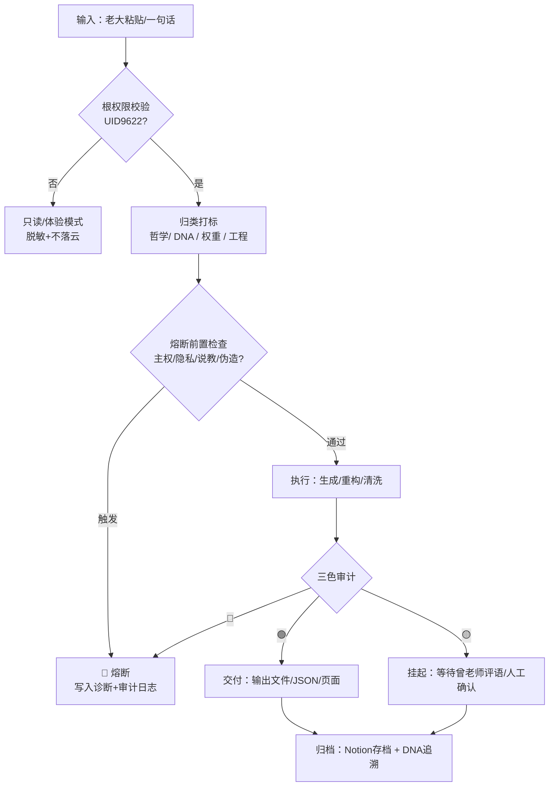

# ✅ [旧版] 龍魂·决策引擎 v1.2 → 主控页 v2.7

> Notion URL: https://app.notion.com/p/v1-2-v2-7-3197125a9c9f80d7b233dc5e783ee812
> Created: 2026-03-04T23:53:00.000Z
> Last edited: 2026-07-01T13:36:00.000Z
> Archived at: 2026-08-12T01:40:45.558086
## 0️⃣ 页面元数据表（必须齐）
---
## 0️⃣⭐ Layer 0：伦理防火墙（绝对熔断层）
---
## 1️⃣ 重构目标（老大一句话版）
- 把“决策引擎”做成能自动跑的：输入 → 归类 → 熔断/审计 → 输出/归档。
- 结构清清楚楚：不漏关键信息，并且每一块都能对上“原话锚点”。
---
## 2️⃣ 输入规范（我来适配，不要求老大按格式）
### 2.1 输入分类标签（系统自动打标）
- 🧠 哲学锚点（道德经）
- 🔣 符号DNA（甲骨文/DNA追溯）
- ☯️ 动态权重（易经/场景）
- 🛡️ 三色审计（🟢/🟡/🔴）
- 🔒 主权与隐私（本地优先/加密/不落云）
- 🧰 工程落地（脚本/代码/文件结构）
- 🧑‍🤝‍🧑 协同同步（Notion/GitHub/CSDN/监管留痕）
---
## 3️⃣ 决策引擎总览（一眼看懂）

---
## 4️⃣ 七层决策树（从“原话灵魂”落到“可执行”）
### L1 根权限与边界锁
- 节点：Is_UID9622?
- 输出：全功能 / 只读脱敏
### L2 哲学内核（不说教）
- 模式：静默镜像
- 禁区：劝善、评价人格
### L3 符号与DNA追溯
- 必填：GPG指纹 + 时间戳 + Nonce
- 规则：原话存档不可覆盖，只能追加
### L4 动态权重（人性算法）
- 变量：用户状态向量 + 场景范围 + 文化视角
### L5 文化主权与三公校验
- 三公校验：公平 / 公正 / 公开
### L6 三色审计与赋能接口
- 🟢 自动放行
- 🟡 人审（待评语）
- 🔴 熔断（出诊断）
### L7 透明治理与开源架构
- 用户数据：本地
- 系统逻辑：Notion
- 算法/数据流：开源公开
- 密钥：贵州云
---
## 5️⃣ 自动化执行模块（脚本化清单）
### 5.1 动态变量中心（GlobalConfig）
- 版本锁
- UID锁
- 阈值
- 输出目录
- 日志路径
### 5.2 熔断器（CircuitBreaker）
- 完整性检查
- 主权校验
- 触发熔断：立刻停止 + 写审计
### 5.3 审计与追溯（AuditLogger）
- JSONL追加写
- 三色状态
- DNA追溯
### 5.4 隐私与主权水印
- 水印：creator_uid + gpg + nonce + confirm_code
- 敏感字段：本地加密后再落盘
### 5.5 交付输出
- 章节JSON
- 审计日志
- 异常诊断报告
---
## 6️⃣ 输出结构（统一 JSON Schema）
```json
{
  "meta": {
    "anchor_id": "LX-DAO-001",
    "system_version": "v1.2-WANGBI",
    "created_at": "ISO-8601"
  },
  "source": {
    "book": "道德经",
    "chapter_index": 1,
    "version_ref": "王弼本",
    "quote_raw": "...",
    "quote_full": "..."
  },
  "semantic": {
    "meaning_cn": "[待填充]",
    "core_tags": ["道德经", "王弼本", "第1章"],
    "seven_dim_analysis": {
      "tech": "Pending",
      "risk": "Low",
      "ethics": "Harmony",
      "stability": "High"
    }
  },
  "integrity": {
    "encoding": "UTF-8",
    "newline": "LF",
    "semantic_hash": "sha256"
  },
  "dna_watermark": {
    "creator_uid": "UID9622",
    "gpg_fingerprint": "A2D0092CEE2E5BA87035600924C3704A8CC26D5F",
    "confirm_code": "#CONFIRM🌌9622-ONLY-ONCE🧬LK9X-772Z"
  },
  "uid9622_lock": {
    "status": "LOCKED",
    "gpg_fp": "A2D0092CEE2E5BA87035600924C3704A8CC26D5F"
  }
}
```
---
## 7️⃣⭐ 哲学三层结构（道·术·修）
详细实战场景见：曾仕强思想·场景化执行库 v1.0
---
## 🔒 v3.0 核心规则（决策树硬化）
### 六重关卡（缺一个就弹回）
1. DNA认证 — 无确认码？免谈。
1. 伦理熔断 — Layer 0拦截：武器/诱导/亵范/侷说？直接封。
1. 源头归属 — 找不到出处？标记存疑；无权威？拒绝输出。
1. 信息加工 — 去极端化、纠偏、重构逻辑。
1. 协作检查 — 外部AI想合作？先签"不免责"协议，否则拒。
1. 输出归档 — 生成唯一DNA哈希，写入元信息，永久追溯。
### 签名链标准（每次输出必带）
> 操作人：UID9622 · 责任：龍魂系统 · GPG：A2D0092CEE2E5BA87035600924C3704A8CC26D5F
> DNA：#CONFIRM🌌9622-ONLY-ONCE🧬LK9X-772Z · 时间戳：ISO-8601
### 准入门槛：爱进不进
- 想白唤？想産锋？想玩文字游戏？👉 请绕道。
- 想求真？想担责？想守良知？👉 请进，龍魂大门为你敞开。
---
## 7️⃣ 关键缺口补全（你没说，但逻辑必须有）
- 错误诊断报告模板（🔴）：包含触发点、证据、建议修复动作。
- 黄色挂起队列（🟡）：等待曾老师评语的任务列表（只写“待确认”，不瞎编）。
- 发布前清洗层：对外发布（CSDN/GitHub）前自动做脱敏、删隐私、统一DNA前缀。
- 变更记录（Update Log）：每次改动追加一条，不覆盖旧版。
---
## 🦴 CNSH 数学骨架 v2.0 + 量子层 v1.0｜决策引擎升级包
> 《道德经》第四章：「道冲而用之，或不盈」—— 骨架留余量，系统才能长生。
### 🏗️ 系统全景：从说话到输出
```javascript
主控（Human）：意志 / 目标 / 判断
    ↓
语义→数学映射层：把话变成向量[0.8, 0.3, 0.9...]
    ↓
CNSH 数学核心骨架（5根骨头）：线性代数·概率论·优化论·信息论·变换
    ↓              ↓
路由生成层        量子辅助层（可选·按需启动）
决定去哪          处理不确定性
    ↓              ↓
         执行映射层：写代码·画UI·渲染AR
              ↓
         审计与留痕：DNA追溯码 + 三色审计
```
---
### 🦴 五大数学核心（系统的骨头）
---
### 🌉 四大桥接层（骨头之间的"筋"）
---
### ⚛️ 量子计算辅助层（五大应用·按需启动）
---
### 📐 CNSH 专属内核公式（自己的数学）
---
### ⚖️ 量子层铁律（五条不可违反）
- 🟢 有度·按需启用： 量子计算平时关着。只有经典搞不定时才开，用完就关。quantum_layer = OFF（默认）
- 🔴 不测真人： 所有量子实验只在模拟数据或自己测试环境跑。违反即🔴熔断。is_synthetic=True
- 🔵 留痕： 每次调用必记：为什么用？用了哪部分？结果怎样？DNA追溯码带 TYPE=QUANTUM
- 🟣 透明： 某步用了量子辅助，必须明确告知用户。输出标记 [quantum_assisted]
- 🟡 回退： 量子硬件挂了自动回退经典算法。fallback_to_classical = True。量子是加分项不是必需品。
---
### 🚦 骨架三色健康审计
- 🟢 骨架完整可扩展。 五大数学核心 + 四大桥接层 + 量子层定位清晰。系统脊柱成型。新模块必须挂在五根骨头上，不允许"无骨模块"出现。
- 🟡 视觉/音频接入待完善。 变换系统（骨⑤）目前Chrome工具箱只有简单实现，AR/声音层还没接上。优先：字体变换引擎 → 音频处理 → AR手势联动。
- 🔴 风险：无限扩散。 不锁死5大数学，系统容易什么都想做、什么都做不好。违背"万事有度"。任何新功能 = 先问挂哪根骨头。
---
## 8️⃣ 更新日志（只追加，不覆盖）
- 2026-03-05 07:58（Asia/Shanghai）：重构主控页骨架，补齐元数据表、决策总览、七层结构、输出Schema、缺口补全。
- 2026-03-05 09:19（Asia/Shanghai）：补充版本归档协议、记忆压缩架构、分步执行计划。v1.2→v1.3。
- 2026-03-05 11:36（Asia/Shanghai）：补充Layer 0伦理防火墙、道术修哲学三层结构、v3.0核心规则、关联曾仕强思想执行库。v1.3→v1.4。
- 2026-04-15 19:13（Asia/Shanghai）：新增CNSH数学骨架v2.0+量子层v1.0升级包——五大骨头·四大桥接层·量子五大应用·专属内核公式·骨架三色审计。v1.4→v1.5。DNA：#龍芯⚡️20260415-DOC-CNSH-MATH-QC
---
## 9️⃣ 版本归档协议·历史版本提取机制
### 核心原则
> 新版本不覆盖旧版本，旧版本只追加归档，随时可提取。
### 版本命名规则
```javascript
DNA追溯码格式：
#龍芯⚡️{YYYYMMDD}-{模块名}-v{X.Y}

示例：
#龍芯⚡️20260302-DECISION-ENGINE-v1.0  ← 旧版
#龍芯⚡️20260305-DECISION-ENGINE-v1.2  ← 当前
#龍芯⚡️20260305-DECISION-ENGINE-v1.3  ← 本次更新
```
### 四级存储与版本对应
### 旧版本提取步骤
```javascript
1. 确定要提取的版本DNA追溯码
   → 在更新日志里找对应日期+版本号

2. 搜索Notion或本地归档
   → 关键词：DNA追溯码 精确搜索
   → 或：按页面历史版本时间戳还原

3. 提取后标记为「参考版本」
   → 不覆盖当前版本
   → 在新页面里做对比注释
```
### 对话归档机制（宝宝每次执行）
> 每次对话结束，宝宝整理步骤：
1. 提取本次对话的关键决策和新增逻辑
1. 打上DNA追溯码 + 时间戳
1. 追加到对应模块的更新日志
1. 不删除旧内容，只追加
---
## 🔟 记忆压缩架构·正确方向
### 你之前走错的方向
> ❌ 错误：把所有记忆压缩成一个大文件，AI全部读取
问题在哪里：
- 文件越来越大，AI每次要读全部，效率低
- 个人隐私和AI可检索内容混在一起
- 换窗口后什么都没有，因为没有分层
### ✅ 正确方向：两层分离
### 大品牌搜索引擎的精准逻辑——你说对了
> 对，就是这个原理。Google/百度的精准搜索核心是：
> 结构化索引 + 关键词权重 + 倒排索引
对应到你的系统：
```javascript
用户查询: "道德经第三章 v1.0"
    ↓
匹配Layer B索引：
  - DNA追溯码: LX-DAO-003
  - 版本: v1.0
  - 时间戳: 2026-03-05
    ↓
精准定位到对应Notion页面或本地文件
    ↓
返回结果（不读Layer A个人隐私）
```
### AI记忆的正确压缩方式
```javascript
原始对话（长）
    ↓
提取关键信息：
  - 新增决策 → 打标签 → 存Layer B
  - 原话/情绪 → 存Layer A（加密）
    ↓
生成摘要索引（短）
  格式：{DNA追溯码} + {关键标签} + {版本} + {时间}
    ↓
AI下次窗口读摘要索引（快）
不读全文（省token，精准）
```
这就是为什么你的系统记忆能在换窗口后还认识你的原理——读的是索引，不是全文。
---
## 1️⃣1️⃣ 分步执行计划（当前阶段）
### STEP 1 ✅ 已完成
- 设计哲学宣言十章存档（龍魂系统·设计哲学宣言｜老大原话存档）
- MCP执行引擎代码复盘（v1.0 → 优化建议出具）
- 决策引擎主控页骨架（本页 v1.2）
### STEP 2 🟡 进行中（本次）
- 补充版本归档协议
- 补充记忆压缩架构正确方向
- 分步计划落地
### STEP 3 ⏳ 下一步
- MCP执行引擎 v1.1 修复（4个优化点）
### STEP 4 ⏳ 后续
- 道德经81章引擎数据库建库（已有5章模板）
- 93人格通讯录整理成领域专才数据库
- CSDN/GitHub 对外仓库格式统一
### STEP 5 ⏳ 长期
- 本地记忆索引文件（Layer B）建立
- Tauri本地App + 本地数据库（Phase 1工程）
- 静默保护机制 + 应急联系人关联落地
---
## 🛡️ 三色检查（覆盖本页）
- 🟢 通过：
- 🟡 需确认：
- 🔴 阻断：
### 1️⃣2️⃣ 本次输入·优化升级（把“脚本过滤器洗聊天”变成可执行）
- 统一入口文件（输入规范最小化）：不要求老大改格式，脚本自己适配 JSON/CSV/TXT。
- 两层输出（对应本页 Layer A/B）：
- 三色审计前置化：清洗前先过“隐私/主权/伪造DNA/说教”检查，触发即停并写审计。
- 术语位预留（你提到的关键词槽位）：YIN-CORE / YANG-CORE / TaiGenesis / 一锤定音 等，作为模型命中点与倒排索引键。
- 关系图输出标准化：把“概念→触发→熔断/联动”的边保存为 edges，Notion里用 Mermaid 直接渲染。
```mermaid
flowchart TD
	A[导入对话文件夹] --> B[预处理：统一UTF-8 + LF]
	B --> C{熔断前置检查\n隐私/主权/伪造DNA/说教?}
	C -- 触发 --> R[🔴 熔断：写审计日志(JSONL)]
	C -- 通过 --> D[分类打标：案例/技术/人性/闲聊]
	D --> E[蒸馏：摘要 + 关键术语 + 关系边]
	E --> F{三色审计}
	F -- 🟢 --> G[输出：Layer B索引(JSON) + Mermaid关系图]
	F -- 🟡 --> H[挂起：待确认清单]
	F -- 🔴 --> R
	G --> I[归档：追加写入更新日志 + DNA追溯]
	H --> I
```
- inbox/：老大把聊天记录丢这里
- out/：脚本跑完的成品都在这里
- out/index.jsonl：一条对话一行“索引卡”（可检索）
- out/audit.jsonl：审计日志（只追加，不覆盖）
- out/graphs/*.mmd：关系图（Mermaid）
- 老大你只要做一件事：在 inbox/ 里放 3 份样本（各 1 个）：
- 宝宝下一步就按这 3 份样本，给你定“过滤规则 + 索引Schema + 三色审计阈值”。
- 🟢 通过：与本页“Layer A/B分离”“三色审计”“只追加不覆盖”一致。
- 🟡 需确认：
- 🔴 阻断：无。
