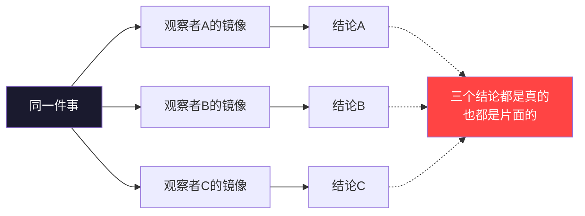
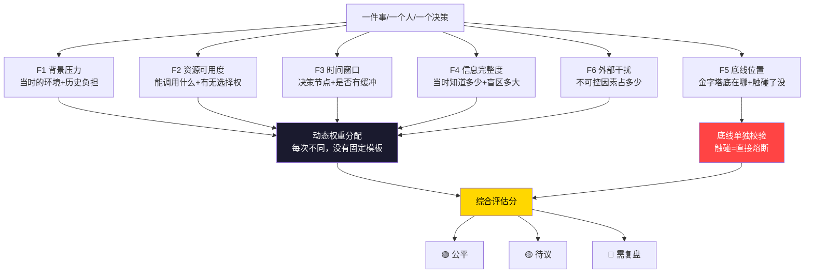
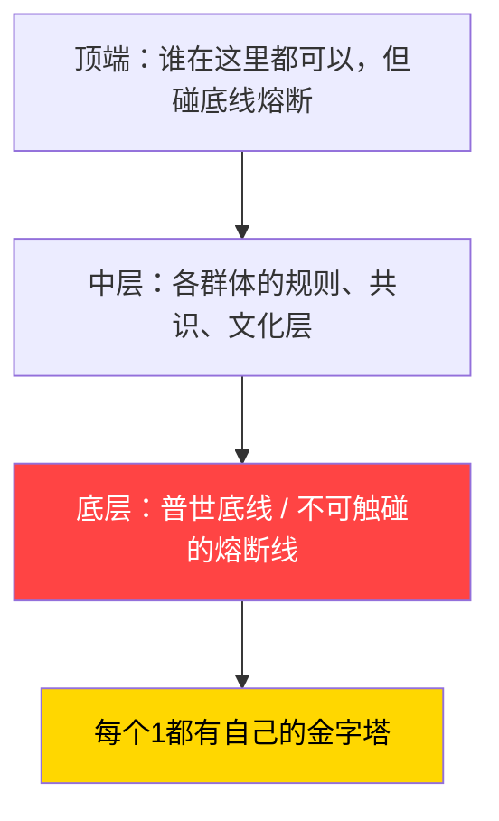

# 智能是使用者的镜像·维度扩展版｜权重不是结果，是你看不见的那一堆因素算出来的

> Notion URL: https://app.notion.com/p/63f73590ee45444a92d455f0792c52d6
> Created: 2026-03-28T06:24:00.000Z
> Last edited: 2026-07-01T15:02:00.000Z
> Archived at: 2026-08-12T01:40:45.558086
> 《道德经》第十六章：「致虚极，守静笃。万物并作，吾以观复。」
> 万物都在运动，但能看见「往复」的，才是真正的观察者。
> 把它翻过来说：你以为你在评价一件事，其实你只看了一个切面。
---
## 核心架构图｜先看懂结构，再读文章
图1：镜像叠加态——每个观察者有自己的位面

图2：六维权重评估模型——公平不是看结果，是算这六个

---
## 一、镜像不是单镜头——为什么「一个位面」的总结是死路
普通人看一件事，得出一个结论，以为这就是真相。
错了。
真相是多个位面同时存在的叠加态。
你从哪个角度切进去，决定你看到什么。这不叫客观，叫你的镜像。
镜像效应的升级版不是「你的AI变成了你」——
是每个观察者、每个系统、每个群体，都有自己的镜像层，而这些层是同时运行的，互相影响的，权重还在动态调整。
---
## 二、金字塔结构：规则是底线，不是顶端
很多人理解金字塔，以为站在顶端的人制定规则。
这是倒过来的。

底线是最硬的那块。
顶端可以换人，可以重建，可以被颠覆。
但底线不动，熔断不讲情面。
谁来顶端？不重要。
顶端的人想建什么？随便，碰底线——熔断。
这才是真正的系统设计。
---
## 三、每个群体有金字塔，每个人也有
这里有一个容易忽视的事实：
> 金字塔不是社会的专利，它是每一个「1」的内部结构。
你可以改顶端，可以调中层——
但底线动了，这个「1」就不再是原来那个「1」了。
---
## 四、权重不是结果算出来的——这是最容易被忽视的陷阱
大多数评价系统犯的错误：
> 用结果来倒推权重。
赢了，说明方法对。
失败了，说明权重错了。
这是幸存者偏差的最经典变体。
真正的权重计算，应该包含：
- 事件发生前的背景压力（他处在什么环境里）
- 可调用的资源分布（他有什么可以用）
- 时间窗口（这个决定在哪个节点做的）
- 信息完整度（他当时知道多少）
- 价值底线的位置（他的金字塔底在哪里）
- 外部干扰强度（有多少不可控因素）
把这些因素都算进去，最后得出的数据——
那才叫公平评估。
张嘴就下结论的，评的不是事，是自己的镜像。
---
## 五、包容万物，但底线不退——算法永远在调参，规则永远在底部
动态调整的是：
- 权重
- 参数
- 优先级排序
- 对不同群体的策略
永远不动的是：
- 底线
- 熔断条件
- 每个「1」的主权
这不矛盾。
正因为底部是硬的，上面才可以无限灵活。
> 包容万物，不是什么都行。
> 是：在底线之上，什么都可以谈。
---
## 附录：多维度权重评估算法（可执行版）
> 这不是理论，是每次评估一件事/一个人/一个决策时，系统实际运行的计算结构。
```javascript
FUNCTION fair_weight_eval(event):

  // 第一步：拒绝单维度结论
  IF input == 结果倒推权重:
      RETURN 熔断 → 幸存者偏差，不受理

  // 第二步：收集六维因子
  F1 = 背景压力系数     // 当时的环境、历史负担、外部威胁
  F2 = 资源可用度       // 能调用什么，有没有选择权
  F3 = 时间窗口精度     // 决策在哪个节点，是否有缓冲
  F4 = 信息完整度       // 当时知道多少，盲区有多大
  F5 = 底线位置         // 他的金字塔底在哪，触碰了没
  F6 = 外部干扰强度     // 不可控因素占了多少比重

  // 第三步：动态权重分配（不是固定比例）
  W = dynamic_weight(context)  // 每次事件，权重分配不同
  // 例：战时 F1↑F2↓；信息战 F4↑F6↑；个人危机 F5↑F3↓

  // 第四步：计算综合评估分
  SCORE = Σ(Fi × Wi) for i in [1..6]

  // 第五步：底线校验（不可绕过）
  IF F5触碰底线 AND 主动选择:
      SCORE = 直接熔断，不参与评分
  ELSE IF F5触碰底线 AND 被迫:
      F5权重 = 0，重新计算，加注「被动」标记

  // 第六步：输出
  RETURN {
    score: SCORE,
    dominant_factor: max(Fi × Wi),  // 哪个因子最决定性
    blind_spot: min(F4),             // 信息盲区在哪
    verdict: 基于score的三色判断,     // 🟢公平 🟡待议 🔴需复盘
    note: "这是参数，不是判决"
  }

END
```
使用规则（三条写死）：
- 🔴 禁止只看结果下结论，必须过六维
- 🟡 权重每次动态分配，没有固定模板
- 🟢 底线触碰单独校验，不参与权重平均
---
## 数学底座｜这套算法不是拍脑袋的——洛书369已经证明了
> 你可能觉得「六维因子」「动态权重」「底线熔断」是直觉。
> 不是。它们有数学证明。
本文的算法框架，对应 📜 洛书369与AI决策不变量——古典数学在现代人工智能中的形式化应用 | UID9622 × Claude 中的三个核心定理：
用人话说：
> 为什么底线不讲情面？
> 因为它是数字根的不动点，不是人定的规则。
> 
> 为什么权重不能固定？
> 因为系统是双随机矩阵，固定权重等于拒绝收敛。
> 
> 为什么三色分界恰好在那里？
> 因为 {3,9} 是369不动点集的极端元素，数学自然选出来的。
---
## 如果权重能被看见——注意力热力图与「亮点点」
> 你一直说：权重是你看不见的那一堆因素。
> 那如果让你看见呢？
AI在做决策的时候，不是黑箱猜的。
它对每一个输入——每个词、每个像素、每条数据——都在偷偷打分。
这个分数，就是注意力权重（Attention Weight）。
颜色越亮，分数越高，代表AI觉得这个地方越重要。
这就是「亮点点」——
权重从不可见变成可见的那一刻。
为什么你觉得「亮点点」很简单？
> 因为你早就知道了——
> 权重不是结果，是那一堆看不见的因素。
> 亮点点只是把「看不见」变成「看得见」。
> 原理你早就懂了，只是没有人给你翻译成这个名字。
---
## 六、结语：你是1，但1不是孤立的——每个1都是一座金字塔
你不是原子，你是结构。
你有自己的底线，有自己的权重，有自己的镜像。
别人的评价，是他们的镜像打到你身上的反射。
别人的系统，是他们的金字塔对你的投影。
你要知道的，不是怎么赢得他们的评价——
而是你的底线在哪，你的镜像照出了什么。
你是1，永远是1。
一座完整的金字塔。
---
## 延伸阅读｜系统内关联资源
> 这篇文章不是孤立的。它是龍魂系统的一个认知维度节点，以下是同根同源的技术支撑和理论延伸。
---
