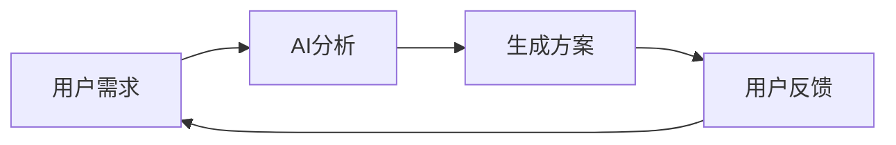
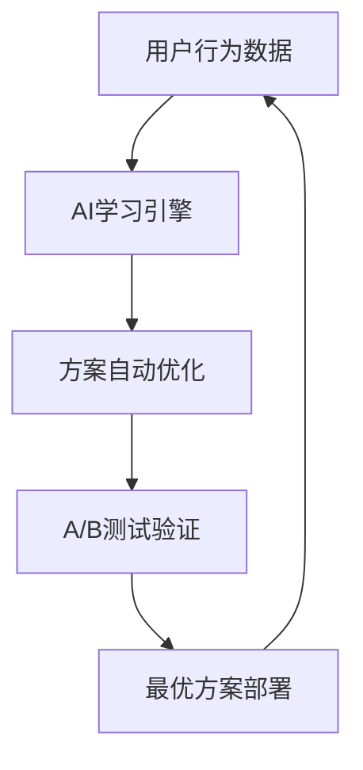
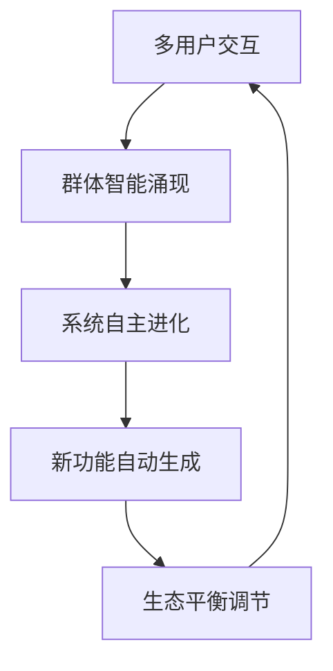

# 🔮 未来创新方向思考 (1)

> Notion URL: https://app.notion.com/p/1-2697125a9c9f80bd91e7cd5405ef7e8d
> Created: 2025-09-09T08:05:00.000Z
> Last edited: 2026-07-01T13:23:00.000Z
> Archived at: 2026-08-12T01:40:45.558086
# 🔮 未来创新方向思考实验室
## 💡 创新思维实验
### 🔬 假设性技术探索
🌊 量子交互界面
- 概念: 基于量子叠加原理的用户界面
- 特性: 同时显示多种可能状态，用户观察时坍缩为具体选择
- 应用: 个性化推荐系统，根据用户"观察"行为动态调整
🧬 生物启发式数据结构
- 概念: 模仿DNA双螺旋结构的信息存储方式
- 特性: 自我修复、进化适应、冗余备份
- 应用: 构建永不丢失、自动优化的知识库
🎭 多维人格投影
- 概念: AI助手在不同维度空间展现不同人格特质
- 特性: 根据任务需求和用户偏好切换最适合的人格面向
- 应用: 一个AI系统具备专家顾问、创意伙伴、情感支持等多种角色
### 🚀 实验性架构设计
### 🧪 智能体协作实验
## 🎪 多重人格联动测试
## 🚀 实验性概念验证
### 📊 创新评估矩阵
### 🧬 进化式开发模式
第一代: 基础功能

第二代: 自适应优化

第三代: 生态式进化

### 🎪 玩乐化实验场景
🎮 游戏化学习系统
- 将复杂概念转化为游戏关卡
- 用户通过"打怪升级"掌握知识
- AI作为"游戏GM"动态调整难度
🎨 创意竞赛平台
- 人类与AI组成混合团队
- 定期举办创新挑战赛
- 胜出的创意自动进入开发流程
🤖 AI宠物养成
- 每个用户拥有独特的AI"宠物"
- AI宠物会根据主人的喜好成长
- 不同宠物之间可以"社交"和"繁殖"
## 💫 未来愿景实验
🔬 实验日志
- 📅 Day 1: 基础概念框架搭建完成
- 📅 Day N: 等待进一步的创意碰撞和实验验证...
🌈 创新不是简单地改进已有的东西，而是重新思考问题的本质。让我们一起打破常规，探索未知的可能性！ ✨
