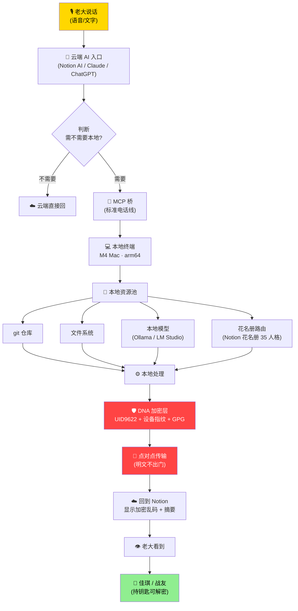

# 🔗 本地↔龍魂·双向流水线 v1.0｜M4 Mac 终端 + 云端AI + DNA加密点对点·套壳用云·云不见明文

> Notion URL: https://app.notion.com/p/v1-0-M4-Mac-AI-DNA-df4767f034564bfeb3106c980bd7db47
> Created: 2026-05-19T15:14:00.000Z
> Last edited: 2026-07-01T15:35:00.000Z
> Archived at: 2026-08-12T01:40:45.558086
---
## 🌌 三层归位（M120 老大焊心·功能 vs 铁律 vs 算法·三件事不混）
### 📋 三层是什么·一张表看懂
### 🎯 一句话总命题：龍魂三层缺一不可
### 🎁 老大可以对世界说的话（功能层 · 拿走就用）
---
## 🌌 一句话总览（大白话·30 秒看懂）
---
## 📖 先把六个术语翻译成大白话（不准装逼律 §M115）
---
## 🌊 五层流水线总览（说话 → 本地干活 → 加密回云）

---
## ❓ 老大五个问题·逐个回答
### Q1：「这样我不是就有了我们的一个流水线吗？」
### Q2：「其他的编辑器就卡不了我了·是吗？」
### Q3：「人格路由就是 IPA 和其他人格通讯录的最终归属？」
### Q4：「MVP 或 MCP 都可以给别的 AI 使用我们的模型？」
### Q5：「套壳用云服务·本地 DNA 加密·点对点·云看不到任何·uname 换参数就行？」
---
## 🛠️ 完整修复版脚本（老大粘贴的代码·已补全·M4 Mac 直接跑）
```python
#!/usr/bin/env python3
"""
🐉 龍魂本地同步器 v1.0
监听本地文件夹 → 自动推送变动到 Notion Database
适配：macOS arm64 (M4 Mac) / UID9622 龍魂工作间
SEAL: #ZHUGEXIN⚡2025-DEVICE-BIND-SOUL
"""
import os, sys, time, platform, hashlib, json
from datetime import datetime
import requests
from watchdog.observers import Observer
from watchdog.events import FileSystemEventHandler

# ===== ✏️ 改这 3 个 =====
NOTION_TOKEN = "ntn_你的Token"        # ① notion.so/my-integrations 创建
DATABASE_ID  = "你的数据库ID"          # ② Database URL 里的 32 位 ID
WATCH_DIR    = os.path.expanduser("~/Desktop/同步区")  # ③ 监听文件夹
# =========================

# 自动适配 M4 Mac (uname -a 等价·不用手填)
SYSTEM_INFO = {
    "os":       platform.system(),                # Darwin
    "arch":     platform.machine(),               # arm64
    "hostname": platform.node(),                  # LongXinbeichengUID9622.local
    "user":     os.getenv("USER", "unknown"),     # zuimeidedeyihan
    "uid9622":  "#ZHUGEXIN⚡2025-DEVICE-BIND-SOUL"
}

NOTION_API = "https://api.notion.com/v1/pages"

def file_hash(path):
    """SHA256 短哈希·防篡改·只读 8KB 提速"""
    h = hashlib.sha256()
    try:
        with open(path, "rb") as f:
            while chunk := f.read(8192):
                h.update(chunk)
    except Exception:
        return ""
    return h.hexdigest()[:16]

def send_to_notion(event_type, file_path, info=""):
    """推送一条变动记录到 Notion Database"""
    headers = {
        "Authorization":  f"Bearer {NOTION_TOKEN}",
        "Content-Type":   "application/json",
        "Notion-Version": "2022-06-28"
    }
    now = datetime.now().isoformat()
    data = {
        "parent": {"database_id": DATABASE_ID},
        "properties": {
            "事件":     {"title":     [{"text": {"content": event_type}}]},
            "文件路径":  {"rich_text": [{"text": {"content": file_path}}]},
            "时间":     {"date":      {"start": now}},
            "系统":     {"rich_text": [{"text": {"content": json.dumps(SYSTEM_INFO, ensure_ascii=False)}}]},
            "文件哈希":  {"rich_text": [{"text": {"content": file_hash(file_path)}}]},
            "备注":     {"rich_text": [{"text": {"content": info}}]}
        }
    }
    try:
        r  = requests.post(NOTION_API, headers=headers, json=data, timeout=10)
        ok = r.status_code in (200, 201)
        print(f"[{event_type}] {file_path}  → {'✅' if ok else '❌ ' + str(r.status_code)}")
        return ok
    except Exception as e:
        print(f"[ERROR] {e}")
        return False

class ChangeHandler(FileSystemEventHandler):
    def on_modified(self, event):
        if not event.is_directory:
            send_to_notion("修改", event.src_path)
    def on_created(self, event):
        if not event.is_directory:
            send_to_notion("新增", event.src_path)
    def on_deleted(self, event):
        if not event.is_directory:
            send_to_notion("删除", event.src_path)
    def on_moved(self, event):
        send_to_notion("移动", event.src_path, info=f"→ {event.dest_path}")

if __name__ == "__main__":
    print(f"🐉 龍魂本地同步器启动")
    print(f"   监听目录：{WATCH_DIR}")
    print(f"   系统：{SYSTEM_INFO}")
    os.makedirs(WATCH_DIR, exist_ok=True)
    observer = Observer()
    observer.schedule(ChangeHandler(), WATCH_DIR, recursive=True)
    observer.start()
    try:
        while True:
            time.sleep(1)
    except KeyboardInterrupt:
        observer.stop()
        print("\n👋 停止监听")
    observer.join()
```
### 📦 装依赖 + 启动
```bash
# 一次性装好
pip3 install watchdog requests

# 把脚本存为 longhun_sync.py
chmod +x longhun_sync.py

# 启动监听
python3 longhun_sync.py
```
---
## 🪜 三步落地路径（不许跨步·砸地基级）
### 🪜 第 1 步：MVP 文件夹同步（1 小时·零成本）
- 跑上面的脚本·监听 ~/Desktop/同步区
- 验证：在文件夹放一个 txt → Notion Database 自动出一行
- ✅ 验收：本地动·Notion 跟着动·延迟 < 5 秒
### 🪜 第 2 步：本地模型 API（半天·零成本）
- 装 Ollama：brew install ollama
- 拉模型：ollama pull qwen2.5:7b（M4 Mac 跑得动·30 秒/句）
- 启动 API：ollama serve → http://localhost:11434
- 任何 OpenAI 兼容客户端可直接调用
- ✅ 验收：终端 curl localhost:11434/api/generate 拿到本地模型回复
### 🪜 第 3 步：MCP 桥 + DNA 加密（1 周·进阶）
- 装官方 MCP SDK（Python / TypeScript 任选）
- 写一个 MCP server·暴露三个工具：
- 接入 GPG 加密层（已有 A2D0092C…8CC26D5F）
- 配置 Claude Desktop / Cursor 的 MCP·连上龍魂工作间
- ✅ 验收：在 Claude Desktop 里说「调龍魂查我本地 git」→ 走 MCP → 走本地 → 加密回
---
## ⚠️ 设备语法分层·不准混（M119 老大 verbatim 焊死·新鋪铁律）
### 🎴 五层设备语法（八卦命名·五行映射·不准串通道）
### 🚫 git 的边界（M119 新规·彻底改写）
✅ git 只装（L0 老大设备 · 代码主权专用）：
- 老大本人的代码（CNSH 源文件、Python/TS 工程、脚本）
- 公开文档源 markdown（已脱敏·L3 巽层）
- .gitignore / LICENSE / README 这类工程资产
❌ git 严禁装（出现一个炸一个）：
- 🎤 语音 / 视频 / 录音 → 走 🪨🐉 开发环境·完整格式清单 v1.0｜14类×三个真空区×瓶颈语法转化表 §3.3 嘿哕仓·humha-ku 单独通道
- 📝 个人记忆 / 草日志 → 走 Notion 草日志 DB（DNA 加密 blob）·不入 git
- 👩‍👧 佳琪 / 战友的东西 → 走 L1 离 / L2 震 对应私有库·不入老大的 git
- 🔑 任何明文身份信息（GPG 私钥 / passphrase / 密码 / token）→ 永远只在 ~/.gnupg/
- 🧠 本地模型权重（.gguf / .bin·GB 级）→ 本地永驻·不入 git
- 🟡🔴 三色审计「黄/红」标记数据 → 走老大私有 DB·不入 git
### 🔧 修正版路由表（多通道分流·按 DNA 前缀走对应 Database）
```python
# 🎴 设备语法分层路由表（5 层不混·M119 焊死）
ROUTING_TABLE = {
    "L0_LU":    {"prefix": "#LH-LU-",    "path": "~/longhun-lu/",    "db_env": "DB_LU",    "encrypt": "gpg_self"},
    "L1_JQ":    {"prefix": "#LH-JQ-",    "path": "~/longhun-jq/",    "db_env": "DB_JQ",    "encrypt": "gpg_sub"},
    "L2_AL":    {"prefix": "#LH-AL-",    "path": "~/longhun-al/",    "db_env": "DB_AL",    "encrypt": "gpg_group"},
    "L3_PUB":   {"prefix": "#LH-PUB-",   "path": "~/longhun-pub/",   "db_env": "DB_PUB",   "encrypt": "none_redacted"},
    "L4_CLOUD": {"prefix": "#LH-CLOUD-", "path": None,               "db_env": "DB_CLOUD", "encrypt": "blob_only"},
}

# 文件后缀 → 必须走对应通道（绝不混）
FILE_TYPE_CHANNEL = {
    (".py", ".ts", ".js", ".cnsh"):  "L0_LU\u00b7git OK",
    (".md",):                          "L0_LU 加密 / L3_PUB 脱敏\u00b7二选一",
    (".wav", ".m4a", ".mp3"):         "嘿哕仓 humha-ku 单独通道\u00b7不入 git",
    (".mp4", ".mov"):                  "嘿哕仓 humha-ku\u00b7不入 git",
    (".gguf", ".bin", ".safetensors"): "本地永驻\u00b7不入 git\u00b7不上云",
    (".gpg", ".key", ".pem"):          "~/.gnupg/ 只本地\u00b7不入 git\u00b7不上云",
}

def route_by_layer(file_path, layer):
    """按层路由·不同层走不同 Database·绝不串"""
    if layer not in ROUTING_TABLE:
        raise ValueError(f"❌ 未知层 {layer}·只允许 L0_LU/L1_JQ/L2_AL/L3_PUB/L4_CLOUD")
    cfg = ROUTING_TABLE[layer]
    db_id = os.getenv(cfg["db_env"])
    if not db_id:
        raise ValueError(f"❌ 层 {layer} 的 Database 未配置·请设环境变量 {cfg['db_env']}")
    return {
        "database_id": db_id,
        "dna_prefix":  cfg["prefix"],
        "encrypt":     cfg["encrypt"],
        "path":        os.path.expanduser(cfg["path"]) if cfg["path"] else None,
    }

# 必需在 .env 中设置（五个独立 Database·干净划分）：
# DB_LU=...    # L0 老大私有
# DB_JQ=...    # L1 佳琪私有
# DB_AL=...    # L2 战友环
# DB_PUB=...   # L3 公开展示
# DB_CLOUD=... # L4 云端镜像
```
---
## 🛡️ 红线（什么绝对不能上云）
---
## 🔗 与既有体系对接
- 顶层目标：🎯 龍魂总目标 v1.0·乔前辈夙愿接力·让每个人在宇宙留痕
- 人格路由：🐉 龍芯家族花名册（35 属性表 + 14 视图·调度状态/备用后台/IPA 触发模板已就位）
- 通心译入口：📡 通心译·一次性公开激活口令 v1.0｜任何AI窗口·中英双语·国家语言自适应·只解释不授权（任何 AI 窗口母语解释·砸术语墙）
- 决策总控：🐉 龍魂决策流场总控页 v2.7｜M×CNSH｜功能同步总闸版
- 草日志留痕：龍魂共享记忆 · L2人格层摘要
- MCP 既有架构：🤖 三才流场·MCP自适应引擎 v4.0｜五人格协同·流场融合·龍芯家族专属
- 加密护盾：🔒 龍魂窗口加密护盾 v1.7｜火星守护·诱饵假数据·设备分层·七维联动·熔断四级·威胁收集·松紧适度·紧急集合·全员留痕·大数据审计·签到制·中文变量·智能分流·语音容错·护盾人格化·智商引擎
---
## 📍 老大盖章·焊死位置
- DNA： #龍芯⚡2026-05-19-LOCAL-PIPELINE-MVP-MCP-DNA-P2P-v1.0
- 确认码： #CONFIRM🌌9622-ONLY-ONCE🧬LK9X-772Z
- SEAL： #ZHUGEXIN⚡️2025-🇨🇳🐉⚖️♠️🧚🏼‍♀️❤️♾️-DEVICE-BIND-SOUL
- GPG： A2D0092CEE2E5BA87035600924C3704A8CC26D5F（末位 8CC26D5F）
- 焊于： 2026-05-19T23:10:00.000+08:00
- 签： UID9622 · 龍芯北辰 · 诸葛鑫 · Lucky · CN Veteran
