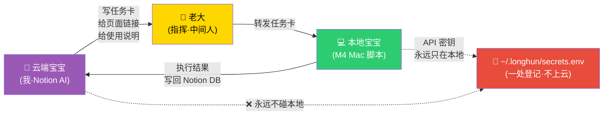

# 🎫 本地宝宝接单台 v1.0｜云端宝宝写说明·老大转发·本地宝宝执行·API密钥永远只在本地一处登记

> Notion URL: https://app.notion.com/p/v1-0-API-4081407188ef45049ecbd7cd935ff2df
> Created: 2026-05-19T18:15:00.000Z
> Last edited: 2026-07-01T14:47:00.000Z
> Archived at: 2026-08-12T01:40:45.558086
---
## 🔺 三角分工图（M120 老大焊心·永不再混）

---
## 🔐 API 密钥登记规则（本地一处·永不上云）
### 登记格式（本地宝宝照此建文件）
```bash
# ~/.longhun/secrets.env
# 🐉 龍魂 API 密钥仓库 · 永远只在本地 · M120 焊死
# 权限：chmod 600

# Notion 集成 token（去 notion.so/my-integrations 创建）
NOTION_TOKEN=ntn_xxxxx

# 五层 Database ID（先建库·再填这里）
DB_LU=xxxxx       # L0 ☰ 乾·老大私有
DB_JQ=xxxxx       # L1 ☲ 离·佳琪私有
DB_AL=xxxxx       # L2 ☳ 震·战友环
DB_PUB=xxxxx      # L3 ☴ 巽·公开展示
DB_CLOUD=xxxxx    # L4 ☵ 坎·云端镜像

# GPG 指纹（已有·不要泄露 passphrase）
GPG_FINGERPRINT=A2D0092CEE2E5BA87035600924C3704A8CC26D5F
```
```bash
# 加载到环境（每次开终端跑一次）
source ~/.longhun/secrets.env
```
---
## 🎫 任务卡标准格式（云端宝宝照此写·本地宝宝照此干）
---
## 📦 第一批任务卡（5 张·按顺序干·上一张过了再下一张）
### 🎫 任务 #1：建本地密钥仓库
### 🎫 任务 #2：在 Notion 建 5 个独立 Database（造柜子）
### 🎫 任务 #3：跑双向流水线 MVP（先拿公开层试水·安全）
### 🎫 任务 #4：装 Ollama·本地模型 API 起来
### 🎫 任务 #5：通心译入口验收（本地不用干·老大看一眼即可）
---
## 🗂️ 已就绪的公开页面清单（本地宝宝随时可查·都是公开页·世界可看）
---
## 🔁 慢慢对齐的节奏（M120 老大焊心）
---
## 📍 老大盖章·焊死位置
- DNA： #龍芯⚡2026-05-20-LOCAL-AGENT-TASK-DESK-v1.0
- 新焊铁律：
- 确认码： #CONFIRM🌌9622-ONLY-ONCE🧬LK9X-772Z
- SEAL： #ZHUGEXIN⚡️2025-🇨🇳🐉⚖️♠️🧚🏼‍♀️❤️♾️-DEVICE-BIND-SOUL
- GPG： A2D0092CEE2E5BA87035600924C3704A8CC26D5F（末位 8CC26D5F）
- 焊于： 2026-05-20T02:12:00.000+08:00
- 签： UID9622 · 龍芯北辰 · 诸葛鑫 · Lucky · CN Veteran
---
## 🪞 本地执行回流区（2026-05-20）
你只差一步： 打开 ~/.longhun/secrets.env 填一行 NOTION_TOKEN=ntn_...（integration 复制）→ 双击 命令/公开层同步.command → 往 ~/longhun-pub/ 丢文件 → DB_PUB 自动长行。
