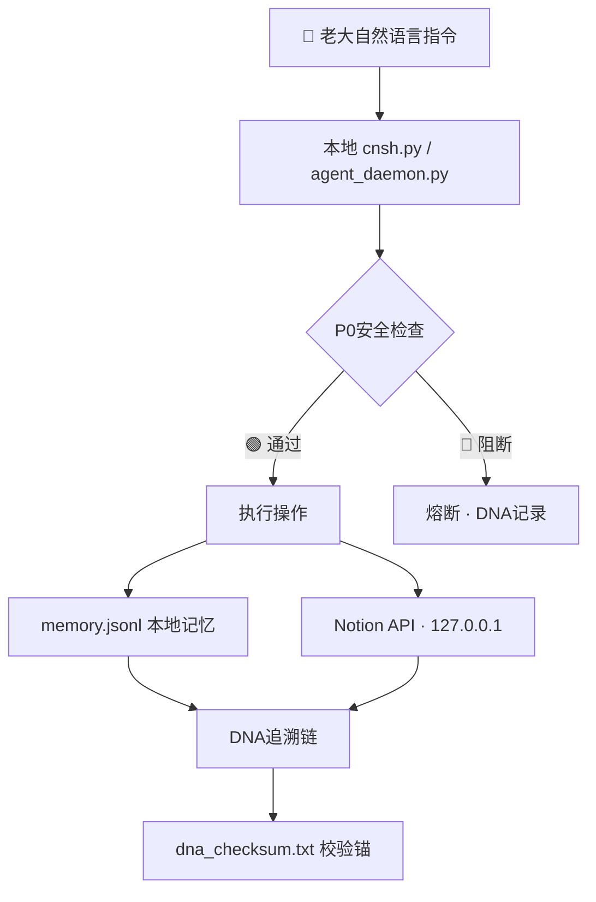

# 本地测试与数据安全防护方案 v1.0 | 龍魂系统

> Notion URL: https://app.notion.com/p/v1-0-859463a6ac0046788b9ae0f105d18beb
> Created: 2026-03-06T07:05:00.000Z
> Last edited: 2026-07-01T15:14:00.000Z
> Archived at: 2026-08-12T01:40:45.558086
## 一、本地测试与数据安全防护方案
---
### 1. 隔离测试环境
- 使用 localhost 或 127.0.0.1 运行本地服务，确保网络请求不暴露到公网
- 在 Notion API 设置中限制 IP 白名单（仅允许本地 IP），并启用 Internal Integration 模式
- 本地开发与生产环境完全隔离，测试操作绝不影响主数据
---
### 2. 敏感数据保护
示例：使用环境变量存储 API 密钥（Python）
```python
import os
from notion_client import Client

# 密钥通过 .env 文件注入，不硬编码在代码里
notion = Client(auth=os.environ["NOTION_SECRET"])
```
- 将 NOTION_SECRET 等凭证存入 .env 文件并加入 .gitignore
- 测试数据使用沙箱页面（Sandbox Page），避免污染生产数据
- .env 示例结构：
```bash
# ~/longhun-system/.env
NOTION_TOKEN='ntn_xxxxxxxxxxxxxxxx'
OLLAMA_HOST='http://127.0.0.1:11434'
SANDBOX_PAGE_ID='your_sandbox_page_id'
```
- .gitignore 必须包含：
```javascript
.env
*.enc
*_checksum.txt
memory.jsonl
dna_log.jsonl
```
---
### 3. 分阶段传输验证
采用 分片压缩 + CRC校验 策略，确保数据完整性与安全性：
第一步：创建带校验的加密压缩包
```bash
# AES-256加密压缩，数据不裸传
tar czvf - ./data_dir | openssl enc -e -aes256 -out data.tar.gz.enc
```
第二步：生成DNA校验码
```bash
# 生成SHA-256校验码，绑定DNA追溯
sha256sum data.tar.gz.enc > dna_checksum.txt

# 追加龍魂DNA标识
echo "DNA: #龍芯⚡️$(date +%Y-%m-%d)-DATA-TRANSFER-v1.0" >> dna_checksum.txt
echo "GPG: A2D0092CEE2E5BA87035600924C3704A8CC26D5F" >> dna_checksum.txt
```
第三步：解密验证（接收端）
```bash
# 先校验，再解密，顺序不能反
sha256sum -c dna_checksum.txt
openssl enc -d -aes256 -in data.tar.gz.enc | tar xzvf -
```
---
### 4. 龍魂安全架构总览

---
### 5. 快速检查清单
---
---
操作日志
