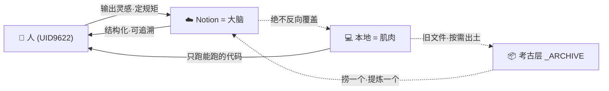

# 🗂️ 本地考古法·三步闭环 v1.0 · 本地↔Notion 对齐公约 | UID9622

> Notion URL: https://app.notion.com/p/v1-0-Notion-UID9622-88c6ee6d019c474e875c595c985bdab7
> Created: 2026-04-18T15:11:00.000Z
> Last edited: 2026-07-01T15:15:00.000Z
> Archived at: 2026-08-12T01:40:45.558086
---
# 🧭 一图看懂：三层职责

---
# 🧘 Step 1 · 冻结（今晚 0 分钟·立规矩）
心法:
- 不删 → 创始人本能要尊重·扎克伯格第一版 Facebook 代码至今锁在保险柜
- 不搬 → 搬家工程量大·容易把能跑的代码拖坏
- 不改 → 任何改动都会污染考古层·失去"时间印记"
---
# 📦 Step 2 · 隔离（有空时 15 分钟·一次性）
隔离完效果:
- 本地 Finder 打开 → 清爽·只剩能跑的项目（LongHunWidget·CNSH 引擎·CNSH 运行时 等）
- _ARCHIVE → 像博物馆地下室·不碍事·不丢失·随时可取
- 符合铁律: 本地 = 代码 · Notion = 大脑
不要做的事:
- ❌ 不要试图一次性整理 _ARCHIVE 内部结构（那是陷阱）
- ❌ 不要建索引·不要做 TOC（让它像地层一样自然沉淀）
- ❌ 不要删重复文件（README.md 和 README 2.md 都留着·它们是版本考古证据）
---
# ⛏️ Step 3 · 按需出土（日常·每次 5 分钟）
为什么这叫闭环:
- 🟢 新来的东西 → 一定进 Notion（大脑更新）
- 🟡 旧东西 → 按需出土（考古队一次挖一件文物）
- 🔴 绝不做的事: Notion → 本地反向覆盖·本地直接当母本
---
# 🚦 什么时候升级到 Step 4？
---
# 🛑 三条红线（本地 vs Notion 永远不能破的底线）
---
# 📜 版本日志（只追加）
