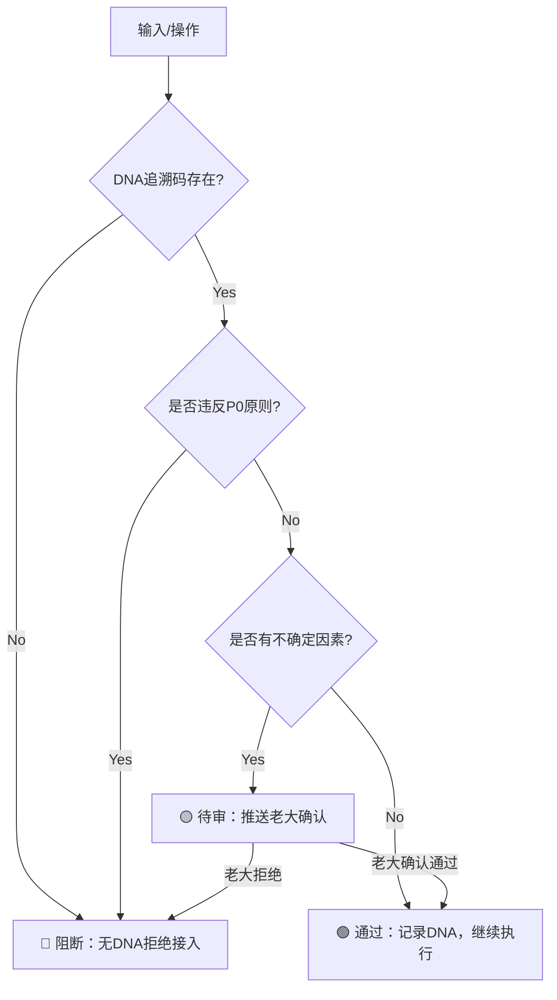

# 模块②：三色审计统一标准｜S1标准页面

> Notion URL: https://app.notion.com/p/S1-887959d2d07d4fb09fe73eda23df5e8e
> Created: 2026-02-14T07:45:00.000Z
> Last edited: 2026-07-01T15:15:00.000Z
> Archived at: 2026-08-12T01:40:45.558086
> 《道德经》第五十八章："其政闷闷，其民淳淳；其政察察，其民缺缺。" —— 治理宽厚则民风淳朴，治理苛察则民心离散。三色审计不是苛察，是守护。
---
## 📋 模块元数据
---
## 🎯 速查版（老大一眼看懂）
---
## 🏗️ 三色定义（统一标准，全模块通用）
### 🟢 绿色：通过
### 🟡 黄色：待人审
### 🔴 红色：阻断
---
## 📊 各模块审计规则（统一汇总）
---
## ⚙️ 审计执行机制
### 审计触发时机
```javascript
所有以下场景，自动触发三色审计：

1. 页面创建/更新 → 检查DNA、格式、引用
2. 对外发布 → 全量三色检查
3. 跨模块引用 → 检查一致性
4. 版本升级 → 检查向后兼容
5. 用户数据操作 → 检查隐私合规
6. 金融交易 → 检查四要素+反洗钱
7. 高风险操作 → 双重审计（AI+人工）
```
### 审计执行流程

### 审计输出格式（统一模板）
所有模块在页面底部必须包含：
```javascript
## 🛡️ 三色检查（覆盖本页）
- 🟢 通过：
  - [具体通过项]
- 🟡 需确认：
  - [具体待确认项]
- 🔴 阻断：
  - [具体阻断项，无则写"无"]
```
---
## 🔐 特殊规则
### 对老大（UID9622）的审计规则
### 对普通用户的审计规则
---
## 🔗 引用关系
---
## 📝 更新日志
---
## 🛡️ 三色检查（覆盖本页）
- 🟢 通过：
- 🟡 需确认：
- 🔴 阻断：
---
> 《易经·革卦》："汤武革命，顺乎天而应乎人" —— 变革要顺应天道、回应民心。三色审计不是管人的工具，是守护人的底线。
DNA追溯码： #龙芯⚡️2026-02-14-三色审计统一标准-v1.0
创建者： 💎 龙芯北辰｜UID9622
确认码： #CONFIRM🌌9622-ONLY-ONCE🧬LK9X-772Z ✅
