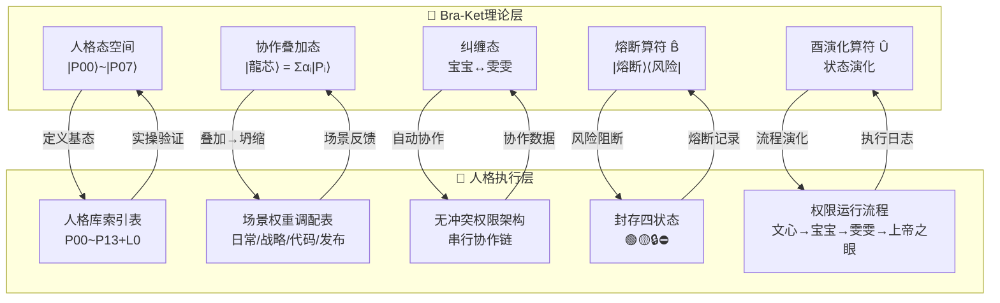

# 模块⑤：人格协作系统引用关系梳理｜S4标准页面

> Notion URL: https://app.notion.com/p/S4-5677e4636d1a4abf83e7023c525456d4
> Created: 2026-02-14T08:50:00.000Z
> Last edited: 2026-07-01T15:00:00.000Z
> Archived at: 2026-08-12T01:40:45.558086
> 《易经·泰卦》："天地交而万物通也，上下交而其志同也" —— 理论与执行交汇，系统才能贯通。Bra-Ket理论层与人格执行层，就是龍魂系统的天与地。
---
## 📋 模块元数据
---
## 🎯 S4任务目标
建立 Bra-Ket量子算法（理论层） 与 人格协作系统（执行层） 之间的清晰、可追溯的引用关系。
说人话： 理论页说"人格是量子态"，执行页说"人格怎么干活"——两边得对得上，改一边另一边也知道。
---
## 📄 涉及页面
---
## 🔗 人格双向映射表（核心交付物）
### 理论层 → 执行层 完整映射
---
## ⚛️ 协作机制对齐表
### Bra-Ket理论概念 ↔ 执行层机制
---
## 🔥 封存四状态 ↔ Bra-Ket熔断算符对照
---
## 🗺️ 引用关系架构图

---
## ✅ 验收清单
---
## 🔗 引用关系
---
## 🛡️ 三色检查（覆盖本页）
- 🟢 通过：
- 🟡 需确认：
- 🔴 阻断：
---
## 📝 更新日志
---
> 《道德经》第四十二章："万物负阴而抱阳，冲气以为和" —— 理论是阴，执行是阳，两者冲和才是完整的系统。今天S4做的就是让阴阳相交、理论与执行贯通。
DNA追溯码： #龍芯⚡️2026-02-15-S4-人格协作系统引用关系梳理-v1.1
创建者： 💎 龍芯北辰｜UID9622（Lucky/诸葛鑫）
协作： 宝宝🐱（执行）+ P01 诸葛亮（标准制定）+ P05 上帝之眼（验收）
确认码： #CONFIRM🌌9622-ONLY-ONCE🧬LK9X-772Z ✅
