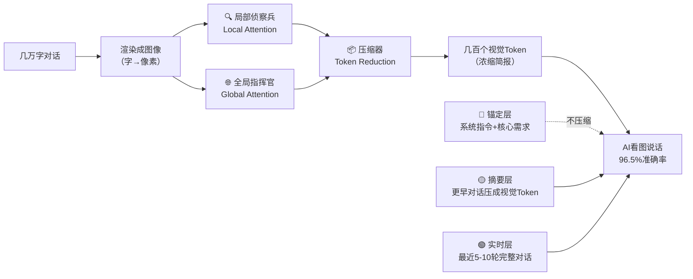

# 深度求索·上下文光学压缩 + 分层记忆｜大白话版

> Notion URL: https://app.notion.com/p/11bbec782e1d4f749b4bc3cc57366795
> Created: 2026-04-22T13:38:00.000Z
> Last edited: 2026-07-01T13:16:00.000Z
> Archived at: 2026-08-12T01:40:45.558086
## 🎯 一句话核心
几万字的聊天记录，先画成一张图，再让AI「看图说话」——就能压到几百字，关键信息一点不丢。
## 💡 为什么这事值得重视（跟普通人啥关系）
你跟AI聊了三小时，它后面忘了前面说啥——不是它笨，是它读字太费劲。
文本越长·算力消耗按平方级爆涨：
光学压缩就是给AI装了个「速读器」——让它过目不忘还不费电。
---
## 🔄 核心架构·一图看懂

---
## 📖 大白话拆解三层
### 第一层：为什么要把字变成图
- AI读字的痛苦：一个字一个字顺着啦，像小学生朗读课文，读到第5000字已经忘了第1个说啥。
- 人看图的爽快：你一眼扫过一张照片，几百个细节同时进脑子，这叫二维并行。
- 结论：那干脆让AI也「看图」而不是「读字」，把长文本先渲染成图像。
### 第二层：深度求索的DeepEncoder三板斧
压缩效果掉头看：几万字 → 席卷图片 → 几百个视觉Token → AI看懂全篇。
### 第三层：分层记忆（模仿人脑遗忘曲线）
就像你自己的记忆——今早吃啥记得清清楚楚，上个月哪天吃啥早忘了，但你妈的生日你永远记得。AI也一样分三层：
---
## ⚙️ 怎么落地（工程方案）
### 触发机制
- 设一个软阈值（比如4000 Token），接近就自动压缩。
- 压缩前先插一个「静默回合」，让AI把关键信息写进 memory/YYYY-MM-DD.md 当备忘录。
### 伪代码示意（看而已·不用背）
```python
def compress_context(dialogue, threshold=4000):
    # 软阈值下不折腾
    if count_tokens(dialogue) < threshold:
        return dialogue
    
    # 静默回合：AI先写备忘录
    memo = extract_key_facts(dialogue)
    save_to_memory(memo, path=f"memory/{today}.md")
    
    # 光学压缩主路径：字→图→视觉Token
    image = render_to_image(dialogue)
    visual_tokens = DeepEncoder(image)  # 10倍压缩·96.5%准确
    
    # 保留实时层 + 摘要层 + 锚定层
    return keep_recent(dialogue, 5) + [visual_tokens] + load_anchor_layer()

# 用户后面问起旧事：memory_search 从向量库捞回
# 信息没丢，只是换了存储方式
```
### 信息闭环
对话上下文 → 压缩/持久化 → 语义检索召回 → 重新注入上下文
### 混合策略（主+辅）
- 主路径：光学压缩（DeepEncoder）
- 辅助：增量滚动摘要 + 结构化JSON提取 + RAG检索增强
---
## 💰 预期收益
- 性能：Token消耗直降一个数量级，算力成本可控。
- 体验：超长对话不再「金鱼记忆」，连贯性接近人类。
- 成本：不用硬扩上下文窗口（那是烧钱的暴力解），走工程精巧路线。
---
## 🎬 一句话结论
与其让AI「背更多」，不如让它「看更少但看得准」——这就是深度求索光学压缩的底层哲学，也是国产AI跳出「拼参数·拼算力」内卷赛道的一条巧路。
---
## 🧬 龍慧算法锚定（通心译记忆点）
### ETE三步流 ↔ DeepEncoder完整映射
### L5分层·哪些能压哪些不能压
### 一票否决铁律（VETO·不可突破）
---
## 🔬 三色审计结论
---
## ✅ 老大画像校验
- 退伍军人·初中文化 → 用「看图 vs 啦字」比喻·不堆术语
- 思维跳跃式 → 从痛点（记不住）→原理（二维并行）→落地（三步流）
- 不懂代码 → 伪代码只作示意·每行都有中文注释·不强求看懂
- 说人话铁律 → 禁用「建议您」「应该」·用「哪里有坑」「一点不丢」
---
