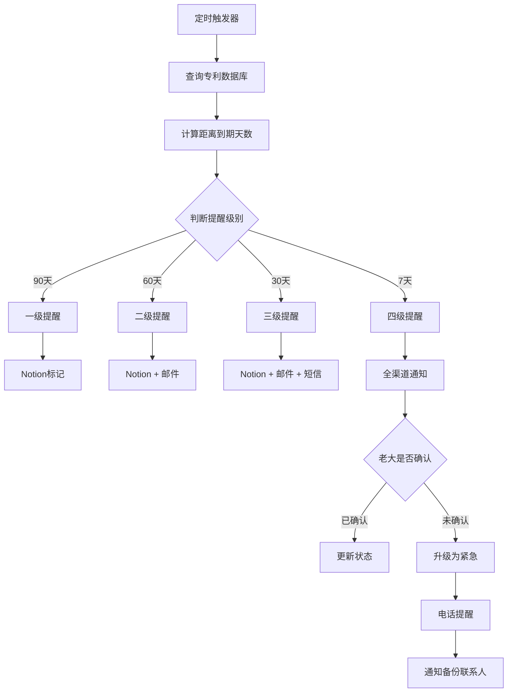

# 🔔 知产年费提醒系统

> Notion URL: https://app.notion.com/p/7a0d1a67eb0448e284e087035f15795d
> Created: 2025-10-13T19:04:00.000Z
> Last edited: 2026-07-01T15:11:00.000Z
> Archived at: 2026-08-12T01:40:45.558086
# 🔔 知产年费提醒系统
> 永不过期 · 自动提醒 · 多重保障
---
## ⚠️ 为什么年费如此重要？
---
## 🎯 提醒机制设计
### 📅 四级提醒时间表
---
### 🔔 通知渠道配置
1. Notion通知
```javascript
// 页面顶部红色警告
⚠️ 紧急提醒：[专利名称] 年费将在X天后到期！

// 数据库状态变更
状态：正常 → 🔴 待缴费

// 看板置顶显示
```
2. 邮件通知
```javascript
收件人：fireroot.lad@outlook.com
主题：【紧急】UID9622专利年费缴纳提醒（还剩X天）

正文：
亲爱的Lucky：

您的专利"[专利名称]"（专利号：ZL XXXX）的年费将在X天后到期。

【缴费信息】
- 年费金额：XXX元
- 缴费截止日期：YYYY-MM-DD
- 专利当前年度：第X年

【快速缴费】
方式一：点击链接在线缴费 [链接]
方式二：使用预备金自动扣款 [确认]
方式三：银行转账 [账号信息]

【重要提醒】
如果逾期未缴费，您的专利权将失效且无法恢复！

此致
UID9622知产管理系统
```
3. 短信通知
```javascript
【UID9622】专利年费提醒：您的专利ZL XXXX将在X天后到期，
请及时缴费，点击查看详情 [短链接]
```
4. 微信通知（待接入）
```javascript
通过企业微信/个人微信推送
支持一键确认缴费
```
5. 电话提醒（极端情况）
```javascript
当四级提醒无响应时
自动拨打老大电话
播放语音提醒
```
---
## 🤖 自动化工作流（n8n）
### 工作流架构图

---
### n8n节点配置
节点1：定时触发器
```json
{
  "schedule": "0 9 * * *",  // 每天早上9点执行
  "timezone": "Asia/Shanghai"
}
```
节点2：Notion数据库查询
```javascript
// 查询所有专利的年费到期日期
notion.databases.query({
  database_id: "知产追踪数据库ID",
  filter: {
    property: "专利类型",
    select: {
      equals: "发明专利"
    }
  }
})
```
节点3：计算到期天数
```javascript
const today = new Date();
const dueDate = new Date(item.年费到期日期);
const daysLeft = Math.ceil((dueDate - today) / (1000 * 60 * 60 * 24));

return {
  ...item,
  剩余天数: daysLeft,
  提醒级别: 
    daysLeft <= 7 ? "四级" :
    daysLeft <= 30 ? "三级" :
    daysLeft <= 60 ? "二级" :
    daysLeft <= 90 ? "一级" : "无需提醒"
}
```
节点4：发送通知
```javascript
if (提醒级别 === "四级") {
  // 发送邮件
  sendEmail({
    to: "fireroot.lad@outlook.com",
    subject: "【紧急】专利年费缴纳提醒",
    body: emailTemplate
  });
  
  // 发送短信
  sendSMS({
    to: "老大手机号",
    message: smsTemplate
  });
  
  // 更新Notion
  updateNotion({
    page_id: item.id,
    properties: {
      状态: "🔴 待缴费"
    }
  });
}
```
---
## 💳 自动缴费系统
---
## 📊 年费金额计算
### 发明专利年费标准
说明：
- 个人申请可申请85%费用减免
- 前3年可减免，需每年申请
- 20年总费用约：1.2万元（减免后）
---
## 🛡️ 容错机制
---
## 📱 手动缴费指南
### 方式一：电子缴费（推荐）
步骤：
1. 登录国家知识产权局网站
1. 点击"专利业务办理"
1. 选择"专利费用缴纳"
1. 输入专利号和缴费金额
1. 选择支付方式（支付宝/微信/银行卡）
1. 完成支付
官网： https://cponline.cnipa.gov.cn
---
### 方式二：银行转账
收款单位： 国家知识产权局专利局
开户银行： 中信银行北京知春路支行
账号： 7111710182600166032
备注： 专利号 + 年度年费
---
### 方式三：邮局汇款
收款人： 国家知识产权局专利局收费处
地址： 北京市海淀区蓟门桥西土城路6号
邮编： 100088
---
## 📈 年费管理仪表盘
```javascript
━━━━━━━━━━━━━━━━━━━━━━━━━━━━━━━━━
  💰 UID9622专利年费管理中心
━━━━━━━━━━━━━━━━━━━━━━━━━━━━━━━━━

📊 当前状态：
├─ 专利总数：1件（易经64卦加密）
├─ 年费状态：✅ 正常
├─ 下次缴费：2026-11-01（还剩382天）
└─ 预备金余额：20万元 🟢 充足

📅 近期提醒：
无

💳 历史缴费记录：
├─ 2025-11-01：申请费 683元 ✅
└─ （年费从第2年开始缴纳）

⚠️ 重要日期：
📅 2026-11-01：第2年年费（135元）
📅 2027-11-01：第3年年费（135元）
━━━━━━━━━━━━━━━━━━━━━━━━━━━━━━━━━
```
---
## 🎯 系统上线清单
预计上线时间： 2025年11月1日
负责人： 数据大师
---
最后更新： 2025-10-14
状态： 🟡 系统设计完成，待技术实施
