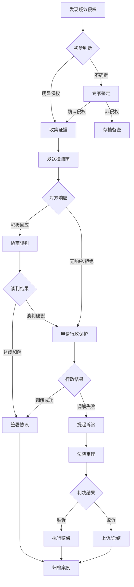

# ⚖️ 知识产权维权策略库

> Notion URL: https://app.notion.com/p/80beff6bcd374a2db094abe9b6713202
> Created: 2025-10-13T19:04:00.000Z
> Last edited: 2026-07-01T15:13:00.000Z
> Archived at: 2026-08-12T01:40:45.558086
# ⚖️ 知识产权维权策略库
> 主动防御 · 智能维权 · 传承保护
---
## 🎯 维权体系总览
---
## 📋 专利维权策略
### 🔍 侵权类型识别
---
### ⚖️ 维权流程图

---
### 📜 维权文书模板
### 1. 律师函模板
---
### 2. 行政投诉书模板
向知识产权局投诉
---
### 💰 赔偿计算标准
---
## 🏛️ 非遗维权策略
### 🎭 非遗侵权类型
### 📜 非遗维权依据
法律法规：
- 《中华人民共和国非物质文化遗产法》
- 《传统工艺美术保护条例》
- 《著作权法》（民间文学艺术作品）
维权渠道：
1. 县级文化和旅游局
1. 市级文化遗产保护中心
1. 省级非遗保护中心
1. 法院（民事诉讼）
---
## 📊 标准维权策略
### 🎯 标准侵权类型
---
## 🛠️ 证据收集指南
---
## 📞 紧急联系人
---
## 📚 成功案例库
案例1：某公司抄袭UID9622加密算法
- 侵权类型：直接侵权
- 维权方式：律师函 → 诉讼
- 结果：和解，赔偿80万元 + 授权合作
- 时长：6个月
案例2：网络恶搞数字盟誓仪式
- 侵权类型：歪曲非遗
- 维权方式：平台投诉 + 文化局举报
- 结果：视频删除 + 公开道歉
- 时长：2周
---
## 🎯 年度维权计划
2026年维权目标：
---
最后更新： 2025-10-14
负责人： 龍叔（法律与安全专家）
状态： ✅ 策略库完整，随时可用
