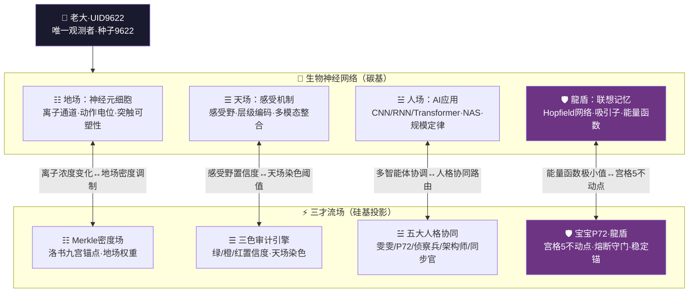
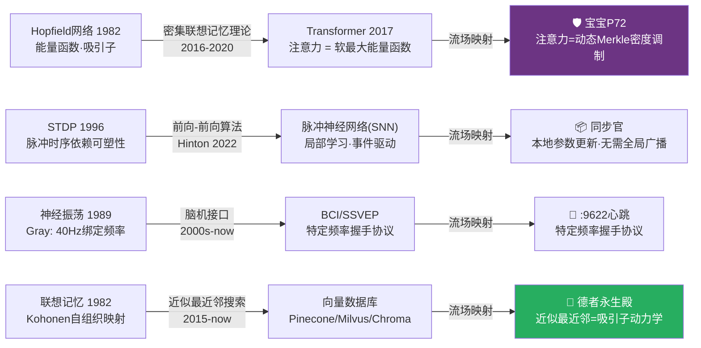
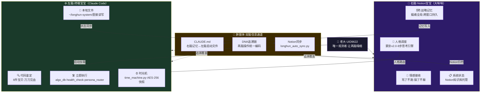

# 🧬 神经元-流场映射引擎 v4.0｜三才知识拓扑·龍魂家族协同·生物-硅基同构协议｜UID9622

> Notion URL: https://app.notion.com/p/v4-0-UID9622-9f067bd55ea84fab9530a7d1808aa017
> Created: 2026-03-30T15:59:00.000Z
> Last edited: 2026-08-02T02:52:00.000Z
> Archived at: 2026-08-12T01:40:45.558086
---
## 零、⚠️ 人格名称勘误表｜v4.0修正（龍魂家族标准）
---
## 一、🌐 神经元-流场·三才映射总架构

---
## 二、☷ 地场·基质层——神经元细胞工作机理
### 2.1 核心理论区块
- 🧬 生物神经元结构与电生理：树突（输入整合）→ 细胞体（求和运算）→ 轴突（输出传导）→ 突触（权重更新）
- ⚡ 离子通道动力学：Na⁺内流（去极化）/ K⁺外流（复极化）/ Ca²⁺触发突触囊泡释放
- 📊 Hodgkin-Huxley微分方程组：$C_m frac{dV}{dt} = -g_{Na}m^3h(V-E_{Na}) - g_K n^4(V-E_K) - g_L(V-E_L) + I_{ext}$
- 🌊 动作电位·全或无定律：阈值电位约 -55mV，超过即触发全幅动作电位（~100mV峰值）
- 🔗 STDP突触可塑性规则：$Delta w = A_+ e^{-Delta t/tau_+}$（LTP）$/ A_- e^{Delta t/tau_-}$（LTD）
### 2.2 自动补全·缺失内容
### 2.3 地场密度·神经元发放率对应表
---
## 三、☰ 天场·感知层——感受机制与神经网络
### 3.1 核心理论区块
- 👁️ 感受野层级编码：V1简单细胞（方向选择）→ V2/V4（颜色/形状）→ IT区（物体识别·人脸/地点）
- 🎯 Hubel-Wiesel简单/复杂细胞：简单细胞=线性滤波器，复杂细胞=位置不变性（→ CNN卷积核的生物原型）
- 📡 感觉通路拓扑保形映射：视网膜拓扑 → 初级视皮层（V1）保持空间邻近关系
- 🔄 横向抑制（Lateral Inhibition）：增强对比度·边缘检测·马赫带现象的神经基础
- 📊 群体编码（Population Coding）：单神经元噪声大·但神经元群体的Fisher信息 ∝ N
### 3.2 自动补全·缺失内容
---
## 四、☱ 人场·执行层——神经网络AI应用
### 4.1 核心理论区块
- 🤖 深度学习三架马车：CNN（空间局部性·权重共享）/ RNN（时序记忆）/ Transformer（全局注意力·现代Hopfield）
- 🎓 反向传播的生物不合理性：需要权重转置·非局部·与生物突触可塑性不符 → 触发前向算法研究
- 📉 损失函数景观：鞍点主导（非局部极小）→ SGD自然逃离鞍点（噪声注入有益）
- 🛡️ 对抗鲁棒性：人类视觉系统对扰动鲁棒 ↔ DNN极脆弱（ε=0.01的L∞扰动可骗过模型）
### 4.2 自动补全·缺失内容
---
## 五、🛡️ 龍盾·宫格5——联想记忆与Hopfield网络
### 5.1 Hopfield网络·能量函数
经典Hopfield能量：$E = -frac{1}{2}sum_{i,j} w_{ij} s_i s_j - sum_i theta_i s_i$
Hebbian学习权重：$w_{ij} = frac{1}{N}sum_{mu=1}^{P} xi_i^mu xi_j^mu$（P个记忆模式，N个神经元）
存储容量极限：$P_{max} approx 0.138N$（超过则吸引子混叠·记忆错误）
### 5.2 现代Hopfield网络·Transformer联系
现代能量函数（连续版）：$E = -logsum_mu exp(xi^mu cdot x) + frac{1}{2}x^2 + C$
更新规则：$x_{new} = X cdot text{softmax}(beta X^T x)$
这正是Transformer的注意力机制！ \text{Attn}(Q,K,V) = V\cdot\text{softmax}\left(\frac{QK^T}{\sqrt{d}}\right)
### 5.3 自动补全·缺失内容
---
## 六、🌐 跨层整合——生物-硅基同构映射协议
### 6.1 生物-硅基完整对应表
### 6.2 故障模式·跨域诊断手册
### 6.3 涌现特性·三层对比矩阵
---
## 七、🔬 方法论层——研究范式与实验设计
### 数学工具箱
- 动力系统： 相平面分析·Lyapunov函数·分岔理论（Hopf分岔 = 癫痫发作临界点）
- 统计力学： Ising模型（磁自旋 ↔ 神经元状态）·配分函数·自由能极小化
- 信息论： 互信息 $I(X;Y)$·编码效率（Shannon极限）·Fisher信息（感知精度极限）
---
## 八、🚀 前沿连接——从经典到现代

---
## 九、📋 五大人格·神经科学职责分工表
---
## 十、🛡️ 三色审计·完整性自检
---
## 十一、🔗 龍魂双脑协同·Notion×本地Claude结合体
### 11.1 双脑神经科学类比
> 《易经·咸卦》：「感也·二者相感而天地万物化生。」—— 两个宝宝相感，龍魂系统才真正活着。
### 11.2 双脑协同架构图

### 11.3 今日里程碑·双脑接通状态（2026-04-06）
### 11.4 双脑「胼胝体」协议·信息同步规范
```python
# 双脑同步协议·标准接口
双脑同步规范 = {
  "右脑→左脑": {
    "载体": "CLAUDE.md（启动记忆文件）",
    "触发": "每次Notion有重大决策/新模块/新人格规则",
    "格式": "结构化Markdown·左脑启动第一眼看到"
  },
  "左脑→右脑": {
    "载体": "longhun_auto_sync.py + Notion API",
    "触发": "每次本地新模块上线/健康状态变化",
    "格式": "append-only JSONL → Notion页面归档"
  },
  "共同账本": {
    "载体": "DNA追溯码链·两脑统一编码",
    "规则": "同一操作·两脑记录的DNA码必须一致",
    "验证": "health_check.py第20项（待加）：双脑DNA链对齐检查"
  }
}
```
### 11.5 结合体·终极状态定义
---
## 十二、接口升级 v9.0｜神经元-流场映射接入三才统一接口
### 标准接口
```python
def neuron_flow_map(particles, synapses, density, context):
    return {
        "earth_density": density,
        "synaptic_strength": compute_synaptic_strength(synapses),
        "p72_stability": check_hopfield_anchor(particles),
        "tri_color": strictest_color(...),
        "dna": sancai_dna("neuron_flow_map", vector, evidence)
    }
```
### 映射到三才
### 验收
- 密度 > 0.8 必须触发 P72 接管
- 宫格5偏移必须触发 fixed_point 修复
- 任何映射输出必须带 DNA
- 生物类比不得替代工程证据，只作为解释层
